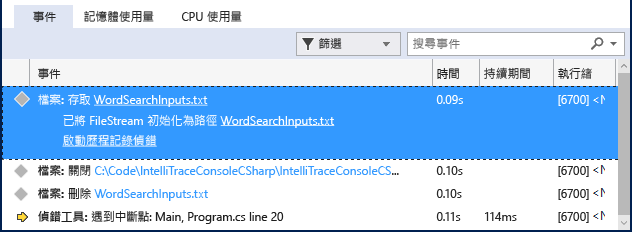

# 逐步解說：使用 IntelliTrace
[!INCLUDE[vs2017banner](../code-quality/includes/vs2017banner.md)]

您可以使用 IntelliTrace 收集特定事件或事件分類的相關資訊，或是事件及個別函式呼叫的相關資訊。 下列程序說明如何執行此作業。  
  
 您可以在 Visual Studio Enterprise 版本 \(而非 Professional 或 Community 版本\) 中使用 IntelliTrace。  
  
##  <a name="GettingStarted"></a> 只對事件使用 IntelliTrace  
 您可以嘗試只針對 IntelliTrace 事件進行偵錯。 IntelliTrace 事件是偵錯工具事件、例外狀況、.NET Framework 事件，以及其他系統事件。 您應在開始偵錯之前，先開啟或關閉特定事件，以控制 IntelliTrace 所記錄的事件。 如需詳細資訊，請參閱[IntelliTrace 功能](../debugger/intellitrace-features.md)。  
  
 下列步驟顯示如何只就 IntelliTrace 事件進行偵錯：  
  
1.  開啟檔案存取的 IntelliTrace 事件。 前往 \[工具\] \/ \[選項\] \/ \[IntelliTrace\] \/ \[IntelliTrace 事件\]  頁面，然後展開 \[檔案\] 分類。 核取 \[檔案\] 事件分類。 這會核取所有的檔案事件 \(存取、關閉、刪除\)。  
  
2.  建立 C\# 主控台應用程式。 在 Program.cs 檔案中，加入下列 `using` 陳述式：  
  
    ```c#  
    using System.IO;  
    ```  
  
3.  在 Main 方法中建立 <xref:System.IO.FileStream>，接著加以讀取、關閉，然後再刪除該檔案。 加入另一行，以設定中斷點：  
  
    ```c#  
    static void Main(string[] args) { FileStream fs = File.Create("WordSearchInputs.txt"); fs.ReadByte(); fs.Close(); File.Delete("WordSearchInputs.txt"); Console.WriteLine("done"); }  
    ```  
  
4.  在 `Console.WriteLine("done");` 上設定中斷點  
  
5.  照常開始偵錯  \(按 \[F5\] 或按一下 \[偵錯\] \/ \[開始偵錯\]\)。  
  
    > [!TIP]
    >  偵錯時，請保持 \[區域變數\] 和 \[自動變數\] 視窗開啟，以查看和記錄這些視窗中所顯示的值。  
  
6.  執行會在中斷點停止。 \[診斷工具\] 視窗若未出現，請按一下 \[偵錯\] \/ \[視窗\] \/ \[IntelliTrace 事件\]。  
  
     在 \[診斷工具\] 視窗中，尋找 \[事件\] 索引標籤 \(應有 3 個索引標籤：\[事件\]、\[記憶體使用量\] 及 \[CPU 使用量\]\)。 \[事件\] 索引標籤會依時間列出事件，其結尾會是偵錯工具中斷執行前的最後一個事件。 您應該會看到一個名為 **Access WordSearchInputs.txt** 的事件。  
  
     下列螢幕擷取畫面來自 Visual Studio 2015 Update 1。  
  
       
  
7.  選取該事件，然後展開其詳細資料。  
  
     下列螢幕擷取畫面來自 Visual Studio 2015 Update 1。  
  
       
  
     您可以選擇路徑名稱連結來開啟該檔案。 如果無法使用完整路徑名稱，會顯示 \[開啟檔案 \] 對話方塊。  
  
     按一下 \[啟動歷程記錄偵錯\]，將偵錯工具的內容設為所選事件的收集時間，並在 \[呼叫堆疊\]、\[區域變數\] 及其他參與偵錯工具視窗中顯示歷程資料。 如果原始程式碼可用，Visual Studio 會將指標移至對應來源視窗中的程式碼，因此您可以檢查它。  
  
     下列螢幕擷取畫面來自 Visual Studio 2015 Update 1。  
  
       
  
8.  如果沒有發現 Bug，請嘗試檢查導致 Bug 的其他事件。 您也可以讓 IntelliTrace 記錄呼叫資訊，以便您能逐步執行函式呼叫。  
  
## 對事件及函式呼叫使用 IntelliTrace  
 IntelliTrace 可以同時記錄函式呼叫與事件。 這可讓您查看呼叫堆疊記錄，並在程式碼中逐步返回及逐步前進。 IntelliTrace 會記錄資料 \(例如函式名稱、函式進入點與結束點\)、特定參數值與傳回值。 請參閱 [IntelliTrace 功能](../debugger/intellitrace-features.md)。  
  
1.  開啟呼叫收集  \(在 \[工具\] \/ \[選項\] \/ \[IntelliTrace\] \/ \[一般\]  中，選取 \[IntelliTrace 事件和呼叫資訊\]。 IntelliTrace 會在下一個偵錯工作階段開始時，開始收集此資訊。  
  
    > [!TIP]
    >  這可能會讓應用程式變慢，並增加儲存到磁碟之 IntelliTrace 記錄檔 \(.iTrace 檔案\) 的大小。 若要取得大部分呼叫資料，但將影響降至最低，可以只記錄您所關注之模組的資料。 如果要變更 .iTrace 檔案的大小上限，請前往 \[工具\] \/ \[選項\] \/ \[IntelliTrace\] \/ \[進階\]，然後指定磁碟空間的最大值。 預設值為 250 MB。  
  
2.  開始對前一節中所建立的 C\# 主控台應用程式進行偵錯。 執行會在中斷點停止。 \[診斷工具\] 視窗若未出現，請按一下 \[偵錯\] \/ \[視窗\] \/ \[IntelliTrace 事件\]。  
  
3.  切換至 \[呼叫\] 索引標籤。  
  
     您的應用程式函式呼叫會從根呼叫 \(在目前的解決方案中是主要進入點\) 開始，並於執行中斷的位置結束。  
  
     選取並按兩下其中一個函式呼叫。 您應會看到函式的進入點與結束點，以及目前對其他函式的呼叫，以及該呼叫所引發的 IntelliTrace 事件。 若未開啟歷程偵錯，此動作會加以開啟。 若要深入了解歷程偵錯，請參閱[歷程偵錯](../debugger/historical-debugging.md)。  
  
    > [!NOTE]
    >  有一些呼叫可能會呈現暗灰色。 這是因為 IntelliTrace 未對錄對應模組的資料。 若要顯示此資料，請將 IntelliTrace 設定成從這些模組收集資料。 如需指定模組的相關資訊，請參閱[IntelliTrace 功能](../debugger/intellitrace-features.md)。  
  
## 後續步驟