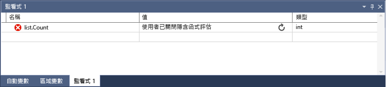

# 監看式及快速監看式視窗
[!INCLUDE[vs2017banner](../code-quality/includes/vs2017banner.md)]

在偵錯工作階段期間，您可以使用 \[監看式\] \(\[偵錯\] \/ \[視窗\] \/ \[監看式\] \/ \[監看式 \(1、2、3、4\)\]\) 和 \[快速監看式\] \(\[偵錯\] \/ \[快速監看式\]\) 視窗，監看變數和運算式。 其差異在於 \[監看式\] 視窗可以顯示數個變數，而 \[快速監看式\] 視窗一次僅可顯示單一變數。  
  
## 使用 \[快速監看式\] 觀察單一變數  
 您可以使用 \[快速監看式\] 視窗觀察單一變數。 例如，如果您有下列的程式碼：  
  
```c#  
static void Main(string[] args) { int a, b; a = 1; b = 2; for (int i = 0; i < 10; i++) { a = a + b; } }  
```  
  
 您可以觀察 \[快速監看式\] 視窗中的變數，如下所示：  
  
1.  在 `a = a + b;` 行上設定中斷點。  
  
2.  開始偵錯。 執行會在中斷點停止。  
  
3.  開啟 \[快速監看式\] 視窗 \(按一下滑鼠右鍵，然後選擇 \[偵錯\] \/ \[快速監看式\]，或 **SHIFT\+F9**\)。您可以開啟視窗並將某個變數加入 \[運算式\] 視窗中，然後按一下 \[重新評估\]。 您應該會在 \[值\] 視窗中看到變數，值為 2。  
  
4.  \[快速監看式\] 視窗是強制回應對話方塊視窗，因此只要開啟您就無法繼續偵錯。 您可以按一下 \[加入監看式\]，將變數加入 \[監看式\] 視窗。  
  
5.  關閉 \[快速監看式\] 視窗。 現在，您就可以一邊觀察 \[監看式\] 視窗中的值，一邊繼續偵錯。  
  
## 使用 \[監看式\] 視窗觀察變數  
 您可以使用 \[監看式\] 視窗觀察多個變數。 例如，如果您有下列的程式碼：  
  
```c#  
static void Main(string[] args) { int a, b, c; a = 1; b = 2; c = 0; for (int i = 0; i < 10; i++) { a++; b *= 2; c = a + b; } }  
  
```  
  
 將三個變數的值加入監看式視窗，如下所示：  
  
1.  在 `c = a + b;` 行上設定中斷點。  
  
2.  開始偵錯 \(**F5**\)。 執行會在中斷點停止。  
  
3.  開啟 \[監看式\] 視窗 \(\[偵錯\] \/ \[視窗\] \/ \[監看式\] \/ \[監看式 1\]，或 **CTRL\+ALT\+W，1**\)。  
  
4.  將 `a` 變數加入第一個資料列，`b` 變數加入第二個資料列，再將 `c` 變數加入第三個資料列。  
  
5.  繼續偵錯。  
  
 您應會發現變數值隨著您逐一查看 `for` 迴圈而變更。  
  
 若以機器碼來設計程式，有時可能需要限定變數名稱，或是包含變數名稱的運算式內容。 內容是變數所在的函式、原始程式檔和模組。 如果您需要執行這個動作，可以使用內容運算子語法。 如需詳細資訊，請參閱＜運算式 \(C\+\+\)＞。  
  
## 使用 \[監看式\] 視窗觀察運算式  
 現在我們試試改用運算式。 您可以加入偵錯工具所能辨識的任何有效運算式。  
  
 比方說，如果您使用上一節列出的程式碼，則可以取得三個值的平均值，如下：  
  
   
  
 一般來說，\[監看式\] 視窗的運算式評估規則與您的程式碼撰寫語言的運算式評估規則相同。 如果您的運算式有語法錯誤，您應會在程式碼編輯器中看到相同的編譯器錯誤。 以下為範例：  
  
   
  
##  <a name="bkmk_refreshWatch"></a> 重新整理已過期的監看值  
 在 \[監看式\] 視窗中評估運算式時，某些情況下，您可能會看到重新整理圖示 \(由兩個箭頭圍成的圓形或含有兩條波浪線的圓形\)。  例如，如果您關閉屬性評估 \(\[工具\] \/ \[選項\] \/ \[偵錯\] \/ \[啟用屬性評估及其他隱含函式呼叫\]\)，而且您有下列的程式碼：  
  
```c#  
static void Main(string[] args) { List<string> list = new List<string>(); list.Add("hello"); list.Add("goodbye"); }  
  
```  
  
 如果您在清單的 `Count` 屬性中設定監看式，您應該會看到類似下列的訊息：  
  
   
  
 這表示錯誤或已過期的值。 按一下圖示通常會重新整理值，但在某些情況下，您可能不想要重新整理。 首先，您必須知道為何沒有評估值。  
  
 如果您指向圖示，工具提示會提供資訊來說明為何沒有評估運算式。 如果出現環繞箭號，表示運算式由於下列其中一個原因而未評估：  
  
-   •	當評估運算式時發生錯誤。 例如，發生逾時或變數超出範圍。  
  
-   •	運算式包含可能在應用程式中觸發副作用的函式呼叫 \(請參閱[副作用和運算式](#bkmk_sideEffects)\)。  
  
-   偵錯工具的屬性自動評估和隱含函式呼叫 \(\[工具\] \/ \[選項\] \/ \[偵錯\] \/ \[啟用屬性評估及其他隱含函式呼叫\]\) 已關閉，如此即無法自動評估運算式。  
  
 若要重新整理值，請按一下重新整理圖示或按下空格鍵。 偵錯工具會嘗試重新評估運算式。 如果出現重新整理圖示是因為屬性和隱含副作用的自動評估已關閉，則可評估運算式。  
  
 如果您看到圓形中有類似螺紋的兩條波浪線條的圖示，則運算式是因為潛在的跨執行緒相依性而未受評估。 也就是說，若要評估程式碼，需要暫時執行應用程式中的其他執行緒。 當您處於中斷模式時，通常會停止應用程式中的所有執行緒。 允許暫時執行其他執行緒可能會對程式的狀態造成無法預期的結果，且可能導致偵錯工具忽略中斷點之類的事件，並在這些執行緒中擲回例外狀況。  
  
##  <a name="bkmk_sideEffects"></a> 副作用和運算式  
 評估某些運算式可能會變更變數的值，或是影響程式的狀態。 例如，評估下列運算式會變更 `var1` 的值：  
  
```  
var1 = var2  
```  
  
 這稱為[副作用](https://en.wikipedia.org/wiki/Side_effect_\(computer_science\))。 副作用會變更程式運作的方式，導致偵錯更加困難。  
  
 已知有副作用的運算式只會在您第一次輸入的時候評估一次。 後續評估都會停用。 您可以按一下值旁邊的更新圖示，手動覆寫這個行為。  
  
 避免所有副作用的其中一種方法是關閉自動函式評估 \(\[工具\] \/ \[選項\] \/ \[偵錯\] \/ \[啟用屬性評估及其他隱含函式呼叫\]\)。  
  
 當關閉屬性評估或隱含函式呼叫時，您可以使用 **ac** 格式修飾詞 \(僅適用 C\#\) 強制評估。 請參閱 [C\# 中的格式規範](../debugger/format-specifiers-in-csharp.md)。  
  
## 在 \[監看式\] 視窗 \(C\# 和 Visual Basic\) 中使用物件 ID  
 有時候您可能需要觀察特定物件的行為，例如您可能想在區域變數已超出範圍之後，追蹤該變數參考的物件。 在 C\# 和 Visual Basic 中，您可以針對參考類型的特定執行個體建立物件 ID，並在中斷點條件和 \[監看式\] 視窗中使用它們。 物件 ID 是由 Common Language Runtime \(CLR\) 偵錯服務所產生並與物件相關聯。  
  
> [!NOTE]
>  物件 ID 會建立弱式參考，且不會防止記憶體回收物件。 它們僅針對目前的偵錯工作階段才有效。  
  
 在下列程式碼中，其中一個方法會使用區域變數建立 `Person`，但您想要找出不同方法中的 `Person` 名稱：  
  
```c#  
class Person { public Person(string name) { Name = name; } public string Name { get; set; } } public class Program { List<Person> _people = new List<Person>(); public static void Main(string[] args) { MakePerson(); DoSomething(); } private static void MakePerson() { var p = new Person("Bob"); _people.Add(p); } private static void DoSomething() { // more processing Console.WriteLine("done"); } }  
  
```  
  
 您可以在 \[監看式\] 視窗中將參考加入這個 `Person` 物件，如下所示：  
  
1.  當物件已建立一段時間之後，於程式碼中設定中斷點。  
  
2.  開始偵錯，當執行到中斷點停止時，找到 \[區域變數\] 視窗中的變數，按一下滑鼠右鍵，然後選取 \[設定物件 ID\]。  
  
3.  您應該會看到 \[區域變數\] 視窗中顯示 **$** 加上一個數字。 這就是物件 ID。  
  
4.  將物件 ID 加入 \[監看式\] 視窗。  
  
5.  在您想要觀察物件的行為位置設定中斷點。  若是上述程式碼，這可能會在 `DoSomething()` 方法中。  
  
6.  繼續偵錯，當執行在 `DoSomething()` 方法中停止時，\[監看式\] 視窗會顯示 `Person` 物件。  
  
> [!NOTE]
>  如果您想要查看物件的屬性，如上述範例中的 `Person.Name`，則必須啟用屬性評估。  
  
## 在 \[監看式\] 視窗中使用暫存器 \(僅限 C\+\+\)  
 如果正在偵錯機器碼，則可以使用  **$\<register name\>** 或 **@\<register name\>** 加入暫存器名稱以及變數名稱。  如需詳細資訊，請參閱[虛擬變數](../debugger/pseudovariables.md)。  
  
## 動態檢視和監看式視窗  
 某些指令碼語言 \(例如 JavaScript 或 Python\) 使用動態或[鴨子類型](https://en.wikipedia.org/wiki/Duck_typing)，而 .NET 語言 \(4.0 或更新版本\) 支援難以用一般偵錯視窗觀察的物件，因為這些物件可能會有無法顯示的執行階段屬性和方法。  
  
 如果物件是從實作 [IDynamicMetaObjectProvider 介面](../Topic/IDynamicMetaObjectProvider%20Interface.md) 的類型所建立，當 \[監看式\] 視窗顯示該物件時，偵錯工具會在 \[自動變數\] 顯示中加入一個特殊的 \[動態檢視\] 節點。 此節點會顯示動態物件的動態成員，但不允許編輯成員值。  
  
 如果您以滑鼠右鍵按一下 \[動態檢視\] 的任何子系，並選擇 \[加入監看式\]，偵錯工具會插入新的監看變數，其可將物件轉換成動態物件。 換句話說，**object Name** 會變成 \(**\(dynamic\)object\).Name**。  
  
 評估 \[動態檢視\] 的成員時可能有副作用。 如需說明有哪些副作用，請參閱[副作用和運算式](#bkmk_sideEffects)。 若是 C\#，在您逐步執行至新的一行程式碼時，偵錯工具不會自動重新評估 \[動態檢視\] 中顯示的值。 若是 Visual Basic，則會自動重新整理透過 \[動態檢視\] 加入的運算式。  
  
 如需重新整理 \[動態檢視\] 值的相關指示，請參閱[重新整理已過期的監看值](#bkmk_refreshWatch)。  
  
 如果您希望只顯示物件的 \[動態檢視\]，可以使用 \[動態\] 格式規範：  
  
-   C\#: **ObjectName, dynamic**  
  
-   Visual Basic:: **$dynamic, ObjectName**  
  
 \[動態檢視\] 也強化了 COM 物件的偵錯體驗。 當偵錯工具發現包裝在 **System.\_\_ComObject** 中的 COM 物件時，它會為該物件新增 \[動態檢視\] 節點。  
  
## 請參閱  
 [偵錯工具視窗](../debugger/debugger-windows.md)