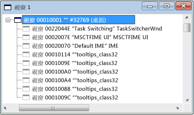

# Windows View
[!INCLUDE[vs2017banner](../code-quality/includes/vs2017banner.md)]

初次開啟 Spy\+\+ 時，\[視窗\] 檢視會顯示系統中所有視窗和控制項的樹狀結構，  其中會顯示視窗控制代碼及類別名稱。  目前的桌面視窗是在樹狀結構的頂端。  所有其他視窗都是桌面的子系，並且會根據標準視窗階層架構列出。  同層級視窗會顯示在可展開的清單中，縮排於父代底下。  
  
 下圖顯示一般 Spy\+\+ \[視窗\] 檢視，其中頂層節點已展開。  
  
   
Spy\+\+ 視窗檢視  
  
 目前的桌面視窗是在樹狀結構的頂端。  所有其他視窗都是桌面的子系，並且會根據標準視窗階層架構列出，而同層級視窗是依圖層順序排序。  您可以按一下節點旁的加號 \(\+\) 或減號 \(\-\)，以展開或摺疊樹狀結構的任何父節點。  
  
 當 \[視窗\] 檢視取得焦點時，您可以使用[視窗搜尋對話方塊](../debugger/window-search-dialog-box.md)中的 \[搜尋\] 工具，來顯示系統中任何已開啟視窗的資訊。  
  
## 本章節內容  
 [How to: Use the Finder Tool](../Topic/How%20to:%20Use%20the%20Finder%20Tool.md)  
 示範這個工具如何掃描視窗中的屬性或訊息。  
  
 [How to: Search for a Window in Windows View](../debugger/how-to-search-for-a-window-in-windows-view.md)  
 說明如何在 \[視窗\] 檢視中尋找特定的視窗。  
  
 [How to: Display Window Properties](../debugger/how-to-display-window-properties.md)  
 開啟 \[視窗屬性\] 對話方塊的程序。  
  
## 相關章節  
 [Spy\+\+ Views](../debugger/spy-increment-views.md)  
 說明視窗、訊息、處理序和執行緒的 Spy\+\+ 樹狀檢視。  
  
 [Using Spy\+\+](../debugger/using-spy-increment.md)  
 介紹 Spy\+\+ 工具並說明如何使用此工具。  
  
 [尋找視窗對話方塊](../debugger/find-window-dialog-box.md)  
 用來從特定視窗檢視屬性或訊息。  
  
 [視窗搜尋對話方塊](../debugger/window-search-dialog-box.md)  
 用來在 \[視窗\] 檢視中尋找特定視窗的節點。  
  
 [視窗屬性對話方塊](../debugger/window-properties-dialog-box.md)  
 用來在 \[視窗\] 檢視中顯示所選視窗的屬性。  
  
 [Spy\+\+ Reference](../debugger/spy-increment-reference.md)  
 包含描述每個 Spy\+\+ 功能表和對話方塊的章節。