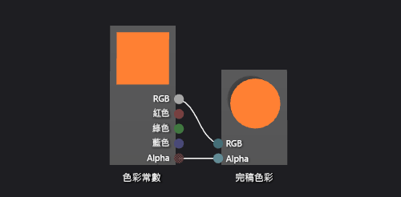

# 如何：建立基本色彩著色器
[!INCLUDE[vs2017banner](../code-quality/includes/vs2017banner.md)]

本文件示範如何使用著色器設計工具和有向圖形著色器語言 \(DGSL\) 建立一般色彩著色器。  這個著色器會將最終色彩設為固定的 RGB 色彩值。  
  
 本文件示範下列活動:  
  
-   從圖表移除節點  
  
-   將節點加入至圖表  
  
-   設定節點屬性  
  
-   連接節點  
  
## 建立一般色彩著色器  
 您可以將 RGB 色彩常數的色彩值寫入最終輸出色彩，以實作一般色彩著色器。  
  
 在您開始之前，請確定 \[**屬性**\] 視窗和 \[**工具箱**\] 隨即顯示。  
  
#### 建立一般色彩呈現著色器  
  
1.  建立 DGSL 著色器使用。  如需如何將 DGSL 著色器加入至專案的詳細資訊，請參閱 [著色器設計工具](../designers/shader-designer.md)中的使用者入門 \> 一節。  
  
2.  刪除 \[**點色彩**\] 節點。  使用 \[**選取**\] 工具選項 \[**點色彩**\] 節點，然後在功能表列上，選擇 \[**編輯**\]， \[**刪除**\]。  
  
3.  將 \[**色彩常數**\] 節點加入至圖形。  在 \[**常數**\] 下的 \[**工具箱**\] 中，選取 \[**色彩常數**\] 並將其移至設計介面。  
  
4.  為 \[**色彩常數**\] 節點指定色彩值。  使用 \[**選取**\] 工具選取 \[**色彩常數**\] 節點，然後在 \[**內容**\] 視窗的 \[**輸出**\] 屬性中指定色彩值。  對於橙色，請指定 \(1.0, 0.5, 0.2, 1.0\) 的值。  
  
5.  將色彩常數連接至完稿色彩。  若要建立連接，請將 \[**色彩常數**\] 節點的 \[**RGB**\] 終端移到 \[**完稿色彩**\] 節點的 \[**RGB**\] 終端，然後將 \[**色彩常數**\] 節點的 \[**Alpha**\] 終端移到 \[**完稿色彩**\] 節點的 \[**Alpha**\] 終端。  這些連接會將最後的色彩設定為在上一個步驟中定義的色彩常數。  
  
 下圖顯示已完成的著色器圖形和套用至 Cube 的著色器預覽。  
  
> [!NOTE]
>  在圖中指定了橙色色彩，以提供較佳的著色器效果示範。  
  
   
  
 某些圖案可能對某些著色器提供更好的預覽。  如需如何在著色器設計工具中預覽著色器的詳細資訊，請參閱[著色器設計工具](../designers/shader-designer.md)。  
  
## 請參閱  
 [如何：將著色器套用至 3D 模型](../designers/how-to-apply-a-shader-to-a-3-d-model.md)   
 [如何：匯出著色器](../designers/how-to-export-a-shader.md)   
 [著色器設計工具](../designers/shader-designer.md)   
 [著色器設計工具節點](../designers/shader-designer-nodes.md)