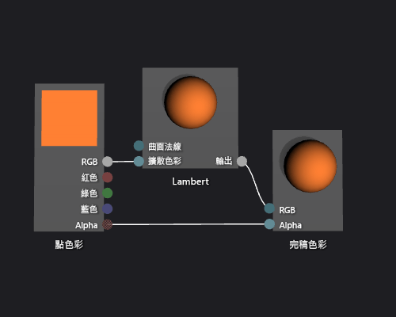

# 如何：建立基本 Lambert 著色器
[!INCLUDE[vs2017banner](../code-quality/includes/vs2017banner.md)]

本文件示範如何使用著色器設計工具和有向圖形著色器語言 \(DGSL\) 建立光源著色器，以實作經典的 Lambert 光源模型。  
  
 本文件示範下列活動:  
  
-   將節點加入至著色器圖表  
  
-   取消連接節點  
  
-   連接節點  
  
## Lambert 光源模型  
 Lambert 光源模型結合環境光線和定向光線，將物件著色成立體場景。  環境元件提供立體場景中基本層級的光亮。  方向元件提供另一個方向 \(遠方\) 光源的照明。  無論場景中各介面的方向為何，環境光源同樣都會影響所有介面。  對於特定介面，這是介面之環境色彩與場景中環境光源之色彩及濃度的乘積。  定向光源會根據介面相對於光源的方向，以不同的方式影響場景中的每個介面。  這是介面之擴散色彩及方向，與光源之色彩、濃度及方向的乘積。  直接面向光源的表面接收最大的作用，而背向光源的表面則接收不到作用。  在 Lambert 光源模型下，環境元件和一或多個方向元件組合後可判斷物件每個點完整的擴散色彩比重。  
  
 開始之前，請先確定已顯示 \[**屬性**\] 視窗和 \[**工具箱**\]。  
  
#### 建立 Lambert 著色器  
  
1.  建立要使用的 DGSL 著色器。  如需有關如何將 DGSL 著色器加到專案的詳細資訊，請參閱[著色器設計工具](../designers/shader-designer.md)中的「使用者入門」一節。  
  
2.  取消 \[**完稿色彩**\] 節點與 \[**點色彩**\] 節點的連結。  選取 \[**點色彩**\] 節點的 \[**RGB**\] 終端，然後選取 \[**中斷連結**\]。  保留 \[**Alpha**\] 終端連接。  
  
3.  將 \[**Lambert**\] 節點加入至圖形。  在 \[**公用程式**\] 下的 \[**工具箱**\] 中，選取 \[**Lambert**\] 並將其移至設計介面。  朗伯節點根據環境和擴散光源參數計算像素完整的擴散色彩比重。  
  
4.  連接 \[**點色彩**\] 節點與 \[**Lambert**\] 節點。  在 \[**選取**\] 模式中，請將 \[**點色彩**\] 節點的 \[**RGB**\] 終端移至 \[**Lambert**\] 節點的 \[**擴散色彩**\] 終端。  這個連接提供以像素插補擴散色彩的朗伯節點。  
  
5.  將計算的色彩值連接至完稿色彩。  將 \[**Lambert**\] 節點的 \[**輸出**\] 終端移至 \[**完稿色彩**\] 節點的 \[**RGB**\] 終端。  
  
 下圖顯示已完成的著色器圖形和套用至茶壺模型的著色器預覽。  
  
> [!NOTE]
>  使用著色器的 \[**MaterialDiffuse**\] 參數指定了橙色色彩，以在圖中提供較佳的著色器效果。  遊戲或應用程式可以使用這個參數提供每個物件唯一的色彩值。  如需材質參數的詳細資訊，請參閱 [著色器設計工具](../designers/shader-designer.md) 中預覽著色器的部分。  
  
   
  
 某些圖案可能對某些著色器提供更好的預覽。  如需如何在著色器設計工具中預覽著色器的詳細資訊，請參閱 [著色器設計工具](../designers/shader-designer.md)中的預覽著色器部分。  
  
 下圖顯示在文件中描述套用至立體模型的著色器。  
  
   
  
 如需如何將著色器套用至 3D 模型的詳細資訊，請參閱[如何：將著色器套用至 3D 模型](../designers/how-to-apply-a-shader-to-a-3-d-model.md)。  
  
## 請參閱  
 [如何：將著色器套用至 3D 模型](../designers/how-to-apply-a-shader-to-a-3-d-model.md)   
 [如何：匯出著色器](../designers/how-to-export-a-shader.md)   
 [如何：建立基本 Phong 著色器](../designers/how-to-create-a-basic-phong-shader.md)   
 [著色器設計工具](../designers/shader-designer.md)   
 [著色器設計工具節點](../designers/shader-designer-nodes.md)