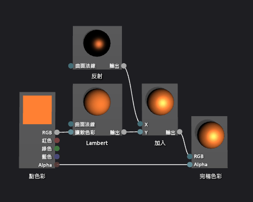

# 如何：建立基本 Phong 著色器
[!INCLUDE[vs2017banner](../code-quality/includes/vs2017banner.md)]

本文件示範如何使用著色器設計工具和有向圖形著色器語言 \(DGSL\) 建立光源著色器，以實作經典的 Phong 光源模型。  
  
 本文件示範下列活動:  
  
-   將節點加入至著色器圖表  
  
-   取消連接節點  
  
-   連接節點  
  
## Phong 光源模型  
 Phong 光源模型擴充 Lambert 光源模型，能夠包含會模擬介面的反射屬性的反射光源。  反射元件透過方向光源提供額外的照明，此光源同樣用於 Lambert 光源模型，但在最終色彩的處理則有所不同。  反射光源會根據檢視的方向、光源的方向、和介面的方向彼此之間的關係，以不同的方式影響場景中的每個介面。  這是介面之反射色彩、光澤度及方向，與光源之色彩、濃度及方向的乘積。  檢視器中直接反射光緣的表面接收最大的反射作用，而背向檢視器反射面的表面則接收不到作用。  在 Phong 光源模型中，一或多個反射元件結合後可判定反射物件每一點的反射反白顯示色彩和密度，然後加入到 Lambert 光源模型的結果，以產生像素的最終色彩。  
  
 如需 Lambert 光源模型的詳細資訊，請參閱[如何：建立基本 Lambert 著色器](../designers/how-to-create-a-basic-lambert-shader.md)。  
  
 開始之前，請先確定已顯示 \[**屬性**\] 視窗和 \[**工具箱**\]。  
  
#### 建立 Phong 著色器  
  
1.  建立 Lambert 著色器，如 [如何：建立基本 Lambert 著色器](../designers/how-to-create-a-basic-lambert-shader.md) 中所述。  
  
2.  取消 \[**完稿色彩**\] 節點和 \[**Lambert**\] 節點的連結。  選取 \[**Lambert**\] 節點的 \[**RGB**\] 終端，然後選取 \[**中斷連結**\]。  這樣會替下一個步驟加入的節點留出空間。  
  
3.  將 \[**加入**\] 節點加入至圖形。  在 \[**數學**\] 下的 \[**工具箱**\] 中，選取 \[**加入**\] 並將其移至設計介面。  
  
4.  將 \[**反射**\] 節點加入至圖形。  在 \[**公用程式**\] 下的 \[**工具箱**\] 中，選取 \[**反射**\] 並將其移至設計介面。  
  
5.  加入反射比重。  將 \[**反射**\] 節點的 \[**輸出**\] 終端移至 \[**加入**\] 節點的 \[**X**\] 終端，然後將 \[**Lambert**\] 節點的 \[**輸出**\] 終端移到 \[**加入**\] 節點的 \[**Y**\] 終端。  這些連接合併像素的完整擴散和反射色彩比重。  
  
6.  將計算的色彩值連接至完稿色彩。  將 \[**加入**\] 節點的 \[**輸出**\] 終端移至 \[**完稿色彩**\] 節點的 \[**RGB**\] 終端。  
  
 下圖顯示已完成的著色器圖形和套用至茶壺模型的著色器預覽。  
  
> [!NOTE]
>  使用著色器的 \[**MaterialDiffuse**\] 參數，以提供較佳的著色器效果示範在圖中指定了橙色色彩，您可以使用 \[**MaterialSpecular**\] 和 \[**MaterialSpecularPower**\] 參數，指定金屬性外觀。  如需材質參數的詳細資訊，請參閱 [著色器設計工具](../designers/shader-designer.md) 中預覽著色器的部分。  
  
   
  
 某些圖案可能對某些著色器提供更好的預覽。  如需如何在著色器設計工具中預覽著色器的詳細資訊，請參閱 [著色器設計工具](../designers/shader-designer.md) 中的預覽著色器部分。  
  
 下圖顯示在文件中描述套用至立體模型的著色器。  \[**MaterialSpecular**\] 屬性設為 \(1.00, 0.50, 0.20, 0.00\)， \[**MaterialSpecularPower**\] 屬性設為 16。  
  
> [!NOTE]
>  \[**MaterialSpecular**\] 屬性決定介面材質的明顯結尾。  高光亮介面 \(例如玻璃或塑膠\) 通常具有鏡面反射效果的色彩，也就是鮮明的白色色調。  金屬色澤介面通常具有接近其擴散色彩的鏡面反射效果色彩。  緞面抛光介面通常具有灰色深色陰影的鏡面反射效果色彩。  
>   
>  \[**MaterialSpecularPower**\] 屬性決定反射明亮部分的強度。  高光澤度模擬較不鮮明、較局部的反白顯示。  非常低的光澤度能夠清除使表面色彩濃度過高的密集強光及隱藏整體表面色彩。  
  
   
  
 如需如何將著色器套用至 3D 模型的詳細資訊，請參閱[如何：將著色器套用至 3D 模型](../designers/how-to-apply-a-shader-to-a-3-d-model.md)。  
  
## 請參閱  
 [如何：將著色器套用至 3D 模型](../designers/how-to-apply-a-shader-to-a-3-d-model.md)   
 [如何：匯出著色器](../designers/how-to-export-a-shader.md)   
 [如何：建立基本 Lambert 著色器](../designers/how-to-create-a-basic-lambert-shader.md)   
 [著色器設計工具](../designers/shader-designer.md)   
 [著色器設計工具節點](../designers/shader-designer-nodes.md)