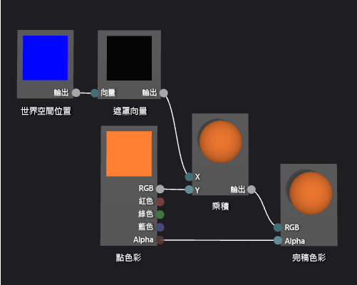

# 如何：建立以幾何為基礎的漸層著色器
[!INCLUDE[vs2017banner](../code-quality/includes/vs2017banner.md)]

本文件示範如何使用著色器設計工具和有向圖形著色器語言建立幾何漸層著色器。  這個著色器會依世界空間中物件每個點的高度縮放固定的 RGB 色彩值。  
  
 本文件示範下列活動:  
  
-   將節點加入至著色器圖表  
  
-   設定節點屬性  
  
-   取消連接節點  
  
-   連接節點  
  
## 建立幾何漸層著色器  
 您可以將像素的位置合併到著色器中，以實作幾何著色器。  在著色器語言，在 2\-D 螢幕像素包含比它的色彩和位置更加詳細的資訊。  像素—被稱為 *片段* 於一些系統—是描述介面對應像素的集合值。  本文件中說明的著色器利用世界空間中每個 3D 物件像素的高度影響片段的最終輸出色彩。  
  
 開始之前，請先確定已顯示 \[**屬性**\] 視窗和 \[**工具箱**\]。  
  
#### 建立以幾何為基礎的的漸層著色器  
  
1.  建立要使用的 DGSL 著色器。  如需有關如何將 DGSL 著色器加到專案的詳細資訊，請參閱[著色器設計工具](../designers/shader-designer.md)中的「使用者入門」一節。  
  
2.  從 \[**完稿色彩**\] 節點取消連結 \[**點色彩**\] 節點。  選取 \[**點色彩**\] 節點的 \[**RGB**\] 終端，然後選取 \[**中斷連結**\]。  這樣會替下一個步驟加入的節點留出空間。  
  
3.  將 \[**乘號**\] 節點加入至圖形。  在 \[**數學**\] 下的 \[**工具箱**\] 中，選取 \[**乘號**\] 並將其移至設計介面。  
  
4.  將 \[**遮罩向量**\] 節點加入至圖形。  在 \[**公用程式**\] 下的 \[**工具箱**\] 中，選取 \[**遮罩向量**\] 並將其移至設計介面。  
  
5.  為 \[**遮罩向量**\] 節點指定遮罩值。  在 \[**選取**\] 模式中，選取 \[**遮罩向量**\] 節點，然後在 \[**屬性**\] 視窗中，將 \[**綠色 \/ Y**\] 屬性設定為\[**True**\]，然後將 \[**紅色 \/ X**\]、\[**藍色 \/ Z**\] 和 \[**Alpha \/ W**\] 屬性設定為 \[**False**\]。  在此範例中，\[**紅色 \/ X**\]、\[**綠色 \/ Y**\] 和 \[**藍色 \/ Z**\] 屬性對應至 \[**全球位置**\] 節點的 x、y 和 z 分量，而 \[**Alpha \/ W**\] 未使用。  由於只有 \[**綠色 \/ Y**\] 設為 \[**True**\]，因此只有輸入向量的 Y 分量在遮罩之後保留。  
  
6.  將 \[**全球位置**\] 節點加入至圖形。  在 \[**常數**\] 下的 \[**工具箱**\] 中，選取 \[**全球位置**\] 並將其移至設計介面。  
  
7.  將片段中世界空間中的位置套上遮罩。  在 \[**選取**\] 模式中，將 \[**全球位置**\] 節點的 \[**輸出**\] 終端移至 \[**遮罩向量**\] 節點的 \[**向量**\] 終端。  這個連接會遮罩片段的位置，以忽略 x 和 z 元件。  
  
8.  將 RGB 色彩常數乘以遮罩的世界空間位置。  將 \[**點色彩**\] 節點的 \[**RGB**\] 終端移至 \[**乘號**\] 節點的 \[**Y**\] 終端，然後將 \[**遮罩向量**\] 節點的 \[**輸出**\] 終端移到 \[**乘號**\] 節點的 \[**X**\] 終端。  這個連接會依世界空間中像素的高度縮放色彩值。  
  
9. 將階層色彩值連接至完稿色彩。  將 \[**乘號**\] 節點的 \[**輸出**\] 終端移至 \[**完稿色彩**\] 節點的 \[**RGB**\] 終端。  
  
 下圖顯示已完成的著色器圖形和套用至圓球的著色器預覽。  
  
> [!NOTE]
>  在本圖中，指定了橙色色彩以提供較佳的著色器效果示範，但由於預覽圖形沒有世界空間中的位置，因此無法在著色器設計工具中完整預覽著色器。  必須在真實場景中預覽著色器，才能示範完整效果。  
  
   
  
 某些圖案可能對某些著色器提供更好的預覽。  如需如何在著色器設計工具中預覽著色器的詳細資訊，請參閱 [著色器設計工具](../designers/shader-designer.md) 的 **預覽著色器**。  
  
 下圖顯示在文件中描述套用至立體模型的著色器，而立體模型在 [如何：為 3D 地形建立模型](../designers/how-to-model-3-d-terrain.md) 也有示範。  色彩的濃度實際上是增加點的高度。  
  
   
  
 如需如何將著色器套用至 3D 模型的詳細資訊，請參閱[如何：將著色器套用至 3D 模型](../designers/how-to-apply-a-shader-to-a-3-d-model.md)。  
  
## 請參閱  
 [如何：將著色器套用至 3D 模型](../designers/how-to-apply-a-shader-to-a-3-d-model.md)   
 [如何：匯出著色器](../designers/how-to-export-a-shader.md)   
 [如何：為 3D 地形建立模型](../designers/how-to-model-3-d-terrain.md)   
 [如何：建立灰階材質著色器](../designers/how-to-create-a-grayscale-texture-shader.md)   
 [著色器設計工具](../designers/shader-designer.md)   
 [著色器設計工具節點](../designers/shader-designer-nodes.md)