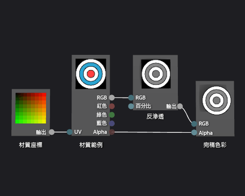

# 如何：建立灰階材質著色器
[!INCLUDE[vs2017banner](../code-quality/includes/vs2017banner.md)]

本文件示範如何使用著色器設計工具和有向圖形著色器語言 \(DGSL\) 建立灰階材質著色器。  這個著色器會修改材質範例的 RGB 色彩值，然後使用該色彩值與未經修改的 Alpha 值設定最中色彩。  
  
## 建立灰階材質著色器  
 您可以先修改材質範本的色彩值，再將它寫入最終輸出色彩，以實作灰階材質著色器。  
  
 開始之前，請先確定已顯示 \[**屬性**\] 視窗和 \[**工具箱**\]。  
  
#### 建立灰階材質著色器  
  
1.  建立基本材質著色器，如 [如何：建立基本材質著色器](../designers/how-to-create-a-basic-texture-shader.md)中所述。  
  
2.  將 \[**材質範例**\] 節點的 \[**RGB**\] 終端從 \[**完稿色彩**\] 節點的 \[**RGB**\] 終端中斷連接。  在 \[**選取**\] 模式中，選取 \[**結構範例**\] 節點的 \[**RGB**\] 終端，然後選取 \[**中斷連結**\]。  這樣會替下一個步驟加入的節點留出空間。  
  
3.  將 \[**灰度**\] 節點加入至圖形。  在 \[**濾鏡**\] 下的 \[**工具箱**\] 中，選取 \[**灰度**\] 並將其移至設計介面。  
  
4.  您可以使用 \[**灰度**\] 節點，計算灰階值。  在 \[**選取**\] 模式中，將 \[**材質範例**\] 節點的 \[**RGB**\] 終端移至 \[**灰度**\] 節點的 \[**RGB**\] 終端。  
  
    > [!NOTE]
    >  根據預設，\[**灰度**\] 節點完全去色輸入色彩，且使用標準亮度為灰階的轉換衡量。  您可以透過變更 \[**亮度**\] 屬性的值變更 \[**灰度**\] 節點的行為，或是只部分去色輸入色彩。  若要部分去色輸入色彩，提供介於 \[0,1\) 的純量值給 \[**灰度**\] 節點的 \[**百分比**\] 終端。  
  
5.  將灰階色彩值連接至完稿色彩。  將 \[**灰度**\] 節點的 \[**輸出**\] 終端移至 \[**完稿色彩**\] 節點的 \[**RGB**\] 終端。  
  
 下圖顯示已完成的著色器圖形和套用至 Cube 的著色器預覽。  
  
> [!NOTE]
>  在圖中，平面當做預覽圖形，然後，指定紋理以得到較佳的著色器效果示範。  
  
   
  
 某些圖案可能對某些著色器提供更好的預覽。  如需如何在著色器設計工具中預覽著色器的詳細資訊，請參閱[著色器設計工具](../designers/shader-designer.md)。  
  
## 請參閱  
 [如何：將著色器套用至 3D 模型](../designers/how-to-apply-a-shader-to-a-3-d-model.md)   
 [如何：匯出著色器](../designers/how-to-export-a-shader.md)   
 [影像編輯器](../designers/image-editor.md)   
 [著色器設計工具](../designers/shader-designer.md)   
 [著色器設計工具節點](../designers/shader-designer-nodes.md)