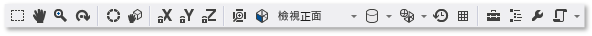

# 模型編輯器
[!INCLUDE[vs2017banner](../code-quality/includes/vs2017banner.md)]

本文件說明如何使用 [!INCLUDE[vsprvs](../code-quality/includes/vsprvs_md.md)] 模型編輯器來檢視、建立和修改 3D 模型。  
  
 您可以使用模型編輯器從頭開始建立基本的 3D 模型，也可以檢視和修改更複雜的 3D 模型 \(使用完整功能 3D 模型化工具建立的\)。  模型編輯器支援數個用在 DirectX 應用程式開發的 3D 模型格式。  
  
## 支援的格式  
 模型編輯器支援這些模型格式：  
  
|格式名稱|副檔名|支援的作業 \(檢視、編輯、建立\)|  
|----------|---------|------------------------|  
|AutoDesk FBX 交換檔案|.fbx|檢視、編輯、建立|  
|Collada DAE 檔案|.dae|檢視、編輯 \(使用 FBX 格式儲存對 Collada DAE 檔案進行的修改\)。|  
|OBJ|.obj|檢視、編輯 \(使用 FBX 格式儲存對 OBJ 檔案進行的修改\)。|  
  
## 使用者入門  
 本節說明如何將 3D 模型加入至 [!INCLUDE[vsprvs](../code-quality/includes/vsprvs_md.md)] 專案，並提供開始所需的基本資訊。  
  
#### 若要加入 3D 模型至您的專案  
  
1.  在 \[**方案總管**\] 中開啟您想要加入影像的捷徑功能表，然後選擇 \[**加入**\]，\[**新增項目**\]。  
  
2.  在 \[**加入新項目**\] 對話方塊中，選取 \[**已安裝**\] 下方的 \[**圖形**\]，然後選取 \[**3D 場景 \(.fbx\)**\]。  
  
3.  指定模型檔案的 \[**名稱**\]，以及您要將其建立的 \[**位置**\]。  
  
4.  選擇 \[**加入**\] 按鈕。  
  
### 座標軸方向  
 [!INCLUDE[vsprvs](../code-quality/includes/vsprvs_md.md)] 支援 3D 座標軸的每一個方向，並且可以從支援座標軸方向的模型檔案格式載入座標軸方向資訊。  如果沒有指定座標軸方向，[!INCLUDE[vsprvs](../code-quality/includes/vsprvs_md.md)] 預設會使用右手座標系統。  \[**座標軸指示器**\] 在設計介面上的右下角顯示目前座標軸的方向。  在 \[**座標軸指示器**\] 上，紅色表示 X 軸，綠色表示 Y 軸，而藍色表示 Z 軸。  
  
### 開始使用 3D 模型  
 在模型編輯器中，每個新的物件永遠都會以模型編輯器內建的其中一種基本 3D 圖形 \(或「*基本類型*」\(Primitive\)\) 為起始。  若要建立新的且唯一的物件，您可以在場景中加入基本類型，然後再修改其頂點以變更其圖形。  對於複雜的圖形，您可以使用立體化或細分來加入其他頂點，然後再加以修改。  如需如何加入基本物件至場景的詳細資訊，請參閱[建立和匯入 3D 物件](#Adding3DObjects)。  如需如何加入更多頂點至物件的詳細資訊，請參閱[修改物件](#ModifyingObjects)。  
  
## 使用模型編輯器  
 下列各節說明如何使用模型編輯器來使用 3D 模型。  
  
### 模型編輯器工具列  
 模型編輯器工具列包含可協助您使用 3D 模型的命令。  
  
 影響 \[模型編輯器\] 狀態的命令位於主要 [!INCLUDE[vsprvs](../code-quality/includes/vsprvs_md.md)] 視窗的 \[**模型編輯器模式**\] 工具列。  模型工具和指令化命令位在 \[模型編輯器\] 設計介面的 \[**模型編輯器**\] 工具列。  
  
 以下是 \[**模型編輯器模式**\] 工具列：  
  
   
  
 此表描述 \[**模型編輯器模式**\] 工具列上的項目，這些項目會依照出現順序從左到右列出。  
  
|工具列項目|描述|  
|-----------|--------|  
|**選取**|啟用依據作用中選取模式，選取場景中的點、邊緣、表面或物件。|  
|**移動瀏覽**|讓 3D 場景相對於視窗框架進行移動。  若要移動瀏覽，請選取場景中的點並四處移動它。   在 \[**選取**\] 模式中，您可以按住 Ctrl 暫時啟用 \[**全景**\] 模式。|  
|**縮放**|使其相對於視窗框架顯示或多或少的場景細節。  在 \[**縮放**\] 模式中，選取場景中的一點，然後左右移動以放大，或上下移動以縮小。   在 \[**選取**\] 模式中，您可以在按住 Ctrl 時使用滑鼠滾輪來縮放。|  
|**軌跡**|將檢視放置在所選物件周圍的圓形路徑。  如果沒有選取任何物件，路徑會置中在場景的原點。 **Note:**  啟用 \[**正視**\] 投影時，此模式沒有作用。|  
|**世界區域**|啟用這個項目時，所選物件的轉換會在世界空間發生。  否則，所選物件上的轉換會在區域空間發生。|  
|**樞紐分析表模式**|啟用這個項目時，轉換會影響選定物件之「*軸點*」\(Pivot Point\) 的位置和方向 \(軸點定義平移、縮放和旋轉作業的中心\)。否則，轉換會影響物件幾何的位置和方向 \(相對於軸點\)。|  
|**鎖定 X 軸**|將物件操作限制於 X 軸。  只有在您使用操作工具 Widget 的中央部分時才適用。|  
|**鎖定 Y 軸**|將物件操作限制於 Y 軸。  只有在您使用操作工具 Widget 的中央部分時才適用。|  
|**鎖定 Z 軸**|將物件操作限制於 Z 軸。  只有在您使用操作工具 Widget 的中央部分時才適用。|  
|**框架物件**|在框架中置入選取的物件，使其位於檢視的中央。|  
|**檢視**|設定檢視方向。  以下是可用的方向：   **前面**  將檢視放置在場景前方。   **背面**  將檢視放置在場景後方。   **左邊**  將檢視放置在場景左方。   **右邊**  將檢視放置在場景右方。   **上方**  將檢視放置在場景上方。   **下方**  將檢視放置在場景下方。 **Note:**  這是在啟用 \[**正視**\] 投影時變更檢視方向的唯一方法。|  
|**投影**|設定用來繪製場景的投影。  以下是可用的投影：   **透視圖**  在透視投影中，離觀測點愈遠的物件看起來愈小，最後在遠方聚集成一點。   **正視**  在正射投影中，不論物件與觀測點的距離為何，物件看起來都是相同大小。  沒有顯示任何聚合。  當啟用 \[**正視**\] 投影時，您不能使用 \[**軌跡**\] 模式放置檢視。|  
|**繪製樣式**|設定在場景中呈現物件的方式。  以下是可用的樣式：   **框線圖**  啟用時，會將物件呈現為框線圖。   **過度繪製**  啟用時，會使用加法混合呈現物件。  您可以使用這個樣式來視覺化場景的過度繪製程度。   **平面網底**  啟用時，會使用基本的平面網底光源模型呈現物件。  您可以使用這個樣式來輕鬆查看物件的表面。   如果這些選項都未啟用，則會使用套用至物件的材質來呈現物件。|  
|**即時轉換模式**|啟用即時轉換時，[!INCLUDE[vsprvs](../code-quality/includes/vsprvs_md.md)] 會重新繪製設計介面，即使沒有執行任何使用者動作也一樣。  當您處理隨著時間變更的著色器時，這個模式相當有用。|  
|**切換格線**|啟用這個項目時，會顯示格線。  否則不會顯示格線。|  
|**工具箱**|或者，顯示或隱藏 \[**工具箱**\]。|  
|**文件大綱**|或者，顯示或隱藏 \[**文件大綱**\] 視窗。|  
|**屬性**|或者，顯示或隱藏 \[**屬性**\] 視窗。|  
|**進階**|包含進階命令和選項。   **圖形引擎**   **以 D3D11 呈現**  使用 Direct3D 11 呈現模型編輯器的設計介面。   **以 D3D11WARP 呈現**  使用 Direct3D 11 Windows Advanced Rasterization Platform \(WARP\) 呈現 \[模型編輯器\] 設計介面。   **場景管理**   **匯入**  將物件從另一個 3D 模型檔案匯入至目前場景。   **附加至父代**  將多個所選物件中的第一個物件建立做為其餘所選物件的父代。   **從父代中斷連結**  從其父代所選物件中斷連結。  選取的物件會變成在場景中的「*根物件*」\(Root Object\)。  根物件沒有父物件。   **建立群組**  將選取的物件群組為同層級物件。   **合併物件**  將選取的物件合併成一個物件。   **從多邊形選取範圍建立新物件**  從目前的物件移除選取的表面，並將包含那些表面的新物件加入至場景。   **工具**   **翻轉多邊形捲繞**  翻轉選取的多邊形，使其捲繞順序及曲面法線反轉。   **移除所有動畫**  移除物件中的動畫資料。   **分成三角形**  將選取的物件轉換為三角形。   **檢視**   背面剔除  啟用或停用背面剔除。   **Frame Rate**  在設計介面的右上角顯示畫面播放速率。  畫面播放速率是每秒繪製的畫面數目。   當您啟用 \[**即時轉換模式**\] 選項時，這個選項就很有用。   **全部顯示**  顯示場景中的所有物件。  這個選項會將每個物件的 \[**隱藏**\] 屬性重設為 \[**False**\]。   **顯示曲面法線**  顯示每一曲面的法線。   **顯示遺漏的材質**  在沒有材質指派給它們的物件上顯示特殊紋理。   **顯示樞紐分析**  啟用或停用在作用中選取範圍的軸點上顯示 3D 座標軸標記。   **顯示預留位置節點**  顯示預留位置節點。  當您群組物件時，會建立預留位置節點。   **顯示頂點法線**  顯示每個頂點的法線。 **Tip:**  您可以選擇 \[**指令碼**\] 按鈕再次執行上一個指令碼。|  
  
 以下是 \[**模型編輯器**\] 工具列：  
  
   
  
 下表描述在 \[**模型編輯器**\] 工具列上的項目，並按照由上而下出現的順序排列。  
  
|工具列項目|描述|  
|-----------|--------|  
|**平移**|移動選取範圍。|  
|**縮放**|變更選取範圍的大小。|  
|**旋轉**|旋轉選取範圍。|  
|**選取點**|設定 \[**選取模式**\] 以選取物件上的個別點。|  
|**選取邊緣**|設定 \[**選取模式**\] 以選取物件上的邊緣 \(兩個頂點之間的線條\)。|  
|**選取表面**|設定 \[**選取模式**\] 以選取物件的表面。|  
|**選取物件**|設定 \[**選取模式**\] 以選取整個物件。|  
|**立體化**|建立額外的表面，並將它連接至選取的表面。|  
|**細分**|將每個選取的表面細分多個面。  若要建立新的表面，需加入新的頂點 \(原始表面的中央一個、每一邊的中央各一個\)，然後和原始頂點連接起來。  新增的表面數目等於原始表面的邊緣數目。|  
  
### 控制檢視  
 這個 3D 場景是根據視景呈現，可視為有位置與方向的虛擬觀景窗。  若要變更位置和方向，請使用 \[**模型編輯器模式**\] 工具列上的檢視控制項。  
  
 下表說明主要檢視控制項。  
  
|檢視控制項|描述|  
|-----------|--------|  
|**移動瀏覽**|讓 3D 場景相對於視窗框架進行移動。  若要移動瀏覽，請選取場景中的點並四處移動它。   在 \[**選取**\] 模式中，您可以按住 Ctrl 暫時啟用 \[**全景**\] 模式。|  
|**縮放**|使其相對於視窗框架顯示或多或少的場景細節。  在 \[**縮放**\] 模式中，選取場景中的一點，然後左右移動以放大，或上下移動以縮小。   在 \[**選取**\] 模式中，您可以在按住 Ctrl 時使用滑鼠滾輪來縮放。|  
|**軌跡**|將檢視放置在所選物件周圍的圓形路徑。  如果沒有選取任何物件，路徑會置中在場景的原點。 **Note:**  啟用 \[**正視**\] 投影時，此模式沒有作用。|  
|**框架物件**|在框架中置入選取的物件，使其位於檢視的中央。|  
  
 這個檢視由虛擬觀景窗建立，不過，它也是由投影定義的。  投影定義在檢視中的圖形和物件如何轉譯成設計介面上的像素。  在 \[**模型編輯器**\] 工具列上，您可以選擇 \[**透視圖**\] 或 \[**正視**\] 投影。  
  
|投影|描述|  
|--------|--------|  
|**透視圖**|在透視投影中，離觀測點愈遠的物件看起來愈小，最後在遠方聚集成一點。|  
|**正視**|在正射投影中，不論物件與觀測點的距離為何，物件看起來都是相同大小。  沒有顯示任何聚合。  當啟用 \[**正視**\] 投影時，您不能使用 \[**軌跡**\] 模式隨機放置檢視。|  
  
 您可能會發現從已知位置和角度檢視 3D 場景是很好的作法，例如當您想要比較兩個類似的場景時。  對於這種情況，模型編輯器提供數個預先定義的檢視。  若要使用預先定義的檢視，在 \[**模型編輯器模式**\] 工具列上，依序選擇 \[**檢視**\] 和您想要使用的預先定義檢視：前面、背面、左邊、右邊、上方或下方。  在這些檢視中，虛擬觀景窗會直接對準場景的原點。  例如，如果您選擇 \[**檢視上方**\]，虛擬觀景窗會從場景正上方對準其原點。  
  
### 檢視其他幾何詳細資料  
 若要進一步了解 3D 物件或場景，您可以檢視其他幾何詳細資料 \(例如每個頂點法線、每個曲面法線、作用中選取範圍的軸點，以及其他詳細資料\)。  若要啟用或停用它們，請在 \[**模型編輯器**\] 工具列中選擇 \[**指令碼**\]、\[**檢視**\]，然後選擇您要的項目。  
  
###   建立和匯入 3D 物件  
 若要將預先定義的 3D 圖形加入至場景，請在 \[**工具箱**\] 中選取您要的圖形，再將它移至設計介面。  新的圖形是放在場景的原點上。  模型編輯器提供七種模型：\[**圓錐體**\]、\[**立方體**\]、\[**圓柱體**\]、\[**實心圓**\]、\[**平面**\]、\[**圓球**\] 和 \[**茶壺**\]。  
  
 若要從檔案匯入 3D 物件，請選擇 \[**模型編輯器**\] 工具列上的 \[**進階**\]、\[**場景管理**\]、\[**匯入**\]，然後指定您要匯入的檔案。  
  
### 轉換物件  
 您可以變更物件的 \[**旋轉**\]、\[**縮放**\] 和 \[**平移**\] 屬性，以「*轉換*」\(Transform\) 該物件。  「*旋轉*」\(Rotation\) 會繞著其軸點定義的 X 軸、Y 軸和 Z 軸連續旋轉，以設定物件的方位。  每個旋轉規格有三個分量 \(依序為 x、y 和 z\)，這些分量以度數為單位指定。  \[**縮放比例**\] 會沿著以軸點為中心的一個或多個座標軸，將物件延伸指定的因數，以調整物件大小。  「*平移*」\(Translation\) 會在 3D 空間中找出與其父代而非軸點相對的物件。  
  
 您可以使用模型化工具或透過設定屬性的方式轉換物件。  
  
##### 若要使用模型化工具來轉換物件  
  
1.  在 \[**選取**\] 模式中，選取您要轉換的物件。  線框重疊表示已選取該物件。  
  
2.  在 \[**模型編輯器**\] 工具列上，選擇 \[**平移**\]、\[**縮放**\] 或 \[**旋轉**\] 工具。  所選物件的平移、縮放或旋轉操作工具隨即出現。  
  
3.  使用操作工具執行轉換。  對於在平移和縮放轉換，操作工具是座標軸指示器。  您一次可以變更一個座標軸，也可以同時使用指示器中心的白色立方體同時變更所有座標軸。  對於旋轉，操作工具是由對應至 X 軸 \(紅色\)、Y 軸 \(綠色\) 和 Z 軸 \(藍色\) 之色彩編碼圓形所組成的球體。  您必須個別地變更座標軸，才能建立所需的旋轉。  
  
##### 若要設定屬性來轉換物件  
  
1.  在 \[**選取**\] 模式中，選取您要轉換的物件。  線框重疊表示已選取該物件。  
  
2.  在 \[**屬性**\] 視窗中，指定 \[**旋轉**\]、\[**縮放**\] 和 \[**平移**\] 屬性的值。  
  
    > [!IMPORTANT]
    >  對於 \[**旋轉**\] 屬性，請指定繞著三個軸中每一個軸旋轉的度數。  旋轉會依序套用，因此務必要規劃旋轉，先繞 X 軸旋轉，接著繞 Y 軸、Z 軸旋轉。  
  
 使用模型工具，您可以快速但不精確地建立轉換。  藉由設定物件屬性，您可以精確但不快速地指定轉換。  建議您使用模型化工具盡可能取得您所需的轉換，然後微調屬性值。  
  
 如果您不想要使用操作工具，您可以啟用自由操作模式。  在 \[**模型編輯器**\] 工具列上，選擇 \[**指令碼**\]、\[**工具**\]、\[**自由操作**\] 以啟用 \(或停用\) 自由操作模式。  在自由操作模式中，您可以開始操作設計介面上的任何點，而不是操作工具上的點。  在自由操作模式中，您可以鎖定您不要變更的座標軸，以限制特定座標軸的變更。  在 \[**模型編輯器模式**\] 工具列上，選擇 \[**鎖定 X**\]、\[**鎖定 Y**\] 和 \[**鎖定 Z**\] 按鈕的任何組合。  
  
 您可能會發現處理物件時使用貼齊格線非常有用。  在 \[**模型編輯器模式**\] 工具列上，選擇 \[**貼齊**\] 按鈕以啟用 \(或停用\) 貼齊格線。  啟用貼齊格線時，平移、旋轉和縮放轉換功能限用於預先定義的遞增。  
  
### 使用軸點  
 物件的軸點是定義它的旋轉和縮放中心。  您可以變更物件的軸點，以變更旋轉及縮放轉換對物件造成的影響。  在 \[**模型編輯器模式**\] 工具列上，選擇 \[**樞紐分析表模式**\] 按鈕以啟用 \(或停用\) 樞紐模式。  啟用樞紐分析模式時，選定物件的軸點上會出現小的座標軸指示器。  接著您可以使用 \[**平移**\] 和 \[**旋轉**\] 工具操作軸點。  
  
 如需如何使用軸點的示範，請參閱 [如何：修改 3D 模型的樞紐分析點](../designers/how-to-modify-the-pivot-point-of-a-3-d-model.md)。  
  
### 世界模式和區域模式  
 平移和旋轉可能發生在物件的區域座標系統 \(或「*局部參考框架*」\(Local Frame\-Of\-Reference\)\)，也可能發生在世界座標系統 \(或「*世界參考框架*」\(World Frame\-Of\-Reference\)\)。  世界參考框架與物件旋轉無關。  預設是區域模式。  若要啟用 \(或停用\) 世界模式，請在 \[**模型編輯器模式**\] 工具列上選擇 \[**WorldLocal**\] 按鈕。  
  
###   修改物件  
 您可以移動或刪除 3D 物件的頂點、邊緣及面，以變更該物件的形狀。  模型編輯器預設會處於「*物件模式*」\(Object Mode\)，讓您可以選取和轉換整個物件。  若要選取範圍點，邊緣或面，請選擇適當的選取模式。  在 \[**模型編輯器模式**\] 工具列上，選擇 \[**選取模式**\]，然後選擇您想要的模式。  
  
 您可以透過擠壓或細分等方式建立其他頂點。  立體化會使表面的頂點 \(頂點的共面集合\) 重複，這仍然由重複的頂點繼續連接，  細分會增加頂點以建立多個平面。  若要建立新的表面，需加入新的頂點 \(原始表面的中央一個、每一邊的中央各一個\)，然後和原始頂點連接起來。  新增的表面數目等於原始表面的邊緣數目。  在這兩種情況下，您可以平移、旋轉和縮放新的頂點來變更物件的幾何。  
  
##### 使物件的表面立體化  
  
1.  在表面選取模式下，選取您想要立體化的表面。  
  
2.  在 \[**模型編輯器**\] 工具列上，選擇 \[**指令碼**\]、\[**工具**\]、\[**立體化**\]。  
  
##### 若要細分表面  
  
1.  在表面選取模式下，選取您想要細分的表面。  由於細分會建立新的邊緣資料，因此當表面為相鄰時，同時細分所有表面會產生更為一致的結果。  
  
2.  在 \[**模型編輯器**\] 工具列上，選擇 \[**指令碼**\]、\[**工具**\]、\[**細分**\]。  
  
 您也可以將表面分成三角形、合併物件，以及將多邊形選取範圍轉換成新物件。  三角形測量會建立其他邊緣，例如將非三角形的表面轉換成最佳的三角形數量；然而，不會提供額外的幾何詳細資料。  合併會將選取的物件結合成一個物件。  可以從多邊形選取範圍建立新物件。  
  
##### 將表面分成三角形  
  
1.  在表面選取模式下，選取您想要分成三角形的表面。  
  
2.  在 \[**模型編輯器**\] 工具列上，選擇 \[**指令碼**\]、\[**工具**\]、\[**分成三角形**\]。  
  
##### 合併物件  
  
1.  在物件選取模式下，選取您想要合併的物件。  
  
2.  在 \[**模型編輯器**\] 工具列上，選擇 \[**指令碼**\]、\[**工具**\]、\[**合併物件**\]。  
  
##### 若要從多邊形選取範圍建立一個物件  
  
1.  在表面選取模式下，選取您想要用來建立新物件的表面。  
  
2.  在 \[**編譯模型**\] 工具列上，選擇 \[**指令碼**\]、\[**工具**\]、\[**從多邊形選取範圍建立新物件**\]。  
  
### 使用材質和著色器  
 物件的外觀取決於在場景中光源的互動及物件的材質。  材質是由描述介面如何回應不同類型光線的屬性，以及根據光源資訊、材質貼圖、法線貼圖和其他資料計算物件表面每個像素之完稿色彩的著色器程式所定義。  
  
 模型編輯器提供這些預設材質：  
  
|材質|描述|  
|--------|--------|  
|Unlit|呈現沒有任何模擬光源的介面。|  
|Lambert|呈現模擬環境光源和擴散光源的介面。|  
|Phong|呈現模擬環境光源、擴散光源和反射反白顯示的介面。|  
  
 這其中每一項材質 \(Material\) 都會將一個紋理 \(Texture\) 套用到物件的介面上。  您可以為每個使用材質的物件設定不同的紋理。  
  
 若要修改特定物件對場景中不同光源的反應，您可以變更材質的光源屬性，而不變更使用該材質的其他物件。  此表說明常見的光源屬性：  
  
|光源屬性|描述|  
|----------|--------|  
|環境|描述介面如何受環境光源的影響。|  
|擴散|描述介面如何受定向光線和點光線的影響。|  
|放射|描述介面如何發出光線，與其他光源無關。|  
|反射|描述介面如何反射定向光線和點光線。|  
|光澤度|描述反射反白顯示的寬度和濃度。|  
  
 根據材質的支援，您可以變更其光源屬性、紋理和其他資料。  在 \[**選取**\] 模式中，選取您要變更的材質，然後在 \[**屬性**\] 視窗中，變更 \[**MaterialAmbient**\]、\[**MaterialDiffuse**\]、\[**MaterialEmissive**\]、\[**MaterialSpecular**\]、\[**MaterialSpecularPower**\] 或其他可用屬性。  材質可以公開最多八個紋理，其屬性是從 \[**Texture1**\] 至 \[**Texture8**\] 循序命名。  
  
 若要移除物件的所有材質，請選擇 \[**模型編輯器**\] 工具列上的 \[**指令碼**\]、\[**材質**\]、\[**移除材質**\]。  
  
 您可以使用 \[**著色器設計工具**\] 建立您可以套用至 3D 場景中物件的自訂著色器材質。  如需如何建立自訂著色器材質的詳細資訊，請參閱[著色器設計工具](../designers/shader-designer.md)。  如需如何將自訂著色器材質套用至物件的詳細資訊，請參閱 [如何：將著色器套用至 3D 模型](../designers/how-to-apply-a-shader-to-a-3-d-model.md)。  
  
### 場景管理  
 您可以將場景當成物件階層結構進行管理。  以階層方式安排多個物件時，平移、縮放或旋轉父節點也會影響其子系。  當您想要利用較基本的物件建構複雜物件或案例時，這特別有用。  
  
 您可以使用 \[**文件大綱**\] 視窗檢視場景階層架構和選取場景節點。  當您選取大綱中的一個節點時，可以使用 \[**屬性**\] 視窗修改其屬性。  
  
 您可以建構物件階層架構，方法是使其成為其他物件的父系，或是將這些物件群組成做為父系之預留位置節點下的同層級。  
  
##### 建立具有父物件的階層架構  
  
1.  在 \[**選取**\] 模式中，選取兩個或更多的物件。  您選取的第一個是父物件。  
  
2.  在 \[**模型編輯器**\] 工具列上，選擇 \[**指令碼**\]、\[**場景管理**\]、\[**附加至父代**\]。  
  
##### 建立同層級物件的階層架構  
  
1.  在 \[**選取**\] 模式中，選取兩個或更多的物件。  預留位置物件已建立並成為其父物件。  
  
2.  在 \[**模型編輯器**\] 工具列上，選擇 \[**指令碼**\]、\[**場景管理**\]、\[**建立群組**\]。  
  
 模型編輯器使用白色線框來識別第一個選取的物件，使其成為父代物件。  選取範圍中的其他物件有藍色線框。  根據預設，不會顯示預留位置節點。  若要顯示預留位置節點，請在 \[**模型編輯器**\] 工具列上選擇 \[**指令碼**\]、\[**場景管理**\]、\[**顯示預留位置節點**\]。  您可以像處理非預留位置物件一樣處理預留位置節點。  
  
 若要移除兩個物件之間的父\-子關聯，請選取子物件，然後選擇 \[**模型編輯器**\] 工具列上的 \[**指令碼**\]、\[**場景管理**\]、\[**從父代中斷連結**\]。  當您中斷連結子物件與其父代時，子物件會變成場景的根物件。  
  
## 鍵盤快速鍵  
  
|命令|鍵盤快速鍵|  
|--------|-----------|  
|切換至 \[**選取**\] 模式。|Ctrl\+G、Ctrl\+Q   S|  
|切換到 \[**縮放**\] 模式|Ctrl\+G、Ctrl\+Z   Z|  
|切換到 \[**全景**\] 模式|Ctrl\+G、Ctrl\+P   K|  
|全選|Ctrl\+A|  
|刪除目前選取範圍|刪除|  
|取消目前的選取範圍|逸出字元|  
|放大|滑鼠滾輪往前捲動   Ctrl \+ 滑鼠滾輪向前轉   Shift \+ 滑鼠滾輪往前捲動   Ctrl \+ PageUp   加號 \(\+\)|  
|縮小|滑鼠滾輪往後捲動   Ctrl \+ 滑鼠滾輪向後轉   Shift \+ 滑鼠滾輪往後捲動   Ctrl \+ PageDown   減號 \(\-\)|  
|向上平移觀景窗|PageDown|  
|向下平移觀景窗|PageUp|  
|向左平移觀景窗|滑鼠滾輪向左捲動   Ctrl \+ PageDown|  
|向右平移觀景窗|滑鼠滾輪向右捲動   Ctrl \+ PageDown|  
|檢視模型頂端|Ctrl\+L、Ctrl\+T   T|  
|檢視模型底部|Ctrl\+L、Ctrl\+U|  
|檢視模型的側面|Ctrl\+L、Ctrl\+L|  
|檢視模型的右側|Ctrl\+L、Ctrl\+R|  
|檢視模型正面|Ctrl\+L、Ctrl\+F|  
|檢視模型背面|Ctrl\+L、Ctrl\+B|  
|視窗中的框架物件|F|  
|切換線框模式|Ctrl\+L、Ctrl\+W|  
|切換貼齊格線|Ctrl\+G、Ctrl\+N|  
|切換樞紐分析模式|Ctrl\+G、Ctrl\+V|  
|切換 X 軸限制|Ctrl\+L、Ctrl\+X|  
|切換 y 軸限制|Ctrl\+L、Ctrl\+Y|  
|切換 z 軸限制|Ctrl\+L、Ctrl\+Z|  
|切換到平移模式|Ctrl\+G、Ctrl\+W   W|  
|切換到 \[縮放\] 模式|Ctrl\+G、Ctrl\+E   E|  
|切換到旋轉模式|Ctrl\+G、Ctrl\+R   R|  
|切換至點選取模式|Ctrl\+L、Ctrl\+1|  
|切換至邊緣選取模式|Ctrl\+L、Ctrl\+2|  
|切換至表面選取模式|Ctrl\+L、Ctrl\+3|  
|切換至物件選取模式|Ctrl\+L、Ctrl\+4|  
|切換至軌跡 \(觀景窗\) 模式|Ctrl\+G、Ctrl\+O|  
|選取場景中的下一個物件|Tab|  
|選取場景中的上一個物件|Shift \+ Tab|  
|在現有工具的基礎上操作選取的物件。|方向鍵|  
|停用目前操作工具|Q|  
|旋轉觀景窗|使用滑鼠左鍵的 Alt \+ 拖曳|  
  
## 相關主題  
  
|標題|描述|  
|--------|--------|  
|[使用 3D 資產來打造遊戲和應用程式](../designers/working-with-3-d-assets-for-games-and-apps.md)|提供可用來與圖形資產 \(例如紋理及影像、立體模型和著色器效果\) 搭配工作之 [!INCLUDE[vsprvs](../code-quality/includes/vsprvs_md.md)] 工具的概觀。|  
|[影像編輯器](../designers/image-editor.md)|描述如何使用 [!INCLUDE[vsprvs](../code-quality/includes/vsprvs_md.md)] 影像編輯器來處理紋理和影像。|  
|[著色器設計工具](../designers/shader-designer.md)|說明如何使用 [!INCLUDE[vsprvs](../code-quality/includes/vsprvs_md.md)] 著色器設計工具，搭配著色器一起運作。|