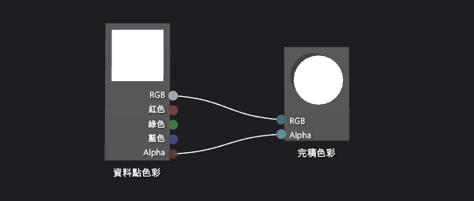
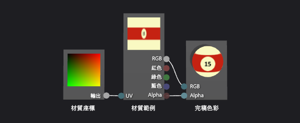
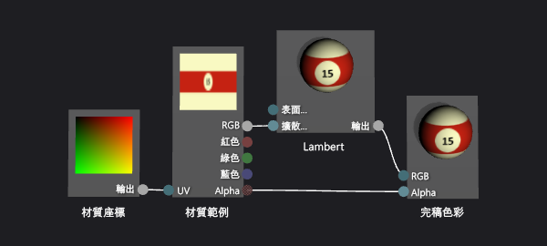
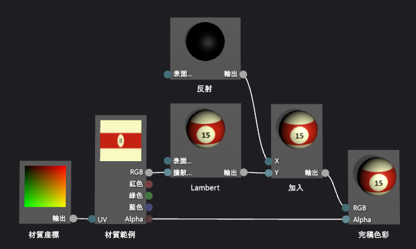
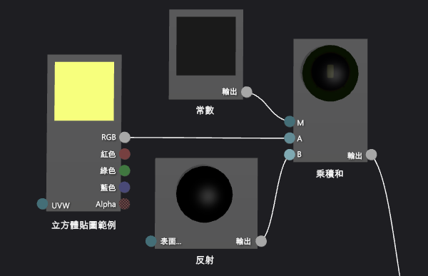
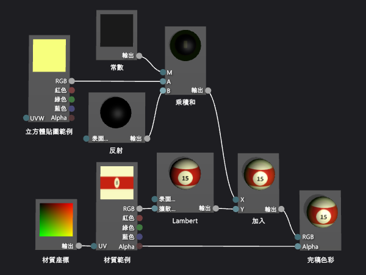

# 逐步解說：建立逼真的 3D 撞球
本逐步解說示範如何在 [!INCLUDE[vsprvs](../code-quality/includes/vsprvs_md.md)] 中使用著色器設計工具與影像編輯器，建立逼真的 3D 撞球。 結合數種著色器技術與適當的紋理資源，達成 3D 撞球的外觀。  
  
 本文件示範下列活動︰  
  
-   使用圖形和紋理建立撞球的基本外觀。  
  
-   透過 Lambert 光源模型增加深度。  
  
-   使用高光強化基本的外觀。  
  
-   透過反映環境建立空間感。  
  
## 必要條件  
 您需要下列元件和技能才能完成此逐步解說：  
  
-   將紋理組合至立方體貼圖的工具，例如隨附於 DirectX SDK 2010 年 6 月版的 DirectX 紋理工具。  
  
-   熟悉 [!INCLUDE[vsprvs](../code-quality/includes/vsprvs_md.md)] 的影像編輯器。  
  
-   熟悉 [!INCLUDE[vsprvs](../code-quality/includes/vsprvs_md.md)] 的著色器設計工具。  
  
## 使用圖形和紋理建立基本的外觀  
 在電腦圖形中，最基本的外觀項目是形狀和色彩。 電腦模擬常使用 3D 模型來表現實際物件的形狀。 然後使用材質貼圖，在模型表面套用色彩細節。  
  
 一般而言，您可能必須詢問藝術家意見以建立可用的 3D 模型，但因為撞球是常見的圖形 (球形)，所以著色器設計工具已有合適的內建模型。  
  
 球體是著色器設計工具中預設的預覽圖形。如果您的著色器目前使用不同的圖形預覽，請切換回球體。  
  
#### 使用球體預覽著色器  
  
-   在 [著色器設計工具] 的工具列上，選擇 [以圓球預覽]。  
  
 在下一個步驟中，您會建立將紋理套用至模型的著色器程式，但首先您必須建立可以使用的紋理。 本逐步解說示範如何使用影像編輯器建立紋理，這是 [!INCLUDE[vsprvs](../code-quality/includes/vsprvs_md.md)] 的一部分，但是您可以使用任何能以合適格式來儲存紋理的影像編輯器。  
  
 請確定已顯示 [屬性] 視窗和 [工具箱]。  
  
#### 使用影像編輯器建立撞球紋理  
  
1.  建立要使用的材質。 如需有關如何將材質加到專案的詳細資訊，請參閱[影像編輯器](../designers/image-editor.md)中的＜使用者入門＞一節。  
  
2.  設定影像大小，使其寬度是高度的兩倍。因為紋理對應到撞球球面的方式，此為必要步驟。 若要調整影像大小，請在 [屬性] 視窗中，指定 [寬度] 和 [高度] 屬性的新值。 例如，將寬度設定為 512、高度設為 256。  
  
3.  繪製撞球的紋理，記住紋理如何對應到球體。  
  
     紋理看起來應該像這樣：  
  
       
  
4.  或者，您也可能想要減少此紋理的儲存需求。 您可以減少紋理的寬度使符合其高度，來完成此作業。 這會壓縮紋理及其寬度，但因為紋理對應至球體的方式，會在呈現撞球時展開。 調整大小後，紋理看起來應該像這樣：  
  
       
  
 現在您可以建立將此紋理套用至模型的著色器。  
  
#### 建立基本材質著色器  
  
1.  建立要使用的 DGSL 著色器。 如需有關如何將 DGSL 著色器加到專案的詳細資訊，請參閱[著色器設計工具](../designers/shader-designer.md)中的＜使用者入門＞一節。  
  
     根據預設，著色器圖形看起來像這樣︰  
  
       
  
2.  修改預設的著色器，以便將紋理樣本的值套用至目前的像素。 著色器圖形看起來應該像這樣︰  
  
       
  
3.  設定紋理屬性，套用您在之前程序中建立的紋理。 將 [材質範例] 節點的 **Texture** 屬性值設定為 [Texture1]，然後使用相同 [屬性] 視窗中的 **Texture1** 屬性群組的 **Filename** 屬性指定紋理檔案。  
  
 如需如何套用您著色器中紋理的詳細資訊，請參閱[如何：建立基本紋理著色器](../designers/how-to-create-a-basic-texture-shader.md)。  
  
 您的撞球現在看起來應該像這樣︰  
  
   
  
## 使用 Lambert 光源模型建立深度  
 到目前為止，您已建立易於辨識的撞球。 不過，它看起起平淡無奇 — 比較像是撞球的卡通圖片，不夠逼真。 平淡的外觀來自簡單的著色器，其表現如同撞球表面的每個像素都接收等量的光照。  
  
 在真實世界中，直接面對光源的受面會顯示最亮的光照，而在光源斜角的受面光照較暗。 這是因為當受面直接面對光源時，光線的能源會分散到最小的受面區域。 當受面轉離光源時，等量的能源會分散到越來越大的受面區域。 背對光源的受面不會接收任何能源，以致有完全黑暗的外觀。 物件的整個介面的亮度變異數是物件的重要視覺提示，有利指出物件的形狀，沒有這個變異數，物件就是扁平的。  
  
 在電腦圖形中，「光源模型」簡化的複雜概數、真實世界的光影互動，其用來複製真實世界的光影景況。 如前文中所述，Lambert 光源模型在物件表面漫射的光照量不一。 您可以將 Lambert 光源模型新增至著色器，讓撞球的 3D 外觀更為逼真。  
  
#### 將 Lambert 光源新增至著色器  
  
-   修改著色器以 Lambert 光源值調整紋理範例的值。 您的著色器圖形看起來應該像這樣︰  
  
       
  
-   或者，您也可以選擇設定著色器圖形的 **MaterialDiffuse** 屬性，調整設定光源的運作方式。 若要存取著色器圖形的屬性，請選擇設計介面的空白區域，然後在 [屬性] 視窗中找出您想要存取的屬性。  
  
 如需如何在著色器中套用 Lambert 光源的詳細資訊，請參閱[如何：建立基本 Lambert 著色器](../designers/how-to-create-a-basic-lambert-shader.md)。  
  
 套用 Lambert 光源後的撞球看起來應該像這樣︰  
  
   
  
## 以高光強化基本的外觀。  
 Lambert 光源模型能為只有紋理的著色器提供形狀和立體感。 不過，撞球仍略顯平淡。  
  
 真實的撞球通常有油亮的光澤，會反射其四周的部分光線。 反射光有部分是高光所致，它會模擬介面的反射屬性。 視加工屬性而定，亮顯可以是局部或廣泛的、強烈或微弱的。 這些高光是使用光源、介面方向和鏡頭位置之間的關係建立模型，也就是當介面方向直接將光源反射到鏡頭時的亮顯最強烈，反射愈間接，亮顯愈不強烈。  
  
 以 Lambert 光源模型為基礎建置的 Phong 光源模型，包括前文中所述的高光。 您可以在著色器中新增 Phong 光源模型，讓撞球的模擬光澤處理產生更有趣的結果。  
  
#### 將高光新增至著色器  
  
1.  使用相加透明混色來修改著色器以包含高光比重。 您的著色器圖形看起來應該像這樣︰  
  
       
  
2.  或者，您也可以設定著色器圖形的高光屬性 (**MaterialSpecular** 和 **MaterialSpecularPower**) 來調整高光的運作方式。 若要存取著色器圖形的屬性，請選擇設計介面的空白區域，然後在 [屬性] 視窗中找出您想要存取的屬性。  
  
 如需如何在著色器中套用高光的詳細資訊，請參閱[如何：建立基本 Phong 著色器](../designers/how-to-create-a-basic-phong-shader.md)。  
  
 套用高光後的撞球看起來應該像這樣︰  
  
   
  
## 反映環境以建立空間感  
 套用高光後的撞球看起來很逼真。 它有正確的形狀、正確的繪製作業及正確的效果。 不過，還有一項技術可讓您的撞球更融入環境。  
  
 如果仔細檢查實際的撞球，您會看到其光亮的表面不只是呈現高光，還會有其周邊事物的模糊倒影。 您可以將環境影像當成紋理使用，結合模型本身的紋理，模擬此反映，藉此決定每個像素的完稿色彩。 視您想要的效果類型而定，您可以結合更多或更少的反射紋理和其餘的著色器。 例如，模擬像鏡像的高反射介面著色器，可能只使用反射紋理，但模擬像撞球那樣較為糢糊反射的著色器，可能只要結合一小部分的反映紋理值和其餘的著色器計算即可。  
  
 當然，您不能只用套用模型紋理貼圖的方式，將反射的影像套用至模型。 如果這樣做，撞球上的反射就會像把周邊環境黏上去一樣。 由於反射可以來自四面八方，所以您需要提供任何角度的反射對應值，以及根據周邊的環境引導反射對應。 為滿足這些需求，您可以使用稱為「立方體貼圖」的特殊紋理貼圖類型，呈立方體的六面紋理。 從這個立方體內部，您可以指向任何方向尋找紋理值。 如果立方體各面的紋理包含環境影像，您可以取樣立方體介面上的正確位置來模擬任何反射。 只要讓立方體與周邊環境保持匹配，您就可以正確反映環境。 為決定立方體的取樣環境，您只要計算鏡頭外的物件介面向量反射，用作 3D 紋理座標即可。 以這種方式使用立方體貼圖，是常用的技巧，稱之為「環境貼圖」。  
  
 環境貼圖提供前文中所述的有效真實反射近似值。 您可以將環境貼圖反射混合到著色器中，讓撞球模擬效果使得撞球在場景中顯得更自然不突兀。  
  
 第一個步驟是建立立方體貼圖紋理。 在多種應用程式中，立方體貼圖的內容不一定要完美無缺才有效，特別是有點模糊的反射或不佔用畫面顯著空間時。 例如，許多遊戲使用預先計算的環境貼圖立方體貼圖，而且只使用其中一個最接近各反射物件的貼圖，雖然這表示反射不正確。 即使粗糙的估計值都足夠逼真。  
  
#### 使用影像編輯器建立環境貼圖的紋理  
  
1.  建立要使用的材質。 如需有關如何將材質加到專案的詳細資訊，請參閱[影像編輯器](../designers/image-editor.md)中的＜使用者入門＞一節。  
  
2.  設定影像大小，使其寬度等於高度，且是 2 的乘冪大小。因為立方體貼圖編製索引的方式，所以這是必要的。 若要調整影像大小，請在 [屬性] 視窗中，指定 [寬度] 和 [高度] 屬性的新值。 例如，將 [寬度] 和 [高度] 屬性的值設成 256。  
  
3.  使用純色填滿紋理。 此紋理會是立方體貼圖的底面，對應球檯的表面。 請記住您所使用的色彩以處理下一個紋理。  
  
4.  建立第二個紋理，大小和第一個紋理相同。 此紋理會在立方體貼圖的四個面重複，對應球檯的表面和邊，以及球檯附近的區域。 請務必使用和底面紋理相同的色彩，以此紋理繪製球檯的介面。 紋理看起來應該像這樣：  
  
       
  
     請記住，反射貼圖不一定要完全一致才有效。例如，本文中建立影像所用的立方體貼圖只包含四個球袋而不是六個。  
  
5.  建立第三個紋理，大小和其他紋理相同。 此紋理會是立方體貼圖的頂面，對應球檯上方的天花板。 為讓這部分的倒影更有趣，您可以繪製頂光以強調前個程序中新增至著色器的高光。 紋理看起來應該像這樣：  
  
       
  
 既然您已針對立方體貼圖的各面建立個別的紋理，就可以使用工具將它們組合至一個儲存在單一 .dds 紋理的立方體貼圖中。 只要可以 .dds 紋理格式來儲存立方體貼圖，您可以使用任何想用的程式來建立立方體貼圖。 本逐步解說示範如何使用附屬於 2010 年 6 月版的 DirectX SDK 的 DirectX 紋理工具來建立紋理。  
  
#### 使用 DirectX 紋理工具組合立方體貼圖  
  
1.  在 DirectX 紋理工具的主功能表中，依序選擇 [檔案] 和 [New Texture] (新增紋理)。 [New Texture] (新增紋理) 對話方塊隨即出現。  
  
2.  在 [Texture Type] (紋理類型) 群組中選擇 [Cubemap Texture] (立方體貼圖紋理)。  
  
3.  在 [尺寸] 群組中，輸入正確的 [寬度] 和 [高度] 值，然後選擇 [確定]。 新的紋理文件隨即出現。 根據預設，紋理首先出現在紋理文件中，對應立方體的**正 X** 面。  
  
4.  將您為紋理立方體面建立的紋理載入到立方體面。 在主功能表上依序選擇 [檔案] 及 [Open Onto This Cubemap Face] (在這個立方體面開啟)，選取您為此立方體面建立的紋理，然後選擇 [開啟]。  
  
5.  對 **負 X**、**正 Z** 和**負 Z** 立方體面重複步驟 4。 若要這樣做，您必須檢視想要載入的立方體面。 若要檢視不同的立方體貼圖面，請在主功能表上依序選擇 [檢視] 和 [Cube Map Face] (立方體貼圖面)，然後選取您想要檢視的立方體面。  
  
6.  在**正 Y** 立方體面載入您為紋理立方體頂面建立的紋理。  
  
7.  在**負 Y** 立方體面載入您為紋理立方體底面建立的紋理。  
  
8.  儲存紋理。  
  
 您可以將立方體貼圖的配置想像成這樣︰  
  
   
  
 頂端影像是正 Y (+Y) 立方體面，中間從左到右是 -X、+Z、+X 和 -Z 立方體面，底面是 -Y 立方體面。  
  
 您現在可以修改著色器，將立方體貼圖範例融入其他著色器。  
  
#### 將環境貼圖新增至著色器  
  
1.  使用相加透明混色來修改著色器以包含環境貼圖。 您的著色器圖形看起來應該像這樣︰  
  
       
  
     請注意，您可以使用 [乘積和] 節點來簡化著色器圖形。  
  
     以下是實作環境貼圖的著色器節點的詳細檢視︰  
  
       
  
2.  設定立方體貼圖紋理屬性，套用您在之前程序中所建立的紋理。 將 [立方體貼圖範例] 節點的 **Texture** 屬性值設定為 [Texture2]，然後使用 **Texture2** 屬性群組的 **Filename** 屬性指定紋理檔案。  
  
3.  或者，您也可以設定 [常數] 節點的 **Output** 屬性，調整撞球的反射率。 若要存取節點屬性，請先選擇節點，然後在 [屬性] 視窗中找出您想要存取的屬性。  
  
 套用環境貼圖後的撞球看起來應該像這樣︰  
  
   
  
 在完稿影像中，請注意您新增的效果如何結合在一起，建立非常逼真的撞球。 形狀、紋理和光源建構了基本的 3D 物件外觀，而高光和反射則讓撞球更有趣且融入環境。  
  
## 另請參閱  
 [如何：匯出著色器](../designers/how-to-export-a-shader.md)   
 [如何：將著色器套用至 3D 模型](../designers/how-to-apply-a-shader-to-a-3-d-model.md)   
 [著色器設計工具](../designers/shader-designer.md)   
 [影像編輯器](../designers/image-editor.md)   
 [著色器設計工具節點](../designers/shader-designer-nodes.md)
