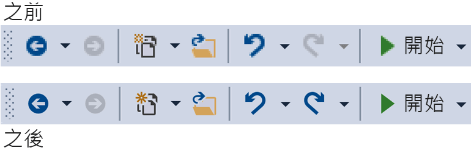
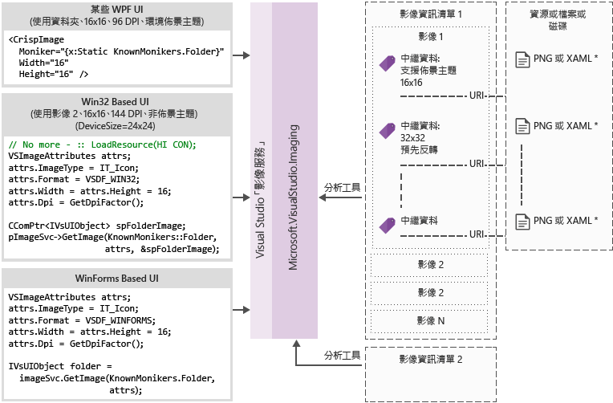

# 映像服務與類別目錄
[!INCLUDE[vs2017banner](../code-quality/includes/vs2017banner.md)]

此操作手冊包含指引和最佳作法採用 Visual Studio 映像服務與 Visual Studio 2015 中導入的映像類別目錄。  
  
 Visual Studio 2015 中導入的映像服務可讓開發人員取得最佳的映像的裝置，以顯示映像，包括正確的主題，它們會顯示內容的使用者選取的佈景主題。 採用映像服務，可協助消除資產維護、 HDPI 調整和主題相關的主要難題。  
  
|||  
|-|-|  
|**今天的問題**|**解決方案**|  
|背景色彩混色|內建的 alpha 混色|  
|佈景主題 （有些） 映像|佈景主題的中繼資料|  
|高對比模式|替代的高對比資源|  
|不同 DPI 模式需要多個資源|可選取以向量為基礎的後援資源|  
|複製影像|映像概念每一個識別項|  
  
 為什麼採用映像服務嗎？  
  
-   一律從 Visual Studio 中取得最新的 「 像素完美 」 映像  
  
-   您可以送出，並使用自己的映像  
  
-   若要測試您的映像出 Windows 加入新的 DPI 縮放比例不需要  
  
-   解決您的實作中的舊架構障礙  
  
 Visual Studio shell 工具列之前和之後使用映像服務︰  
  
   
  
## <a name="how-it-works"></a>它的運作方式  
 映像服務可以提供適用於任何支援的 UI 架構點陣圖影像︰  
  
-   WPF: BitmapSource  
  
-   WinForms: System.Drawing.Bitmap  
  
-   Win32: HBITMAP  
  
 映像服務流程圖  
  
   
  
 **映像 moniker**  
  
 映像 moniker （或簡稱為 moniker） 是可唯一識別影像資產或映像庫中的影像清單資產的 GUID/識別碼配對。  
  
 **已知的 moniker**  
  
 在 Visual Studio 映像的目錄和公開可使用包含任何 Visual Studio 元件或延伸模組的映像 moniker 組。  
  
 **映像的資訊清單檔案**  
  
 映像 (.imagemanifest) 資訊清單檔案是 XML 檔案，定義一組影像資產，表示這些資產，和真正的映像或映像代表每個資產的 moniker。 映像的資訊清單可以定義獨立映像或映像列出舊版的 UI 支援。 此外，也可以變更何時以及如何顯示這些資產設定資產或個別的映像，每個資產背後的屬性。  
  
 **映像的資訊清單結構描述**  
  
 完成映像的資訊清單看起來像這樣︰  
  
```xml  
<ImageManifest>  
      <!-- zero or one Symbols elements -->  
      <Symbols>  
        <!-- zero or more Import, Guid, ID, or String elements -->  
      </Symbols>  
      <!-- zero or one Images elements -->  
      <Images>  
        <!-- zero or more Image elements -->  
      </Images>  
      <!-- zero or one ImageLists elements -->  
      <ImageLists>  
        <!-- zero or more ImageList elements -->  
      </ImageLists>  
</ImageManifest>  
```  
  
 **符號**  
  
 可讀性及維護幫助，因為映像的資訊清單可用於屬性值的符號。 符號已定義如下︰  
  
```xml  
<Symbols>  
      <Import Manifest="manifest" />  
      <Guid Name="ShellCommandGuid" Value="8ee4f65d-bab4-4cde-b8e7-ac412abbda8a" />  
      <ID Name="cmdidSaveAll" Value="1000" />  
      <String Name="AssemblyName" Value="Microsoft.VisualStudio.Shell.UI.Internal" />  
</Symbols>  
```  
  
|||  
|-|-|  
|**子元素**|**定義**|  
|匯入|匯入使用目前的資訊清單中的指定資訊清單檔案的符號|  
|Guid|符號表示的 GUID，而且必須符合 GUID 格式|  
|ID|符號代表識別碼和必須為非負整數|  
|String|此符號代表任意字串值|  
  
 符號會區分大小寫，並參考使用 $(symbol-name) 語法︰  
  
```xml  
<Image Guid="$(ShellCommandGuid)" ID="$(cmdidSaveAll)" >  
      <Source Uri="/$(AssemblyName);Component/Resources/image.xaml" />  
</Image>  
```  
  
 所有的資訊清單已預先定義某些符號。 這些可以用在 Uri 屬性的 \< 來源> 或 \< 匯入> ，參考的路徑在本機電腦上的項目。  
  
|||  
|-|-|  
|**符號**|**描述**|  
|CommonProgramFiles|%Commonprogramfiles%環境變數的值|  
|LocalAppData|%Localappdata%環境變數的值|  
|ManifestFolder|包含資訊清單檔案的資料夾|  
|MyDocuments|目前使用者的 [我的文件] 資料夾的完整路徑|  
|ProgramFiles|%Programfiles%環境變數的值|  
|System|Windows\System32 資料夾|  
|WinDir|%Windir%環境變數的值|  
  
 **映像**  
  
 \< 映像> 項目定義的映像，可以參考的 moniker。 GUID 和 ID 結合起來形成映像 moniker。 在整個映像庫，moniker 映像必須是唯一的。 如果多個映像指定的 moniker，在建立程式庫時所遇到的第一個是會保留。  
  
 它必須包含至少一個來源。 中性大小的來源會提供最佳結果，跨廣泛的大小，但是它們並非必要項。 如果此服務會在要求中未定義大小的影像 \< 映像> 項目並沒有大小中性來源，服務會選擇最適合的特定大小的來源，並調整為要求的大小。  
  
```xml  
<Image Guid="guid" ID="int" AllowColorInversion="true/false">  
      <Source ... />  
      <!-- optional additional Source elements -->  
</Image>  
```  
  
|||  
|-|-|  
|**屬性**|**定義**|  
|Guid|[必要]映像 moniker GUID 部分|  
|ID|[必要]映像 moniker 識別碼部分|  
|AllowColorInversion|[選用，預設為 true]指出映像是否可以有它以程式設計方式反轉使用深色背景的色彩。|  
  
 **來源**  
  
 \< 來源> 項目會定義單一映像來源資產 （XAML 和 PNG）。  
  
```xml  
<Source Uri="uri" Background="background">  
      <!-- optional NativeResource element -->  
 </Source>  
```  
  
|||  
|-|-|  
|**屬性**|**定義**|  
|URI|[必要]定義從何處可以載入影像的 URI。 它可以是下列其中一項︰<br /><br /> -A [Pack URI](http://msdn.microsoft.com/en-US/library/aa970069\(v=vs.100\).aspx) 使用應用程式: / / 授權單位<br />-絕對元件資源參考<br />-包含原生資源的檔案路徑|  
|背景|[選用]指出哪些類型的來源要使用的背景。<br /><br /> 它可以是下列其中一項︰<br /><br /> *光︰* 淺背景使用的來源。<br /><br /> *黑暗︰*深色背景使用的來源。<br /><br /> *高對比︰* 來源可用於任何背景中高對比模式。<br /><br /> *HighContrastLight:* 淺背景高對比模式中使用的來源。<br /><br /> *HighContrastDark:* 深色背景高對比模式中使用的來源。<br /><br /> 如果省略背景屬性，則來源可以用於任何背景。<br /><br /> 如果背景是 *Light*, ，*深色*, ，*HighContrastLight*, ，或 *HighContrastDark*, ，永遠不會反轉的來源色彩。 如果省略或設為背景 *高對比*, ，反轉的來源色彩由映像的 **AllowColorInversion** 屬性。|  
|||  
  
 A \< 來源> 項目可以有一個下列的選擇性子項目︰  
  
||||  
|-|-|-|  
|**項目**|**屬性 （全部所需）**|**定義**|  
|\< 大小>|值|將用來指定大小 （以裝置為單位） 的映像的來源。 映像會正方形。|  
|\< SizeRange>|MinSize MaxSize|來源將使用中的映像從 MinSize 到 MaxSize （裝置單位） （含） 之間。 映像會正方形。|  
|\< 維度>|寬度、 高度|將用來指定的寬度和高度 （以裝置為單位） 的映像的來源。|  
|\< DimensionRange>|MinWidth 或 MinHeight<br /><br /> MaxWidth MaxHeight|來源將使用的最小寬度/高度的最大寬度/高度 （以裝置為單位） 的映像 （含） 之間。|  
  
 A \< 來源> 項目也可以有選擇性 \< NativeResource> 子元素，定義 \< 來源> 載入原生組件，而不是 managed 組件。  
  
```xml  
<NativeResource Type="type" ID="int" />  
```  
  
|||  
|-|-|  
|**屬性**|**定義**|  
|類型|[必要]XAML 或 PNG 原生資源的類型|  
|ID|[必要]原生資源整數識別碼部分|  
  
 **ImageList**  
  
 \< ImageList> 項目會定義一個可傳回單一區域中影像的集合。 視需求，區域為基礎。  
  
```xml  
<ImageList>  
      <ContainedImage Guid="guid" ID="int" External="true/false" />  
      <!-- optional additional ContainedImage elements -->  
 </ImageList>  
```  
  
|||  
|-|-|  
|**屬性**|**定義**|  
|Guid|[必要]映像 moniker GUID 部分|  
|ID|[必要]映像 moniker 識別碼部分|  
|外部|[選用，預設為 false]指出是否映像 moniker 參考目前的資訊清單中的映像。|  
  
 參考目前的清單中所定義的映像沒有包含影像的 moniker。 如果映像庫中找不到包含的影像，影像空白預留位置將使用在其位置。  
  
## <a name="using-the-image-service"></a>使用映像服務  
  
### <a name="first-steps-managed"></a>第一個步驟 (managed)  
 若要使用映像服務，您需要將部分或所有下列組件的參考加入至您的專案︰  
  
-   **Microsoft.VisualStudio.ImageCatalog.dll**  
  
    -   如果您使用內建影像類別目錄 KnownMonikers 為必要項  
  
-   **Microsoft.VisualStudio.Imaging.dll**  
  
    -   如果您使用所需 **CrispImage** 和 **ImageThemingUtilities** WPF ui  
  
-   **Microsoft.VisualStudio.Imaging.Interop.14.0.DesignTime.dll**  
  
    -   如果您使用所需 **ImageMoniker** 和 **ImageAttributes** 類型  
  
    -   **EmbedInteropTypes** 應設為 true  
  
-   **Microsoft.VisualStudio.Shell.Interop.14.0.DesignTime**  
  
    -   如果您使用所需 **IVsImageService2** 類型  
  
    -   **EmbedInteropTypes** 應設為 true  
  
-   **Microsoft.VisualStudio.Utilities.dll**  
  
    -   如果您使用所需 **BrushToColorConverter** 的 ImageThemingUtilities。**ImageBackgroundColor** WPF ui  
  
-   **Microsoft.VisualStudio.Shell。 \< VSVersion>.0**  
  
    -   如果您使用所需 **IVsUIObject** 類型  
  
-   **Microsoft.VisualStudio.Shell.Interop.10.0.dll**  
  
    -   如果您使用 WinForms 相關的 UI 協助程式為必要項  
  
    -   **EmbedInteropTypes** 應設為 true  
  
### <a name="first-steps-native"></a>第一個步驟 (native)  
 若要使用映像服務，您需要包含部分或所有下列標頭至您的專案︰  
  
-   **KnownImageIds.h**  
  
    -   如果您使用內建影像類別目錄所需 **KnownMonikers**, ，但是不能使用 **ImageMoniker** 類型，例如當傳回從數值 **IVsHierarchy GetGuidProperty** 或 **GetProperty** 呼叫。  
  
-   **KnownMonikers.h**  
  
    -   如果您使用內建影像類別目錄所需 **KnownMonikers**。  
  
-   **ImageParameters140.h**  
  
    -   如果您使用所需 **ImageMoniker** 和 **ImageAttributes** 型別。  
  
-   **VSShell140.h**  
  
    -   如果您使用所需 **IVsImageService2** 型別。  
  
-   **ImageThemingUtilities.h**  
  
    -   如果您將無法讓您處理主題的映像服務的需要。  
  
    -   如果映像服務可處理您的映像佈景主題，請不要使用此標頭。  
  
-   **VSUIDPIHelper.h**  
  
    -   如果您使用 DPI 協助程式以取得目前 DPI 必要項。  
  
## <a name="how-do-i-write-new-wpf-ui"></a>如何撰寫新的 WPF 使用者介面？  
  
1.  首先請將上述程式碼中所需的組件參考加入第一個步驟一節，以您的專案。 您不需要將它們全部，因此將您需要的參考。 (請注意︰ 如果您使用或存取 **色彩** 而不是 **筆刷**, ，則可跳至參考 **公用程式**, ，因為您不需要轉換程式。)  
  
2.  選取所需的映像，並取得其 moniker。 使用 **KnownMoniker**, ，或使用您自己，如果您有自己的自訂映像和 moniker。  
  
3.  新增 **CrispImages** 至 XAML。 （請參閱下列範例中）。  
  
4.  設定 **ImageThemingUtilities.ImageBackgroundColor** UI 階層中的屬性。 (這應該設定背景色彩為已知情況下，不一定在位置 **CrispImage**。)（請參閱下列範例中）。  
  
```xaml  
<Window  
  x:Class="WpfApplication.MainWindow"  
  xmlns="http://schemas.microsoft.com/winfx/2006/xaml/presentation"  
  xmlns:x="http://schemas.microsoft.com/winfx/2006/xaml"  
  xmlns:imaging="clr-namespace:Microsoft.VisualStudio.Imaging;assembly=Microsoft.VisualStudio.Imaging"  
  xmlns:theming="clr-namespace:Microsoft.VisualStudio.PlatformUI;assembly=Microsoft.VisualStudio.Imaging"  
  xmlns:utilities="clr-namespace:Microsoft.Internal.VisualStudio.Imaging;assembly=Microsoft.VisualStudio.Imaging"  
  xmlns:catalog="clr-namespace:Microsoft.VisualStudio.Imaging;assembly=Microsoft.VisualStudio.ImageCatalog"  
  Title="MainWindow" Height="350" Width="525" UseLayoutRounding="True">  
  <Window.Resources>  
    <utilities:BrushToColorConverter x:Key="BrushToColorConverter"/>  
  </Window.Resources>  
  <StackPanel Background="White" VerticalAlignment="Center"   
    theming:ImageThemingUtilities.ImageBackgroundColor="{Binding Background, RelativeSource={RelativeSource Self}, Converter={StaticResource BrushToColorConverter}}">  
    <imaging:CrispImage Width="16" Height="16" Moniker="{x:Static catalog:KnownMonikers.MoveUp}" />  
  </StackPanel>  
</Window>  
```  
  
 **如何更新現有的 WPF UI？**  
  
 更新現有的 WPF UI，是相當簡單的程序包含三個基本步驟︰  
  
1.  全部取代 \< 映像> 與在 UI 中的項目 \< CrispImage> 項目  
  
2.  將來源的所有屬性都變更為 Moniker 屬性  
  
    -   如果影像永遠不會變更，而且您正在使用 **KnownMonikers**, ，然後以靜態方式繫結至該屬性 **KnownMoniker**。 （請參閱上面的範例）。  
  
    -   如果影像永遠不會變更，而且您正在使用您自己的自訂映像，然後以靜態方式繫結至您自己的 moniker。  
  
    -   如果影像可能會變更，繫結 Moniker 屬性，屬性變更通知的程式碼屬性。  
  
3.  某處，在 UI 階層中設定 **ImageThemingUtilities.ImageBackgroundColor** 才能確定色彩反轉運作正常。  
  
    -   這可能需要使用 **BrushToColorConverter** 類別。 （請參閱上面的範例）。  
  
## <a name="how-do-i-update-win32-ui"></a>如何更新 Win32 UI？  
 新增下列程式碼，只要適當取代原始的映像載入。 切換傳回 HBITMAPs 與 HIMAGELIST HICONs 與視需要的值。  
  
 **取得映像服務**  
  
```cpp  
CComPtr<IVsImageService2> spImgSvc;  
CGlobalServiceProvider::HrQueryService(SID_SVsImageService, &spImgSvc);  
```  
  
 **要求的映像**  
  
```cpp  
ImageAttributes attr = { 0 };  
attr.StructSize      = sizeof(attributes);  
attr.Format          = DF_Win32;  
// IT_Bitmap for HBITMAP, IT_Icon for HICON, IT_ImageList for HIMAGELIST  
attr.ImageType       = IT_Bitmap;  
attr.LogicalWidth    = 16;  
attr.LogicalHeight   = 16;  
attr.Dpi             = VsUI::DpiHelper::GetDeviceDpiX();  
attr.Background      = 0xFFFFFFFF;  
// Desired RGBA color, if you don't use this, don't set IAF_Background below  
attr.Flags           = IAF_RequiredFlags | IAF_Background;  
  
CComPtr<IVsUIObject> spImg;  
// Replace this KnownMoniker with your desired ImageMoniker  
spImgSvc->GetImage(KnownMonikers::Blank, attributes, &spImg);  
  
```  
  
## <a name="how-do-i-update-winforms-ui"></a>如何更新 WinForms UI？  
 新增下列程式碼，只要適當取代原始的映像載入。 切換傳回點陣圖與圖示，視需要的值。  
  
 **Using 陳述式的有用**  
  
```c#  
using GelUtilities = Microsoft.Internal.VisualStudio.PlatformUI.Utilities;  
```  
  
 **取得映像服務**  
  
```c#  
// This or your preferred way of querying for Visual Studio services  
IVsImageService2 imageService = (IVsImageService2)Package.GetGlobalService(typeof(SVsImageService));  
  
```  
  
 **要求的映像**  
  
```c#  
ImageAttributes attributes = new ImageAttributes  
{  
    StructSize    = Marshal.SizeOf(typeof(ImageAttributes)),  
    // IT_Bitmap for Bitmap, IT_Icon for Icon  
    ImageType     = (uint)_UIImageType.IT_Bitmap,  
    Format        = (uint)_UIDataFormat.DF_WinForms,  
    LogicalWidth  = 16,  
    LogicalHeight = 16,  
    // Desired RGBA color, if you don't use this, don't set IAF_Background below  
    Background    = 0xFFFFFFFF,  
    Flags = (uint)_ImageAttributesFlags.IAF_RequiredFlags | _ImageAttributesFlags.IAF_Background,  
};  
  
// Replace this KnownMoniker with your desired ImageMoniker  
IVsUIObject uIObj = imageService.GetImage(KnownMonikers.Blank, attributes);  
  
Bitmap bitmap = (Bitmap)GelUtilities.GetObjectData(uiObj); // Use this if you need a bitmap  
// Icon icon = (Icon)GelUtilities.GetObjectData(uiObj); // Use this if you need an icon  
  
```  
  
## <a name="how-do-i-use-image-monikers-in-a-new-tool-window"></a>如何使用新的工具視窗中的映像 moniker？  
 VSIX 套件的專案範本已更新為 Visual Studio 2015。 若要建立新的工具視窗，在 VSIX 專案上按一下滑鼠右鍵，然後選取 [加入新項目] (Ctrl + Shift + A)。 節點下的擴充性專案語言，選取 「 自訂工具視窗 」 提供的工具視窗的名稱，然後按 [新增] 按鈕。  
  
 這些是工具視窗中使用 moniker 索引鍵的地方。 請依照下列每個指示︰  
  
1.  當索引標籤取得小工具視窗索引標籤 （也用於 Ctrl + Tab 視窗切換器） 不夠。  
  
     從衍生類別的建構函式中加入這一行 **ToolWindowPane** 類型︰  
  
    ```c#  
    // Replace this KnownMoniker with your desired ImageMoniker  
    this.BitmapImageMoniker = KnownMonikers.Blank;  
    ```  
  
2.  若要開啟 [工具] 視窗中命令。  
  
     在封裝.vsct 檔案中，編輯工具視窗的命令按鈕︰  
  
    ```xml  
    <Button guid="guidPackageCmdSet" id="CommandId" priority="0x0100" type="Button">  
      <Parent guid="guidSHLMainMenu" id="IDG_VS_WNDO_OTRWNDWS1"/>  
      <!-- Replace this KnownMoniker with your desired ImageMoniker -->  
      <Icon guid="ImageCatalogGuid" id="Blank" />  
      <!-- Add this -->  
      <CommandFlag>IconIsMoniker</CommandFlag>  
      <Strings>  
        <ButtonText>MyToolWindow</ButtonText>  
      </Strings>  
    </Button>  
    ```  
  
 **如何使用現有的工具視窗中的映像 moniker？**  
  
 更新現有的工具視窗來使用映像 moniker 是類似的步驟來建立新的工具視窗。  
  
 這些是工具視窗中使用 moniker 索引鍵的地方。 請依照下列每個指示︰  
  
1.  當索引標籤取得小工具視窗索引標籤 （也用於 Ctrl + Tab 視窗切換器） 不夠。  
  
    1.  衍生自類別建構函式中移除這些程式碼行 （如果有的話） **ToolWindowPane** 類型︰  
  
        ```c#  
        this.BitmapResourceID = <Value>;  
        this.BitmapIndex = <Value>;  
        ```  
  
    2.  請參閱步驟 1 的 「 如何使用新的工具視窗中的映像 Moniker？ 」 如上一節。  
  
2.  若要開啟 [工具] 視窗中命令。  
  
    -   請參閱步驟 2 的 「 如何使用新的工具視窗中的映像 Moniker？ 」 如上一節。  
  
## <a name="how-do-i-use-image-monikers-in-a-vsct-file"></a>如何使用.vsct 檔中的映像 moniker？  
 更新您.vsct 檔案加上註解下列程式行所示︰  
  
```xml  
<?xml version="1.0" encoding="utf-8"?>  
<CommandTable xmlns="http://schemas.microsoft.com/VisualStudio/2005-10-18/CommandTable" xmlns:xs="http://www.w3.org/2001/XMLSchema">  
  <!--  Include the definitions for images included in the VS image catalog -->  
  <Include href="KnownImageIds.vsct"/>  
  <Commands package="guidMyPackage">  
    <Buttons>  
      <Button guid="guidMyCommandSet" id="cmdidMyCommand" priority="0x0000" type="Button">  
        <!-- Add an Icon element, changing the attributes to match the image moniker you want to use.  
             In this case, we’re using the Guid for the VS image catalog.  
             Change the id attribute to be the ID of the desired image moniker. -->  
        <Icon guid="ImageCatalogGuid" id="OpenFolder" />  
        <CommandFlag>DynamicVisibility</CommandFlag>  
        <CommandFlag>DefaultInvisible</CommandFlag>  
        <CommandFlag>DefaultDisabled</CommandFlag>  
        <CommandFlag>CommandWellOnly</CommandFlag>  
        <CommandFlag>IconAndText</CommandFlag>  
        <!-- Add the IconIsMoniker CommandFlag -->  
        <CommandFlag>IconIsMoniker</CommandFlag>  
        <Strings>  
          <ButtonText>Quick Fixes...</ButtonText>  
          <CommandName>Show Quick Fixes</CommandName>  
          <CanonicalName>ShowQuickFixes</CanonicalName>  
          <LocCanonicalName>ShowQuickFixes</LocCanonicalName>  
        </Strings>  
      </Button>  
    </Buttons>  
  </Commands>  
  <!-- It is recommended that you remove <Bitmap> elements that are no longer used in the vsct file -->  
  <Symbols>  
    <GuidSymbol name="guidMyPackage"    value="{1491e936-6ffe-474e-8371-30e5920d8fdd}" />  
    <GuidSymbol name="guidMyCommandSet" value="{10347de4-69a9-47f4-a950-d3301f6d2bc7}">  
      <IDSymbol name="cmdidMyCommand" value="0x9437" />  
    </GuidSymbol>  
  </Symbols>  
</CommandTable>  
```  
  
 **如果我.vsct 檔也需要由舊版的 Visual Studio？**  
  
 舊版的 Visual Studio 不會辨識 **IconIsMoniker** 命令旗標。 您可以使用映像從映像服務之支援它，但繼續使用舊式的映像在舊版的 Visual Studio 版本的 Visual Studio。 若要這樣做，您會將.vsct 檔案保持不變 （並因此與舊版的 Visual Studio 相容），並從.vsct 檔中所定義的 GUID /ID 組建立 CSV （逗點分隔值） 檔案所對應 \< 點陣圖> 映像 moniker GUID /ID 組項目。  
  
 對應的 CSV 檔案的格式如下︰  
  
```  
Icon guid, Icon id, Moniker guid, Moniker id  
b714fcf7-855e-4e4c-802a-1fd87144ccad,1,fda30684-682d-421c-8be4-650a2967058e,100  
b714fcf7-855e-4e4c-802a-1fd87144ccad,2,fda30684-682d-421c-8be4-650a2967058e,200  
```  
  
 CSV 檔案會與封裝一起部署，並指定其位置 **IconMappingFilename** 屬性 **ProvideMenuResource** 封裝屬性︰  
  
```c#  
[ProvideMenuResource("MyPackage.ctmenu", 1, IconMappingFilename="IconMappings.csv")]  
```  
  
  **IconMappingFilename** 相對路徑以隱含方式為根目錄 $PackageFolder$ （如同上述範例中），或明確為定義環境變數，例如目錄的絕對路徑根目錄 @"%UserProfile%\dir1\dir2\MyMappingFile.csv".  
  
## <a name="how-do-i-port-a-project-system"></a>如何連接埠專案系統？  
 **如何提供 ImageMonikers 專案**  
  
1.  實作 **VSHPROPID_SupportsIconMonikers** 專案的 **IVsHierarchy**, ，並傳回 true。  
  
2.  實作 **VSHPROPID_IconMonikerImageList** (如果使用原始專案 **VSHPROPID_IconImgList**) 或 **VSHPROPID_IconMonikerGuid**, ，**VSHPROPID_IconMonikerId**, ，**VSHPROPID_OpenFolderIconMonikerGuid**, ，**VSHPROPID_OpenFolderIconMonikerId** (如果使用原始專案 **VSHPROPID_IconHandle** 和 **VSHPROPID_OpenFolderIconHandle**)。  
  
3.  變更原始 VSHPROPIDs 圖示來建立 「 舊版 」 圖示的版本，如果擴充點提出要求時的實作。 **IVsImageService2** 提供那些圖示所需的功能  
  
 **額外的需求，vb / C# 專案特性**  
  
 只有實作 **VSHPROPID_SupportsIconMonikers** 如果偵測到您的專案 **最外層 flavor**。 否則，實際的最外層類別可能不支援影像 moniker，事實上，而且您基底類別可能會有效地 「 隱藏 」 自訂映像。  
  
 **如何使用 CPS 中的映像 moniker？**  
  
 CPS （一般專案系統） 中設定自訂映像可以透過手動或透過隨附於專案系統擴充性 SDK 的項目範本。  
  
 **使用專案系統擴充性 SDK**  
  
 請依照下列指示 [專案型別項目型別提供自訂圖示](https://github.com/Microsoft/VSProjectSystem/blob/master/doc/scenario/provide_custom_icons_for_the_project_or_item_type.md) 來自訂您的 CPS 映像。 CPS 的詳細資訊，請參閱 [Visual Studio 專案系統擴充性文件](https://github.com/Microsoft/VSProjectSystem)  
  
 **以手動方式使用 ImageMonikers**  
  
1.  實作並匯出 **IProjectTreeModifier** 專案系統中的介面。  
  
2.  判斷哪些 **KnownMoniker** 或您想要使用的自訂映像 moniker。  
  
3.  在 **ApplyModifications** 方法，執行下列某處中的方法，再傳回新的樹狀結構，類似於下列範例中︰  
  
    ```c#  
    // Replace this KnownMoniker with your desired ImageMoniker  
    tree = tree.SetIcon(KnownMonikers.Blank.ToProjectSystemType());  
    ```  
  
4.  如果您要建立新的樹狀結構，您可以設定自訂映像所需的 moniker 傳遞至 NewTree 方法類似於下列範例︰  
  
    ```c#  
    // Replace this KnownMoniker with your desired ImageMoniker  
    ProjectImageMoniker icon         = KnownMonikers.FolderClosed.ToProjectSystemType();  
    ProjectImageMoniker expandedIcon = KnownMonikers.FolderOpened.ToProjectSystemType();  
  
    return this.ProjectTreeFactory.Value.NewTree(/*caption*/<value>,  
                                                 /*filePath*/<value>,  
                                                 /*browseObjectProperties*/<value>,  
                                                 icon,  
                                                 expandedIcon);  
    ```  
  
## <a name="how-do-i-convert-from-a-real-image-strip-to-a-moniker-based-image-strip"></a>如何將轉換的實際影像區域從 moniker 為基礎的影像區域？  
 **我需要支援 HIMAGELISTs**  
  
 如果有現存的映像帶您想要更新來使用映像服務，但您會受限於需要影像清單傳遞的 Api 的程式碼，您仍然可以取得映像服務的優點。 若要建立的 moniker 為基礎的影像區域，請依照下列步驟，從現有的 moniker 建立資訊清單。  
  
1.  執行 **ManifestFromResources** 工具，將它傳遞影像區域。 這會產生該區域的資訊清單。  
  
    -   建議值︰ 提供以符合其使用方式的資訊清單的非預設名稱。  
  
2.  如果您只使用 **KnownMonikers**, ，然後執行下列動作︰  
  
    -   取代 \< 映像> 與資訊清單區段 \< 映像 />。  
  
    -   移除所有 subimage Id (任何具有 \< imagestrip 名稱>_ # #)。  
  
    -   建議值︰ 重新命名的 AssetsGuid 符號和影像區域符號，以符合其使用方式。  
  
    -   取代每個 **ContainedImage**的 GUID 以 $(ImageCatalogGuid)，取代每個 **ContainedImage**的識別碼與 $(\<moniker>)，將外部 ="true"屬性加入至每個 **ContainedImage**  
  
        -   \< moniker> 用來取代 **KnownMoniker** 符合映像，但 「 KnownMonikers 」。 從名稱中移除。  
  
    -   新增 < 匯入 Manifest="$(ManifestFolder)\\< 相對安裝目錄路徑來\>\Microsoft.VisualStudio.ImageCatalog.imagemanifest"/\> 頂端 \< 符號> 一節。  
  
        -   相對路徑取決於安裝程式撰寫為資訊清單中所定義之部署位置。  
  
3.  執行 **ManifestToCode** 工具產生的包裝函式使現有的程式碼有的 moniker，它可用來查詢映像服務的影像區域。  
  
    -   建議值︰ 提供包裝函式和命名空間，以符合其使用方式的非預設的名稱。  
  
4.  所有加入時，安裝程式撰寫/部署，與其他程式碼變更，才能使用映像服務和新的檔案。  
  
 包括內部和外部的映像，以查看其外觀的範例資訊清單︰  
  
```xml  
<?xml version="1.0"?>  
<ImageManifest  
  xmlns:xsi="http://www.w3.org/2001/XMLSchema-instance"  
  xmlns:xsd="http://www.w3.org/2001/XMLSchema"  
  xmlns="http://schemas.microsoft.com/VisualStudio/ImageManifestSchema/2014">  
  
  <Symbols>  
    <!-- This needs to be the relative path from your manifest to the ImageCatalog's manifest  
         where $(ManifestFolder) is the deployed location of this manifest. -->  
    <Import Manifest="$(ManifestFolder)\<RelPath>\Microsoft.VisualStudio.ImageCatalog.imagemanifest" />  
  
    <String Name="Resources" Value="/My.Assembly.Name;Component/Resources/ImageStrip" />  
    <Guid Name="ImageGuid" Value="{fb41b7ef-6587-480c-aa27-5b559d42cfc9}" />  
    <Guid Name="ImageStripGuid" Value="{9c84a570-d9a7-4052-a340-188fb276f973}" />  
    <ID Name="MyImage_0" Value="100" />  
    <ID Name="MyImage_1" Value="101" />  
    <ID Name="InternalList" Value="1001" />  
    <ID Name="ExternalList" Value="1002" />  
  </Symbols>  
  
  <Images>  
    <Image Guid="$(ImageGuid)" ID="$(MyImage_0)">  
      <Source Uri="$(Resources)/MyImage_0.png">  
        <Size Value="16" />  
      </Source>  
    </Image>  
    <Image Guid="$(ImageGuid)" ID="$(MyImage_1)">  
      <Source Uri="$(Resources)/MyImage_1.png">  
        <Size Value="16" />  
      </Source>  
    </Image>  
  </Images>  
  
  <ImageLists>  
    <ImageList Guid="$(ImageStripGuid)" ID="$(InternalList)">  
      <ContainedImage Guid="$(ImageGuid)" ID="$(MyImage_0)" />  
      <ContainedImage Guid="$(ImageGuid)" ID="$(MyImage_1)" />  
    </ImageList>  
    <ImageList Guid="$(ImageStripGuid)" ID="$(ExternalList)">  
      <ContainedImage Guid="$(ImageCatalogGuid)" ID="$(StatusError)" External="true" />  
      <ContainedImage Guid="$(ImageCatalogGuid)" ID="$(StatusWarning)" External="true" />  
      <ContainedImage Guid="$(ImageCatalogGuid)" ID="$(StatusInformation)" External="true" />  
    </ImageList>  
  </ImageLists>  
  
</ImageManifest>  
```  
  
 **我不需要支援 HIMAGELISTs**  
  
1.  判斷一組 **KnownMonikers** ，符合您的影像區域，在影像，或在影像區域中建立您自己的映像的 moniker。  
  
2.  更新您用來取得映像所需的索引，改為使用 moniker 的映像帶中的任何對應。  
  
3.  更新您的程式碼使用映像服務要求透過更新對應的 moniker。 (這可能表示需要更新至 **CrispImages** 的 managed 程式碼，或要求 HBITMAPs 或 HICONs 映像服務，並將它們周圍的原生程式碼。)  
  
## <a name="testing-your-images"></a>測試您的映像  
 您可以使用映像的程式庫檢視器工具來測試您的映像資訊清單，並確定已正確撰寫的所有項目。 您可以找到此工具在 [Visual Studio 2015 SDK](http://msdn.microsoft.com/library/bb166441.aspx)。 這項工具和其他文件 [這裡](http://aka.ms/VSImageThemeTools)。  
  
## <a name="additional-resources"></a>其他資源  
  
### <a name="samples"></a>範例  
 數個 GitHub 上的 Visual Studio 範例已經更新，說明如何使用各種 Visual Studio 擴充性點的一部分，映像服務。  
  
 檢查 [http://github.com/Microsoft/VSSDK-Extensibility-Samples](http://github.com/Microsoft/VSSDK-Extensibility-Samples) 的最新的範例。  
  
### <a name="tooling"></a>Tooling  
 建立映像服務的支援工具組，以建立/更新 UI，可以使用映像服務。 如需每個工具的詳細資訊，請檢查工具所隨附的文件。 工具會納入 [Visual Studio 2015 SDK。](http://msdn.microsoft.com/library/bb166441.aspx)  
  
 **ManifestFromResources**  
  
 從資源工具資訊清單會擷取影像資源 （PNG 或 XAML） 的清單，並產生映像服務搭配使用這些映像的映像資訊清單檔。  
  
 **ManifestToCode**  
  
 程式碼工具的資訊清單會使用映像資訊清單檔案，並產生的包裝函式檔案參考程式碼 （c + +、 C# 或 VB） 或.vsct 檔案中的資訊清單的值。  
  
 **ImageLibraryViewer**  
  
 映像的程式庫檢視器工具可以載入映像的資訊清單，並讓使用者能夠操作這些 Visual Studio 會先確認已正確撰寫資訊清單的方式相同。 使用者可以改變背景、 大小、 DPI 設定，高對比，以及其他設定。 它也會顯示載入之資訊清單中找出錯誤的資訊，並顯示資訊清單中的每個映像的來源資訊。  
  
## <a name="faq"></a>常見問題集  
  
-   是否有任何相依性，載入時，您必須包含 \< 參考 Include="Microsoft.VisualStudio.*。Interop.14.0.DesignTime"/>嗎？  
  
    -   設定 EmbedInteropTypes ="true"，所有的 interop Dll 上。  
  
-   如何部署與 my 擴充性的映像資訊清單？  
  
    -   將.imagemanifest 檔案加入至您的專案。  
  
    -   設定 [包含在 VSIX] 為 True。  
  
-   我要更新我的 CPS 專案系統。 發生了什麼事 **ImageName** 和 **StockIconService**？  
  
    -   o CPS 已更新為使用 moniker 時，這些被移除。 您不再需要呼叫 **StockIconService**, ，只要傳遞所需 **KnownMoniker** 方法或屬性使用 **ToProjectSystemType()** CPS 公用程式中的擴充方法。 您可以找到從對應 **ImageName** 至 **KnownMonikers** 如下︰  
  
        |||  
        |-|-|  
        |**ImageName**|**KnownMoniker**|  
        |ImageName.OfflineWebApp|KnownImageIds.Web|  
        |ImageName.WebReferencesFolder|KnownImageIds.Web|  
        |ImageName.OpenReferenceFolder|KnownImageIds.FolderOpened|  
        |ImageName.ReferenceFolder|KnownImageIds.Reference|  
        |ImageName.Reference|KnownImageIds.Reference|  
        |ImageName.SdlWebReference|KnownImageIds.WebReferenceFolder|  
        |ImageName.DiscoWebReference|KnownImageIds.DynamicDiscoveryDocument|  
        |ImageName.Folder|KnownImageIds.FolderClosed|  
        |ImageName.OpenFolder|KnownImageIds.FolderOpened|  
        |ImageName.ExcludedFolder|KnownImageIds.HiddenFolderClosed|  
        |ImageName.OpenExcludedFolder|KnownImageIds.HiddenFolderOpened|  
        |ImageName.ExcludedFile|KnownImageIds.HiddenFile|  
        |ImageName.DependentFile|KnownImageIds.GenerateFile|  
        |ImageName.MissingFile|KnownImageIds.DocumentWarning|  
        |ImageName.WindowsForm|KnownImageIds.WindowsForm|  
        |ImageName.WindowsUserControl|KnownImageIds.UserControl|  
        |ImageName.WindowsComponent|KnownImageIds.ComponentFile|  
        |ImageName.XmlSchema|KnownImageIds.XMLSchema|  
        |ImageName.XmlFile|KnownImageIds.XMLFile|  
        |ImageName.WebForm|KnownImageIds.Web|  
        |ImageName.WebService|KnownImageIds.WebService|  
        |ImageName.WebUserControl|KnownImageIds.WebUserControl|  
        |ImageName.WebCustomUserControl|KnownImageIds.WebCustomControl|  
        |ImageName.AspPage|KnownImageIds.ASPFile|  
        |ImageName.GlobalApplicationClass|KnownImageIds.SettingsFile|  
        |ImageName.WebConfig|KnownImageIds.ConfigurationFile|  
        |ImageName.HtmlPage|KnownImageIds.HTMLFile|  
        |ImageName.StyleSheet|KnownImageIds.StyleSheet|  
        |ImageName.ScriptFile|KnownImageIds.JSScript|  
        |ImageName.TextFile|KnownImageIds.Document|  
        |ImageName.SettingsFile|KnownImageIds.Settings|  
        |ImageName.Resources|KnownImageIds.DocumentGroup|  
        |ImageName.Bitmap|KnownImageIds.Image|  
        |ImageName.Icon|KnownImageIds.IconFile|  
        |ImageName.Image|KnownImageIds.Image|  
        |ImageName.ImageMap|KnownImageIds.ImageMapFile|  
        |ImageName.XWorld|KnownImageIds.XWorldFile|  
        |ImageName.Audio|KnownImageIds.Sound|  
        |ImageName.Video|KnownImageIds.Media|  
        |ImageName.Cab|KnownImageIds.CABProject|  
        |ImageName.Jar|KnownImageIds.JARFile|  
        |ImageName.DataEnvironment|KnownImageIds.DataTable|  
        |ImageName.PreviewFile|KnownImageIds.Report|  
        |ImageName.DanglingReference|KnownImageIds.ReferenceWarning|  
        |ImageName.XsltFile|KnownImageIds.XSLTransform|  
        |ImageName.Cursor|KnownImageIds.CursorFile|  
        |ImageName.AppDesignerFolder|KnownImageIds.Property|  
        |ImageName.Data|KnownImageIds.Database|  
        |ImageName.Application|KnownImageIds.Application|  
        |ImageName.DataSet|KnownImageIds.DatabaseGroup|  
        |ImageName.Pfx|KnownImageIds.Certificate|  
        |ImageName.Snk|KnownImageIds.Rule|  
        |ImageName.VisualBasicProject|KnownImageIds.VBProjectNode|  
        |ImageName.CSharpProject|KnownImageIds.CSProjectNode|  
        |ImageName.Empty|KnownImageIds.Blank|  
        |ImageName.MissingFolder|KnownImageIds.FolderOffline|  
        |ImageName.SharedImportReference|KnownImageIds.SharedProject|  
        |ImageName.SharedProjectCs|KnownImageIds.CSSharedProject|  
        |ImageName.SharedProjectVc|KnownImageIds.CPPSharedProject|  
        |ImageName.SharedProjectJs|KnownImageIds.JSSharedProject|  
        |ImageName.CSharpCodeFile|KnownImageIds.CSFileNode|  
        |ImageName.VisualBasicCodeFile|KnownImageIds.VBFileNode|  
  
    -   我要更新我的完成清單提供者。 什麼 **KnownMonikers** 符合舊 **StandardGlyphGroup** 和 **StandardGlyph** 值？  
  
        ||||  
        |-|-|-|  
        |GlyphGroupClass|GlyphItemPublic|ClassPublic|  
        |GlyphGroupClass|GlyphItemInternal|ClassInternal|  
        |GlyphGroupClass|GlyphItemFriend|ClassInternal|  
        |GlyphGroupClass|GlyphItemProtected|ClassProtected|  
        |GlyphGroupClass|GlyphItemPrivate|ClassPrivate|  
        |GlyphGroupClass|GlyphItemShortcut|ClassShortcut|  
        |GlyphGroupConstant|GlyphItemPublic|ClassPublic|  
        |GlyphGroupConstant|GlyphItemInternal|ClassInternal|  
        |GlyphGroupConstant|GlyphItemFriend|ClassInternal|  
        |GlyphGroupConstant|GlyphItemProtected|ClassProtected|  
        |GlyphGroupConstant|GlyphItemPrivate|ClassPrivate|  
        |GlyphGroupConstant|GlyphItemShortcut|ClassShortcut|  
        |GlyphGroupDelegate|GlyphItemPublic|DelegatePublic|  
        |GlyphGroupDelegate|GlyphItemInternal|DelegateInternal|  
        |GlyphGroupDelegate|GlyphItemFriend|DelegateInternal|  
        |GlyphGroupDelegate|GlyphItemProtected|DelegateProtected|  
        |GlyphGroupDelegate|GlyphItemPrivate|DelegatePrivate|  
        |GlyphGroupDelegate|GlyphItemShortcut|DelegateShortcut|  
        |GlyphGroupEnum|GlyphItemPublic|EnumerationPublic|  
        |GlyphGroupEnum|GlyphItemInternal|EnumerationInternal|  
        |GlyphGroupEnum|GlyphItemFriend|EnumerationInternal|  
        |GlyphGroupEnum|GlyphItemProtected|EnumerationProtected|  
        |GlyphGroupEnum|GlyphItemPrivate|EnumerationPrivate|  
        |GlyphGroupEnum|GlyphItemShortcut|EnumerationShortcut|  
        |GlyphGroupEnumMember|GlyphItemPublic|EnumerationMemberPublic|  
        |GlyphGroupEnumMember|GlyphItemInternal|EnumerationMemberInternal|  
        |GlyphGroupEnumMember|GlyphItemFriend|EnumerationMemberInternal|  
        |GlyphGroupEnumMember|GlyphItemProtected|EnumerationMemberProtected|  
        |GlyphGroupEnumMember|GlyphItemPrivate|EnumerationMemberPrivate|  
        |GlyphGroupEnumMember|GlyphItemShortcut|EnumerationMemberShortcut|  
        |GlyphGroupEvent|GlyphItemPublic|EventPublic|  
        |GlyphGroupEvent|GlyphItemInternal|EventInternal|  
        |GlyphGroupEvent|GlyphItemFriend|EventInternal|  
        |GlyphGroupEvent|GlyphItemProtected|EventProtected|  
        |GlyphGroupEvent|GlyphItemPrivate|EventPrivate|  
        |GlyphGroupEvent|GlyphItemShortcut|EventShortcut|  
        |GlyphGroupException|GlyphItemPublic|ExceptionPublic|  
        |GlyphGroupException|GlyphItemInternal|ExceptionInternal|  
        |GlyphGroupException|GlyphItemFriend|ExceptionInternal|  
        |GlyphGroupException|GlyphItemProtected|ExceptionProtected|  
        |GlyphGroupException|GlyphItemPrivate|ExceptionPrivate|  
        |GlyphGroupException|GlyphItemShortcut|ExceptionShortcut|  
        |GlyphGroupField|GlyphItemPublic|FieldPublic|  
        |GlyphGroupField|GlyphItemInternal|FieldInternal|  
        |GlyphGroupField|GlyphItemFriend|FieldInternal|  
        |GlyphGroupField|GlyphItemProtected|FieldProtected|  
        |GlyphGroupField|GlyphItemPrivate|FieldPrivate|  
        |GlyphGroupField|GlyphItemShortcut|FieldShortcut|  
        |GlyphGroupInterface|GlyphItemPublic|InterfacePublic|  
        |GlyphGroupInterface|GlyphItemInternal|InterfaceInternal|  
        |GlyphGroupInterface|GlyphItemFriend|InterfaceInternal|  
        |GlyphGroupInterface|GlyphItemProtected|InterfaceProtected|  
        |GlyphGroupInterface|GlyphItemPrivate|InterfacePrivate|  
        |GlyphGroupInterface|GlyphItemShortcut|InterfaceShortcut|  
        |GlyphGroupMacro|GlyphItemPublic|MacroPublic|  
        |GlyphGroupMacro|GlyphItemInternal|MacroInternal|  
        |GlyphGroupMacro|GlyphItemFriend|MacroInternal|  
        |GlyphGroupMacro|GlyphItemProtected|MacroProtected|  
        |GlyphGroupMacro|GlyphItemPrivate|MacroPrivate|  
        |GlyphGroupMacro|GlyphItemShortcut|MacroShortcut|  
        |GlyphGroupMap|GlyphItemPublic|MapPublic|  
        |GlyphGroupMap|GlyphItemInternal|MapInternal|  
        |GlyphGroupMap|GlyphItemFriend|MapInternal|  
        |GlyphGroupMap|GlyphItemProtected|MapProtected|  
        |GlyphGroupMap|GlyphItemPrivate|MapPrivate|  
        |GlyphGroupMap|GlyphItemShortcut|MapShortcut|  
        |GlyphGroupMapItem|GlyphItemPublic|MapItemPublic|  
        |GlyphGroupMapItem|GlyphItemInternal|MapItemInternal|  
        |GlyphGroupMapItem|GlyphItemFriend|MapItemInternal|  
        |GlyphGroupMapItem|GlyphItemProtected|MapItemProtected|  
        |GlyphGroupMapItem|GlyphItemPrivate|MapItemPrivate|  
        |GlyphGroupMapItem|GlyphItemShortcut|MapItemShortcut|  
        |GlyphGroupMethod|GlyphItemPublic|MethodPublic|  
        |GlyphGroupMethod|GlyphItemInternal|MethodInternal|  
        |GlyphGroupMethod|GlyphItemFriend|MethodInternal|  
        |GlyphGroupMethod|GlyphItemProtected|MethodProtected|  
        |GlyphGroupMethod|GlyphItemPrivate|MethodPrivate|  
        |GlyphGroupMethod|GlyphItemShortcut|MethodShortcut|  
        |GlyphGroupOverload|GlyphItemPublic|MethodPublic|  
        |GlyphGroupOverload|GlyphItemInternal|MethodInternal|  
        |GlyphGroupOverload|GlyphItemFriend|MethodInternal|  
        |GlyphGroupOverload|GlyphItemProtected|MethodProtected|  
        |GlyphGroupOverload|GlyphItemPrivate|MethodPrivate|  
        |GlyphGroupOverload|GlyphItemShortcut|MethodShortcut|  
        |GlyphGroupModule|GlyphItemPublic|ModulePublic|  
        |GlyphGroupModule|GlyphItemInternal|ModuleInternal|  
        |GlyphGroupModule|GlyphItemFriend|ModuleInternal|  
        |GlyphGroupModule|GlyphItemProtected|ModuleProtected|  
        |GlyphGroupModule|GlyphItemPrivate|ModulePrivate|  
        |GlyphGroupModule|GlyphItemShortcut|ModuleShortcut|  
        |GlyphGroupNamespace|GlyphItemPublic|NamespacePublic|  
        |GlyphGroupNamespace|GlyphItemInternal|NamespaceInternal|  
        |GlyphGroupNamespace|GlyphItemFriend|NamespaceInternal|  
        |GlyphGroupNamespace|GlyphItemProtected|NamespaceProtected|  
        |GlyphGroupNamespace|GlyphItemPrivate|NamespacePrivate|  
        |GlyphGroupNamespace|GlyphItemShortcut|NamespaceShortcut|  
        |GlyphGroupOperator|GlyphItemPublic|OperatorPublic|  
        |GlyphGroupOperator|GlyphItemInternal|OperatorInternal|  
        |GlyphGroupOperator|GlyphItemFriend|OperatorInternal|  
        |GlyphGroupOperator|GlyphItemProtected|OperatorProtected|  
        |GlyphGroupOperator|GlyphItemPrivate|OperatorPrivate|  
        |GlyphGroupOperator|GlyphItemShortcut|OperatorShortcut|  
        |GlyphGroupProperty|GlyphItemPublic|PropertyPublic|  
        |GlyphGroupProperty|GlyphItemInternal|PropertyInternal|  
        |GlyphGroupProperty|GlyphItemFriend|PropertyInternal|  
        |GlyphGroupProperty|GlyphItemProtected|PropertyProtected|  
        |GlyphGroupProperty|GlyphItemPrivate|PropertyPrivate|  
        |GlyphGroupProperty|GlyphItemShortcut|PropertyShortcut|  
        |GlyphGroupStruct|GlyphItemPublic|StructurePublic|  
        |GlyphGroupStruct|GlyphItemInternal|StructureInternal|  
        |GlyphGroupStruct|GlyphItemFriend|StructureInternal|  
        |GlyphGroupStruct|GlyphItemProtected|StructureProtected|  
        |GlyphGroupStruct|GlyphItemPrivate|StructurePrivate|  
        |GlyphGroupStruct|GlyphItemShortcut|StructureShortcut|  
        |GlyphGroupTemplate|GlyphItemPublic|TemplatePublic|  
        |GlyphGroupTemplate|GlyphItemInternal|TemplateInternal|  
        |GlyphGroupTemplate|GlyphItemFriend|TemplateInternal|  
        |GlyphGroupTemplate|GlyphItemProtected|TemplateProtected|  
        |GlyphGroupTemplate|GlyphItemPrivate|TemplatePrivate|  
        |GlyphGroupTemplate|GlyphItemShortcut|TemplateShortcut|  
        |GlyphGroupTypedef|GlyphItemPublic|TypeDefinitionPublic|  
        |GlyphGroupTypedef|GlyphItemInternal|TypeDefinitionInternal|  
        |GlyphGroupTypedef|GlyphItemFriend|TypeDefinitionInternal|  
        |GlyphGroupTypedef|GlyphItemProtected|TypeDefinitionProtected|  
        |GlyphGroupTypedef|GlyphItemPrivate|TypeDefinitionPrivate|  
        |GlyphGroupTypedef|GlyphItemShortcut|TypeDefinitionShortcut|  
        |GlyphGroupType|GlyphItemPublic|TypePublic|  
        |GlyphGroupType|GlyphItemInternal|TypeInternal|  
        |GlyphGroupType|GlyphItemFriend|TypeInternal|  
        |GlyphGroupType|GlyphItemProtected|TypeProtected|  
        |GlyphGroupType|GlyphItemPrivate|TypePrivate|  
        |GlyphGroupType|GlyphItemShortcut|TypeShortcut|  
        |GlyphGroupUnion|GlyphItemPublic|UnionPublic|  
        |GlyphGroupUnion|GlyphItemInternal|UnionInternal|  
        |GlyphGroupUnion|GlyphItemFriend|UnionInternal|  
        |GlyphGroupUnion|GlyphItemProtected|UnionProtected|  
        |GlyphGroupUnion|GlyphItemPrivate|UnionPrivate|  
        |GlyphGroupUnion|GlyphItemShortcut|UnionShortcut|  
        |GlyphGroupVariable|GlyphItemPublic|FieldPublic|  
        |GlyphGroupVariable|GlyphItemInternal|FieldInternal|  
        |GlyphGroupVariable|GlyphItemFriend|FieldInternal|  
        |GlyphGroupVariable|GlyphItemProtected|FieldProtected|  
        |GlyphGroupVariable|GlyphItemPrivate|FieldPrivate|  
        |GlyphGroupVariable|GlyphItemShortcut|FieldShortcut|  
        |GlyphGroupValueType|GlyphItemPublic|ValueTypePublic|  
        |GlyphGroupValueType|GlyphItemInternal|ValueTypeInternal|  
        |GlyphGroupValueType|GlyphItemFriend|ValueTypeInternal|  
        |GlyphGroupValueType|GlyphItemProtected|ValueTypeProtected|  
        |GlyphGroupValueType|GlyphItemPrivate|ValueTypePrivate|  
        |GlyphGroupValueType|GlyphItemShortcut|ValueTypeShortcut|  
        |GlyphGroupIntrinsic|GlyphItemPublic|ObjectPublic|  
        |GlyphGroupIntrinsic|GlyphItemInternal|ObjectInternal|  
        |GlyphGroupIntrinsic|GlyphItemFriend|ObjectInternal|  
        |GlyphGroupIntrinsic|GlyphItemProtected|ObjectProtected|  
        |GlyphGroupIntrinsic|GlyphItemPrivate|ObjectPrivate|  
        |GlyphGroupIntrinsic|GlyphItemShortcut|ObjectShortcut|  
        |GlyphGroupJSharpMethod|GlyphItemPublic|MethodPublic|  
        |GlyphGroupJSharpMethod|GlyphItemInternal|MethodInternal|  
        |GlyphGroupJSharpMethod|GlyphItemFriend|MethodInternal|  
        |GlyphGroupJSharpMethod|GlyphItemProtected|MethodProtected|  
        |GlyphGroupJSharpMethod|GlyphItemPrivate|MethodPrivate|  
        |GlyphGroupJSharpMethod|GlyphItemShortcut|MethodShortcut|  
        |GlyphGroupJSharpField|GlyphItemPublic|FieldPublic|  
        |GlyphGroupJSharpField|GlyphItemInternal|FieldInternal|  
        |GlyphGroupJSharpField|GlyphItemFriend|FieldInternal|  
        |GlyphGroupJSharpField|GlyphItemProtected|FieldProtected|  
        |GlyphGroupJSharpField|GlyphItemPrivate|FieldPrivate|  
        |GlyphGroupJSharpField|GlyphItemShortcut|FieldShortcut|  
        |GlyphGroupJSharpClass|GlyphItemPublic|ClassPublic|  
        |GlyphGroupJSharpClass|GlyphItemInternal|ClassInternal|  
        |GlyphGroupJSharpClass|GlyphItemFriend|ClassInternal|  
        |GlyphGroupJSharpClass|GlyphItemProtected|ClassProtected|  
        |GlyphGroupJSharpClass|GlyphItemPrivate|ClassPrivate|  
        |GlyphGroupJSharpClass|GlyphItemShortcut|ClassShortcut|  
        |GlyphGroupJSharpNamespace|GlyphItemPublic|NamespacePublic|  
        |GlyphGroupJSharpNamespace|GlyphItemInternal|NamespaceInternal|  
        |GlyphGroupJSharpNamespace|GlyphItemFriend|NamespaceInternal|  
        |GlyphGroupJSharpNamespace|GlyphItemProtected|NamespaceProtected|  
        |GlyphGroupJSharpNamespace|GlyphItemPrivate|NamespacePrivate|  
        |GlyphGroupJSharpNamespace|GlyphItemShortcut|NamespaceShortcut|  
        |GlyphGroupJSharpInterface|GlyphItemPublic|InterfacePublic|  
        |GlyphGroupJSharpInterface|GlyphItemInternal|InterfaceInternal|  
        |GlyphGroupJSharpInterface|GlyphItemFriend|InterfaceInternal|  
        |GlyphGroupJSharpInterface|GlyphItemProtected|InterfaceProtected|  
        |GlyphGroupJSharpInterface|GlyphItemPrivate|InterfacePrivate|  
        |GlyphGroupJSharpInterface|GlyphItemShortcut|InterfaceShortcut|  
        |GlyphGroupError||StatusError|  
        |GlyphBscFile||ClassFile|  
        |GlyphAssembly||參考資料|  
        |GlyphLibrary||程式庫|  
        |GlyphVBProject||VBProjectNode|  
        |GlyphCoolProject||CSProjectNode|  
        |GlyphCppProject||CPPProjectNode|  
        |GlyphDialogId||對話方塊|  
        |GlyphOpenFolder||FolderOpened|  
        |GlyphClosedFolder||FolderClosed|  
        |GlyphArrow||GoToNext|  
        |GlyphCSharpFile||CSFileNode|  
        |GlyphCSharpExpansion||程式碼片段|  
        |GlyphKeyword||IntellisenseKeyword|  
        |GlyphInformation||StatusInformation|  
        |GlyphReference||ClassMethodReference|  
        |GlyphRecursion||遞迴|  
        |GlyphXmlItem||標記|  
        |GlyphJSharpProject||DocumentCollection|  
        |GlyphJSharpDocument||文件|  
        |GlyphForwardType||GoToNext|  
        |GlyphCallersGraph||下列|  
        |GlyphCallGraph||CallFrom|  
        |GlyphWarning||StatusWarning|  
        |GlyphMaybeReference||QuestionMark|  
        |GlyphMaybeCaller||下列|  
        |GlyphMaybeCall||CallFrom|  
        |GlyphExtensionMethod||ExtensionMethod|  
        |GlyphExtensionMethodInternal||ExtensionMethod|  
        |GlyphExtensionMethodFriend||ExtensionMethod|  
        |GlyphExtensionMethodProtected||ExtensionMethod|  
        |GlyphExtensionMethodPrivate||ExtensionMethod|  
        |GlyphExtensionMethodShortcut||ExtensionMethod|  
        |GlyphXmlAttribute||XmlAttribute|  
        |GlyphXmlChild||XmlElement|  
        |GlyphXmlDescendant||XmlDescendant|  
        |GlyphXmlNamespace||XmlNamespace|  
        |GlyphXmlAttributeQuestion||XmlAttributeLowConfidence|  
        |GlyphXmlAttributeCheck||XmlAttributeHighConfidence|  
        |GlyphXmlChildQuestion||XmlElementLowConfidence|  
        |GlyphXmlChildCheck||XmlElementHighConfidence|  
        |GlyphXmlDescendantQuestion||XmlDescendantLowConfidence|  
        |GlyphXmlDescendantCheck||XmlDescendantHighConfidence|  
        |GlyphCompletionWarning||IntellisenseWarning|