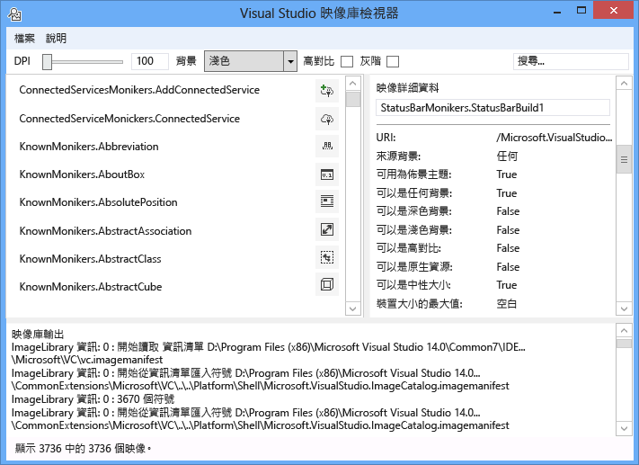
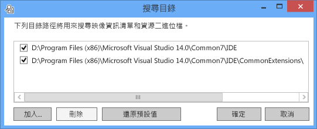
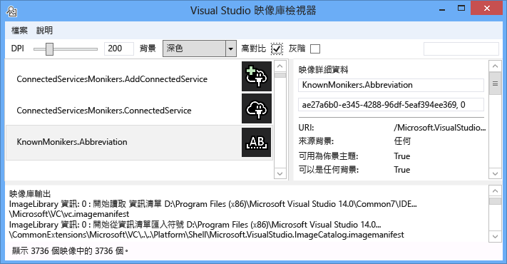
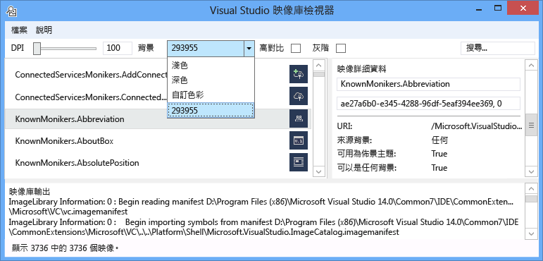
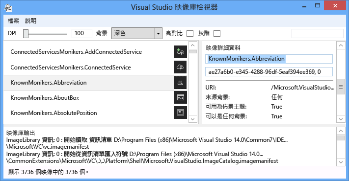
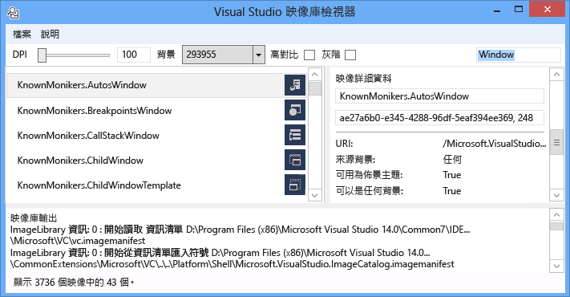
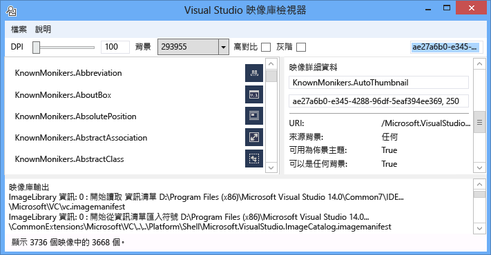
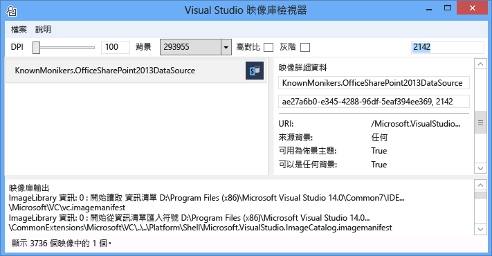

# 映像的程式庫檢視器
[!INCLUDE[vs2017banner](../../code-quality/includes/vs2017banner.md)]

Visual Studio 影像程式庫檢視器工具可以載入並搜尋映像的資訊清單，讓使用者能夠操作這些 Visual Studio 會的方式相同。 使用者可以改變背景、 大小、 DPI、 高對比，以及其他設定。 此工具也會顯示每個映像的資訊清單載入資訊，並顯示映像的資訊清單中的每個映像的來源資訊。 這項工具可用於︰  
  
1.  診斷錯誤  
  
2.  確保屬性已正確設定在自訂映像的資訊清單中  
  
3.  搜尋 Visual Studio 映像目錄中的映像，好讓 Visual Studio 擴充功能可以使用符合的 Visual Studio 樣式的映像  
  
   
  
 **映像 moniker**  
  
 影像 moniker （或簡稱為 moniker） 是可唯一識別影像資產或映像庫中的影像清單資產的 GUID:ID 組。  
  
 **映像的資訊清單檔案**  
  
 映像 (.imagemanifest) 資訊清單檔案是 XML 檔案，定義一組影像資產，表示這些資產，和真正的映像或映像代表每個資產的 moniker。 映像的資訊清單可以定義獨立映像或映像列出舊版的 UI 支援。 此外，也可以變更何時以及如何顯示這些資產設定資產或個別的映像，每個資產背後的屬性。  
  
 **映像的資訊清單結構描述**  
  
 完成映像的資訊清單看起來像這樣︰  
  
```xml  
<ImageManifest>  
      <!-- zero or one Symbols elements -->  
      <Symbols>  
        <!-- zero or more Guid, ID, or String elements -->  
      </Symbols>  
      <!-- zero or one Images elements -->  
      <Images>  
        <!-- zero or more Image elements -->  
      </Images>  
      <!-- zero or one ImageLists elements -->  
      <ImageLists>  
        <!-- zero or more ImageList elements -->  
      </ImageLists>  
</ImageManifest>  
```  
  
 **符號**  
  
 可讀性及維護幫助，因為映像的資訊清單可用於屬性值的符號。 符號已定義如下︰  
  
```xml  
<Symbols>  
      <Import Manifest="manifest" />  
      <Guid Name="ShellCommandGuid" Value="8ee4f65d-bab4-4cde-b8e7-ac412abbda8a" />  
      <ID Name="cmdidSaveAll" Value="1000" />  
      <String Name="AssemblyName" Value="Microsoft.VisualStudio.Shell.UI.Internal" />  
</Symbols>  
```  
  
|||  
|-|-|  
|**子元素**|**定義**|  
|匯入|匯入使用目前的資訊清單中的指定資訊清單檔案的符號。|  
|Guid|符號表示的 GUID，且必須符合 GUID 格式。|  
|ID|符號代表的識別碼，而且必須為非負整數。|  
|String|符號表示任意字串值。|  
  
 符號會區分大小寫，並參考使用 $(symbol-name) 語法︰  
  
```xml  
<Image Guid="$(ShellCommandGuid)" ID="$(cmdidSaveAll)" >  
      <Source Uri="/$(AssemblyName);Component/Resources/image.xaml" />  
</Image>  
```  
  
 所有的資訊清單已預先定義某些符號。 這些可以用在 Uri 屬性的 \< 來源> 或 \< 匯入> ，參考的路徑在本機電腦上的項目。  
  
|||  
|-|-|  
|**符號**|**描述**|  
|CommonProgramFiles|%Commonprogramfiles%環境變數的值|  
|LocalAppData|%Localappdata%環境變數的值|  
|ManifestFolder|包含資訊清單檔案的資料夾|  
|MyDocuments|目前使用者的 [我的文件] 資料夾的完整路徑|  
|ProgramFiles|%Programfiles%環境變數的值|  
|System|Windows\System32 資料夾|  
|WinDir|%Windir%環境變數的值|  
  
 **映像**  
  
 \< 映像> 項目會定義可由 moniker 參考映像。 GUID 和 ID 結合起來形成映像 moniker。 在整個映像庫，moniker 映像必須是唯一的。 如果多個映像指定的 moniker，在建立程式庫時所遇到的第一個是會保留。  
  
 它必須包含至少一個來源。 雖然中性大小的來源會提供最佳結果，跨廣泛的大小，這些屬性並非必要。 如果此服務會在要求中未定義大小的影像 \< 映像> 項目並沒有中性大小的來源，服務會選擇最適合的特定大小的來源，並調整為要求的大小。  
  
```xml  
<Image Guid="guid" ID="int" AllowColorInversion="true/false">  
      <Source ... />  
      <!-- optional additional Source elements -->  
</Image>  
```  
  
|||  
|-|-|  
|**屬性**|**定義**|  
|Guid|[必要]映像 moniker GUID 部分|  
|ID|[必要]映像 moniker 識別碼部分|  
|AllowColorInversion|[選用，預設為 true]指出映像是否可以有它以程式設計方式反轉使用深色背景的色彩。|  
  
 **來源**  
  
 \< 來源> 項目會定義單一映像來源資產 （XAML 和 PNG）。  
  
```xml  
<Source Uri="uri" Background="background">  
      <!-- optional NativeResource element -->  
 </Source>  
```  
  
|||  
|-|-|  
|**屬性**|**定義**|  
|URI|[必要]定義從何處可以載入影像的 URI。 它可以是下列其中一項︰<br /><br /> -A [Pack URI](http://msdn.microsoft.com/en-US/library/aa970069\(v=vs.100\).aspx) 使用應用程式: / / 授權單位<br /><br /> -絕對元件資源參考<br /><br /> -包含原生資源的檔案路徑|  
|背景|[選用]指出哪些類型的來源要使用的背景。<br /><br /> 它可以是下列其中一項︰<br /><br /> - *光*︰ 淺背景使用的來源。<br /><br /> - *深色*︰ 深色背景使用的來源。<br /><br /> - *高對比*: 來源可用於任何背景中高對比模式。<br /><br /> - *HighContrastLight*︰ 淺背景高對比模式中使用的來源。<br /><br /> -*HighContrastDark*︰ 深色背景高對比模式中使用的來源。<br /><br /> 如果 **背景** 省略屬性中，於任何背景使用的來源。<br /><br /> 如果 **背景** 是 *Light*, ，*深色*, ，*HighContrastLight*, ，或 *HighContrastDark*, ，永遠不會反轉的來源色彩。 如果 **背景** 已省略或設為 *高對比*, ，反轉的來源色彩由映像的 **AllowColorInversion** 屬性。|  
  
 A \< 來源> 項目可以有一個下列的選擇性子項目︰  
  
||||  
|-|-|-|  
|**項目**|**屬性 （全部所需）**|**定義**|  
|\< 大小>|值|將用來指定大小 （以裝置為單位） 的映像的來源。 映像會正方形。|  
|\< SizeRange>|MinSize MaxSize|來源將使用中的映像從 MinSize 到 MaxSize （裝置單位） （含） 之間。 映像會正方形。|  
|\< 維度>|寬度、 高度|將用來指定的寬度和高度 （以裝置為單位） 的映像的來源。|  
|\< DimensionRange>|MinWidth 或 MinHeight<br /><br /> MaxWidth MaxHeight|來源將使用的最小寬度/高度的最大寬度/高度 （以裝置為單位） 的映像 （含） 之間。|  
  
 A \< 來源> 項目也可以有選擇性 \< NativeResource> 子元素，定義 \< 來源> 載入原生組件，而不是 managed 組件。  
  
```xml  
<NativeResource Type="type" ID="int" />  
```  
  
|||  
|-|-|  
|**屬性**|**定義**|  
|類型|[必要]XAML 或 PNG 原生資源的類型|  
|ID|[必要]原生資源整數識別碼部分|  
  
 **ImageList**  
  
 \< ImageList> 項目會定義一個可傳回單一區域中影像的集合。 視需求，區域為基礎。  
  
```xml  
<ImageList>  
      <ContainedImage Guid="guid" ID="int" External="true/false" />  
      <!-- optional additional ContainedImage elements -->  
 </ImageList>  
```  
  
|||  
|-|-|  
|**屬性**|**定義**|  
|Guid|[必要]映像 moniker GUID 部分|  
|ID|[必要]映像 moniker 識別碼部分|  
|外部|[選用，預設為 false]指出是否映像 moniker 參考目前的資訊清單中的映像。|  
  
 參考目前的清單中所定義的映像沒有包含影像的 moniker。 如果映像庫中找不到包含的影像，影像空白預留位置將使用在其位置。  
  
## <a name="how-to-use-the-tool"></a>如何使用工具  
 **驗證自訂映像的資訊清單**  
  
 若要建立自訂的資訊清單，我們建議您使用 ManifestFromResources 工具，來自動產生資訊清單。 若要驗證自訂資訊清單，請啟動映像的程式庫檢視器，並選取檔案 > 設定路徑... 若要開啟 [搜尋目錄] 對話方塊。 此工具會載入映像的資訊清單，使用搜尋目錄，但它也會用到它們包含在資訊清單中的映像的.dll 檔因此請務必在此對話方塊包含資訊清單和 DLL 的目錄。  
  
   
  
 按一下 [ **加入...** 若要選取新的搜尋目錄來搜尋資訊清單和其相對應的 Dll。 此工具會記住這些搜尋目錄，以及他們可以開啟或關閉核取或取消核取 [目錄。  
  
 根據預設，此工具會嘗試尋找 Visual Studio 安裝目錄，並將這些目錄加入至搜尋目錄清單。 您可以手動新增找不到此工具的目錄。  
  
 一旦載入所有的資訊清單時，此工具可以用來切換 **背景** 色彩 **DPI**, ，**高對比**, ，或 **grayscaling** 映像，讓使用者可以以視覺化方式檢查影像資產，以確認它們呈現正確的各種設定。  
  
   
  
 Light、 暗色調，或自訂的值可以設定的背景色彩。 選取 「 自訂色彩 」 將會開啟色彩選取對話方塊，並將該自訂色彩加入至稍後輕鬆重新叫用背景的下拉式方塊的底部。  
  
   
  
 選取映像 moniker 右側映像的詳細資料窗格中顯示每個實際映像的 moniker 背後的資訊。 窗格還可讓使用者依名稱或原始 GUID:ID 值複製 moniker。  
  
   
  
 顯示每個映像來源的資訊是否可以設定主題包含何種背景以顯示上，或支援高對比，它適用於何種大小或它是否大小中性以及映像是否來自原生組件。  
  
   
  
 當驗證映像資訊清單時，我們建議您部署資訊清單和映像 DLL 在真實世界的位置。 這會驗證任何相對路徑正常運作，則映像庫可以尋找並載入資訊清單和 DLL 映像。  
  
 **映像目錄 KnownMonikers 搜尋**  
  
 若要使其更符合 Visual Studio 樣式，Visual Studio 擴充功能可以使用 Visual Studio 映像的目錄，而非建立及使用它自己的映像。 這有一個優點，不用維護這些映像，並保證映像會有高 DPI 備份映像，讓它看起來應該在所有 Visual Studio 支援的 DPI 設定正確。  
  
 映像的程式庫檢視器可讓資訊清單，以搜尋，讓使用者能夠尋找 moniker，表示影像資產，並在程式碼中使用的 moniker。 若要搜尋的映像，在 [搜尋] 方塊中輸入所需的搜尋詞彙然後按 Enter。 在底部的狀態列會顯示多少相符項目中找不到影像總數超出所有資訊清單。  
  
   
  
 當您在現有資訊清單中的映像 moniker 的搜尋，我們建議您搜尋，並使用只有 Visual Studio 映像的目錄 moniker、 其他刻意可公開存取的 moniker 或您自己自訂的 moniker。 如果您使用非公用的 moniker，自訂使用者介面可能會損毀或其映像變更非預期的方式是否變更或更新這些非公用的 moniker 和映像時。  
  
 此外，搜尋 GUID 可供使用。 這種搜尋適合用來篩選清單中，單一的資訊清單，或如果該資訊清單資訊清單的單一子區段都包含多個 Guid。  
  
   
  
 最後，搜尋識別碼也可能時。  
  
   
  
## <a name="notes"></a>備註  
  
-   根據預設，此工具會在數個 Visual Studio 安裝目錄中的影像資訊清單中提取。 已公開取用 moniker 只有一種是 **Microsoft.VisualStudio.ImageCatalog** 資訊清單。 GUID: ae27a6b0-e345-4288-96df-5eaf394ee369 (請勿 **不** 覆寫此自訂資訊清單中的 GUID) 型別︰ KnownMonikers  
  
-   此工具會嘗試載入發現，所有映像資訊清單，因此可能需要幾秒鐘的時間來實際顯示的應用程式的啟動。 下載資訊清單時，它可能也會變慢或無回應。  
  
## <a name="sample-output"></a>範例輸出  
 此工具不會產生任何輸出。