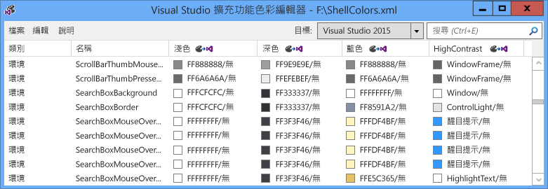
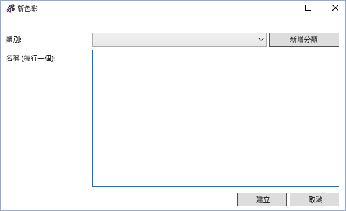
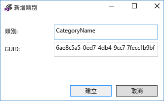
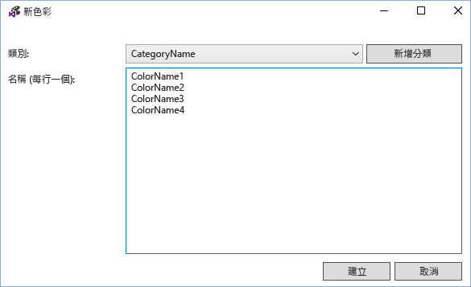
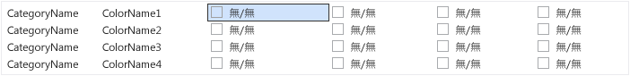
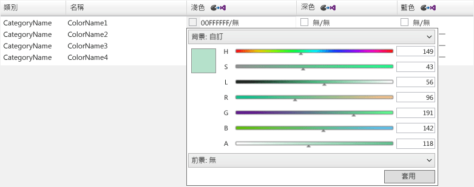
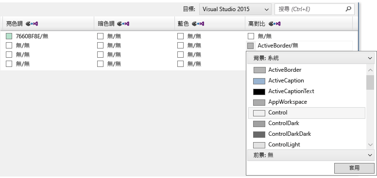
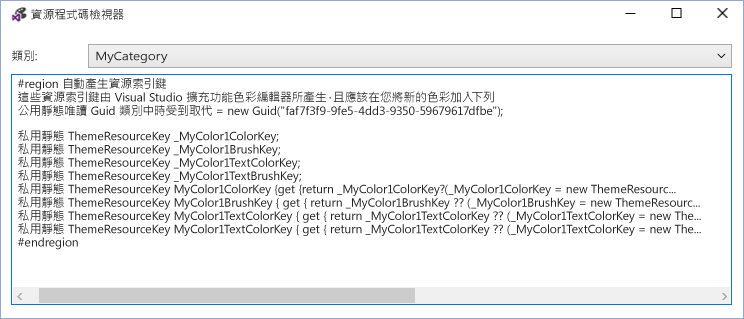
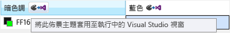

# VSIX 色彩編輯器
[!INCLUDE[vs2017banner](../../code-quality/includes/vs2017banner.md)]

Visual Studio 擴充功能色彩編輯器工具可以建立和編輯 Visual Studio 自訂色彩。 此工具也可以產生佈景主題資源金鑰，以便可以在程式碼中使用的色彩。 這項工具可用於讓 Visual Studio 擴充功能可支援佈景主題色彩。 這項工具可開啟.pkgdef 和.xml 檔案。 Visual Studio 佈景主題 \(.vstheme 檔案\) 可供使用 Visual Studio 擴充功能色彩編輯器將副檔名變更為.xml。 此外，.vstheme 檔案可匯入目前的.xml 檔案。  
  
   
  
 **套件定義檔**  
  
 套件定義 \(.pkgdef\) 檔會定義主題的檔案。 色本身會儲存在佈景主題色彩.xml 檔案，這樣會編譯成.pkgdef 檔。 .Pkgdef 檔案部署至 Visual Studio 可搜尋的位置，處理在執行階段，並合併在一起，以定義佈景主題。  
  
 **色彩語彙基元**  
  
 色彩語彙基元為四個項目組成:  
  
-   **類別名稱:** 邏輯群組的一組色彩。 如果已經有專屬的所需的 UI 項目或 UI 項目群組的色彩，請使用現有的類別名稱。  
  
-   **語彙基元名稱:** 色彩權杖和權杖集的描述性名稱。 設定包括背景和前景 \(文字\) token 名稱，以及其狀態，以及這些名稱應該是，讓您輕鬆識別配對，而它們套用到的狀態。  
  
-   **色彩值 \(或色調\):** 所需的每個彩色的佈景主題。 永遠建立背景與文字色彩值組中。 色彩配對的背景\/前景，使文字 \(前景\) 色彩永遠都是可讀取繪製它的背景顏色。 這些色彩的連結，並且會在 UI 中一起使用。 如果背景不適用於文字，請勿定義前景色彩。  
  
-   **系統色彩名稱:** 用於顯示高對比。  
  
## 如何使用工具  
 儘可能，而不是進行新的適用時，應該重複使用現有的 Visual Studio 色彩和。 不過，其中定義沒有適當的色彩的情況下，應該建立自訂色彩保持相容的延伸主題。  
  
 **建立新的色彩權杖**  
  
 若要建立使用 Visual Studio 擴充功能的色彩編輯器的自訂色彩，請依照下列步驟執行:  
  
1.  判斷新的色彩權杖的類別和語彙基元名稱。  
  
2.  選擇 UI 項目高對比，將使用每個佈景主題和系統色彩的色調。  
  
3.  使用色彩編輯器建立新的色彩語彙基元。  
  
4.  在 Visual Studio 擴充功能中使用的色彩。  
  
5.  在 Visual Studio 中測試的變更。  
  
 **步驟 1: 決定類別和新的色彩語彙基元的語彙基元名稱。**  
  
 慣用的命名配置為 VSColor **\[Category\] \[UI 型別\] \[狀態\]**。 如果其為備援，請勿 VSColor 名稱中使用"color"這個字。  
  
 分類的名稱提供邏輯群組，而且應定義為短越好。 比方說，單一工具視窗的名稱可能是類別名稱，但不是整個商務單位或專案小組的名稱。 群組分類的項目有助於避免混淆具有相同名稱的色彩。  
  
 項目類型的情況下或 「 狀態 」 會套用色彩，必須清楚指出語彙基元的名稱。 比方說，在使用中的資料提示的 **\[UI 型別\]** 可以命名為"**資料提示方塊**」 和 **\[狀態\]** 可以命名為"**Active**,，」 產生的色彩名稱"**DataTipActive**。 」 由於資料提示文字，必須定義前景和背景色彩。 藉由使用的背景\/前景的配對，色彩編輯器會自動建立色彩 」**DataTipActive**」 的背景和 「**DataTipActiveText**"前景。  
  
 如果 UI 的片段都只能有一個狀態， **\[狀態\]** 可以省略名稱的一部分。 例如，如果在搜尋方塊有框線，而且沒有狀態變更會影響框線的色彩，然後框線的色彩語彙基元的名稱可以只是呼叫 「**SearchBoxBorder**。 」  
  
 一些常見的狀態名稱包括:  
  
-   作用中  
  
-   非作用中  
  
-   為 MouseOver  
  
-   MouseDown  
  
-   已選取  
  
-   已取得焦點  
  
 清單項目控制項的組件的幾個語彙基元名稱範例:  
  
-   ListItem  
  
-   ListItemBorder  
  
-   ListItemMouseOver  
  
-   ListItemMouseOverBorder  
  
-   ListItemSelected  
  
-   ListItemSelectedBorder  
  
-   ListItemDisabled  
  
-   ListItemDisabledBorder  
  
 **步驟 2: 選取的 UI 項目高對比，將使用每個佈景主題和系統色彩的色調。**  
  
 在 ui 中選擇自訂色彩，選取類似現有 UI 項目，並使用它的色彩做為基底。 在方塊的 UI 元素的色彩有經過檢閱和測試，因此它們會先尋找適當正常運作，所有的主題。  
  
 **步驟 3: 使用色彩編輯器建立新的色彩語彙基元。**  
  
 啟動色彩編輯器，開啟或建立新的自訂佈景主題色彩.xml 檔案。 選取 **編輯 \> 新的色彩** 從功能表。 這樣會開啟對話方塊，可指定分類和色彩項目，該分類中的一個或多個名稱:  
  
   
  
 選取現有的類別，或選取 **新類別** 要建立新的類別。 此時會開啟另一個對話方塊，建立新的類別名稱:  
  
   
  
 新的類別目錄的可用在 **新色彩** 類別下拉式選單。 輸入每個新的色彩語彙基元每行一個名稱，並選取 \[建立\] 完成後選擇類別目錄的情況:  
  
   
  
 「 無 」，表示未定義的色彩顯示背景\/前景組色彩值。 附註: 如果色彩並沒有文字色彩背景色彩配對，則只有背景需要定義。  
  
   
  
 若要編輯色彩語彙基元，請選取該語彙基元的佈景主題 \(資料行\) 的色彩項目。 輸入格式為 8 位數 ARGB 十六進位色彩值，系統色彩名稱輸入儲存格，或使用下拉式選單選取想要的色彩，透過一組色彩滑桿或系統色彩的清單中加入色彩值。  
  
   
  
   
  
 不需要顯示文字的元件、 輸入值，只有一種色彩: 背景色彩。 否則，請輸入的背景與文字的色彩，以正斜線分隔的值。  
  
 當輸入值，高對比，請輸入有效的 Windows 系統色彩名稱。 請勿輸入硬式編碼 ARGB 值。 您可以從色彩值的下拉式清單中選取 「 背景:: 系統 」 或 「 前景:: 系統 」 來檢視有效的系統色彩名稱清單。 在建立具有文字元件的項目時，使用正確的背景文字系統色彩配對或文字可能無法讀取。  
  
 當您完成建立、 設定，然後編輯色彩語彙基元時，請將它們儲存到所需的.xml 或.pkgdef 格式。 權杖都沒有背景的色彩也會另存為.xml 格式的空白色彩前景集，但捨棄.pkgdef 格式。 對話方塊會警告您損失的色彩，如果您嘗試將空的色彩儲存至.pkgdef 檔。  
  
 **步驟 4: 在 Visual Studio 擴充功能中使用的色彩。**  
  
 定義新的色彩後語彙基元，與 \[建置動作\] 設為 「 內容 」，在專案檔中包含.pkgdef 和 」 包含在 VSIX 」 設為"True"。  
  
   
  
 在 Visual Studio 擴充功能色彩編輯器中，選擇 \[檔案 \> 檢視資源的程式碼以檢視用來存取自訂的程式碼以 WPF 為基礎的 UI 中的色彩。  
  
   
  
 此程式碼納入專案中的靜態類別。 參考 **Microsoft.VisualStudio.Shell。 \< VSVersion \>.0.dll** 必須加入至專案，以使用 **ThemeResourceKey** 型別。  
  
```c#  
namespace MyCustomColors { public static class MyCategory { #region Autogenerated resource keys // These resource keys are generated by Visual Studio Extension Color Editor, and should be replaced when new colors are added to this category. public static readonly Guid Category = new Guid("faf7f3f9-9fe5-4dd3-9350-59679617dfbe"); private static ThemeResourceKey _MyColor1ColorKey; private static ThemeResourceKey _MyColor1BrushKey; private static ThemeResourceKey _MyColor1TextColorKey; private static ThemeResourceKey _MyColor1TextBrushKey; public static ThemeResourceKey MyColor1ColorKey { get { return _MyColor1ColorKey ?? (_MyColor1ColorKey = new ThemeResourceKey(Category, "MyColor1", ThemeResourceKeyType.BackgroundColor)); } } public static ThemeResourceKey MyColor1BrushKey { get { return _MyColor1BrushKey ?? (_MyColor1BrushKey = new ThemeResourceKey(Category, "MyColor1", ThemeResourceKeyType.BackgroundBrush)); } } public static ThemeResourceKey MyColor1TextColorKey { get { return _MyColor1TextColorKey ?? (_MyColor1TextColorKey = new ThemeResourceKey(Category, "MyColor1", ThemeResourceKeyType.ForegroundColor)); } } public static ThemeResourceKey MyColor1TextBrushKey { get { return _MyColor1TextBrushKey ?? (_MyColor1TextBrushKey = new ThemeResourceKey(Category, "MyColor1", ThemeResourceKeyType.ForegroundBrush)); } } #endregion } }  
```  
  
 這可讓您存取 XAML 程式碼中的色彩，並允許回應佈景主題變更 UI。  
  
```xaml  
<UserControl x:Class="NewTestProject.TestPackageControl" Name="MyToolWindow" xmlns="http://schemas.microsoft.com/winfx/2006/xaml/presentation" xmlns:x="http://schemas.microsoft.com/winfx/2006/xaml" xmlns:ns="clr-namespace:MyCustomColors"> <Grid> <TextBlock Background="{DynamicResource {x:Static ns:MyCategory.MyColor1BrushKey}}" Foreground="{DynamicResource {x:Static ns:MyCategory.MyColor1TextBrushKey}}" >Sample Text</TextBlock> </Grid> </UserControl>  
```  
  
 **步驟 5: 在 Visual Studio 中測試的變更。**  
  
 色彩編輯器可以暫時將色彩權杖套用至 Visual Studio 來檢視即時變更色彩，而不需重建擴充功能封裝的執行個體。 若要這樣做，請按一下 「 將此主題套用至執行中的 Visual Studio 視窗 」 按鈕位於每個主題的資料行的標頭。 關閉 VSIX 色彩編輯器時，此暫存的佈景主題就會消失運作。  
  
   
  
 若要進行永久變更，重建並重新部署 Visual Studio 擴充功能之後將新的色彩加入至.pkgdef 檔和撰寫的程式碼，將會使用這些色彩。 重建 Visual Studio 擴充功能，將新的色彩的登錄值合併到佈景主題的其餘部分。 然後再重新啟動 Visual Studio、 檢視 UI，並確認新的色彩都如預期般出現。  
  
## 備註  
 此工具被要用來建立自訂色彩預先存在的 Visual Studio 佈景主題，或編輯自訂 Visual Studio 佈景主題色彩。 若要建立完整自訂的 Visual Studio 佈景主題，請下載 [Visual Studio 色彩佈景主題的編輯器延伸模組](http://visualstudiogallery.msdn.microsoft.com/6f4b51b6-5c6b-4a81-9cb5-f2daa560430b) Visual Studio 擴充功能組件庫。  
  
## 範例輸出  
 **XML 色彩輸出**  
  
 工具所產生的.xml 檔案將會如下所示:  
  
```xml  
<Themes> <Theme Name="Light" GUID="{de3dbbcd-f642-433c-8353-8f1df4370aba}"> <Category Name="CategoryName" GUID="{eee9d521-dac2-48d9-9a5e-5c625ba2040c}"> <Color Name="ColorName1"> <Background Type="CT_RAW" Source="FFFFFFFF" /> </Color> <Color Name="ColorName2"> <Background Type="CT_RAW" Source="FFFFFFFF" /> <Foreground Type="CT_RAW" Source="FF000000" /> </Color> <Color Name="ColorName3"> <Background Type="CT_RAW" Source="FFFF0000" /> </Color> <Color Name="ColorName4"> <Background Type="CT_RAW" Source="FF000088" /> <Foreground Type="CT_RAW" Source="FFFFFFFF" /> </Color> </Category> </Theme> <Theme Name="Dark" GUID="{1ded0138-47ce-435e-84ef-9ec1f439b749}">...</Theme> <Theme Name="Blue" GUID="{a4d6a176-b948-4b29-8c66-53c97a1ed7d0}">...</Theme> <Theme Name="HighContrast" GUID="{a5c004b4-2d4b-494e-bf01-45fc492522c7}">...</Theme> </Themes>  
  
```  
  
 **PKGDEF 色彩輸出**  
  
 工具所產生.pkgdef 檔將會如下所示:  
  
```  
[$RootKey$\Themes\{de3dbbcd-f642-433c-8353-8f1df4370aba}\CategoryName] "Data"=hex:78,00,00,00,0b,00,00,00,01,00,00,00,21,d5,e9,ee,c2,da,d9,48,9a,5e,5c,62,5b,a2,04,0c,04,00,00,00,0a,00,00,00,43,6f,6c,6f,72,4e,61,6d,65,31,01,ff,ff,ff,ff,00,0a,00,00,00,43,6f,6c,6f,72,4e,61,6d,65,32,01,ff,ff,ff,ff,01,00,00,00,ff,0a,00,00,00,43,6f,6c,6f,72,4e,61,6d,65,33,01,ff,00,00,ff,00,0a,00,00,00,43,6f,6c,6f,72,4e,61,6d,65,34,01,00,00,88,ff,01,ff,ff,ff,ff [$RootKey$\Themes\{1ded0138-47ce-435e-84ef-9ec1f439b749}\CategoryName] "Data"=hex:... [$RootKey$\Themes\{a4d6a176-b948-4b29-8c66-53c97a1ed7d0}\CategoryName] "Data"=hex:... [$RootKey$\Themes\{a5c004b4-2d4b-494e-bf01-45fc492522c7}\CategoryName] "Data"=hex:...  
  
```  
  
 **C\# 資源金鑰包裝函式**  
  
 工具所產生的色彩資源索引鍵會如下所示:  
  
```c#  
namespace MyNamespace { public static class MyColors { #region Autogenerated resource keys // These resource keys are generated by Visual Studio Extension Color Editor, and should be replaced when new colors are added to this category. public static string ColorName1ColorKey { get { return "ColorName1ColorKey"; } } public static string ColorName1BrushKey { get { return "ColorName1BrushKey"; } } public static string ColorName2ColorKey { get { return "ColorName2ColorKey"; } } public static string ColorName2BrushKey { get { return "ColorName2BrushKey"; } } public static string ColorName2TextColorKey { get { return "ColorName2TextColorKey"; } } public static string ColorName2TextBrushKey { get { return "ColorName2TextBrushKey"; } } public static string ColorName3ColorKey { get { return "ColorName4ColorKey"; } } public static string ColorName3BrushKey { get { return "ColorName4BrushKey"; } } public static string ColorName3TextColorKey { get { return "ColorName4TextColorKey"; } } public static string ColorName3TextBrushKey { get { return "ColorName4TextBrushKey"; } } #endregion } }  
```  
  
 **WPF 資源字典包裝函式**  
  
 色彩 **ResourceDictionary** 工具所產生的金鑰將會如下所示:  
  
```xaml  
<ResourceDictionary xmlns="http://schemas.microsoft.com/winfx/2006/xaml/presentation" xmlns:x="http://schemas.microsoft.com/winfx/2006/xaml" xmlns:colors="clr-namespace:MyNamespace"> <SolidColorBrush x:Key="{x:Static colors:MyColors.ColorName1BrushKey}" Color="#FFFFFFFF" /> <Color x:Key="{x:Static colors:MyColors.ColorName1ColorKey}" A="255" R="255" G="255" B="255" /> <SolidColorBrush x:Key="{x:Static colors:MyColors.ColorName2BrushKey}" Color="#FFFFFFFF" /> <Color x:Key="{x:Static colors:MyColors.ColorName2ColorKey}" A="255" R="255" G="255" B="255" /> <SolidColorBrush x:Key="{x:Static colors:MyColors.ColorName2TextBrushKey}" Color="#FF000000" /> <Color x:Key="{x:Static colors:MyColors.ColorName2TextColorKey}" A="255" R="0" G="0" B="0" /> <SolidColorBrush x:Key="{x:Static colors:MyColors.ColorName3BrushKey}" Color="#FFFF0000" /> <Color x:Key="{x:Static colors:MyColors.ColorName3ColorKey}" A="255" R="255" G="0" B="0" /> <SolidColorBrush x:Key="{x:Static colors:MyColors.ColorName4BrushKey}" Color="#FF000088" /> <Color x:Key="{x:Static colors:MyColors.ColorName4ColorKey}" A="255" R="0" G="0" B="136" /> <SolidColorBrush x:Key="{x:Static colors:MyColors.ColorName4TextBrushKey}" Color="#FFFFFFFF" /> <Color x:Key="{x:Static colors:MyColors.ColorName4TextColorKey}" A="255" R="255" G="255" B="255" /> </ResourceDictionary>  
```