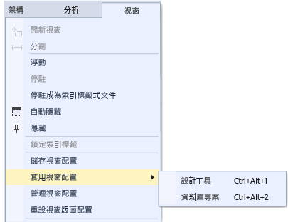

# 在 Visual Studio 中自訂視窗版面配置
在 Visual Studio 中，您可自訂視窗的位置、大小和行為，以建立最適合各種開發工作流程的視窗版面配置。 IDE 會記住您自訂的版面配置。 例如，若您變更 [方案總管]  的固定位置，然後再關閉 Visual Studio，則下次啟動時即使您在另一台電腦上操作，[方案總管]  亦會固定於相同位置。 您亦可命名和儲存自訂配置，然後使用單一命令切換各個配置。 例如，您可以建立一個編輯配置和一個偵錯配置，然後使用 [視窗] &#124; [套用視窗配置] 功能表命令在兩者間切換。  

## 視窗種類  

### 工具和文件視窗  
 IDE 提供兩種基本的視窗型別：「工具視窗」  與「文件視窗」 。 工具視窗包含「方案總管」、「伺服器總管」、「輸出視窗」、「錯誤清單」、設計工具、偵錯工具視窗等等。 文件視窗包含原始程式碼檔案、任意文字檔、設定檔等等。 您可使用標題列將工具視窗調整大小和拖曳。 您可使用索引標籤來拖曳文件視窗。 您可在索引標籤或標題列上按一下滑鼠右鍵，以在視窗上設定其他選項。  

 [視窗]  功能表會顯示關於在 IDE 中固定、浮動和隱藏視窗的選項。 在視窗索引標籤或標題列上按一下滑鼠右鍵，以查看該特定視窗的其他選項。 您可一次顯示多個特定工具視窗的執行個體。 例如，您可顯示多個網頁瀏覽器視窗，並可在 [視窗]  功能表上選擇 [開新視窗]  ，以建立部分工具視窗的其他執行個體。  

### [預覽] 索引標籤 (文件視窗)  
 在 [預覽] 索引標籤中，您可使用編輯器來檢視檔案而無須將其開啟。 您可透過以下方式預覽檔案：在 [方案總管] 中選擇檔案、逐步執行檔案並進行偵錯時，以及瀏覽搜尋結果時。 預覽檔案亦會顯示在文件索引標籤右側的索引標籤中。 若您修改檔案或選擇 [開啟] ，系統即會開啟該檔案以供您編輯。  

### 索引標籤群組  
 「索引標籤群組」可在您於 IDE 執行兩個以上的開啟文件時，擴充管理有限工作區的能力。 您可將多個文件視窗和工具視窗組織至垂直或水平「索引標籤群組」，並將文件從某一「索引標籤群組」隨機移動至另一個「索引標籤群組」。  

### 分割視窗  
 若您必須在文件中一次檢視或編輯兩個位置，則可分割視窗。 若要將文件分割成兩個獨立的捲動區段，請按一下 [視窗]  功能表上的 [分割]  。 按一下 [視窗]  功能表上的 [移除分割]  ，以還原單一檢視。  

### 工具列  
 您可透過拖曳或使用 [自訂]  對話方塊，以排列工具列。 如需如何定位及自訂工具列的詳細資訊，請參閱[何：自訂功能表和工具列](../ide/how-to-customize-menus-and-toolbars-in-visual-studio.md)。  

## 排列和固定視窗  
 您可 *固定*文件視窗和工具視窗，以將其在 IDE 視窗框架內定位和調整大小，或是做為獨立於 IDE 的個別浮動視窗。 工具視窗可固定於 IDE 框架內的任一處；某些工具視窗可在編輯器框架中固定為索引視窗。 文件視窗可固定於編輯器框架內，且可依定位順序鎖定至目前的位置。 您可以停駐多個視窗，以將這些視窗一次「浮動定位」於 IDE 上方或外部。 您亦可隱藏或最小化工具視窗。  

 您可使用下列方式排列視窗：  

-   亦可將文件視窗鎖定至索引標籤左側。  

-   將視窗固定至編輯框架。  

-   將工具視窗固定至 IDE 中的框架邊緣。  

-   將文件或工具視窗浮動於 IDE 上方或外部。  

-   沿著 IDE 邊緣隱藏工具視窗。  

-   在不同監視器上顯示視窗。  

-   將視窗位置重設為預設版面配置，或是已儲存的自訂版面配置。  

 您可透過拖曳、使用 [視窗]  功能表上的命令，或是在要排列的視窗標題列上按一下滑鼠右鍵，來排列工具和文件視窗。  

> [!NOTE]
>  在下列指示的某些 Visual Studio 使用者介面項目中，您的電腦可能會顯示不同的名稱或位置。 您所擁有的 Visual Studio 版本以及使用的設定會決定這些項目。 如需詳細資訊，請參閱[將 Visual Studio IDE 個人化](../ide/personalizing-the-visual-studio-ide.md)。  

### 固定視窗  
 若您按一下並拖曳工具視窗的標題列，或是文件視窗的索引標籤，則會顯示輔助方塊。 執行拖曳作業時，若將滑鼠資料指標停駐於菱形的其中一個箭號上，則會顯示陰影區域指出當您立即放開滑鼠按鈕時的視窗固定位置。  

 若要移動可固定視窗而不將其貼齊定位，請在拖曳視窗時選擇 Ctrl 鍵。  

 若要讓工具視窗或文件視窗回到最近的固定位置，請按 **CTRL** 並按兩下視窗的標題列或索引標籤。  

 下圖顯示文件視窗的輔助方塊，其僅可固定於編輯框架當中：  

   

 工具視窗可固定至 IDE 框架的其中一邊或是編輯框架內部。 當您將工具視窗拖曳至另一個位置時會顯示輔助方塊，其可協助您輕鬆重新固定視窗。  

 工具視窗的輔助方塊  

   

 下圖顯示 [方案總管] 正固定於新的位置，其會顯示藍色陰影區域：  

   

### 關閉並自動隱藏工具視窗  
 您可按一下標題列右上角的 [X] 關閉工具視窗；若要重新開啟視窗，請使用其鍵盤快速鍵或功能表命令。 工具視窗支援 [自動隱藏] 功能，其可在您使用另一個視窗時自動隱藏視窗。 若您自動隱藏視窗，則在 IDE 邊緣的索引標籤上會顯示其名稱。 若要再次使用視窗，請指向索引標籤以重新顯示視窗。  

   

> [!NOTE]
>  若要設定以個別或固定群組方式「自動隱藏」工具視窗，請在 [選項]  對話方塊中選取或清除 [自動隱藏按鈕僅對使用中的工具視窗生效]  。 如需詳細資訊，請參閱 [General, Environment, Options Dialog Box](../ide/reference/general-environment-options-dialog-box.md)。  

> [!NOTE]
>  視窗具有焦點時，可能會暫時顯示已啟用「自動隱藏」的工具視窗。 若要再次隱藏視窗，請選取目前視窗以外的項目。 當視窗失去焦點時，其即會自動隱藏。  

### 指定第二個監視器  
 若您具有第二個監視器且受作業系統支援，則可選擇要顯示視窗的監視器。 您甚至還可在其他監視器上，以「浮動定位」方式將多個視窗組成群組。  

> [!TIP]
>  您可建立多個 [方案總管]  的執行個體，並將其移至另一個監視器。 以滑鼠右鍵按一下視窗，然後選擇 [新增方案總管檢視] 。 您可按兩下並選擇 Ctrl 鍵，讓所有視窗回到原始監視器。  

### 重設、命名和切換不同的視窗版面配置  
 您可使用 [重設視窗版面配置]  命令，讓 IDE 回到您設定集合的原始視窗版面配置。 當您執行此命令時，會發生下列動作：  

-   所有的視窗會移至其預設位置。  

-   關閉已在預設視窗版面配置中關閉的視窗。  

-   開啟已在預設視窗版面配置中開啟的視窗。  

### 建立和儲存自訂版面配置  
 Visual Studio 可讓您儲存高達 10 個自訂視窗版面配置，並在各個視窗版面配置之間快速切換。 下列步驟顯示如何利用固定和浮動工具視窗，建立、儲存、叫用及管理採用多個監視器的自訂配置。  

 首先，建立一個有兩個專案的測試方案，每個都有不同的最佳配置。  

##### 建立 UI 專案，並自訂配置。  

1.  在 [新增專案]  對話方塊中，建立 Visual C# WPF 桌面應用程式，並為它任意命名。 假設這是我們要在使用者介面上進行的專案，因此我們想要將設計工具視窗的空間最大化，並將造成妨礙的其他工具視窗移開。  

2.  如果您有多個監視器，請將 [方案總管]  視窗和 [屬性]  視窗拉到第二個監視器。 在單一監視器系統上，嘗試關閉設計工具以外的所有視窗。  

3.  按 **Ctrl + Alt + X** ，以顯示 [工具箱]。 如果已停駐視窗，則拖曳它，使其飄浮至您要將它定位的地方 (任一監視器上)。  

4.  按 F5 使 Visual Studio 處於偵錯模式。 依照您想要的方式，調整 [自動變數]、[呼叫堆疊] 和 [輸出] 偵錯視窗的位置。 您即將建立的配置將會套用至編輯模式和偵錯模式。  

5.  當偵錯模式和編輯模式中的配置都是您想要的樣子時，從主要功能表選擇 [視窗] > [儲存視窗配置]。 將此配置命名為 "Designer"。  

     請注意，已經從 Ctrl + Alt + 1...0 的保留清單為您的新配置指派下一個鍵盤快速鍵。  

##### 建立資料庫專案和配置。  

1.  將新的 **SQL Server 資料庫** 專案加入方案。  

2.  在方案總管中，用滑鼠右鍵按一下新專案，並選擇 [在物件總管中檢視] 。 這樣會顯示 [SQL Server 物件總管]  視窗，可讓您存取資料表、檢視和資料庫中的其他物件。 您可以將此視窗設為浮動，或是保留固定狀態。 依照您想要的方式調整其他工具視窗。 為了增加真實度，您可以新增實際資料庫，但在此逐步解說中不需這麼做。  

3.  當配置呈現您想要的樣子時，從主要功能表選擇 [視窗] > [儲存視窗配置]。 將此配置命名為 "DB Project" (我們不用為此專案的偵錯模式配置擔心)。  

##### 在配置之間切換  

1.  若要在配置之間切換，請使用鍵盤快速鍵，或是從主要功能表選擇 [視窗] > [套用視窗配置]。  

       

     套用 UI 配置之後，請注意配置在編輯模式和偵錯模式中的保留方式。  

     如果您在辦公室具有多監視器設定，在家單一監視器膝上型電腦，您可以建立針對各電腦最佳化的配置。  

     注意：如果您在單一監視器系統上套用多監視器配置，您放在第二個監視器上的浮動視窗現在會隱藏在 Visual Studio 視窗後面。 您可以按 Alt + Tab，將這些視窗帶到前面來。 如果您稍後以多個監視器來開啟 Visual Studio，可以重新套用配置，將視窗還原至其指定位置。  

##### 管理及漫遊您的配置  

1.  您可以選擇 [視窗] > [管理視窗配置] 來移除、重新命名或重新排序您的自訂配置。 如果您移動配置，則會自動調整按鍵繫結來反映清單中的新位置。 這些繫結不能修改，所以您一次可以儲存最多 10 個配置。  

       

     若要提醒自己哪個鍵盤快速鍵指派給哪個配置，請選擇 [視窗] > [套用視窗配置]。  

     這些配置會自動在 Visual Studio 版本之間漫遊，也會在不同電腦上的 Blend 執行個體漫遊，以及從任何 Express 版本漫遊至任何其他 Express 組織。 不過，配置不會跨 Visual Studio、Blend 和 Express 漫遊。  

## 相關主題  

[何：在 IDE 中四處移動](../ide/how-to-move-around-in-the-visual-studio-ide.md)

