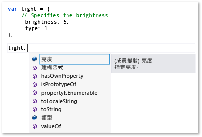
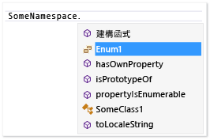

# 擴充 JavaScript IntelliSense
[!INCLUDE[vs2017banner](../code-quality/includes/vs2017banner.md)]

JavaScript IntelliSense 擴充性功能可讓您自訂在 JavaScript 編輯器的 IntelliSense 結果協力廠商程式庫的。  這樣可以改善使用這些程式庫開發人員的體驗。  
  
 JavaScript 語言服務加入至專案的協力廠商 JavaScript 程式庫提供 IntelliSense 功能。  對於大部分的程式庫，陳述式完成由語言服務自動提供。  下圖顯示陳述式完成的範例:  
  
   
  
 如果您的程式庫在標準 JavaScript 註解標記包含變數、函式和物件的描述 \(\/\)，則從 IntelliSense 擴充性功能會自動獲益，根據預設，，提供在快顯方塊的描述性資訊在完成清單中的項目右邊，或者，當您在函式呼叫時的左括號。  在快顯方塊中輸入註解包含這個成員的描述。  下列範例顯示完成清單的快顯方塊中。  
  
   
  
 進一步改善開發人員經驗，您可能想要提供型別資訊會在快顯方塊的開發人員。  您可以提供型別資訊使用 JavaScript [XML 文件註解](../ide/xml-documentation-comments-javascript.md) 取代標準註解標記。  將 XML 文件註解使用三個斜線註解標記 \(\/\) 和一組已定義之 XML 項目。  
  
 或者，您也可以使用 JavaScript IntelliSense 擴充性，您可以提供型別資訊。  這項功能可讓您藉由建立 JavaScript 擴充並加入自訂 IntelliSense 結果到指令碼內容。  在擴充功能中，是 JavaScript 檔案，您訂閱由語言服務的 `intellisense` 物件所公開的事件。  JavaScript IntelliSense 擴充性是程式庫的慣用方案，如果一個行為模式在程式庫中防止 JavaScript 語言服務提供期望層級 IntelliSense 支援，因此，如果要以宣告方式， XML 文件註解的替代也需要。  您可以自訂 IntelliSense 結果，您可以建立第一個 IntelliSense 功能，不論可能會限制語言服務的預設功能的所有行為模式。  如需詳細資訊，請參閱[識別項的陳述式完成](../ide/statement-completion-for-identifiers.md)。  
  
## 將副檔名加入至指令碼內容。  
 對於將執行的 IntelliSense 副檔名，它需要加入目前的指令碼內容。  副檔名會自動加入至指令碼內容是自動探索機制，使用參考群組或參考指示詞，或手動將副檔名加入至指令碼內容。  
  
 自動探索機制讓語言服務自動探索遵循檔案命名慣例 *libraryname*.intellisense.js，，且位於目錄和程式庫相同的擴充功能適用於的擴充。  例如， jQuery 程式庫的有效副檔名為 jQuery.intellisense.js。  如需更嚴格的 jQuery 擴充功能，您可以使用檔案名稱 \(例如 jQuery\-1.7.1.intellisense.js 一版本特定副檔名\) 或 jQuery.ui.intellisense.js \(已指定範圍的 jQuery 程式庫的副檔名\)。  擴充功能的最嚴格的版本，如果多個副檔名為指定之程式庫中找到，則使用。  
  
 如果希望所有您的 JavaScript 專案檔使用擴充功能，您可以選擇將副檔名加入至參考群組。  有參考群組，或的幾種類型包括隱含參考的項目，並包含的那些專屬的背景工作參考。  若要將副檔名，您通常不需要將檔案，隱含參考群組，或是建立 \[**隱含 \(Windows\)**\]， \[**隱含 \(Web\)**\]。  隱含參考在程式碼編輯器中開啟的每個 .js 檔案。  當您使用這個方法時，您必須將副檔名和副檔名子目錄中的檔案。  
  
 使用 \[**選項**\] 對話方塊的 \[**IntelliSense**\] 頁面將副檔名，參考群組。  您可以選取 \[**工具**\] 存取 \[**IntelliSense**\] 頁，請在功能表列上，然後選取 \[**文字編輯器**\] 中的 \[**選項**\] \]，則 \[**JavaScript**\]， \[**IntelliSense**\]， \[**參考**\]。  如需參考群組的詳細資訊，請參閱 [JavaScript IntelliSense](../ide/javascript-intellisense.md) 和 [IntelliSense、JavaScript、文字編輯器、選項](../ide/reference/options-text-editor-javascript-intellisense.md)。  
  
 如果您想要為特定一組檔案使用擴充功能，請使用參考指示詞。  當您使用這個方法時，您需要參考副檔名，並擴充補充的檔案。  如需使用 reference 指示詞的詳細資訊，請參閱 [JavaScript IntelliSense](../ide/javascript-intellisense.md)。  
  
## 處理 IntelliSense 事件  
 擴充功能可讓您透過訂閱自訂 IntelliSense 結果的事件 \(例如語言服務的 `intellisense` 物件的 `statementcompletion` 事件。  下列範例顯示語言服務用來隱藏成員從陳述式完成的一個底線開始的簡單擴充。  這個程式碼會 underscorefilter.js 包含並在 \\\\*Visual Studio 安裝路徑。*\\JavaScript\\References 資料夾。  
  
```javascript  
intellisense.addEventListener('statementcompletion', function (event) {  
    if (event.targetName === "this") return;  
  
    var filterRegex;  
  
    if (event.target === undefined || event.target === window)  
        filterRegex = /^_.*\d{2,}/;  
    else  
        filterRegex = /^_.*/;  
  
    event.items = event.items.filter(function (item) {  
        return !filterRegex.test(item.name);  
    });  
});  
```  
  
 在上述程式碼中，擴充功能會檢查 [targetName 屬性](#TargetName) ，而且 `statementcompletion` 事件 [目標屬性](#Target) 屬性物件排除物件 \(例如 `this` 和 `window`並確定有效的陳述式完成清單可識別。  如果完成清單可以識別，擴充功能會透過篩選以底線為開頭的成員更新陳述式完成 [項目的屬性。](#Items) 集合。  
  
 如需其他範例，請參閱 \< \\\\*Visual Studio 安裝路徑。*\\JavaScript\\References 資料夾。  在這個資料夾的 showPlainComments.js 檔案提供的使用範例其他事件為標準 JavaScript 註解標記提供預設 IntelliSense 支援 \(\/\)。  如 underscorefilter.js， showPlainComments.js 已經是可運作的擴充功能，然後，您可以查看產生的 IntelliSense 資訊，以及使用註解時標記中的變數、函式和物件的程式碼。  如需其他範例，請參閱 [程式碼範例](#CodeExamples)。  
  
> [!WARNING]
>  如果您修改擴充檔隨附於 Visual Studio 中，您可以停用 IntelliSense JavaScript 或擴充功能所支援的功能。  
  
 使用 `addEventListener`，用您的擴充程式碼，您可以建立下列類型的事件處理常式:  
  
-   `statementcompletion`，將陳述式完成事件的處理常式。  陳述式完成為出現的特定型別的成員清單，在您輸入特性，例如句號 \(.\) 之後，或識別項清單隨即出現，在您輸入時，或當您按下 CTRL \+ J. 時。  處理常式會接收類型 `CompletionEvent`事件物件，支援下列成員: [項目的屬性。](#Items)、 [目標屬性](#Target)、 [targetName 屬性](#TargetName)和 [範圍的屬性。](#Scope)。  
  
-   `signaturehelp`，將 IntelliSense 參數的訊息處理常式。  參數資訊提供您有關函式所需的參數數目、名稱和型別的相關資訊。  處理常式會接收類型 `SignatureHelpEvent`事件物件，支援下列成員: [目標屬性](#Target)， [parentObject 屬性](#ParentObject)， [functionComments 屬性](#FunctionComments)， [functionHelp 屬性](#FunctionHelp)。  
  
-   `statementcompletionhint`，將 IntelliSense 的快速諮詢的處理常式。  快速諮詢快顯方塊顯示識別項的完整宣告在您的程式碼。  處理常式會接收類型 `CompletionHintEvent`事件物件，支援下列成員: [completionItem 屬性](#CompletionItem)和 [symbolHelp 屬性](#SymbolHelp)。  
  
 如需顯示 IntelliSense 功能如陳述式完成、參數資訊、快速諮詢的範例，請參閱 [使用 IntelliSense](../ide/using-intellisense.md)。  
  
> [!NOTE]
>  在 JavaScript 中，快速諮詢指完成清單右邊的快顯方塊中。  您無法手動叫用快速諮詢。  
  
##  <a name="intellisenseObject"></a> IntelliSense 物件  
 下表列出 `intellisense` 物件使用的函式。  `intellisense` 物件只能在設計階段。  
  
|Function|描述|  
|--------------|--------|  
|`addEventListener(type, handler);`|IntelliSense 加入事件的事件處理常式。<br /><br /> `type` 是字串值。  有效值包括 `statementcompletion`、 `signaturehelp`和 `statementcompletionhint`。<br /><br /> `handler` 是接收事件物件下列其中一種型別的事件處理常式:<br /><br /> -   `CompletionEvent`，用於 `statementcompletion` 事件。<br />-   `SignatureHelpEvent`，用於 `signaturehelp` 事件。<br />-   `CompletionHintEvent`，用於 `statementcompletionhint` 事件。<br /><br /> 如需使用這個函式的範例，請參閱 [程式碼範例](#CodeExamples)。|  
|`annotate(obj, doc);`|為物件指定文件透過複製某個物件的文件註解加入至另一個物件。<br /><br /> `obj` 指定複製資料的物件。<br /><br /> `doc` 指定複製資料的物件。<br /><br /> 如需示範如何使用這個函式的範例，請參閱 [將 IntelliSense 附註](#Annotations)。|  
|`getFunctionComments(func);`|傳回指定之函式的註解。<br /><br /> `func` 指定註解傳回的函式。<br /><br /> 使用 `completionItem.value`，設定 `func` 參數。<br /><br /> 傳回的 `functionComments` 物件包含下列成員: `above`、 `inside`和 `paramComment`。  如需詳細資訊，請參閱 [functionComments 屬性](#FunctionComments) 屬性 \(Property\)。<br /><br /> `getFunctionComments` 只能由 `addEventListener`所註冊的其中一個事件處理常式中。<br /><br /> 如需示範如何使用這個函式，參閱 \\\\*Visual Studio 安裝路徑。*\\JavaScript\\References\\showPlainComments.js。|  
|`logMessage(msg);`|將診斷訊息傳送至輸出視窗。<br /><br /> `msg` 是包含訊息的字串。<br /><br /> 如需示範如何使用這個函式的範例，請參閱 [傳送訊息至輸出視窗](#Logging)。|  
|`nullWithCompletionsOf(value);`|傳回完成清單在 `value` 參數傳遞的物件相依的特殊的 null 值。<br /><br /> `value` 判斷所傳回值的完成清單。  `value` 可以是任何型別。<br /><br /> 會傳回 null 值是將 null 在設計階段，不過，傳回值的完成清單與 `value` 參數的完成清單。<br /><br /> 這個函式的用法是傳回值提供 IntelliSense，在傳回型別可預測的在執行階段時，不過，傳回值是 `null` 在設計階段。|  
|`redirectDefinition(func, definition);`|指令會使用提供的定義函式的 IntelliSense 取代原始的功能，當函式參數說明或 \[**移至定義**\] 要求。<br /><br /> `func` 指定目標函式。<br /><br /> `definition` 指定之函式而不是目標函式對於參數資訊和 \[**移至定義**\]。|  
|`setCallContext(func, thisArg);`|設定呼叫內容或範圍，指定的函式。<br /><br /> `func` 指定可以設定範圍的函式。<br /><br /> `thisArg` 為 `this` 關鍵字可參照，為成員指定新範圍的物件常值。  您在這個參數，例如， `intellisense.setCallContext(func, { thisArg: "", args: [23,2] });`可以包含引數傳遞<br /><br /> `setCallContext` 的行為類似於 `Function.prototype.bind`，不過，它提供設計階段支援 IntelliSense 只使用了。  您可以使用 `setCallContext` 設定函式範圍，如果您需要模擬呼叫不是則為可執行程式碼，，因此，當您呼叫函式時，函式呼叫中有效的範圍和引數。|  
|`undefinedWithCompletionsOf(value);`|傳回完成清單在 `value` 參數傳遞的物件相依的特殊未定義的值。<br /><br /> `value` 判斷所傳回值的完成清單。  `value` 可以是任何型別。<br /><br /> 未定義傳回值視為未定義在設計階段，不過，傳回值的完成清單與 `value` 參數的完成清單。<br /><br /> 這個函式的用法是傳回值提供 IntelliSense，在傳回型別可預測的在執行階段時，不過，傳回值為 undefined 在設計階段。|  
|`version()`|傳回 Visual Studio 版本。|  
  
## 事件成員。  
 下列章節說明在下列事件的事件物件公開的成員: `statementcompletion`、 `signaturehelp`和 `statementcompletionhint`。  
  
###  <a name="CompletionItem"></a> completionItem 屬性  
 傳回識別項，稱為完成項目，一個快速諮詢快顯方塊要求。  這個屬性可供 `statementcompletionhint` 事件物件和 `statementcompletion` 事件物件的 [項目的屬性。](#Items) 屬性。  
  
 傳回值: `completionItem` 物件  
  
 下列 `completionItem` 物件的成員:  
  
-   `name`.  讀取\/寫入，用於 `items` 集合;否則，唯讀。  傳回識別完成項目的字串。  
  
-   `kind`.  讀取\/寫入，用於 `items` 集合;否則，唯讀。  傳回表示完成項目型別的字串。  可能的值為方法，欄位，屬性，參數，變數並保留。  
  
-   `glyph`.  讀取\/寫入，用於 `items` 集合;否則，唯讀。  傳回表示要顯示在完成清單中顯示的字串。  `glyph` 的可能值使用下列格式: vs:*glyphType*，其中 *glyphType* 對應於 <xref:Microsoft.VisualStudio.Language.Intellisense.StandardGlyphGroup> 列舉型別和語言無關的成員。  例如， `vs:GlyphGroupMethod` 是 `glyph`的可能值。  當未設定 `glyph` 時， `kind` 屬性會決定預設圖示。  
  
-   `parentObject`.  唯讀。  傳回父物件。  
  
-   `value`.  唯讀。  傳回表示完成項目值的物件。  
  
-   `comments`.  唯讀。  傳回包含註解在欄位或變數中的字串。  
  
-   `scope`.  唯讀。  傳回完成項目的範圍。  可能的值是全域、區域變數、參數和成員。  
  
###  <a name="Items"></a> 項目的屬性。  
 取得或設定一些陳述式完成項目。  陣列中的每個項目是 [completionItem 屬性](#CompletionItem) 物件。  `items` 屬性為 `statementcompletion` 事件物件\)。  
  
 傳回值:陣列  
  
###  <a name="FunctionComments"></a> functionComments 屬性  
 傳回函式的註解。  這個屬性為 `signaturehelp` 事件物件\)。  
  
 傳回值: `comments` 物件  
  
 下列 `comments` 物件的成員:  
  
-   `above`.  傳回在函式上的註解。  
  
-   `inside`.  傳回在函式內的註解，通常在 VSDoc 格式。  
  
-   `paramComments`.  傳回代表每個參數的陣列註解在函式。  陣列包含的成員:  
  
    -   `name`.  傳回表示參數名稱的字串。  
  
    -   `comment`.  傳回包含參數之註解的字串。  
  
###  <a name="FunctionHelp"></a> functionHelp 屬性  
 傳回函式的說明。  這個屬性為 `signaturehelp` 事件物件\)。  
  
 傳回值: `functionHelp` 物件  
  
 下列 `functionHelp` 物件的成員:  
  
-   `functionName`.  讀取\/寫入。  傳回包含函式名稱的字串。  
  
-   `signatures`.  讀取\/寫入。  取得或設定一些函式簽章。  陣列中的每個項目是 `signature` 物件。  `signature` 屬性，例如 `locid`，對應於共同的 [XML 文件註解](../ide/xml-documentation-comments-javascript.md) 屬性。  
  
     `signature` 物件包含的成員:  
  
    -   `description`.  讀取\/寫入。  傳回描述函式的字串。  
  
    -   `locid`.  讀取\/寫入。  傳回字串識別項函式相關的包含當地語系化資訊。  
  
    -   `helpKeyword`.  讀取\/寫入。  傳回包含說明關鍵字的字串。  
  
    -   `externalFile`.  讀取\/寫入。  傳回表示檔案包含成員 ID. 的字串  
  
    -   `externalid`.  讀取\/寫入。  傳回代表函式成員 ID 的字串。  
  
    -   `params`.  讀取\/寫入。  取得或設定函式的參數。  在參數陣列的每個項目都有屬性對應於 [\<param\>](../ide/param-javascript.md) 項目的下列屬性的 `parameter` 物件:  
  
        -   `name`.  讀取\/寫入。  傳回表示參數名稱的字串。  
  
        -   `type`.  讀取\/寫入。  傳回代表參數型別的字串。  
  
        -   `elementType`.  讀取\/寫入。  如果型別是 `Array`，則會傳回表示項目型別陣列中的字串。  
  
        -   `description`.  讀取\/寫入。  傳回描述參數的字串。  
  
        -   `locid`.  讀取\/寫入。  傳回字串識別項函式相關的包含當地語系化資訊。  
  
        -   `optional`.  讀取\/寫入。  傳回的字串表示參數是否為選擇性的。  `true` 表示參數是選擇性的; `false` 表示它不是。  
  
    -   `returnValue`.  讀取\/寫入。  取得或設定與對應到 [\<returns\>](../ide/returns-javascript.md) 項目的下列屬性的屬性的傳回值物件:  
  
        -   `type`.  讀取\/寫入。  傳回表示傳回型別的字串。  
  
        -   `elementType`.  讀取\/寫入。  如果型別是 `Array`，則會傳回表示項目型別陣列中的字串。  
  
        -   `description`.  讀取\/寫入。  傳回描述傳回值的字串。  
  
        -   `locid`.  讀取\/寫入。  傳回字串識別項函式相關的包含當地語系化資訊。  
  
        -   `helpKeyword`.  讀取\/寫入。  傳回包含說明關鍵字的字串。  
  
        -   `externalFile`.  讀取\/寫入。  傳回表示檔案包含成員 ID. 的字串  
  
        -   `externalid`.  讀取\/寫入。  傳回代表函式成員 ID 的字串。  
  
###  <a name="ParentObject"></a> parentObject 屬性  
 傳回成員函式的父物件。  例如，如果是 `document.getElementByID`， `parentObject` 會傳回 `document` 物件。  這個屬性為 `signaturehelp` 事件物件\)。  
  
 傳回值:物件  
  
###  <a name="Target"></a> 目標屬性  
 傳回在觸發字元左邊表示項目，是句號 \(.\)。  對於函式，則 `target` 會傳回參數資訊要求的功能。  這個屬性為 `statementcompletion` 和 `signaturehelp` 事件物件\)。  
  
 傳回值:物件  
  
###  <a name="TargetName"></a> targetName 屬性  
 傳回表示目標的字串。  例如，此為「。」， `targetName` 會傳回「this」。  對於「A.B \(當游標位於「B」之後\)， `targetName` 會傳回「B」。  這個屬性為 `statementcompletion` 事件物件\)。  
  
 傳回值:字串  
  
###  <a name="SymbolHelp"></a> symbolHelp 屬性  
 傳回一個快速諮詢快顯方塊中要求的完成項目。  這個屬性為 `statementcompletionhint` 事件物件\)。  
  
 傳回值: `symbolHelp` 物件。  
  
 `symbolHelp` 物件的某些屬性，例如 `locid`，對應於共同的 [XML 文件註解](../ide/xml-documentation-comments-javascript.md) 屬性。  
  
 下列 `symbolHelp` 物件的成員:  
  
-   `name`.  讀取\/寫入。  傳回包含識別項名稱的字串。  
  
-   `symbolType`.  讀取\/寫入。  傳回表示符號類型的字串。  可能的值包括未知、布林值、數字、字串、物件、函式、陣列、日期和 Regex。  
  
-   `symbolDisplayType`.  讀取\/寫入。  傳回包含型別名稱顯示的字串。  如果未設定 `symbolDisplayType` ，使用 `symbolType` 。  
  
-   `elementType`.  讀取\/寫入。  如果 `symbolType` 是 `Array`，則會傳回表示項目型別陣列中的字串。  
  
-   `scope`.  讀取\/寫入。  傳回表示符號範圍的字串。  可能的值包括全域、區域變數、參數和成員。  
  
-   `description`.  讀取\/寫入。  傳回包含符號之描述的字串。  
  
-   `locid`.  讀取\/寫入。  傳回字串識別項與符號的包含當地語系化資訊。  
  
-   `helpKeyword`.  讀取\/寫入。  傳回包含說明關鍵字的字串。  
  
-   `externalFile`.  讀取\/寫入。  傳回表示檔案包含成員 ID. 的字串  
  
-   `externalid`.  讀取\/寫入。  傳回代表符號成員 ID 的字串。  
  
-   `functionHelp`.  讀取\/寫入。  傳回 [functionHelp 屬性](#FunctionHelp)，可能包含資訊， `symbolType` 是函式時。  
  
###  <a name="Scope"></a> 範圍的屬性。  
 傳回指定的完成範圍。  已完成範圍的可能值為全域和成員。  這個屬性為 `statementcompletion` 事件物件\)。  
  
 傳回值:字串  
  
## 偵錯 IntelliSense 副檔名  
 您無法偵錯擴充功能，不過，您可以使用 [IntelliSense 物件](#intellisenseObject) 函式傳送資訊到 Visual Studio 輸出視窗。  如需示範如何使用這個函式，請參閱本主題後面的 [傳送訊息至輸出視窗](#Logging) 主題中的範例。  為了讓的 `logMessage` ，至少一個事件處理常式在擴充功能必須註冊。  
  
##  <a name="CodeExamples"></a> 程式碼範例  
 本節包含說明如何使用 IntelliSense 擴充性 API 的程式碼範例。  還有其他方式使用這些 API。  如需其他範例，請參閱 \< \\\\*Visual Studio 安裝路徑。*\\JavaScript\\References 資料夾。  這些是 JavaScript 語言服務的實用範例。  
  
-   underscoreFilter.js.  這個程式碼隱藏 IntelliSense 的私用成員。  它包含 `statementcompletion` 事件的事件處理常式。  
  
-   showPlainComments.js.  這個程式碼為標準註解支援 IntelliSense。  它包括 `signaturehelp` 和 `statementcompletionhint` 事件的事件處理常式。  
  
###  <a name="Annotations"></a> 將 IntelliSense 附註  
 下列程序將說明如何使用協力廠商程式庫提供 IntelliSense 文件支援，而不需要直接修改程式庫。  若要這樣做，您必須在擴充功能中使用 `intellisense.annotate` 。  
  
 若要讓範例能夠運作，您的專案需要下列 JavaScript 檔案:  
  
-   demoLib.js，是專案檔代表協力廠商程式庫。  
  
-   demoLib.intellisense.js，這是 IntelliSense 副檔名。  這個檔案在專案不需要包含，，但需要在資料夾和 exampleLib.js 相同。  
  
-   appCode.js，是專案檔案代表應用程式程式碼。  
  
##### 將 IntelliSense 附註  
  
1.  將下列程式碼加入至 demoLib.js。  
  
    ```javascript  
    function someFunc(a) { };  
    var rectangle;  
  
    ```  
  
2.  將下列程式碼加入至 demoLib.intellisense.js。  
  
    ```javascript  
    intellisense.annotate(someFunc, function (a) {  
        /// <signature>  
        /// <summary>Description of someFunc</summary>  
        /// <param name="a">Param a</param>  
        /// </signature>  
    });  
  
    intellisense.annotate(window, {  
        // This is a comment on a global variable named rectangle.  
        rectangle: undefined  
    });  
    ```  
  
3.  將下列參考指示詞，在 appCode.js 的第一行。  路徑使用了這裡指示 JavaScript 檔案在同一個資料夾。  
  
    ```javascript  
    /// <reference path="demoLib.js" />  
  
    ```  
  
4.  在 appCode.js，輸入以下程式碼。  您會在 IntelliSense 參數顯示延伸的 XML 文件註解資訊。  
  
       
  
5.  在 appCode.js，輸入以下程式碼。  當您輸入時，您會在做為 IntelliSense 顯示之擴充功能的標準註解快速諮詢。  
  
       
  
###  <a name="Logging"></a> 傳送訊息至輸出視窗  
 下列程序示範如何將訊息傳送到輸出視窗。  您可以將資訊協助偵錯 IntelliSense 副檔名。  
  
 若要讓範例能夠運作，您的專案需要下列 JavaScript 檔案:  
  
-   exampleLib.js，是專案檔代表協力廠商程式庫。  
  
-   exampleLib.intellisense.js，這是 IntelliSense 副檔名。  這個檔案在專案不需要包含，，但需要在資料夾和 exampleLib.js 相同。  
  
-   appCode.js，是專案檔案代表應用程式程式碼。  
  
##### 將訊息傳送到輸出視窗  
  
1.  將下列程式碼加入至 exampleLib.js。  
  
    ```javascript  
    var someVar = {  
        a: 1,  
        b: 'hello'  
    };  
    ```  
  
2.  將下列程式碼加入至 exampleLib.intellisense.js。  
  
    ```javascript  
    intellisense.addEventListener('statementcompletion', function (e) {  
        // Prints out statement completion info: Either (1) the member   
        // list, if the trigger character was typed, or (2) the   
        // statement completion identifiers.  
        // e.target represents the object left of the trigger character.  
        intellisense.logMessage(  
            e.target ? 'member list requested, target: ' + e.targetName : 'statement completion for current scope requested');  
  
        // Prints out all statement completion items.  
        e.items.forEach(function (item) {  
            intellisense.logMessage('[completion item] ' + item.name + ', kind:' + item.kind + ', scope:' + item.scope + ', value:' + item.value);  
        });  
    });  
    ```  
  
3.  將下列參考指示詞，在 appCode.js 的第一行。  路徑使用了這裡指示 JavaScript 檔案在同一個資料夾。  
  
    ```javascript  
    /// <reference path="exampleLib.js" />  
  
    ```  
  
4.  在輸出視窗，請在 \[**顯示輸出。**\] 清單中選取 \[**JavaScript 語言服務**\] 。  \(檢視輸出視窗，請從檢視功能表上的 \[**輸出**\] \]\)。  
  
5.  在 appCode.js，輸入以下程式碼。  當您輸入時，輸出視窗會顯示語言服務的訊息。  在輸出視窗中的第一個訊息表示目前範圍中要求陳述式完成。  
  
    ```javascript  
    some  
    ```  
  
     以下是您應該會看到輸出的部分檢視。  
  
    ```scr  
    03:16:14.3113: statement completion for current scope requested  
    03:16:14.3113: [completion item] break, kind:reserved, scope:undefined, value:undefined  
    03:16:14.3113: [completion item] case, kind:reserved, scope:undefined, value:undefined  
    03:16:14.3113: [completion item] catch, kind:reserved, scope:undefined, value:undefined  
  
    …  
    ```  
  
6.  選取在輸出視窗中的 \[**清除所有**\] 按鈕。  
  
7.  輸入下列程式碼。  在輸出視窗中的第一個訊息指出成員清單要求。  
  
    ```javascript  
    someVar.  
    ```  
  
     以下是您應該會看到輸出的部分檢視:  
  
    ```scr  
    03:17:43.4032: member list requested, target: someVar  
    03:17:43.4032: [completion item] a, kind:field, scope:member, value:1  
    03:17:43.4032: [completion item] b, kind:field, scope:member, value:hello  
    03:17:43.4032: [completion item] constructor, kind:method, scope:member, value:  
  
    …  
    ```  
  
###  <a name="Icons"></a> 變更 IntelliSense 圖示  
 預設為下列程序會示範如何變更 IntelliSense 所顯示的圖示。  當您提供關於程式庫特定概念的 IntelliSense 資訊 \(例如命名空間、類別、介面和列舉型別時，這可能會很有用。  
  
 如需可用圖示值，請參閱 <xref:Microsoft.VisualStudio.Language.Intellisense.StandardGlyphGroup>。  
  
 若要讓範例能夠運作，您的專案需要下列 JavaScript 檔案:  
  
-   exampleLib.js，是一個專案檔 represens 協力廠商程式庫。  
  
-   exampleLib.intellisense.js，這是 IntelliSense 副檔名。  這個檔案在專案不需要包含，，但需要在資料夾和 exampleLib.js 相同。  
  
-   appCode.js，是專案檔案代表應用程式程式碼。  
  
##### 變更圖示  
  
1.  將下列程式碼加入至 exampleLib.js。  
  
    ```javascript  
    function Namespace(name) {  
        this._isNamespace = true;  
        window[name] = this;  
    };  
  
    function Enum(values) {  
        var e = Object.create(values);  
        e._isEnum = true;  
        return e;  
    };  
  
    var SomeNamespace = new Namespace('SomeNamespace');  
    // A constructor function is considered a class.  
    SomeNamespace.SomeClass1 = function () { }  
    SomeNamespace.Enum1 = new Enum({ VALUE1: 0, VALUE2: 1 });  
    ```  
  
2.  將下列程式碼加入至 exampleLib.intellisense.js。  
  
    ```javascript  
    intellisense.addEventListener('statementcompletion', function (e) {  
        e.items.forEach(function (item) {  
            // Detect a namespace by using the _isNamespace flag.  
            if (item.value && item.value._isNamespace) {  
                item.glyph = 'vs:GlyphGroupNamespace';  
                }  
  
            if (item.parentObject && item.parentObject._isNamespace) {  
                // The item is a member of a namespace.   
  
                // All constructor functions that are part of a namespace   
                // are considered classes.   
                // A constructor function starts with  
                // an uppercase letter by convention.    
                if (typeof item.value == 'function' && (item.name[0].toUpperCase()   
                    == item.name[0])) {  
                    item.glyph = 'vs:GlyphGroupClass';  
                }  
  
                // Detect an enumeration by using the _isEnum flag.  
                if (item.value && item.value._isEnum) {  
                    item.glyph = 'vs:GlyphGroupEnum';  
                }  
            }  
        });  
    });  
  
    intellisense.addEventListener('statementcompletionhint', function (e) {  
        if (e.completionItem.value) {  
            if (e.completionItem.value._isNamespace) {  
                e.symbolHelp.symbolDisplayType = 'Namespace';  
            }  
            if (e.completionItem.value._isEnum) {  
                e.symbolHelp.symbolDisplayType = 'Enum';  
            }  
        }  
    });  
    ```  
  
3.  將下列參考指示詞，在 appCode.js 的第一行。  路徑使用了這裡指示 JavaScript 檔案在同一個資料夾。  
  
    ```javascript  
    /// <reference path="exampleLib.js" />  
  
    ```  
  
4.  在 appCode.js，輸入以下程式碼。  當您輸入時，將會看到命名空間的圖示變更為「{1}」，用於 C\#。  
  
       
  
5.  在 appCode.js，輸入以下程式碼。  當您輸入時，會為這個 Enum1 成員會看到新的列舉圖示和這個 SomeClass1 成員的新類別圖示。  
  
       
  
###  <a name="Overriding"></a> 避免對 IntelliSense 結果的執行階段。  
 動態提供 IntelliSense 資訊的 JavaScript 語言服務執行程式碼。  因此，執行階段行為可能偶爾會妨礙預期的結果。  當執行階段行為會導致不正確的 IntelliSense 時，下列程序顯示如何覆寫 IntelliSense 結果。  
  
 若要讓範例能夠運作，您的專案需要下列 JavaScript 檔案:  
  
-   exampleLib.js，是專案檔代表協力廠商程式庫。  
  
-   exampleLib.intellisense.js，這是 IntelliSense 副檔名。  這個檔案在專案不需要包含，，但需要在資料夾和 exampleLib.js 相同。  
  
-   appCode.js，是專案檔案代表應用程式程式碼。  
  
##### 避免對 IntelliSense 結果的執行階段。  
  
1.  將下列程式碼加入至 exampleLib.js。  
  
    ```javascript  
    function after(count, func) {  
        return function () {  
            if (--times < 1) {  
                return func.apply(this, arguments);  
            }  
        };  
    };  
    ```  
  
     在上述程式碼中，包裝函式的略初始呼叫，取決於 `count`的值，且不會傳回結果。  
  
2.  將下列參考指示詞，在 appCode.js 的第一行。  路徑使用了這裡指示 JavaScript 檔案在同一個資料夾。  
  
    ```javascript  
    /// <reference path="exampleLib.js" />  
  
    ```  
  
3.  在 appCode.js，輸入以下程式碼。  識別項清單會顯示而不是 IntelliSense，因為包裝的函式從未呼叫，也就是說， `throttled` 函式不會傳回任何結果。  
  
       
  
4.  將下列程式碼加入至 exampleLib.intellisense.js。  這會變更設計階段行為，讓 IntelliSense 提供包裝函式的顯示，如預期般運作。  
  
    ```javascript  
    window.after = function (count, func) {  
        // Just return func.   
        return func;  
    };  
    ```  
  
5.  在 appCode.js，輸入您先前輸入的程式碼測試結果。  此時， IntelliSense 會提供所需的資訊。  
  
       
  
## 請參閱  
 [JavaScript IntelliSense](../ide/javascript-intellisense.md)   
 [識別項的陳述式完成](../ide/statement-completion-for-identifiers.md)