# 尋找 CodeLens 的程式碼變更和其他記錄
當您了解程式碼發生什麼事時，也能保持專注在工作上，且無須離開編輯器。 尋找程式碼參考、程式碼的變更、已連結的 Bug、工作項目、程式碼檢閱和單元測試。  
  
> [!NOTE]
>  CodeLens 僅適用於 Visual Studio Enterprise 與 Visual Studio Professional 版。 其不適用於 Visual Studio Community 版。  
  
 請參閱在解決方案中的何處使用程式碼的各個部分，及使用方式：  
  
 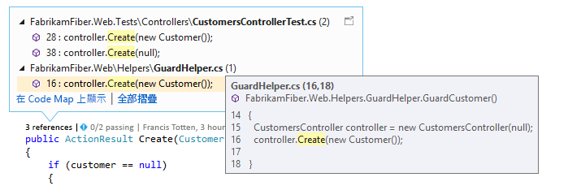  
  
 連絡您的小組有關程式碼的變更，而無須離開編輯器：  
  
 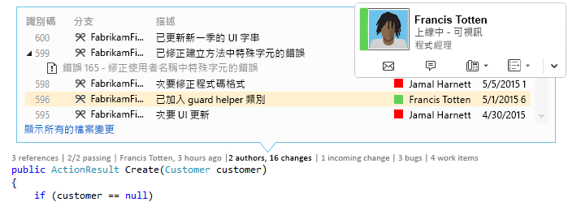  
  
 若要選擇欲查看或開啟/關閉 CodeLens 的指標，請移至 [工具] 、[選項] 、[文字編輯器] 、[所有語言] 、[CodeLens] 。  
  
##   尋找您程式碼的參考  
 您需要下列項目：  
  
-   Visual Studio Enterprise 或 Visual Studio Professional  
  
-   Visual C# .NET 或 Visual Basic .NET 程式碼  
  
 請選擇 [參考]  指標 (**[Alt+2]**)。 如果您看到 [0 個參考] ，代表您沒有來自 Visual C# 或 Visual Basic 程式碼的參考。 這不包含來自其他項目的參考，例如 XAML 和 ASPX 檔案。  
  
 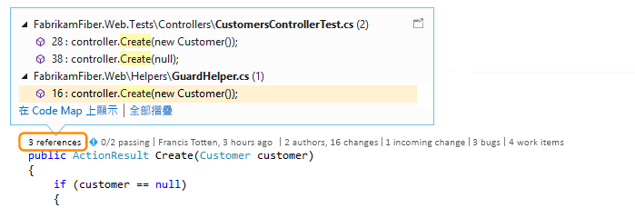  
  
 若要檢視參考程式碼，請將滑鼠移至該參考上方。  
  
   
  
 若要開啟包含參考的檔案，請按兩下參考。  
  
 若要查看此程式碼與其參考之間的關聯性，請[建立 Code Map](../modeling/map-dependencies-across-your-solutions.md)，並選擇 Code Map 捷徑功能表的 [顯示所有參考] 。  
  
 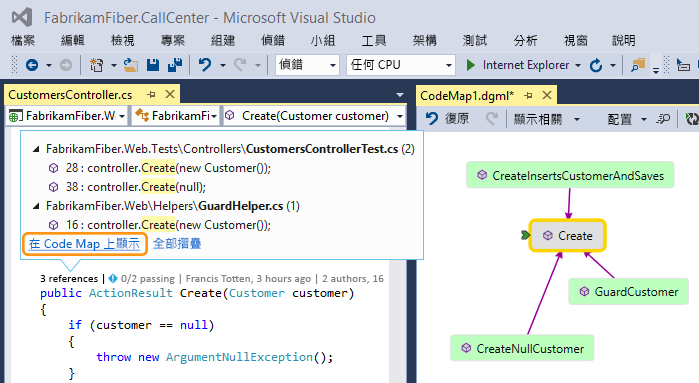  
  
##   尋找您程式碼的記錄和連結的項目  
 檢閱您的程式碼記錄，以了解程式碼發生了什麼事。 或者，請先檢閱變更內容，再將其合併到您的程式碼中，如此可更了解其他分支中的變更可能會如何影響您的程式碼。  
  
 您需要下列項目：  
  
-   Visual Studio Enterprise 或 Visual Studio Professional  
  
-   Team Foundation Server 2013 或更新版本、Visual Studio Team Services 或 Git  
  
-   [Lync 2010 或更新版本或是商務用 Skype](http://technet.microsoft.com/en-us/lync)，以從程式碼編輯器連絡您的小組  
  
 針對 Team Foundation 版本控制 (TFVC) 或 Git 儲存的 Visual C# .NET 或 Visual Basic .NET，您將在類別與方法層級取得 CodeLens 詳細資訊 (*程式碼項目層級* 指標)。 如果您的 Git 儲存機制裝載在 TfGit 中，您也會取得 TFS 工作項目的連結。  
  
   
  
 對於可以在 Visual Studio 編輯器中開啟的所有其他類型的檔案，將可於視窗的下方取得整個檔案的 CodeLens 詳細資料 (*檔案層級* 指標)。  
  
   
  
 若要使用鍵盤來選取指標，請按住 **ALT** 鍵以顯示相關數字鍵。  
  
   
  
### 尋找您程式碼中的變更  
 在程式碼項目層級指標中，找出誰變更了您的 C# 或 Visual Basic 程式碼，以及他們做的變更。 當您使用 Team Foundation Server 或 Visual Studio Team Services 中的 Team Foundation 版本控制 (TFVC) 時，這就是您所看到的樣子。  
  
   
  
 預設的時間週期為 12 個月。 如果程式碼儲存在 Team Foundation Server 中，您就可以執行 [TFSConfig 命令](http://msdn.microsoft.com/en-us/94424190-3b6b-4f33-a6b6-5807f4225b62) 與 [CodeIndex 命令](../ide/codeindex-command.md) 和 **/indexHistoryPeriod** 旗標，變更這項限制。  
  
 若要查看所有變更的詳細記錄，包括一年多前的記錄，請選擇 [顯示所有檔案變更] 。  
  
   
  
 這會開啟變更集的 [記錄] 視窗。  
  
   
  
 當您的檔案放在 Git 儲存機制中，而您選擇程式碼項目層級變更指標時，這就是您所看到的。  
  
   
  
 在視窗下方的檔案層級指標中，尋找整個檔案 (除了 C# 和 Visual Basic 檔案) 的變更。  
  
 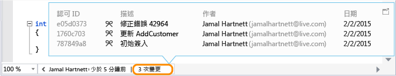  
  
 若要取得變更的更多詳細資料，請在該項目上按一下滑鼠右鍵。 視您使用的 TFVC 或 Git 之不同，您會取得一系列的選項以比較檔案的版本、檢視詳細資料及追蹤變更集，取得檔案所選的版本，並以對作者發送電子郵件表示出現該變更。 部分詳細資料會出現在 Team Explorer 中。  
  
 您也可以看到在這段時間裡是誰變更了您的程式碼。 這可協助您找出小組變更的模式，並評估其影響。  
  
   
  
#### 尋找您目前分支中的變更  
 假設您的小組有多個分支 (主要分支和子系開發) 可減少中斷穩定程式碼的風險：  
  
 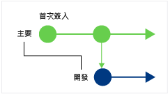  
  
 找出在主要分支中，有多少人對您的程式碼進行了多少變更 (**Alt + 6**)：  
  
 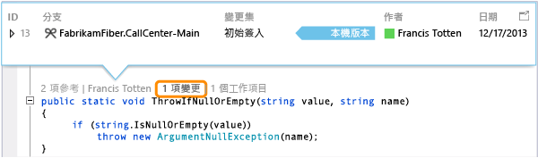  
  
#### 尋找何時將您的程式碼進行分支處理  
 在子分支中移至您的程式碼 (例如，這裡的 Dev 分支)。 選擇變更指標 (**Alt + 6**)：  
  
 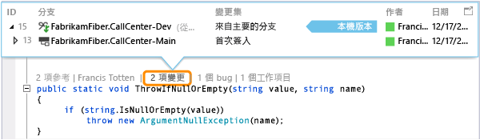  
  
#### 尋找其他分支傳入的變更  
   
  
 ...像此處 Dev 分支中的這個 Bug 修正：  
  
 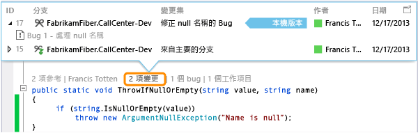  
  
 您可以檢閱這項變更，而不離開目前分支 (Main)：  
  
 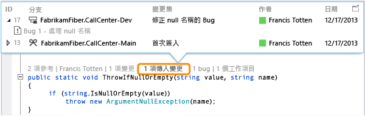  
  
#### 尋找何時合併變更  
 因此，您可以看到您分支中所含的變更：  
  
 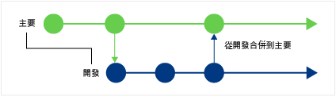  
  
 例如，您在 Main 分支中的程式碼現在具有來自 Dev 分支的 Bug 修正：  
  
 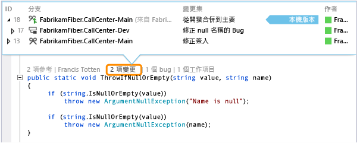  
  
#### 比較傳入變更與您的本機版本 (Shift + F10)  
 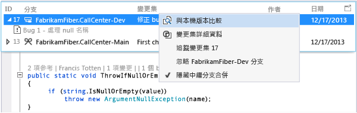  
  
 您也可以連按兩下變更集。  
  
#### 圖示的意義為何？  
  
|**圖示**|**變更的出處為何？**|  
|--------------|-----------------------------------------|  
||目前分支|  
||父分支|  
||子分支|  
||對等分支|  
||比父分支、子分支或對等分支更遠的分支|  
||從父分支到子分支的合併|  
||從子分支到父分支的合併|  
||從不相關分支的合併 (無基礎的合併)|  
  
### 尋找已連結的工作項目  
 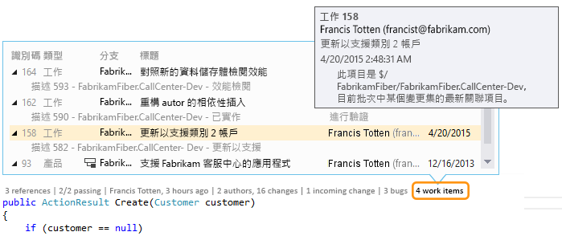  
  
### 尋找已連結的程式碼檢閱  
 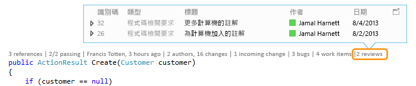  
  
### 尋找已連結的錯誤 (bug)  
 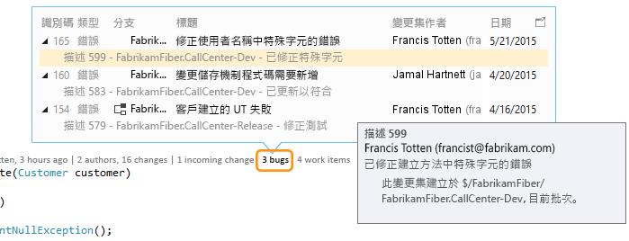  
  
### 連絡項目擁有者  
   
  
 開啟項目的捷徑功能表，查看連絡人選項。 如果您安裝了 Lync 或商務用 Skype，您會看到下列選項：  
  
   
  
##   尋找您程式碼的單元測試  
 深入了解因您的程式碼而存在的單元測試，而不需要開啟 [測試總管]。 您需要下列項目：  
  
-   Visual Studio Enterprise 或 Visual Studio Professional  
  
-   Visual C# .NET 或 Visual Basic .NET 程式碼  
  
-   [單元測試專案](../test/unit-test-your-code.md) ，其中具有應用程式程式碼的單元測試  
  
1.  移至包含單元測試的應用程式程式碼。  
  
2.  檢閱該程式碼的測試 (**Alt + 3**)。  
  
     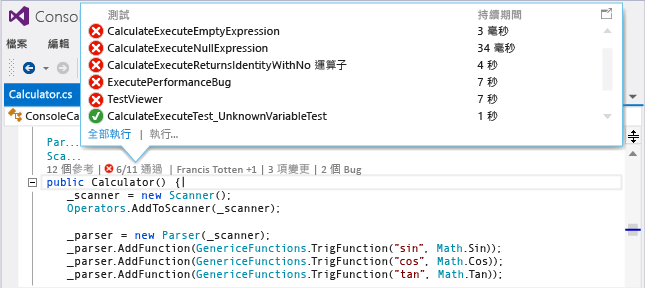  
  
3.  如果您看到警告圖示 ，請執行測試。  
  
     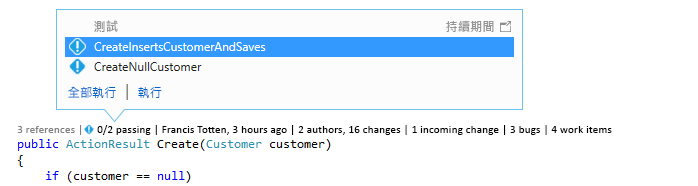  
  
4.  若要檢閱測試的定義，請按兩下 CodeLens 指示器視窗中的測試項目，在編輯器中開啟程式碼檔案。  
  
     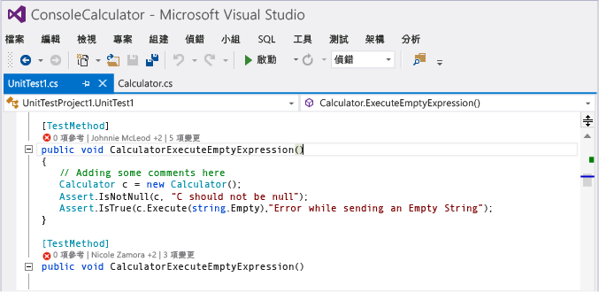  
  
5.  檢閱測試結果。 選擇測試狀態指標 ( 或 )，或按 **Alt + 1**。  
  
     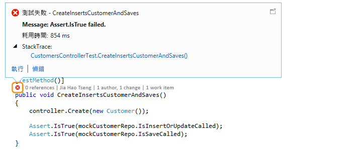  
  
6.  若要查看有多少人變更此測試、是誰變更此測試，或是對此測試做了多少變更，請[尋找您程式碼的記錄和連結的項目](#FindCodeHistory)。  
  
##   問與答  
  
###   問：如何關閉或開啟 CodeLens？ 又如何選擇要查看的指標？  
 **答：**  除了參考指標之外，您可以關閉或開啟各個指標。 請依序移至 [工具] 、[選項] 、[文字編輯器] 、[所有語言] 和 [CodeLens] 。  
  
 開啟指標之後，您也可以從指標開啟 CodeLens 選項。  
  
 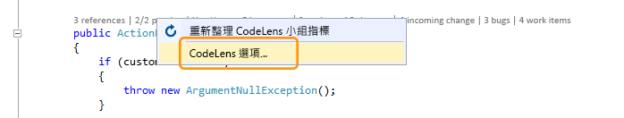  
  
 請使用 [編輯器] 視窗底部的＞形箭號圖示，開啟和關閉 CodeLens 檔案層級指標。  
  
   
  
###   問：CodeLens 在哪裡？  
 **答：** CodeLens 顯示在方法、類別、索引子和屬性層級的 Visual C# .NET 和 Visual Basic .NET 程式碼中。 CodeLens 會顯示在所有其他類型檔案的檔案層級。  
  
-   請確定 CodeLens 已開啟。 請依序移至 [工具] 、[選項] 、[文字編輯器] 、[所有語言] 和 [CodeLens] 。  
  
-   如果您的程式碼儲存在 TFS 中，請務必使用 [CodeIndex 命令](../ide/codeindex-command.md) 與 [TFS 組態命令](http://msdn.microsoft.com/en-us/94424190-3b6b-4f33-a6b6-5807f4225b62)，確定程式碼索引已開啟。  
  
-   唯有當工作項目連結程式碼，且您擁有開啟連結工作項目的權限時，才會出現與 TFS 相關的指標。 [確認您擁有小組成員權限。](http://msdn.microsoft.com/en-us/f58805de-ba61-4d09-8f2d-d3ab9662ecfd)  
  
-   應用程式程式碼沒有單元測試時，不會出現測試狀態指標。 測試狀態指標會自動出現在測試專案中。 如果您知道應用程式程式碼有單元測試，但是並未出現測試指標，請嘗試建置方案 ([**Ctrl + Shift + B**])。  
  
### 問：為什麼看不到認可的工作項目詳細資料？  
 **答：** 因為 CodeLens 在 TFS 中找不到工作項目，所以可能會發生這種情況。 請確認您已連接至具有那些工作項目的 Team 專案，以及您具有查看那些工作項目的權限。 如果認可描述具有 TFS 中工作項目 ID 的不正確資訊，則也可能會發生這種情況。  
  
###   問：為什麼看不到 Lync 或 Skype 指標？  
 **答：** 如果您未登入 Lync 或商務用 Skype、未安裝其中之一，或沒有支援的組態，則不會出現 Lync 或 Skype 指標。 不過您仍然可以傳送郵件：  
  
 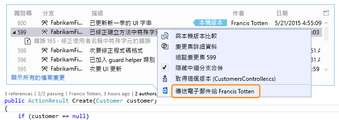  
  
 **支援哪些 Lync 和 Skype 組態？**  
  
-   商務用 Skype (32 位元或 64 位元)  
  
-   Lync 2010 或更新版本搭配 (32 位元或 64 位元)，但不是 Lync Basic 2013 的 Windows 8.1  
  
 CodeLens 不支援安裝不同版本的 Lync 或 Skype。 它們可能尚未對所有 Visual Studio 當地語系化版本完成當地語系化。  
  
### 問：如何變更 CodeLens 的字型和色彩？  
 **答：** 移至 [ **工具**]、[ **選項**]、[ **環境**]、[ **字型和色彩**]。  
  
 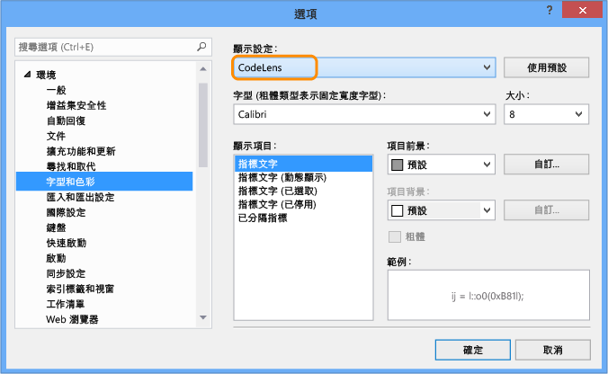  
  
 使用鍵盤：  
  
1.  按 **Alt + T + O** 開啟 [ **選項** ] 方塊。  
  
2.  按 **向上鍵** 或 **向下鍵** 移至 [ **環境** ] 節點，然後按 **向左鍵** 展開節點。  
  
3.  按 **向下鍵** 移至 [ **字型和色彩**]。  
  
4.  按 **TAB** 鍵移至 [ **顯示設定:** ] 清單，然後按 **向下鍵** 選取 [ **CodeLens**]。  
  
### 問：我可以移動 CodeLens 平視顯示窗嗎？  
 **答︰**可以，選擇 ，來將 CodeLens 停駐成為視窗。  
  
   
  
   
  
### 問：如何重新整理指標？  
 **答：** 這取決於指標：  
  
-   **參考**：程式碼變更時，此指標會自動更新。 如果您將此指標固定為獨立視窗，請在此處手動重新整理指標：  
  
     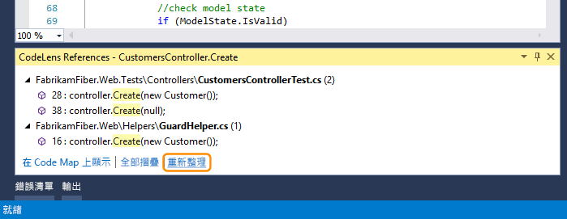  
  
-   **小組**：請在此處手動重新整理指標：  
  
     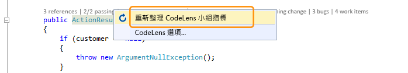  
  
-   **測試**：[尋找您程式碼的單元測試](#FindRunUnitTests)，以重新整理此指標。  
  
###   問：什麼是「本機版本」？  
 **答：** [ **本機版本** ] 箭頭指向這個檔案的本機版本的最新變更集。 當伺服器有更新的變更集時，它們會顯示在 [ **本機版本** ] 箭頭上方或下方 (根據變更集的排列順序而定)。  
  
### 問：我是否可以管理 CodeLens 處理程式碼的方式，以顯示記錄和連結項目？  
 **答：** 可以，如果您的程式碼儲存於 TFS，請使用 [CodeIndex 命令](../ide/codeindex-command.md) 與 [TFS 組態命令](http://msdn.microsoft.com/en-us/94424190-3b6b-4f33-a6b6-5807f4225b62)。
