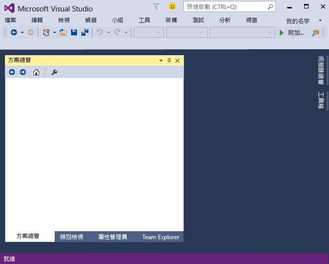
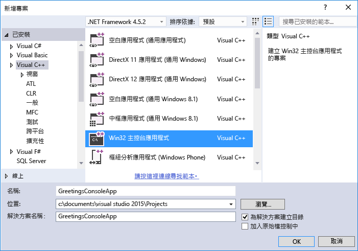
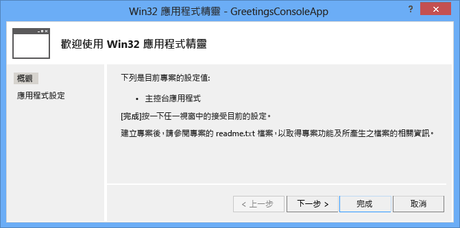
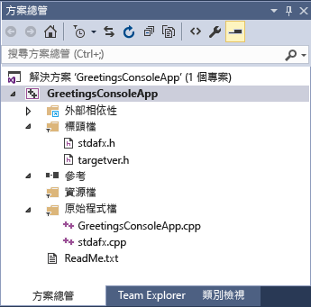
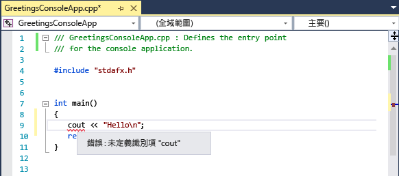
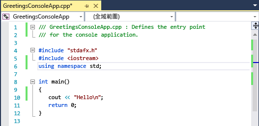

# <a name="getting-started-with-c-in-visual-studio"></a>Visual Studio 中的 C++ 使用者入門
完成這個逐步解說，您就能熟悉許多可在使用 Visual Studio 開發應用程式時運用的工具與對話方塊。 您將建立簡單的 "Hello, World" 型應用程式，同時深入了解如何使用整合式開發環境 (IDE)。  
  
 此主題包括下列章節：  
  
 [登入 Visual Studio](../ide/getting-started-with-cpp-in-visual-studio.md#BKMK_Configure)  
  
 [建立簡單的應用程式](../ide/getting-started-with-cpp-in-visual-studio.md#BKMK_CreateApp)  
  
 [將程式碼加入應用程式](../ide/getting-started-with-cpp-in-visual-studio.md#BKMK_AddCode)  
  
 [偵錯和測試應用程式](../ide/getting-started-with-cpp-in-visual-studio.md#BKMK_DebugTest)  
  
 [建置應用程式的發行版本](../ide/getting-started-with-cpp-in-visual-studio.md#BKMK_BuildRelease)  
  
##  <a name="BKMK_Configure"></a> 登入 Visual Studio  
 當您第一次啟動 Visual Studio 時，可以選擇使用例如 Live 或 Outlook 等 Microsoft 帳戶登入。 登入可讓您跨所有裝置同步處理設定。 如需詳細資訊，請參閱 [Signing in to Visual Studio](../ide/signing-in-to-visual-studio.md)。  
  
 圖 1：Visual Studio IDE  
  
   
  
 開啟 Visual Studio 之後，您會看到 IDE 的三個基本部分：工具視窗、功能表和工具列，以及主視窗空間。 工具視窗停駐在應用程式視窗的左右側，同時 [快速啟動] 、功能表列和標準工具列則位於視窗上方。 位於應用程式視窗中央的是 [起始頁] 。 當您開啟方案或專案時，編輯器和設計工具就會出現在此空間中。 在開發應用程式時，您大部分時間都會在此中央區域工作。  
  
##  <a name="BKMK_CreateApp"></a> 建立簡單的應用程式  
 在 Visual Studio 中建立應用程式時，必須先建立一個專案和一個方案。 在這個範例中，您將建立 Windows 主控台應用程式。  
  
#### <a name="to-create-a-console-app"></a>若要建立主控台應用程式  
  
1.  在功能表列上，選擇 [檔案] 、[新增] 、[專案] 。  
  
     ![在功能表列上，依序選擇 [檔案]、[新增] 和 [專案]](../ide/media/exploreide-filenewproject.png "ExploreIDE-FileNewProject")  
  
2.  在 [Visual C++] 分類中，選擇 [Win32 主控台應用程式] 範本，然後將專案命名為 `GreetingsConsoleApp`。  
  
       
     根據已安裝的項目，對話方塊可能會有不同的選項。 如果您看不到 Visual C++ 專案範本，則需要回到安裝程式，並安裝 C++ 工作負載。
  
3.  [Win32 應用程式精靈] 出現時，請選擇 [完成]  按鈕。  
  
       
  
 這樣會建立 GreetingsConsoleApp 專案和方案以及 Win32 主控台應用程式的基本檔案，並自動載入 **方案總管**。 GreetingsConsoleApp.cpp 檔案會在程式碼編輯器中開啟。 下列項目會在 **方案總管**中出現：  
  
 圖 4：專案項目  
  
   
  
##  <a name="BKMK_AddCode"></a> 將程式碼新增到應用程式  
 接下來，您將新增程式碼以在主控台視窗中顯示 "Hello" 文字。  
  
#### <a name="to-display-hello-in-the-console-window"></a>在主控台視窗中顯示 "Hello"  
  
1.  在 GreetingsConsoleApp.cpp 檔案中的 `return 0;` 行之前輸入空白行，然後輸入下列程式碼：  
  
    ```  
    cout << "Hello\n";  
    ```  
  
     `cout`底下會出現紅色曲線。 如果您指向它，就會出現錯誤訊息。  
  
       
  
     錯誤訊息也會出現在 [錯誤清單]  視窗中。 您可以在功能表列上依序選擇 [檢視] 和 [錯誤清單] 來顯示視窗。  
  
     [cout](/cpp/standard-library/iostream) 包含在 \<iostream> 標頭檔中。  
  
2.  若要包含 iostream 標頭，請在 `#include "stdafx.h"`之後輸入下列程式碼：  
  
    ```  
    #include <iostream>  
    using namespace std;  
    ```  
  
     您可能已經注意到輸入程式碼時會出現方塊，其中提供您所輸入的字元的建議。 這個方塊是 C++ IntelliSense 的一部分，可提供編碼提示，包括列出類別或介面成員及參數資訊。 您也可以使用程式碼片段，也就是預先定義的程式碼區塊。 如需詳細資訊，請參閱 [Using IntelliSense](../ide/using-intellisense.md) 與 [Code Snippets](../ide/code-snippets.md)。  
  
     當您修正錯誤時， `cout` 底下的紅色曲線就會消失。  
  
3.  將變更儲存到檔案。  
  
       
  
##  <a name="BKMK_DebugTest"></a> 偵錯和測試應用程式  
 您可以偵錯 GreetingsConsoleApp，看看 "Hello" 這個字是否出現在主控台視窗中。  
  
#### <a name="to-debug-the-application"></a>若要進行應用程式偵錯  
  
-   啟動偵錯工具。  
  
     ![[偵錯] 功能表上的 [開始偵錯] 命令](../ide/media/exploreide-startdebugging.png "ExploreIDE-StartDebugging")  
  
     偵錯工具會啟動並執行程式碼。 主控台視窗 (外觀類似命令提示字元的另一個視窗) 會出現幾秒鐘，並在偵錯工具停止執行時快速關閉。 若要查看文字，則必須設定中斷點以停止程式執行。  
  
#### <a name="to-add-a-breakpoint"></a>若要加入中斷點  
  
1.  從功能表列，將中斷點加入 `return 0;`這一行。 您也可以按一下左邊界來設定中斷點。  
  
     ![[偵錯] 功能表上的 [切換中斷點] 命令](../ide/media/exploreide-togglebreakpoint.png "ExploreIDE-ToggleBreakpoint")  
  
     在編輯器視窗最左緣、程式碼行的旁邊會出現一個紅色圓圈。  
  
2.  選擇 F5 鍵開始偵錯。  
  
     偵錯工具隨即啟動，而主控台視窗會出現並顯示 **Hello**這個字。  
  
       
  
3.  按 SHIFT + F5 停止偵錯。  
  
 如需詳細資訊，請參閱[主控台專案](../debugger/debugging-preparation-console-projects.md)。  
  
##  <a name="BKMK_BuildRelease"></a> 建置應用程式的發行版本  
 既然已經驗證應用程式的運作一切正常，您就可以準備其發行組建。  
  
#### <a name="to-clean-the-solution-files-and-build-a-release-version"></a>清除方案檔案和建置發行版本  
  
1.  從功能表列中，刪除在先前組建期間所建立的中繼檔和輸出檔。  
  
     ![[建置] 功能表上的 [清除方案] 命令](../ide/media/exploreide-cleansolution.png "ExploreIDE-CleanSolution")  
  
2.  將 GreetingsConsoleApp 的組建組態由 [偵錯]  變更為 [發行] 。  
  
       
  
3.  建置方案。  
  
     ![[建置] 功能表上的 [建置方案] 命令](../ide/media/exploreide-buildsolution.png "ExploreIDE-BuildSolution")  
  
 恭喜您完成此逐步解說！ 如果您想要探索更多範例，請參閱 [Visual Studio 範例](../ide/visual-studio-samples.md)。  
  
## <a name="see-also"></a>另請參閱  
 [使用 Visual Studio IDE 進行 C++ 桌面程式開發](/cpp/ide/using-the-visual-studio-ide-for-cpp-desktop-development)   
 [逐步解說：使用 Visual C# 或 Visual Basic 建立簡單的應用程式](../ide/walkthrough-create-a-simple-application-with-visual-csharp-or-visual-basic.md)   
 [使用 Visual Studio 提高產能的秘訣](../ide/productivity-tips-for-visual-studio.md)   
 [Visual Studio 範例](../ide/visual-studio-samples.md)   
 [Visual Studio 使用者開發入門](../ide/get-started-developing-with-visual-studio.md)
