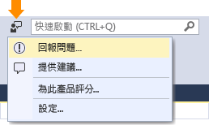
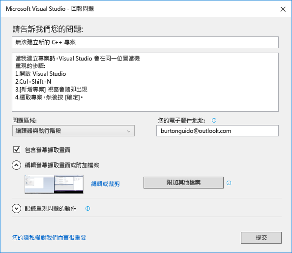
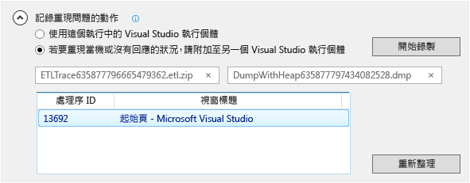

# 如何回報在使用 Visual Studio 時發生的問題
[!INCLUDE[vs2017banner](../code-quality/includes/vs2017banner.md)]

若您在使用 Visual Studio 時發生問題，請告知我們，讓我們能夠加以診斷並修正。  透過使用 \[回報問題\] 工具，您可以收集問題的詳細資訊，並只需按幾下按鈕即可將其傳送給 Microsoft。  
  
 Microsoft 尊重您的隱私權。 如需我們如何處理您所傳送之資料的資訊，請參閱 [Microsoft Visual Studio 產品系列隱私權聲明](https://www.visualstudio.com/en-us/dn948229)。  
  
## 開啟 \[回報問題\] 工具  
 按一下標題列中 \[快速啟動\]旁的使用者意見反應圖示，或按一下 \[說明 &#124;傳送意見反應 &#124;回報問題\]。  
  
   
  
## 描述問題  
  
###    
  
1.  請提供問題的描述性標題，如此可協助我們將問題發送給 Visual Studio 中適當的團隊。  
  
2.  請提供其他詳細資訊，若可能的話，也請提供重現問題的步驟。  
  
3.  從下拉式表單中選擇問題區域。 若您不確定，則請選擇最接近的區域。  
  
   
  
## 提供螢幕擷取畫面 \(選擇性\)  
 選擇 \[包含螢幕擷取畫面\]，將目前螢幕傳送給 Microsoft。 此工具可讓您裁剪影像，讓該影像只包含顯示出問題的螢幕部分。 您可按一下 \[附加其他檔案\] 按鈕，即可附加其他螢幕擷取畫面或檔案。  
  
## 提供追蹤和堆積傾印 \(選擇性\)  
  
###    
  
1.  追蹤和堆積傾印檔案有助於我們診斷問題。   我們非常感激您願意使用 \[回報問題\] 工具記錄重現問題的步驟，並將資料傳送給 Microsoft。  
  
2.  按一下 \[記錄重現問題的動作\] 旁邊的 \> 形箭號。 若您的問題造成 Visual Studio 停滯或當機，請開啟另一個 Visual Studio 執行個體，並從清單檢視中加以選取。  
  
3.  按一下 \[開始錄製\] 並執行重現問題的步驟。 完成之後，請按一下浮動視窗中的 \[停止錄製\] 按鈕。  
  
4.  請稍等幾分鐘，讓 Visual Studio 收集和封裝已錄製的資訊。 收集處理序完成時，對話方塊看起來會像這樣：  
  
       
  
## 若有因應措施，請加以描述  
 若您能解決此問題，請在針對該目的而提供的編輯方塊中描述因應措施。 這不僅有助於診斷問題，還可協助其他可能發生相同問題的使用者。  
  
## 提交報告  
 按一下 \[提交\] 按鈕，連同任何影像、追蹤或傾印檔案送出您的報告。 若 \[提交\] 按鈕呈現灰色，請確定您是否已提供標題與描述。  
  
## 請參閱  
 [告訴我們](../ide/talk-to-us.md)