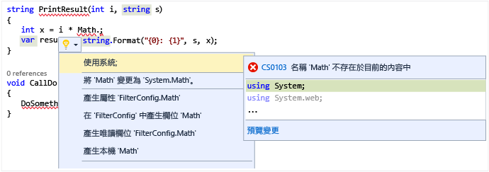

# <a name="quick-actions"></a>快速動作

[快速動作](refactoring-code-generation-quick-actions.md#quick-actions)可讓您輕鬆地重構、產生或用其他方式以單一動作修改程式碼。  雖然有許多專門適用於 C# 或 Visual Basic 的快速動作，也有一些同時適用於 C# 和 Visual Basic 專案。  這些可以藉由當您的游標位於適當程式碼行時使用燈泡圖示  或按 **Ctrl + .** 來套用。 when your cursor is on the appropriate line of code.

如果有紅色曲線，而且 Visual Studio 有針對如何修正問題的建議，您就會看到燈泡。 例如，如果紅色曲線指出一個錯誤，當該錯誤有可用的修正時，便會出現燈泡。 針對任何語言，協力廠商都可以提供自訂診斷和建議，例如做為 SDK 的一部分，而 Visual Studio 燈泡會依據這些規則亮燈。  

### <a name="to-see-a-light-bulb"></a>如何看到燈泡  

1. 在許多情況下，當您將滑鼠指標停留在錯誤點上方時，會自動出現燈泡；或者當您將插入號移到含有錯誤的字行時，會在編輯器左邊界出現燈泡。 當您看到紅色曲線時，可以將滑鼠暫留在其上方，即可顯示燈泡。 當您使用滑鼠或鍵盤前往發生問題之字行中的任何地方，也可以使燈泡顯示。  

2. 在字行任何地方按 **Ctrl+.**， 可叫用燈泡，直接前往可能的修正方法清單。  

     

### <a name="to-see-potential-fixes"></a>如何看到可能的修正方法  
按一下向下箭號或 [顯示可能的修正方法] 連結，就會顯示燈泡可以提供給您的快速動作清單。  



## <a name="common-quick-actions"></a>一般的快速動作
以下是一些同時適用於 C# 和 Visual Basic 程式碼的一般快速動作。

### <a name="add-missing-casesdefault-caseboth"></a>新增遺漏的 Case/預設的 Case/兩者
以 C# 建立 `switch` 陳述式或以 Visual Basic 建立 `Select Case` 陳述式時，您可以使用程式碼動作，自動新增遺漏的 Case 項目、預設的 Case 陳述式，或兩者。  對於如下的空陳述式：

```CSharp
enum MyEnum
{
    Item1,
    Item2,
    Item3
}

...

MyEnum myEnum = MyEnum.Item1;

switch(myEnum)
{
}
```

```VB
Enum MyEnum
    Item1
    Item2
    Item3
End Enum

...

Dim myEnum as MyEnum = MyEnum.Item1

Select Case myEnum
End Select
```

使用 [新增兩者] 快速動作填入遺漏的 Case 和預設 Case 將會建立下列︰

```CSharp
switch(myEnum)
{
    case MyEnum.Item1:
        break;
    case MyEnum.Item2:
        break;
    case MyEnum.Item3:
        break;
    default:
        break;    
}
```

```VB
Select Case myEnum
    Case MyEnum.Item1
        Exit Select
    Case MyEnum.Item2
        Exit Select
    Case Else
        Exit Select
End Select
```

### <a name="correct-misspelled-type"></a>更正拼字錯誤的類型
如果您不小心拼錯 Visual Studio 中的類型，這個快速動作會自動更正它。  您會看到燈泡功能表中的這些項目**「變更 '*拼字錯誤類型*' 為 '*正確類型*'**。  例如: 

```CSharp
// Before
private viod MyMethod()
{
}

// Change 'viod' to 'void'

// After
private void MyMethod()
{
}
```

```VB
' Before
Function MyFunction as Intger
End Function

' Change 'Intger' to 'Integer'

' After
Function MyFunction as Integer
End Function
```

### <a name="remove-unnecessary-cast"></a>移除不必要的 Cast
如果您將類型轉型為不需要轉型的另一種類型，**移除不必要的 Cast** 快速動作項目將會移除您程式碼中的 Cast。

```CSharp
// before
int number = (int)3;

// Remove Unnecessary Cast

// after
int number = 3;
```

```VB
' Before
Dim number as Integer = CType(3, Integer)

' Remove Unnecessary Cast

' After
Dim number as Integer = 3
```

### <a name="replace-method-with-property--replace-property-with-method"></a>以屬性取代方法/以方法取代屬性
這些快速動作會將方法轉換為屬性，或反過來轉換。  下列範例顯示從方法變更為屬性。  相反的情況下，只要反轉「之前」和「之後」區段。

```CSharp
private int MyValue;

// Before
public int GetMyValue()
{
    return MyValue;
}

// Replace 'GetMyValue' with property

// After
public int MyValue
{
    get { return MyValue; }
}
```

```VB
Dim MyValue As Integer

' Before
Function GetMyValue() As Integer
    Return MyValue
End Function

' Replace 'GetMyValue' with property

' After
ReadOnly Property MyValue As Integer
    Get
        Return MyValue
    End Get
End Property
```

### <a name="make-method-synchronous"></a>將方法設為同步
對方法使用 `async`/`Async` 關鍵字時，預期在該方法中的某處，也會使用 `await`/`Await` 關鍵字。  不過，若情況不是這樣，就會顯示快速動作，讓您可藉由移除 `async`/`Async` 關鍵字和變更傳回型別將方法設為同步。  使用 [快速動作] 功能表的 [將方法設為同步] 選項。

```CSharp
// Before
async Task<int> MyAsyncMethod()
{
    return 3;
}

// Make method synchronous

// After
int MyAsyncMethod()
{
    return 3;
}
```

```VB
' Before
Async Function MyAsyncMethod() As Task(Of Integer)
    Return 3
End Function

' Make method synchronous

' After
Function MyAsyncMethod() As Integer
    Return 3
End Function
```

### <a name="make-method-asynchronous"></a>將方法設為非同步
在方法內使用 `await`/`Await` 關鍵字時，預期方法本身會標記 `async`/`Async` 關鍵字。  不過，若情況不是這樣，就會顯示快速動作，讓您可以將方法設為非同步。  使用 [快速動作] 功能表的 [將方法/函式設為非同步] 選項。

```CSharp
// Before
int MyAsyncMethod()
{
    return await Task.Run(...);
}

// Make method synchronous

// After
async Task<int> MyAsyncMethod()
{
    return await Task.Run(...);
}
```

```VB
' Before
Function MyAsyncMethod() as Integer
    Return  Await Task.Run(...)
End Function

' Make method synchronous

' After
Async Function MyAsyncMethod() As Task(Of Integer)
    Return Await Task.Run(...)
End Function
```

### <a name="remove-unnecesary-usingsimports"></a>移除不必要的 using/Import
**移除不必要的 using/Import** 快速動作將會移除目前檔案中任何未使用的 `using` 和 `Import` 陳述式。  當您選取此項目時，將會立即移除未使用的命名空間匯入。

### <a name="add-usingsimports-for-types-in-reference-assemblies-nuget-packages-or-other-types-in-your-solution"></a>針對參考組件的類型、NuGet 套件的類型或您方案中的其他類型新增 using/Import
使用位於您方案中其他專案的類型會自動顯示快速動作，但是其他則需要從 [工具] > [選項] > [C#] 或 [基本] > [進階] 索引標籤啟用︰  

* 針對參考組件中的類型建議 using/Import
* 針對 NuGet 套件中的類型建議 using/Import

啟用時，如果您使用的類型位於目前未匯入，但存在於參考組件或 NuGet 套件的命名空間中，將會建立 using/Import 陳述式。

```CSharp
// Before
Debug.WriteLine("Hello");

// using System.Diagnostics;

// After
using System.Diagnostics;

Debug.WriteLine("Hello");
```

```VB
' Before
Debug.WriteLine("Hello")

' Imports System.Diagnostics

// After
Imports System.Diagnostics

Debug.WriteLine("Hello")
```

### <a name="convert-to-interpolated-string"></a>轉換成字串插值
[字串插值](/dotnet/articles/csharp/language-reference/keywords/interpolated-strings)可以輕鬆表示含有內嵌變數的字串，類似於 **[String.Format](https://msdn.microsoft.com/library/system.string.format(v=vs.110).aspx)** 方法。  這個快速動作會辨識字串串連或使用 **String.Format** 的情況，並將使用方式變更為字串插值。

```CSharp
// Before
int num = 3;
string s = string.Format("My string with {0} in the middle", num);

// Convert to interpolated string

// After
int num = 3;
string s = $"My string with {num} in the middle";
```

```VB
' Before
Dim num as Integer = 3
Dim s as String = String.Format("My string with {0} in the middle", num)

' Convert to interpolated string

' After
Dim num as Integer = 3
Dim s As String = $"My string with {num} in the middle"
```

# <a name="see-also"></a>另請參閱
* [程式碼樣式及快速動作](code-styles-and-quick-actions.md)
