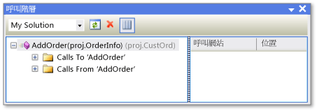

# 呼叫階層
[!INCLUDE[vs2017banner](../../code-quality/includes/vs2017banner.md)]

呼叫階層式架構可讓您瀏覽您的程式碼，藉由顯示與選取的方法、 屬性或建構函式的所有呼叫。  這可以讓您更加了解程式碼的流程，並評估程式碼變更的影響。  您可以檢查數個程式碼階層，以檢視複雜的方法呼叫鏈結及程式碼的其他進入點，讓您探索所有可能的執行路徑。  
  
 與呼叫堆疊 \(由偵錯工具顯示\) 不同，「呼叫階層架構」可以在設計階段使用。  
  
## 使用呼叫階層架構  
 若要顯示 \[**呼叫階層**\] 視窗，請以滑鼠右鍵按一下方法、屬性或建構函式呼叫的名稱，然後按一下 \[**檢視呼叫階層**\]。  
  
 成員名稱會顯示在 \[**呼叫階層**\] 視窗的樹狀檢視窗格中。  如果您展開成員節點，則 \[**呼叫目標**\] \<*成員名稱*\> 和 \[**呼叫來源**\] \<*成員名稱*\> 子節點隨即顯示。  下圖顯示 \[**呼叫階層架構**\] 視窗中的上述節點。  
  
   
呼叫階層視窗  
  
-   如果您展開 \[**呼叫目標**\] 節點，則會顯示呼叫選取之成員的所有成員。  
  
-   如果您展開 \[**呼叫來源**\] 節點，則會顯示選取之成員所呼叫的所有成員。  
  
 接著，您可以將上述每個子節點成員都展開成 \[**呼叫目標**\] 和 \[**呼叫來源**\] 節點。  這可以讓您巡覽至呼叫端的堆疊中，如同下圖所示。  
  
   
呼叫階層視窗  
  
 對於定義為虛擬或抽象的成員，則會顯示 \[**覆寫方法名稱**\] 節點。  對於介面成員，則會顯示 \[**實作方法名稱**\] 節點。  這些可展開的節點都會在相同階層顯示為 \[**呼叫**\] 和 \[**呼叫來源**\] 節點。  
  
 工具列上的 \[**搜尋範圍**\] 方塊包含 \[**我的方案**\]、\[**目前專案**\] 和 \[**目前文件**\] 選項。  
  
 當您選取 \[**呼叫階層**\] 樹狀檢視窗格中的子方法時：  
  
-   \[**呼叫階層**\] 詳細資料窗格會顯示從父成員中呼叫子成員的所有程式碼。  
  
-   **程式碼定義視窗**，如果開啟時，顯示所選成員的程式碼。  C\# 和 C\+\+ 中使用這個視窗。  如需這個視窗的詳細資訊，請參閱 [檢視程式碼的結構](../../ide/viewing-the-structure-of-code.md)。  
  
> [!NOTE]
>  呼叫階層找不到方法群組參考，而方法群組包含位置以將方法加入為事件處理常式，或將方法指派給委派。  若要尋找某個方法的所有參考，您可以使用 \[**尋找所有參考**\] 命令。  
  
## 捷徑功能表項目  
 下表描述幾個當您以滑鼠右鍵按一下樹狀檢視窗格中的節點時，可以使用的捷徑功能表選項。  
  
|內容功能表項目|描述|  
|-------------|--------|  
|**加入做為新根目錄**|將選取的節點加入至樹狀檢視窗格成為新的根節點。  這可讓您將注意力放在特定樹狀子目錄。|  
|**移除根目錄**|從樹狀檢視窗格移除選取的根節點。  這個選項只能從根節點使用。   您也可以使用 \[**移除根目錄**\] 工具列按鈕來移除選取的根節點。|  
|**移至定義**|針對選取的節點執行 \[移至定義\] 命令。  如此即可巡覽至成員呼叫的原始定義或變數定義。   若要執行 \[移至定義\] 命令，您也可以按兩下選取的節點，或在選取的節點上按 F12。|  
|**尋找所有參考**|針對選取的節點執行 \[尋找所有參考\] 命令。  如此即可尋找專案中參考類別或成員的所有程式碼行。   您也可以使用 SHIFT\+F12，針對選取的節點執行 \[尋找所有參考\] 命令。|  
|**複製**|複製選取之節點 \(而非其子節點\) 的內容。|  
|**重新整理**|摺疊選取的節點，以便於再次展開時可顯示目前的資訊。|