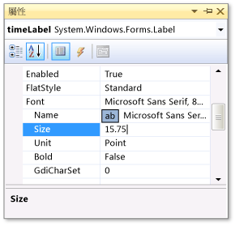
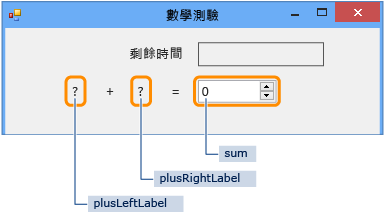
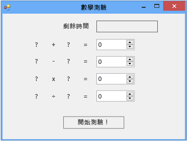

# 步驟 1：建立專案並將標籤加入至表單
[!INCLUDE[vs2017banner](../code-quality/includes/vs2017banner.md)]

開發這個測驗的前幾個步驟是建立專案，然後將標籤、按鈕和其他控制項加入至表單。  另外也會設定您所加入每個控制項的屬性。  專案將包含表單、控制項和程式碼 \(稍後在本教學課程中加以說明\)。  按鈕用於開始測驗，標籤用於顯示測驗問題，而其他控制項則顯示測驗的答案及完成測驗所剩餘的時間。  
  
> [!NOTE]
>  這個主題是有關基本程式碼撰寫概念的教學課程系列的一部分。  如需教學課程的概觀，請參閱[教學課程 2：建立計時的數學測驗](../ide/tutorial-2-create-a-timed-math-quiz.md)。  
  
### 若要建立專案和設定表單的屬性  
  
1.  在功能表列上，選擇 \[**檔案**\]、\[**新增**\]、\[**專案**\]。  
  
2.  在 \[**安裝的範本**\] 清單中選擇 \[**C\#**\] 或 \[**Visual Basic**\]。  
  
3.  在範本清單中，選擇 \[**Windows Form 應用程式**\] 範本，將它命名為「數學測驗」，然後選擇 \[**確定**\] 按鈕。  
  
     依據您選擇的程式語言而定，名為 \[**Form1.cs**\] 或 \[**Form1.vb**\] 的表單隨即出現。  
  
4.  選擇表單，然後將其 \[**Text**\] 屬性變更為 \[**數學測驗**\]。  
  
     \[**屬性**\] 視窗中包含表單的屬性。  
  
5.  將表單的大小變更為寬度 500 像素乘以高度 400 像素。  
  
     您可以藉由拖曳邊緣來調整表單大小，直到正確的大小出現在整合式開發環境 \(Integrated Development Environment，IDE\) 的左下角。  或者，您可以變更 \[**Size**\] 屬性的值。  
  
6.  將 \[**FormBorderStyle**\] 屬性的值變更為 \[**Fixed3D**\]，並將 \[**MaximizeBox**\] 屬性設定為 \[**False**\]。  
  
     這些值可防止受測者調整表單的大小。  
  
### 若要建立剩餘時間方塊  
  
1.  從 \[工具箱\] 加入 \[**Label**\] 控制項，然後將其 \[**\(Name\)**\] 屬性的值設定為 `timeLabel`。  
  
     這個標籤會變成右上角的方塊，顯示測驗所剩的秒數。  
  
2.  將 \[**AutoSize**\] 屬性變更為 \[**False**\]，就可以調整方塊的大小。  
  
3.  將 \[**BorderStyle**\] 屬性變更為 \[**FixedSingle**\]，以繪製方塊周圍的框線。  
  
4.  將 \[**Size**\] 屬性設定為 \[**200, 30**\]。  
  
5.  將標籤移至表單右上角，藍色分隔線就會出現。  
  
     這些分隔線可幫助您對齊表單上的控制項。  
  
6.  在 \[**屬性**\] 視窗中選擇 \[**Text**\] 屬性，然後選擇退格鍵清除其值。  
  
7.  選擇 \[**Font**\] 屬性旁邊的加號 \(\+\)，然後將 \[**Size**\] 屬性的值變更為 \[15.75\]。  
  
     您可以變更數個字型屬性，如下圖所示。  
  
       
顯示字型大小的 \[屬性\] 視窗  
  
8.  從 \[工具箱\] 加入另一個 **Label** 控制項，然後將其字型大小設定為 \[15.75\]。  
  
9. 將 \[**Text**\] 屬性設定為 \[**Time Left**\]。  
  
10. 移動標籤，讓它排列在 \[**timeLabel**\] 標籤的左邊。  
  
### 若要加入加法問題的控制項  
  
1.  從 \[工具箱\] 加入 **Label** 控制項，然後將其 \[**Text**\] 屬性設定為 \[**?**\] \(問號\)。  
  
2.  將 \[**AutoSize**\] 屬性設定為 \[**False**\]。  
  
3.  將 \[**Size**\] 屬性設定為 \[**60, 50**\]。  
  
4.  將字型大小設定為 \[**18**\]。  
  
5.  將 \[**TextAlign**\] 屬性設定為 \[**MiddleCenter**\]。  
  
6.  將 \[**Location**\] 屬性設定為 \[**50, 75**\]，決定控制項在表單上的位置。  
  
7.  將 \[**\(Name\)**\] 屬性設定為 \[**plusLeftLabel**\]。  
  
8.  選擇 \[**plusLeftLabel**\] 標籤，然後選擇 Ctrl\+C 鍵或 \[**編輯**\] 功能表上的 \[**複製**\]。  
  
9. 選擇 Ctrl\+V 鍵或 \[**編輯**\] 功能表上的 \[**貼上**\]，將標籤貼上三次。  
  
10. 排列這三個新標籤，讓它們在 \[**plusLeftLabel**\] 標籤右邊排成一列。  
  
     您可以使用分隔線分隔並對齊這些標籤。  
  
11. 將第二個標籤的 \[**Text**\] 屬性值設定為 \[**\+**\] \(加號\)。  
  
12. 將第三個標籤的 \[**\(Name\)**\] 屬性值設定為 \[**plusRightLabel**\]。  
  
13. 將第四個標籤的 \[**Text**\] 屬性值設定為 \[**\=**\] \(等號\)。  
  
14. 從 \[工具箱\] 加入 \[**NumericUpDown**\] 控制項，將其字型大小設定為 \[**18**\]，並將其寬度設定為 \[**100**\]。  
  
     您稍後將進一步了解這類控制項。  
  
15. 將 **NumericUpDown** 控制項對齊加法問題的 Label 控制項。  
  
16. 將 \[**NumericUpDown**\] 控制項的 \[**\(Name\)**\] 屬性值變更為 \[**sum**\]。  
  
     您已建立第一個資料列，如下圖所示。  
  
       
數學測驗的第一個資料列  
  
### 若要加入減法、乘法和除法問題的控制項  
  
1.  將加法問題的五個控制項全部複製 \(四個 Label 控制項和 NumericUpDown 控制項\)，然後將它們貼上。  
  
     表單會包含五個新的控制項，而且五個控制項仍為選取狀態。  
  
2.  移動所有控制項，使其在加法控制項下方排成一列。  
  
     您可以使用分隔線讓兩個資料列之間相隔足夠的距離。  
  
3.  將第二個標籤的 \[**Text**\] 屬性值變更為 \[**\-**\] \(減號\)。  
  
4.  將第一個問號標籤命名為 \[**minusLeftLabel**\]。  
  
5.  將第二個問號標籤命名為 \[**minusRightLabel**\]。  
  
6.  將 \[**NumericUpDown**\] 控制項命名為 \[**difference**\]。  
  
7.  再將這五個控制項貼上兩次。  
  
8.  在第三個資料列中，將第一個標籤命名為 \[**timesLeftLabel**\]、將第二個標籤的 \[**Text**\] 屬性變更為 \[**×**\] \(乘號\)、將第三個標籤命名為 \[**timesRightLabel**\]，然後將 NumericUpDown 控制項命名為 \[**product**\]。  
  
9. 在第四個資料列中，將第一個標籤命名為 \[**dividedLeftLabel**\]、將第二個標籤的 \[**Text**\] 屬性變更為 \[**÷**\] \(除號\)、將第三個標籤命名為 \[**dividedRightLabel**\]，然後將 NumericUpDown 控制項命名為 \[**quotient**\]。  
  
    > [!NOTE]
    >  您可以從本教學課程中複製乘號 × 和除號 ÷，並貼入表單中。  
  
### 若要加入開始按鈕和設定定位索引順序  
  
1.  從 \[工具箱\] 加入 **Button** 控制項，然後將其 \[**\(Name\)**\] 屬性設定為 \[**startButton**\]。  
  
2.  將 \[**Text**\] 屬性設定為 \[**開始測驗**\]。  
  
3.  將字型大小設定為 \[**14**\]。  
  
4.  將 \[**AutoSize**\] 屬性設定為 \[**True**\]，這樣會使按鈕自動調整大小來容納文字。  
  
5.  將按鈕放在表單底部的中央。  
  
6.  將 \[**startButton**\] 控制項的 \[**TabIndex**\] 屬性值設定為 \[**1**\]。  
  
    > [!NOTE]
    >  **TabIndex** 屬性會設定受測者選擇 Tab 鍵時的控制項順序。  若要了解其運作方式，請開啟任何對話方塊 \(例如，在功能表列上選擇 \[**檔案**\]、\[**開啟**\]\)，然後選擇 Tab 鍵幾次。  觀察每次您選擇 Tab 鍵時，游標從一個控制項移至另一個控制項的情況。  程式設計人員在建立該表單時就已決定順序。  
  
7.  將 NumericUpDown sum 控制項的 \[**TabIndex**\] 屬性值設定為 \[**2**\]、針對 difference 控制設定為 \[**3**\]、針對 product 控制項設定為 \[**4**\]，以及針對 quotient 控制項設定為 \[**5**\]。  
  
     表單看起來應該如下圖所示。  
  
       
初始數學測驗表單  
  
8.  若要驗證 \[**TabIndex**\] 屬性是否如您預期般運作，請選擇 F5 鍵或選擇功能表列上的 \[**偵錯**\]、\[**開始偵錯**\] 儲存並執行您的程式，然後選擇 Tab 鍵幾次。  
  
### 若要繼續或檢視  
  
-   若要移到下一個教學課程步驟，請參閱[步驟 2：建立隨機加法問題](../ide/step-2-create-a-random-addition-problem.md)。  
  
-   若要回到概觀主題，請參閱[教學課程 2：建立計時的數學測驗](../ide/tutorial-2-create-a-timed-math-quiz.md)。