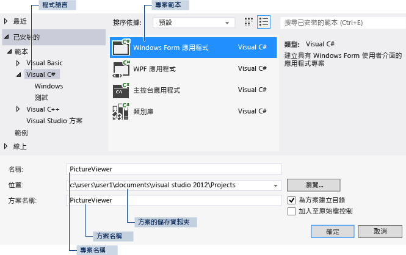

# 步驟 1：建立 Windows Form 應用程式專案
[!INCLUDE[vs2017banner](../code-quality/includes/vs2017banner.md)]

建立圖片檢視器的第一個步驟是建立 Windows Form 應用程式專案。  
  
  如需觀看本主題的影片版本，請參閱[教學課程 1：在 Visual Basic 中建立圖片檢視器 \- 影片 1](http://go.microsoft.com/fwlink/?LinkId=205209) 或[教學課程 1：在 C\# 中建立圖片檢視器 \- 影片 1](http://go.microsoft.com/fwlink/?LinkId=205199)。  這些影片使用舊版 Visual Studio，因此有一些功能表命令以及某些使用者介面項目會有些微差異。  不過，概念和程序在目前 Visual Studio 版本中的運作方式雷同。  
  
### 若要建立 Windows Form 應用程式專案  
  
1.  在功能表列上，選擇 \[**檔案**\]、\[**新增**\]、\[**專案**\]。  對話方塊看起來會像這樣。  
  
       
\[新增專案\] 對話方塊  
  
2.  在 \[**安裝的範本**\] 清單中選擇 \[**Visual C\#**\] 或 \[**Visual Basic**\]。  
  
3.  在範本清單中，選擇 \[**Windows Form 應用程式**\] 圖示。  將新表單命名為 PictureViewer，然後選擇 \[**確定**\] 按鈕。  
  
     Visual Studio 會為您的程式建立方案。  方案會做為您程式所需的全部專案和檔案的容器。  本教學課程稍後將會詳細說明這些詞彙。  
  
4.  下圖顯示您現在會在 Visual Studio 介面中看到的內容。  
  
    > [!NOTE]
    >  您的視窗配置看起來可能不會與下圖完全相同。  確切的視窗配置取決於 Visual Studio 版本、您使用的程式語言及其他因素。  不過，您應該確認三個視窗都已出現。  
  
       
IDE 視窗  
  
     介面中包含三個視窗：主視窗、\[**方案總管**\] 和 \[**屬性**\] 視窗。  
  
     如果遺漏任一個視窗，請還原預設視窗配置，方法是在功能表列上選擇 \[**視窗**\]、\[**重設視窗配置**\]。  您也可以使用功能表命令顯示視窗。  在功能表列上，依序選擇 \[**檢視**\]、\[**屬性視窗**\] 或 \[**方案總管**\]。  如果有任何其他視窗開啟，請選擇視窗右上角的 \[**關閉**\] \(x\) 按鈕將視窗關閉。  
  
5.  圖中會顯示下列視窗 \(從左上角開始，依順時針方向\)：  
  
    -   **主視窗**：您將在這個視窗中進行大部分的工作，例如，使用表單和編輯程式碼。  在圖中，視窗在 \[表單編輯器\] 中顯示表單。  視窗頂端會出現 \[**起始頁**\] 索引標籤和 \[**Form1.cs \[Design\]**\] 索引標籤 \(在 Visual Basic 中，索引標籤名稱的結尾是 .vb，而不是 .cs\)。  
  
    -   **方案總管 視窗**：在這個視窗中，您可以檢視和巡覽至方案中的所有項目。  如果您選擇一個檔案，\[**屬性**\] 視窗的內容會隨著變更。  如果您開啟程式碼檔 \(在 Visual C\# 中結尾 .cs，在 Visual Basic 中則是 .vb\)，程式碼檔或程式碼檔的設計工具隨即出現。  設計工具是一個視覺化介面，您可以將控制項 \(例如按鈕和清單\) 加入該介面中。  Visual Studio 表單的設計工具稱為 Windows Form 設計工具。  
  
    -   **屬性 視窗**：在這個視窗中，您可以變更在其他視窗中所選擇項目的屬性。  例如，如果您選擇 Form1，可以藉由設定 \[**Text**\] 屬性變更其標題，也可以藉由設定 \[**Backcolor**\] 屬性變更背景色彩。  
  
    > [!NOTE]
    >  \[**方案總管**\] 中的第一行會顯示 \[**方案 'PictureViewer' \(1 個專案\)**\]，表示 Visual Studio 已為您建立方案。  方案可以包含多個專案，不過，您將暫時使用只包含一個專案的方案。  
  
6.  在功能表列上，選擇 \[**檔案**\]、\[**全部儲存**\]。  
  
     或者，選擇工具列上的 \[**全部儲存**\] 按鈕，如下圖所示。  
  
       
\[全部儲存\] 工具列按鈕  
  
     Visual Studio 會自動填入資料夾名稱和專案名稱，然後將專案儲存在專案資料夾中。  
  
### 若要繼續或檢視  
  
-   若要移到下一個教學課程步驟，請參閱[步驟 2：執行您的程式](../ide/step-2-run-your-program.md)。  
  
-   若要回到概觀主題，請參閱[教學課程 1：建立圖片檢視器](../ide/tutorial-1-create-a-picture-viewer.md)。