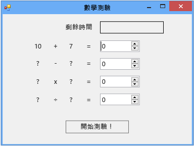

# 步驟 2：建立隨機加法問題
[!INCLUDE[vs2017banner](../code-quality/includes/vs2017banner.md)]

在本教學課程的第二個部分中，您會加入以隨機數字為基礎的數學問題，藉此增加測驗的挑戰性。  您也會建立名為 `StartTheQuiz()` 的方法，這個方法會填入問題並啟動倒數計時器。  稍後在本教學課程中，您將加入減法、乘法和除法問題。  
  
> [!NOTE]
>  這個主題是有關基本程式碼撰寫概念的教學課程系列的一部分。  如需教學課程的概觀，請參閱[教學課程 2：建立計時的數學測驗](../ide/tutorial-2-create-a-timed-math-quiz.md)。  
  
### 若要建立隨機加法問題  
  
1.  在表單設計工具中選擇表單 \(Form1\)。  
  
2.  在功能表列上選擇 \[**檢視**\]、\[**程式碼**\]。  
  
     依您使用的程式設計語言而定，會出現 Form1.cs 或 Form1.vb，如此您就可以檢視表單的後置程式碼。  
  
3.  在靠近程式碼頂端的位置加入 `new` 陳述式建立 `Random` 物件，如下所示。  
  
     [!code-cs[VbExpressTutorial3Step2#1](../ide/codesnippet/CSharp/step-2-create-a-random-addition-problem_1.cs)]
     [!code-vb[VbExpressTutorial3Step2#1](../ide/codesnippet/VisualBasic/step-2-create-a-random-addition-problem_1.vb)]  
  
     您已將 `Random` 物件加入至表單，並將物件命名為 **randomizer**。  
  
     `Random` 稱為物件。  您以前或許聽過這個名詞，在接下來的教學課程中，您將進一步了解它對程式設計的意義。  現在只要記得您可以使用 `new` 陳述式建立按鈕、標籤、面板、OpenFileDialogs、ColorDialogs、SoundPlayers、Randoms，甚至表單，而這些項目都稱為物件。  當您執行程式時，表單就會啟動，而表單的後置程式碼會建立 `Random` 物件並將它命名為 **randomizer**。  
  
     您很快就要建置檢查答案的方法，因此您的測驗必須使用變數來儲存為每個問題產生的隨機數字。  請參閱 [Variables](/dotnet/visual-basic/programming-guide/language-features/variables/index)或 [類型](/dotnet/csharp/programming-guide/types/index)。  若要正確使用變數，您必須宣告變數，這表示將它們的名稱和資料類型列出。  
  
4.  將兩個整數變數加入至表單，並命名為 **addend1** 和 **addend2**。  
  
    > [!NOTE]
    >  整數變數在 C\# 中稱為 int，在 Visual Basic 中則稱為 Integer。  這類變數會儲存從 \-2147483648 到 2147483647 的正數或負數，但是只能儲存整數，不包括小數。  
  
     您可以使用類似的語法加入整數變數，就像加入 `Random` 物件一般，如下列程式碼所示。  
  
     [!code-cs[VbExpressTutorial3Step2#2](../ide/codesnippet/CSharp/step-2-create-a-random-addition-problem_2.cs)]
     [!code-vb[VbExpressTutorial3Step2#2](../ide/codesnippet/VisualBasic/step-2-create-a-random-addition-problem_2.vb)]  
  
5.  加入名為 `StartTheQuiz()` 的方法，這個方法會使用 `Random` 物件的 `Next()` 方法在標籤中顯示隨機數字。  `StartTheQuiz()` 最後會填入所有問題，然後啟動計時器，所以請加入註解。  函式看起來應該如下所示。  
  
     [!code-cs[VbExpressTutorial3Step2#3](../ide/codesnippet/CSharp/step-2-create-a-random-addition-problem_3.cs)]
     [!code-vb[VbExpressTutorial3Step2#3](../ide/codesnippet/VisualBasic/step-2-create-a-random-addition-problem_3.vb)]  
  
     請注意，您在程式碼中的 randomizer 後面輸入點 \(.\) 時，\[IntelliSense\] 視窗便會開啟，並顯示可以呼叫的所有 `Random` 物件的方法。  例如，IntelliSense 會列出 `Next()` 方法，如下所示。  
  
       
Next 方法  
  
     您在物件後面輸入一個點時，IntelliSense 會顯示物件的成員清單，例如屬性、方法和事件。  
  
    > [!NOTE]
    >  當您使用 `Next()` 方法搭配 `Random` 物件時 \(例如，當您呼叫 `randomizer.Next(50)` 時\)，會得到小於 50 \(從 0 到 49\) 的隨機數字。  在這個範例中，您呼叫了 `randomizer.Next(51)`。  您使用 51 而不是 50，如此這兩個數字就會相加並得出從 0 到 100 的答案。  如果您將 50 傳給 `Next()` 方法，它會選擇 0 至 49 的數字，所以可能的最大答案是 98，而不是 100。  當方法中的前兩個陳述式執行之後，`addend1` 和 `addend2` 這兩個整數變數會各自保存一個從 0 至 50 的隨機數字。  這個螢幕擷取畫面會顯示 Visual C\# 程式碼，不過，IntelliSense 對於 Visual Basic 運作的方式一樣。  
  
     仔細查看這些陳述式。  
  
     [!code-cs[VbExpressTutorial3Step2#18](../ide/codesnippet/CSharp/step-2-create-a-random-addition-problem_4.cs)]
     [!code-vb[VbExpressTutorial3Step2#18](../ide/codesnippet/VisualBasic/step-2-create-a-random-addition-problem_4.vb)]  
  
     陳述式會設定 \[**plusLeftLabel**\] 和 \[**plusRightLabel**\] 的 \[**Text**\] 屬性，讓它們顯示兩個隨機數字。  您必須使用整數的 `ToString()` 方法將數字轉換為文字。在程式設計中，字串表示文字。  Label 控制項只會顯示文字，不會顯示數字。  
  
6.  在設計視窗中，按兩下 \[**開始**\] 按鈕，或是選擇該按鈕，然後選擇 Enter 鍵。  
  
     當受測者選擇這個按鈕時，測驗就會開始，而您剛加入了 Click 事件處理常式來實作該行為。  
  
7.  加入下面兩個陳述式。  
  
     [!code-cs[VbExpressTutorial3Step2#4](../ide/codesnippet/CSharp/step-2-create-a-random-addition-problem_5.cs)]
     [!code-vb[VbExpressTutorial3Step2#4](../ide/codesnippet/VisualBasic/step-2-create-a-random-addition-problem_5.vb)]  
  
     第一個陳述式會呼叫新的 `StartTheQuiz()` 方法。  第二個陳述式會將 **startButton** 控制項的 \[**Enabled**\] 屬性設定為 \[**False**\]，如此受測者就無法在測驗期間選擇該按鈕。  
  
8.  儲存您的程式碼，執行程式碼，然後選擇 \[**開始**\] 按鈕。  
  
     隨機加法問題就會出現，如下圖所示。  
  
       
隨機加法問題  
  
     在本教學課程的下一個步驟中，您將加入總和。  
  
### 若要繼續或檢視  
  
-   若要移到下一個教學課程步驟，請參閱[步驟 3：加入倒數計時器](../Topic/Step%203:%20Add%20a%20Countdown%20Timer.md)。  
  
-   若要回到上一個教學課程步驟，請參閱[步驟 1：建立專案並將標籤加入至表單](../ide/step-1-create-a-project-and-add-labels-to-your-form.md)。