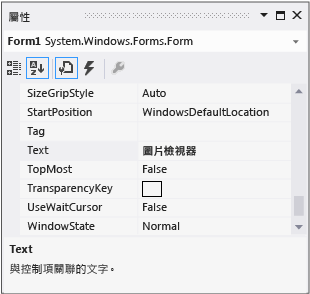

# 步驟 3：設定您的表單屬性
[!INCLUDE[vs2017banner](../code-quality/includes/vs2017banner.md)]

接下來，您要使用 \[**屬性**\] 視窗變更表單的外觀。  
  
  如需觀看本主題的影片版本，請參閱[教學課程 1：在 Visual Basic 中建立圖片檢視器 \- 影片 1](http://go.microsoft.com/fwlink/?LinkId=205209) 或[教學課程 1：在 C\# 中建立圖片檢視器 \- 影片 1](http://go.microsoft.com/fwlink/?LinkId=205199)。  這些影片使用舊版 Visual Studio，因此有一些功能表命令以及某些使用者介面項目會有些微差異。  不過，概念和程序在目前 Visual Studio 版本中的運作方式雷同。  
  
### 若要設定您的表單屬性  
  
1.  確定您在查看 \[Windows Form 設計工具\]。  在 Visual Studio 整合式開發環境 \(IDE\) 中，選擇 \[**Form1.cs \[設計\]**\] 索引標籤 \(或 Visual Basic 中的 \[**Form1.vb \[設計\]**\] 索引標籤\)。  
  
2.  選擇表單 \[**Form1**\] 內的任何位置來選取它。  查看 \[**屬性**\] 視窗，現在應該會顯示表單的屬性。  表單有各種屬性。  例如，您可以設定前景和背景色彩、表單頂端顯示的標題文字、表單的大小和其他屬性。  
  
    > [!NOTE]
    >  如果 \[**屬性**\] 視窗沒有出現，請選擇工具列上的 \[**停止偵錯**\] 方形按鈕，或直接關閉視窗以停止程式。  如果程式停止，而您仍然看不到 \[**屬性**\] 視窗，請在功能表列上選擇 \[**檢視**\]、\[**屬性視窗**\]。  
  
3.  選取表單之後，在 \[**屬性**\] 視窗中 \[**文字**\] 屬性。  根據清單排序的方式，您可能需要向下捲動。  選擇 \[**文字**\]，輸入 Picture Viewer，然後選擇 ENTER。表單現在會在標題列中顯示文字 \[**Picture Viewer**\]，而 \[**屬性**\] 視窗應該如下列圖片所示。  
  
       
屬性視窗  
  
    > [!NOTE]
    >  屬性可以依 \[分類\] 或 \[字母順序\] 檢視來排序。  您可以使用 \[**屬性**\] 視窗上的按鈕，在這兩個檢視之間切換。  在本教學課程中，透過 \[字母順序\] 檢視比較容易找到屬性。  
  
4.  返回 \[Windows Form 設計工具\]。  選擇表單的右下方拖曳控點，即表單右下方的白色小方塊，如下所示。  
  
       
拖曳控點  
  
     拖曳控點來調整表單大小，使表單變得較寬且稍微高一些。  
  
5.  查看 \[**屬性**\] 視窗，並注意 \[**Size**\] 屬性已變更。  每當您調整表單的大小時，\[**Size**\] 屬性就會變更。  嘗試拖曳表單的控點，將其調整為大約 550, 350 \(不需要很精確\) 的表單大小，這樣應該很適合此專案。  或者，您可以直接在 \[**大小**\] 屬性中輸入值，然後選擇 ENTER 鍵。  
  
6.  重新執行程式。  請記住，您可以使用下列任何一個方法執行程式。  
  
    -   選擇 **F5** 鍵。  
  
    -   在功能表列上，選擇 \[**偵錯**\]、\[**開始偵錯**\]。  
  
    -   在工具列上選擇 **\[開始偵錯\]** 按鈕，如下所示。  
  
           
啟動偵錯工具列按鈕  
  
     如同先前一樣，IDE 會建置並執行您的程式，且視窗隨即出現。  
  
7.  在繼續下一個步驟之前，請停止程式，因為當程式執行時，IDE 不會允許您變更程式。  請記住，您可以使用下列任何一個方法停止程式。  
  
    -   在工具列上選擇 \[**停止偵錯**\] 按鈕。  
  
    -   在功能表列上，選擇 \[**偵錯**\]、\[**停止偵錯**\]。  
  
    -   選擇 \[**Form1**\] 視窗右上角的 X 按鈕。  
  
### 若要繼續或檢視  
  
-   若要移到下一個教學課程步驟，請參閱[步驟 4：使用 TableLayoutPanel 控制項來配置您的表單](../ide/step-4-lay-out-your-form-with-a-tablelayoutpanel-control.md)。  
  
-   若要回到上一個教學課程步驟，請參閱[步驟 2：執行您的程式](../ide/step-2-run-your-program.md)。