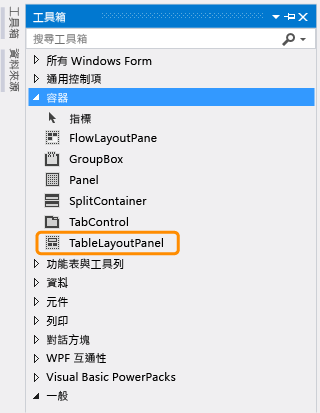
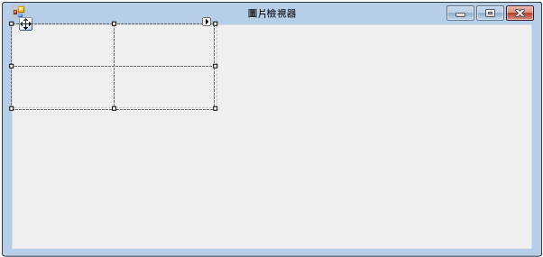
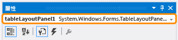
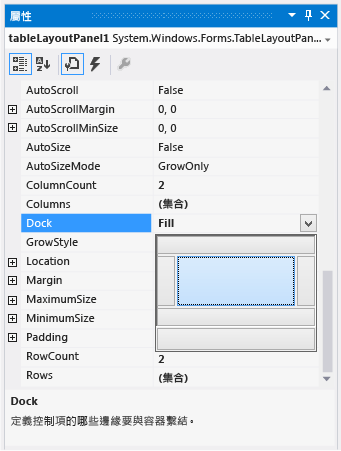
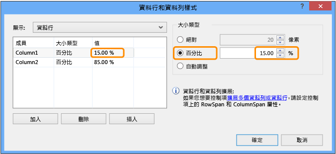
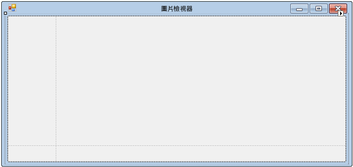

# 步驟 4：使用 TableLayoutPanel 控制項來配置您的表單
[!INCLUDE[vs2017banner](../code-quality/includes/vs2017banner.md)]

在這個步驟中，您會將 `TableLayoutPanel` 控制項加入至表單。  TableLayoutPanel 有助於正確對齊稍後加入至表單中的控制項。  
  
  如需觀看本主題的影片版本，請參閱[教學課程 1：在 Visual Basic 中建立圖片檢視器 \- 影片 2](http://go.microsoft.com/fwlink/?LinkId=205211) 或[教學課程 1：在 C\# 中建立圖片檢視器 \- 影片 2](http://go.microsoft.com/fwlink/?LinkId=205200)。  這些影片使用舊版 Visual Studio，因此有一些功能表命令以及某些使用者介面項目會有些微差異。  不過，概念和程序在目前 Visual Studio 版本中的運作方式雷同。  
  
### 若要使用 TableLayoutPanel 控制項來配置您的表單  
  
1.  在 Visual Studio IDE 左邊找出 \[**工具箱**\] 索引標籤。  選擇 \[**工具箱**\] 索引標籤，然後，工具箱隨即出現 \(或者，在功能表列上選擇 \[**檢視**\]、\[**工具箱**\]\)。  
  
2.  選擇 \[**容器**\] 群組旁邊的小三角形符號開啟它，如下列圖片所示。  
  
       
容器群組  
  
3.  您可以將控制項 \(例如按鈕、核取方塊和標籤\) 加入至表單。  按兩下 \[工具箱\] 中的 `TableLayoutPanel` 控制項。\(或者，可以從工具箱將控制項拖曳到表單\)。這樣做時，IDE 會將 `TableLayoutPanel` 控制項加入至表單，如下列圖片所示。  
  
       
TableLayoutPanel 控制項  
  
    > [!NOTE]
    >  加入 TableLayoutPanel 之後，如果表單內出現標題為 \[**TableLayoutPanel 工作**\] 的視窗，請選擇表單內的任何位置以關閉它。  稍後在教學課程中，您將深入了解此視窗。  
  
     請注意 \[工具箱\] 在您選擇索引標籤時會展開以包含您的表單，當您選擇其外部任何地方時就會關閉。  這就是 IDE 的自動隱藏功能。  您可以藉著選擇視窗右上角的圖釘圖示，開啟或關閉任何視窗的此功能，以便切換自動隱藏並鎖定視窗。  圖釘圖示顯示如下。  
  
       
圖釘圖示  
  
4.  選擇 \[**TableLayoutPanel**\] 以確定選取它。  您可以查看 \[**屬性**\] 視窗頂端的下拉式清單，以驗證已選取哪一個控制項，如下列圖片所示。  
  
       
顯示 TableLayoutPanel 控制項的屬性視窗  
  
5.  在 \[**屬性**\] 視窗的工具列上選擇 \[**字母順序**\] 按鈕。  這會造成 \[**屬性**\] 視窗中的屬性清單以字母順序顯示，可讓您輕鬆地找到本教學課程中的屬性。  
  
6.  控制項選擇器是 \[**屬性**\] 視窗頂端的下拉式清單。  在此範例中，它顯示已選取一個稱為 `tableLayoutPanel1` 的控制項。  您可以從 \[Windows Form 設計工具\] 或從控制項選取器中選擇區域，以選取控制項。  現在已選取 `TableLayoutPanel`，請尋找 \[**停駐**\] 屬性並選擇 \[**停駐**\]，此屬性應該設定為 \[**無**\]。  請注意，值旁邊會出現下拉箭號。  選擇箭號，然後選取 \[**填滿**\] 按鈕 \(中間的大型按鈕\)，如下列圖片所示。  
  
       
已選取填滿的屬性視窗  
  
     Visual Studio 中的「*停駐*」\(Docking\) 是指在 IDE 中，視窗附加至另一個視窗或區域。  例如，\[屬性\] 視窗可以浮動，也就是未連接，可在 Visual Studio 內自由浮動，也可以固定於 \[**方案總管**\]。  
  
7.  將 TableLayoutPanel \[**Dock**\] 屬性設定為 \[**Fill**\] 之後，面板會填滿整個表單。  如果您再次調整表單的大小，TableLayoutPanel 會停駐不動，並調整大小來填滿表單。  
  
    > [!NOTE]
    >  TableLayoutPanel 就像 Microsoft Office Word 中的表格 \(具有列和欄\)，且單一儲存格可以跨越多個列和欄。  每一個儲存格中放置一個控制項 \(例如按鈕、核取方塊或標籤\)。  您的 TableLayoutPanel 將具有一個橫跨整個上方資料列的 `PictureBox` 控制項、在左下方儲存格有一個 `CheckBox` 控制項，以及在右下方儲存格中則有四個 `Button` 控制項。  
  
8.  目前，TableLayoutPanel 具有兩個大小相等的資料列和兩個大小相等的資料行。  您需要對它們調整大小，使上方資料列和右邊資料行都變得更大。  在 \[Windows Form 設計工具\] 中，選取 \[TableLayoutPanel\]。  右上角有一個黑色的小型三角形按鈕，如下所示。  
  
       
三角形按鈕  
  
     此按鈕表示控制項具有可協助您自動設定其屬性的工作。  
  
9. 選擇三角形以顯示控制項的工作清單，如下列圖片所示。  
  
       
TableLayoutPanel 工作  
  
10. 選擇 \[**編輯資料列與資料行**\] 工作以顯示 \[**資料行和資料列樣式**\] 視窗。  選擇 \[**資料行1**\]，並將其大小設定為 15% \(藉由確定已選取 \[**百分比**\] 按鈕，並在 \[**百分比**\] 方塊中輸入 `15`\) \(這是一個 `NumericUpDown` 控制項，在稍後的教學課程中會用到\)。選擇 \[**資料行2**\]，並設定為 85%。  還不要選擇 \[**確定**\] 按鈕，因為視窗將會關閉 \(但如果這樣做，您還是可以使用工作清單來重新開啟視窗\)。  
  
       
TableLayoutPanel 資料行和資料列樣式  
  
11. 從視窗頂端的 \[**顯示**\] 下拉式清單中，選擇 \[**列**\]。  將 \[**Row1**\] 設定為 90%，將 \[**Row2**\] 設定為 10%。  
  
12. 選擇 \[**確定**\] 按鈕。  TableLayoutPanel 現在應該具有大型的上方資料列、小型的下方資料列和大型的右邊資料行。  您可以在表單中選取 tableLayoutPanel1 並拖曳資料列和資料行的框線，來調整 TableLayoutPanel 中的資料列和資料行大小。  
  
       
Form1，包含已調整大小的 TableLayoutPanel  
  
### 若要繼續或檢視  
  
-   若要移到下一個教學課程步驟，請參閱[步驟 5：將控制項加入至您的表單](../Topic/Step%205:%20Add%20Controls%20to%20Your%20Form.md)。  
  
-   若要回到上一個教學課程步驟，請參閱[步驟 3：設定您的表單屬性](../ide/step-3-set-your-form-properties.md)。