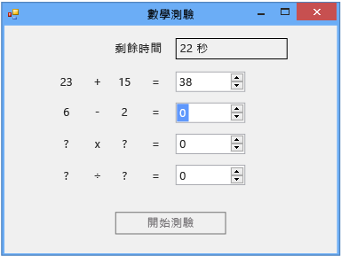

# 步驟 6：加入減法問題
[!INCLUDE[vs2017banner](../code-quality/includes/vs2017banner.md)]

在本教學課程的第六個部分中，您將加入減法問題並學習如何執行下列工作：  
  
-   儲存減法的值。  
  
-   產生問題的隨機數字 \(並確定答案介於 0 和 100 之間\)。  
  
-   更新用來檢查答案的方法，如此該方法就會一併檢查新的減法問題。  
  
-   更新計時器的 Tick 事件處理常式，讓事件處理常式在時間結束時填入正確答案。  
  
### 若要加入減法問題  
  
1.  將減法問題的兩個整數變數加入至表單中，並且放置在加法問題的整數變數與計時器之間。  程式碼看起來應該如下所示。  
  
     [!code-vb[VbExpressTutorial3Step5_6#12](../ide/codesnippet/VisualBasic/step-6-add-a-subtraction-problem_1.vb)]
     [!code-cs[VbExpressTutorial3Step5_6#12](../ide/codesnippet/CSharp/step-6-add-a-subtraction-problem_1.cs)]  
  
     新的整數變數名稱 **minuend** 和 **subtrahend** 並不是程式設計詞彙。  這兩個名稱是算術中的減數 \(subtrahend\) 和從中減去減數之被減數 \(minuend\) 的慣用名稱。  差等於被減數減去減數。  您可以使用其他名稱，因為您程式中的變數、控制項、元件或方法不需要特定名稱。  您必須遵循規則 \(例如，名稱開頭不可使用數字\)，但是通常可以使用 x1、x2、x3 或 x4 這類名稱。  不過，一般名稱可能使程式碼不易閱讀，而且幾乎難以追蹤問題。  為了讓變數名稱保持唯一且實用，稍後在本教學課程中，您將在乘法 \(被乘數 × 乘數 \= 乘積\) 和除法 \(被除數 ÷ 除數 \= 商數\) 中使用慣用名稱。  
  
     接著您將修改 `StartTheQuiz()` 方法，為減法問題提供隨機值。  
  
2.  在 "Fill in the subtraction problem" 註解後面加上下列程式碼。  
  
     [!code-vb[VbExpressTutorial3Step5_6#13](../ide/codesnippet/VisualBasic/step-6-add-a-subtraction-problem_2.vb)]
     [!code-cs[VbExpressTutorial3Step5_6#13](../ide/codesnippet/CSharp/step-6-add-a-subtraction-problem_2.cs)]  
  
     為避免減法問題得出負數答案，這個程式碼會以稍微不同於加法問題的方式使用 `Random` 類別的 `Next()` 方法。  當您為 `Next()` 方法指定兩個值時，它會挑選一個大於或等於第一個值且小於第二個值的隨機數字。  下列程式碼會從 1 至 100 選擇一個隨機數字，並將它儲存到被減數變數中。  
  
     [!code-vb[VbExpressTutorial3Step5_6#21](../ide/codesnippet/VisualBasic/step-6-add-a-subtraction-problem_3.vb)]
     [!code-cs[VbExpressTutorial3Step5_6#21](../ide/codesnippet/CSharp/step-6-add-a-subtraction-problem_3.cs)]  
  
     您可以透過多種方式呼叫 `Random` 類別的 `Next()` 方法，也就是您在本教學課程前段中命名為 "randomizer" 的方法。  能夠以多種方式呼叫的方法稱為「多載」\(Overload\)，您可以使用 IntelliSense 來了解這些方法。  再看一次 `Next()` 方法的 \[IntelliSense\] 視窗工具提示。  
  
       
Intellisense 視窗工具提示  
  
     工具提示會顯示 \[**\(\+ 2 多載\)**\]，也就是說，您可以透過另外兩種方式呼叫 `Next()` 方法。  多載包含不同數目或類型的引數，因此彼此之間的運作方式會稍有不同。  例如，某個方法可能會接受單一整數引數，而它的其中一個多載可能會接受一個整數和一個字串。  您可以依據需要的功能選擇正確的多載。  您將程式碼加入至 `StartTheQuiz()` 方法時，只要輸入 `randomizer.Next(`，\[IntelliSense\] 視窗就會顯示詳細資訊。  選擇向上鍵和向下鍵，就可以循環瀏覽這些多載，如下圖所示。  
  
       
IntelliSense 中 Next\(\) 方法的多載  
  
     在這個案例中，您想要選擇最後一個多載，因為這樣就可以指定最小值和最大值。  
  
3.  修改 `CheckTheAnswer()` 方法來檢查正確的減法答案。  
  
     [!code-vb[VbExpressTutorial3Step5_6#14](../ide/codesnippet/VisualBasic/step-6-add-a-subtraction-problem_4.vb)]
     [!code-cs[VbExpressTutorial3Step5_6#14](../ide/codesnippet/CSharp/step-6-add-a-subtraction-problem_4.cs)]  
  
     在 Visual C\# 中，`&&` 是`logical and` 運算子。  在 Visual Basic 中，對等的運算子是 `AndAlso`。  這些運算子表示：「如果 addend1 和 addend2 的總和等於 NumericUpDown 的總和值，以及如果 minuend 減 subtrahend 等於 NumericUpDown 的差值」。只有在加法和減法問題的答案都正確時，`CheckTheAnswer()` 方法才會傳回 `true`。  
  
4.  將計時器之 Tick 事件處理常式的最後一部分取代為下列程式碼，讓事件處理常式在時間結束時填入正確答案。  
  
     [!code-vb[VbExpressTutorial3Step5_6#22](../ide/codesnippet/VisualBasic/step-6-add-a-subtraction-problem_5.vb)]
     [!code-cs[VbExpressTutorial3Step5_6#22](../ide/codesnippet/CSharp/step-6-add-a-subtraction-problem_5.cs)]  
  
5.  儲存並執行程式碼。  
  
     您的程式包括減法問題，如下圖所示。  
  
       
減法問題的數學測驗  
  
### 若要繼續或檢視  
  
-   若要移到下一個教學課程步驟，請參閱[步驟 7：加入乘法和除法問題](../Topic/Step%207:%20Add%20Multiplication%20and%20Division%20Problems.md)。  
  
-   若要回到上一個教學課程步驟，請參閱[步驟 5：加入 NumericUpDown 控制項的 Enter 事件處理常式](../Topic/Step%205:%20Add%20Enter%20Event%20Handlers%20for%20the%20NumericUpDown%20Controls.md)。