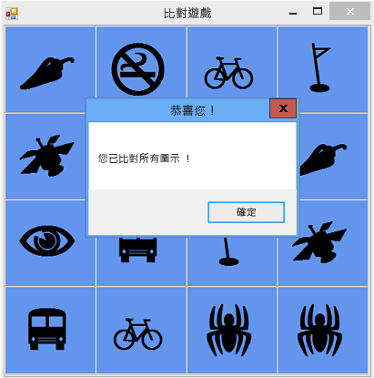

# 步驟 8：加入方法以驗證玩家是否贏了
[!INCLUDE[vs2017banner](../code-quality/includes/vs2017banner.md)]

您已建立一個有趣的遊戲，但它需要額外的項目才能完成。  這個遊戲應該在玩家獲勝時結束，因此您需要加入 `CheckForWinner()` 方法以驗證玩家是否贏了。  
  
### 若要加入方法來驗證玩家是否贏了  
  
1.  將 `CheckForWinner()` 方法加入至您的程式碼下方 \(位於 `timer1_Tick()` 事件處理常式下方\)，如下列程式碼所示。  
  
     [!code-cs[VbExpressTutorial4Step8#10](../ide/codesnippet/CSharp/step-8-add-a-method-to-verify-whether-the-player-won_1.cs)]
     [!code-vb[VbExpressTutorial4Step8#10](../ide/codesnippet/VisualBasic/step-8-add-a-method-to-verify-whether-the-player-won_1.vb)]  
  
     這個方法會在 Visual C\# 中使用另一個 `foreach` 迴圈，在 Visual Basic 中使用 `For Each` 迴圈，以通過 TableLayoutPanel 中的每一個標籤。  它會使用相等運算子 \(在 Visual C\# 中為 `==`，在 Visual Basic 中為 `=`\) 來檢查每一個標籤的圖示色彩，以驗證它是否符合背景。  如果色彩符合，則圖示會維持不可見狀態，而且玩家尚未配對剩餘的所有圖示。  在這種情況下，程式會使用 `return` 陳述式略過此方法的其餘部分。  如果迴圈通過所有的標籤，但未執行 `return` 陳述式，這表示已配對表單上的所有的圖示。  程式會顯示 MessageBox 恭喜玩家獲勝的播放程式，然後呼叫表單的 `Close()` 方法以結束遊戲。  
  
2.  接下來，讓標籤的 Click 事件處理常式呼叫新的 `CheckForWinner()` 方法。  確定您的程式會在顯示玩家所選擇的第二個圖示之後立即檢查贏家。  尋找您在其中設定第二個已選擇圖示之色彩的程式碼行，然後立即呼叫 `CheckForWinner()` 方法，如下列程式碼所示。  
  
     [!code-cs[VbExpressTutorial4Step8#11](../ide/codesnippet/CSharp/step-8-add-a-method-to-verify-whether-the-player-won_2.cs)]
     [!code-vb[VbExpressTutorial4Step8#11](../ide/codesnippet/VisualBasic/step-8-add-a-method-to-verify-whether-the-player-won_2.vb)]  
  
3.  儲存並執行程式。  玩遊戲並將所有的圖示配對。  當您贏了之後，程式會顯示恭喜 MessageBox \(如下列圖片所示\)，然後關閉此方塊。  
  
       
比對遊戲和 MessageBox  
  
### 若要繼續或檢視  
  
-   若要移到下一個教學課程步驟，請參閱[步驟 9：嘗試其他功能](../ide/step-9-try-other-features.md)。  
  
-   若要回到上一個教學課程步驟，請參閱[步驟 7：讓配對保持可見](../Topic/Step%207:%20Keep%20Pairs%20Visible.md)。