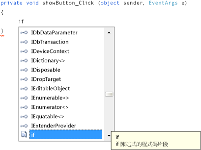

# 步驟 8：為顯示圖片按鈕事件處理常式撰寫程式碼
[!INCLUDE[vs2017banner](../code-quality/includes/vs2017banner.md)]

在這個步驟中，您會將 \[**顯示圖片**\] 按鈕變成如下的運作方式：  
  
-   當使用者選擇該按鈕時，程式會開啟 \[**開啟檔案**\] 對話方塊。  
  
-   如果使用者開啟圖片檔案，程式會在 PictureBox 中顯示該圖片。  
  
 IDE 提供一個功能強大的工具，稱為 IntelliSense，可幫助您撰寫程式碼。  當您輸入程式碼時，IDE 會根據您輸入的局部文字，開啟方塊來提供建議的完整程式碼。  它會嘗試判斷您接下來想要怎麼做，然後自動跳至您從清單中選擇的最後一個項目。  您可以利用向上或向下箭號在清單中移動，也可以繼續輸入字母來縮小選項範圍。  當您看到想要的選項時，選擇 TAB 鍵加以選取。  或者，如果不需要的話，您也可以忽略建議。  
  
  如需觀看本主題的影片版本，請參閱[教學課程 1：在 Visual Basic 中建立圖片檢視器 \- 影片 4](http://go.microsoft.com/fwlink/?LinkId=205215) 或[教學課程 1：在 C\# 中建立圖片檢視器 \- 影片 4](http://go.microsoft.com/fwlink/?LinkId=205203)。  這些影片使用舊版 Visual Studio，因此有一些功能表命令以及某些使用者介面項目會有些微差異。  不過，概念和程序在目前 Visual Studio 版本中的運作方式雷同。  
  
### 若要為顯示圖片按鈕事件處理常式撰寫程式碼  
  
1.  移至 \[Windows Form 設計工具\]，按兩下 \[**顯示圖片**\] 按鈕。  IDE 會立即移至程式碼設計工具，並將游標移至您先前加入的 `showButton_Click()` 方法內。  
  
2.  在兩個大括號 { } 中間的空白行上輸入 `i` \(在 Visual Basic 中，請在 Private Sub… 和 End Sub 中間的空白行上輸入\)。 \[**IntelliSense**\] 視窗隨即開啟，如下列圖片所示。  
  
       
包含 Visual C\# 程式碼的 IntelliSense  
  
3.  \[**IntelliSense**\] 視窗應該會反白顯示 **if** 這個字   \(如果沒有，請輸入小寫 `f`，這樣就會反白顯示\)。 請注意 \[*IntelliSense*\] 視窗旁邊很小的「**工具提示**」\(Tooltip\) 方塊，如何顯示描述 \[**if 陳述式的程式碼片段**\]。  \(在 Visual Basic 中，該工具提示也會指出這是程式碼片段，只是說法稍微不同\)。 您要使用該程式碼片段，因此選取 TAB 鍵將 **if** 插入至程式碼。  然後再次選擇 TAB 鍵，使用 **if** 程式碼片段   \(如果您選擇其他位置造成 \[**IntelliSense**\] 視窗消失，請按退格鍵刪除 **i** 並重新輸入，\[**IntelliSense**\] 視窗就會再次開啟\)。  
  
       
Visual C\# 程式碼  
  
4.  接下來，您使用 IntelliSense 輸入更多程式碼，以開啟 \[**開啟檔案**\] 對話方塊。  如果使用者選擇 \[**確定**\] 按鈕，則 PictureBox 會載入使用者選取的檔案。  下列步驟顯示如何輸入程式碼，雖然步驟很多，但也只是輸入幾個按鍵而已。  
  
    1.  從程式碼片段中選取的文字 **true** 開始。  輸入 `op` 覆寫它   \(在 Visual Basic 中，開頭是大寫，因此請輸入 `Op`\)。  
  
    2.  \[**IntelliSense**\] 視窗隨即開啟並顯示 \[**openFileDialog1**\]。  選擇 TAB 鍵加以選取。  \(在 Visual Basic 中，開頭是大寫，因此您會看到 \[**OpenFileDialog1**\]。  確定已選取 \[**OpenFileDialog1**\]\)。  
  
         若要深入了解 `OpenFileDialog`，請參閱 [OpenFileDialog](http://msdn.microsoft.com/library/system.windows.forms.openfiledialog.aspx)。  
  
    3.  輸入句號 \(`.`\) \(許多程式設計人員會說是一個點\)。 因為您在 \[**openFileDialog1**\] 後面輸入一個點，\[**IntelliSense**\] 視窗會隨即開啟並填入 **OpenFileDialog** 元件的所有屬性和方法。  當您在 \[Windows Form 設計工具\] 中選擇該元件時，\[**屬性**\] 視窗中也會顯示相同的屬性。  您也可以選擇指示元件執行動作 \(例如開啟對話方塊\) 的方法。  
  
        > [!NOTE]
        >  \[**IntelliSense**\] 視窗可以同時顯示屬性和方法。  若要判斷哪些顯示，請檢視 \[**IntelliSense**\] 視窗中每個項目左方的圖示。  您在每個方法旁邊會看到方塊圖片，而在每個屬性旁邊會看到扳手 \(或扳鉗\) 的圖片。  每一個事件旁邊也會出現閃電圖示。  這些圖片如下所示。  
  
           
方法圖示  
  
           
屬性圖示  
  
           
事件圖示  
  
    4.  開始輸入 `ShowDialog` \(大小寫對 IntelliSense 而言不重要\)。  `ShowDialog()` 方法會顯示 \[**開啟檔案**\] 對話方塊。  視窗反白顯示 **ShowDialog** 後，請選擇 TAB 鍵。  您也可以反白顯示「ShowDialog」和選取 F1 鍵取得其說明。  
  
         若要深入了解 `ShowDialog()` 方法，請參閱 [ShowDialog 方法](http://msdn.microsoft.com/library/c7ykbedk.aspx)。  
  
    5.  當您在控制項或元件上使用方法時 \(稱為「*呼叫方法*」\(Calling A Method\)\)，您需要加上括號。  因此，在 `ShowDialog` 中緊接 "g" 之後輸入左括號和右括號：`()` 現在這應該看起來像 "openFileDialog1.ShowDialog\(\)"。  
  
        > [!NOTE]
        >  方法在任何程式中都很重要，本教學課程已展示幾種使用方法的做法。  您可以呼叫元件的方法來指示元件執行動作，就像您呼叫 **OpenFileDialog** 元件的 `ShowDialog()` 方法一樣。  您可以建立自己的方法來指示程式執行動作，例如您正在建置名為 `showButton_Click()` 的方法，當使用者選擇按鈕時，就會開啟對話方塊和圖片。  
  
    6.  在 Visual C\# 中，加入空格，再加入兩個等號 \(`==`\)。  在 Visual Basic 中，加入空格，再使用單一等號 \(`=`\)   \(Visual C\# 和 Visual Basic 使用不同的相等運算子\)。  
  
    7.  加入另一個空格。  這樣做之後，另一個 \[**IntelliSense**\] 視窗會隨即開啟。  開始輸入 `DialogResult`，並選擇 TAB 鍵將其加入。  
  
        > [!NOTE]
        >  當您撰寫程式碼來呼叫方法時，有時會傳回一個值。  在這個案例中，**OpenFileDialog** 元件的 `ShowDialog()` 方法會傳回 DialogResult 值。  DialogResult 是特殊值，可讓您得知對話方塊中發生的情形。  使用者在 **OpenFileDialog** 元件中可能選擇 \[**確定**\] 或 \[**取消**\]，所以 `ShowDialog()` 方法會傳回 DialogResult.OK 或 DialogResult.Cancel。  
  
    8.  輸入一個點來開啟 DialogResult 值 \[**IntelliSense**\] 視窗。  輸入字母 `O`，然後選擇 TAB 鍵插入 **OK**。  
  
         若要深入了解 `DialogResult`，請參閱 [DialogResult](http://msdn.microsoft.com/library/system.windows.forms.dialogresult.aspx)。  
  
        > [!NOTE]
        >  第一行程式碼應該就完成。  在 Visual C\# 中，程式碼應該如下所示。  
        >   
        >  `if (openFileDialog1.ShowDialog() == DialogResult.OK)`  
        >   
        >  在 Visual Basic 中，程式碼應該如下所示。  
        >   
        >  `If OpenFileDialog1.ShowDialog() = DialogResult.OK Then`  
  
    9. 現在再加入另一行程式碼。  您可以直接輸入它 \(或複製並貼上\)，但建議使用 IntelliSense 來加入它。  只要愈熟悉 IntelliSense，您自己撰寫程式碼的速度就會愈快。  最終的 `showButton_Click()` 方法看起來如下。  \(選擇 \[**VB**\] 索引標籤以檢視 Visual Basic 版本的程式碼\)。  
  
         [!code-cs[VbExpressTutorial1Step8#1](../ide/codesnippet/CSharp/step-8-write-code-for-the-show-a-picture-button-event-handler_1.cs)]
         [!code-vb[VbExpressTutorial1Step8#1](../ide/codesnippet/VisualBasic/step-8-write-code-for-the-show-a-picture-button-event-handler_1.vb)]  
  
### 若要繼續或檢視  
  
-   若要移到下一個教學課程步驟，請參閱[步驟 9：檢閱、註解和測試您的程式碼](../ide/step-9-review-comment-and-test-your-code.md)。  
  
-   若要返回上一個教學課程步驟，請參閱[步驟 7：將對話方塊元件加入至您的表單](../ide/step-7-add-dialog-components-to-your-form.md)。