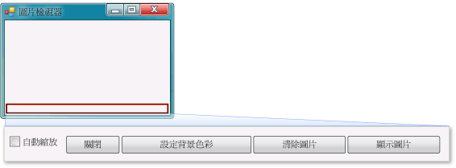

# 步驟 9：檢閱、註解和測試您的程式碼
[!INCLUDE[vs2017banner](../code-quality/includes/vs2017banner.md)]

您接下來要將註解加入至程式碼。  註解是一種不會變更程式運作方式的附註。  它可讓讀取程式碼的人容易了解您的程式碼有何用途。  將註解加入至您的程式碼是個好習慣。  在 Visual C\# 中，兩個斜線 \(\/\/\) 可將一行標示成註解。  在 Visual Basic 中，使用單引號 \('\) 將一行標示成註解。  加入註解後，請測試程式。  較好的做法是，經常在您處理專案時執行和測試程式碼，以便在程式碼變得更複雜之前早期攔截並修正所有問題。  這稱為「*反覆測試*」\(Iterative Testing\)。  
  
 您剛才已建置一些有作用的功能，雖然尚未完成，但已能夠載入圖片。  在將註解加入至程式碼並測試之前，請花一點時間檢閱程式碼概念，因為您會經常用到這些概念：  
  
-   當您在 \[Windows Form 設計工具\] 中按兩下 \[**顯示圖片**\] 按鈕時，IDE 會自動將「*方法*」\(Method\) 加入至程式的程式碼。  
  
-   方法是用來組織程式碼的方式，也就是將程式碼組合在一起的方式。  
  
-   方法通常會以特定順序執行少數幾項工作，例如 `showButton_Click()` 方法如何顯示對話方塊，然後載入圖片。  
  
-   方法由程式碼「*陳述式*」\(Statement\) 或程式碼行所組成。  可將方法視為將程式碼陳述式配套起來的機制。  
  
-   執行方法時 \(或說「*呼叫*」\(Call\)\)，方法中的陳述式會從第一個陳述式開始依序逐一執行。  
  
     下列是陳述式的範例。  
  
    ```c#  
    pictureBox1.Load(openFileDialog1.FileName);  
    ```  
  
    ```vb#  
    pictureBox1.Load(openFileDialog1.FileName)  
    ```  
  
     陳述式就是讓程式執行動作的機制。  在 Visual C\# 中，陳述式的結尾一定是分號。  在 Visual Basic 中，行尾就代表陳述式結尾 \(Visual Basic 中不需要分號\)。上一個陳述式指示 `PictureBox` 控制項載入使用者以 **OpenFileDialog** 元件選取的檔案。  
  
  如需觀看本主題的影片版本，請參閱[教學課程 1：在 Visual Basic 中建立圖片檢視器 \- 影片 5](http://go.microsoft.com/fwlink/?LinkId=205216) 或[教學課程 1：在 C\# 中建立圖片檢視器 \- 影片 5](http://go.microsoft.com/fwlink/?LinkId=205206)。  這些影片使用舊版 Visual Studio，因此有一些功能表命令以及某些使用者介面項目會有些微差異。  不過，概念和程序在目前 Visual Studio 版本中的運作方式雷同。  
  
### 加入註解  
  
1.  將下列註解加入至程式碼。  
  
     [!code-vb[VbExpressTutorial1Step9_10#1](../ide/codesnippet/VisualBasic/step-9-review-comment-and-test-your-code_1.vb)]
     [!code-cs[VbExpressTutorial1Step9_10#1](../ide/codesnippet/CSharp/step-9-review-comment-and-test-your-code_1.cs)]  
  
    > [!NOTE]
    >  \[**showButton**\] 按鈕的 Click 事件處理常式現在已完成，可以運作。  您已從 `if` 陳述式開始撰寫程式碼。  `if` 陳述式可指示程式「檢查這一件事，如果條件成立，則執行這些動作」。在這個案例中，您指示程式開啟 \[**開啟檔案**\] 對話方塊，而如果使用者選取檔案並選擇 \[**確定**\] 按鈕，則在 PictureBox 中載入該檔案。  
  
    > [!TIP]
    >  IDE 的設計可讓您輕鬆撰寫程式碼，「*程式碼片段*」\(Code Snippet\) 就是它基於此目的而提供的一項機制。  程式碼片段是捷徑，可展開成一小段程式碼區塊。  
    >   
    >  您可以看到所有可用的程式碼片段。  在功能表列上選擇 \[**工具**\]、\[**程式碼片段管理員**\]。  在 Visual C\# 中，`if` 程式碼片段位於 \[**Visual C\#**\] 中。  在 Visual Basic 中，`if` 程式碼片段位於 \[**程式碼模式**\] 的 \[**條件和迴圈**\] 中。  您可以使用此管理員來瀏覽現有的程式碼片段或加入您自己的程式碼片段。  
    >   
    >  若要在輸入程式碼時啟動程式碼片段，請輸入程式碼並選擇 TAB 鍵。  許多程式碼片段會出現在 \[**IntelliSense**\] 視窗中，這就是為何選擇兩次 TAB 鍵的原因：第一次是從 \[**IntelliSense**\] 視窗中選取程式碼片段，第二次是指示 IDE 使用該程式碼片段 \(IntelliSense 支援 `if` 程式碼片段，但不支援 `ifelse` 程式碼片段\)。  
  
2.  執行程式之前，選擇 \[**全部儲存**\] 工具列按鈕儲存程式，如下所示。  
  
       
全部儲存按鈕  
  
     或者，在功能表列上選擇 \[**檔案**\]、\[**全部儲存**\]，以儲存程式。  最好養成儘早並經常儲存的習慣。  
  
     程式執行時，看起來應該類似下列圖片。  
  
       
圖片檢視器  
  
### 若要測試程式  
  
1.  選擇 F5 鍵或選擇 \[**開始偵錯**\] 工具列按鈕。  
  
2.  選擇 \[**顯示圖片**\] 按鈕，執行您剛撰寫的程式碼。  首先，程式會開啟 \[**開啟檔案**\] 對話方塊。  確認篩選器出現在對話方塊底部的 \[**檔案類型**\] 下拉式清單中。  然後，瀏覽至圖片並開啟它。  在 \[**我的文件**\] 資料夾的 \[**我的圖片\\範例圖片**\] 資料夾內，您通常可以找到 Windows 作業系統隨附的範例圖片。  
  
    > [!NOTE]
    >  如果未在 \[**選取圖片檔案**\] 對話方塊中看見任何影像，請確定已選取對話方塊右下方的下拉式清單中的 \[所有檔案 \(\*.\*\)\] 篩選條件。  
  
3.  載入圖片，而它會出現在 PictureBox 中。  然後藉由拖曳框線，嘗試調整表單大小。  因為您將 PictureBox 停駐在 TableLayoutPanel 內，而此面板本身又停駐在表單內，所以圖片區域會自行調整大小，成為與表單一樣寬，並填滿表單上方 90% 的空間。  這就是為何使用 TableLayoutPanel 和 FlowLayoutPanel 容器的原因：當使用者調整表單的大小時，這些容器可讓表單保持正確大小。  
  
     就在此時，更大的圖片超過圖片檢視器的範圍框線。  在下一個步驟中，您會加入程式碼，將圖片調整為符合視窗大小。  
  
### 若要繼續或檢視  
  
-   若要移到下一個教學課程步驟，請參閱[步驟 10：撰寫其他按鈕和核取方塊的程式碼](../Topic/Step%2010:%20Write%20Code%20for%20Additional%20Buttons%20and%20a%20Check%20Box.md)。  
  
-   若要回到上一個教學課程步驟，請參閱[步驟 8：為顯示圖片按鈕事件處理常式撰寫程式碼](../ide/step-8-write-code-for-the-show-a-picture-button-event-handler.md)。