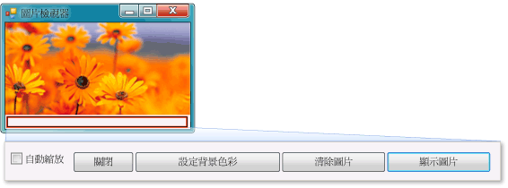

# 教學課程 1：建立圖片檢視器
[!INCLUDE[vs2017banner](../code-quality/includes/vs2017banner.md)]

在本教學課程中，您要建置一個從檔案載入圖片並將圖片顯示在視窗中的程式。  您將了解如何拖曳表單上的控制項 \(例如按鈕和圖片方塊\)、設定其屬性，以及使用容器來順暢地調整表單的大小。  您也會開始撰寫程式碼。  您將學習如何：  
  
-   建立新的專案。  
  
-   測試 \(偵錯\) 應用程式。  
  
-   將基本控制項 \(例如核取方塊和按鈕\) 加入至表單。  
  
-   使用版面配置將控制項放置在表單上。  
  
-   將 \[**開啟檔案**\] 和 \[**色彩**\] 對話方塊加入至表單。  
  
-   使用 IntelliSense 和程式碼片段撰寫程式碼。  
  
-   撰寫事件處理常式方法。  
  
 完成時，您的程式看起來類似下列圖片。  
  
   
您在本教學課程中建立的圖片  
  
 若要下載此範例的完整版本，請參閱[完整的圖片檢視器教學課程範例](http://code.msdn.microsoft.com/Complete-Picture-Viewer-7d91d3a8)。  
  
  如需觀看本主題的影片版本，請參閱[如何：在 Visual Basic 中建立圖片檢視器](http://go.microsoft.com/fwlink/?LinkId=205207)或[如何：在 C\# 中建立圖片檢視器](http://go.microsoft.com/fwlink/?LinkId=205198)。  
  
> [!NOTE]
>  這些影片使用舊版 Visual Studio，因此有一些功能表命令以及某些使用者介面項目會有些微差異。  不過，概念和程序在目前 Visual Studio 版本中的運作方式雷同。  本教學課程中同時涵蓋 Visual C\# 和 Visual Basic，所以請將焦點放在您使用的程式語言專屬資訊。  
>   
>  若要查看 Visual Basic 程式碼，請選擇程式碼區塊頂端的 \[**VB**\] 索引標籤，若要查看 Visual C\# 程式碼，請選擇 \[**C\#**\] 索引標籤。  如果您有興趣了解 Visual C\+\+，請參閱[快速入門](../misc/getting-started-with-visual-cpp-in-visual-studio-2015.md) 和 [C\+\+ 語言教學課程](http://www.cplusplus.com/doc/tutorial/)。  
>   
>  如果您有興趣了解如何撰寫 Windows 市集的 Visual C\# 或 Visual Basic 應用程式，請參閱[使用 C\# 或 Visual Basic 建立您的第一個 Windows 市集應用程式](http://msdn.microsoft.com/library/windows/apps/hh974581.aspx)。  如需建立適用於 Windows 市集之 JavaScript 應用程式的詳細資訊，請參閱[使用 JavaScript 建立您的第一個 Windows 市集應用程式](http://msdn.microsoft.com/library/windows/apps/br211385.aspx)。  
  
## 相關主題  
  
|標題|描述|  
|--------|--------|  
|[步驟 1：建立 Windows Form 應用程式專案](../ide/step-1-create-a-windows-forms-application-project.md)|從建立 Windows Form 應用程式專案開始。|  
|[步驟 2：執行您的程式](../ide/step-2-run-your-program.md)|執行您在上一個步驟中建立的 Windows Form 應用程式。|  
|[步驟 3：設定您的表單屬性](../ide/step-3-set-your-form-properties.md)|使用 \[**屬性**\] 視窗變更表單的外觀。|  
|[步驟 4：使用 TableLayoutPanel 控制項來配置您的表單](../ide/step-4-lay-out-your-form-with-a-tablelayoutpanel-control.md)|將 `TableLayoutPanel` 控制項加入至表單。|  
|[步驟 5：將控制項加入至您的表單](../Topic/Step%205:%20Add%20Controls%20to%20Your%20Form.md)|將控制項 \(例如 `PictureBox` 控制項和 `CheckBox` 控制項\) 加入至表單。  將按鈕加入至表單。|  
|[步驟 6：命名您的按鈕控制項](../ide/step-6-name-your-button-controls.md)|將按鈕重新命名為更有意義的名稱。|  
|[步驟 7：將對話方塊元件加入至您的表單](../ide/step-7-add-dialog-components-to-your-form.md)|將 \[**OpenFileDialog**\] 元件和 \[**ColorDialog**\] 元件加入至表單。|  
|[步驟 8：為顯示圖片按鈕事件處理常式撰寫程式碼](../ide/step-8-write-code-for-the-show-a-picture-button-event-handler.md)|使用 IntelliSense 工具撰寫程式碼。|  
|[步驟 9：檢閱、註解和測試您的程式碼](../ide/step-9-review-comment-and-test-your-code.md)|檢閱和測試程式碼。  視需要加入註解。|  
|[步驟 10：撰寫其他按鈕和核取方塊的程式碼](../Topic/Step%2010:%20Write%20Code%20for%20Additional%20Buttons%20and%20a%20Check%20Box.md)|使用 IntelliSense 撰寫程式碼讓其他按鈕和核取方塊發揮作用。|  
|[步驟 11：執行您的程式並嘗試其他功能](../Topic/Step%2011:%20Run%20Your%20Program%20and%20Try%20Other%20Features.md)|執行程式並設定背景色彩。  嘗試其他功能，例如變更色彩、字型和框線。|