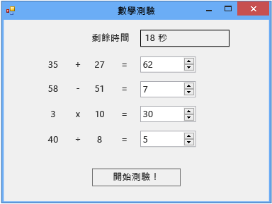

# 教學課程 2：建立計時的數學測驗
[!INCLUDE[vs2017banner](../code-quality/includes/vs2017banner.md)]

在本教學課程中，您將會建置一項測驗，在測驗中，受測者必須在指定的時間內回答四個隨機的算術問題。  您將學習如何：  
  
-   使用 `Random` 類別產生隨機數字。  
  
-   使用 \[**Timer**\] 控制項觸發事件，使其在特定時間發生。  
  
-   使用 `if else` 陳述式控制程式流程。  
  
-   在程式碼中執行基本的算術運算。  
  
 完成時，您的測驗看起來會像下圖一樣，但數字不同。  
  
   
您在本教學課程中建立的測驗  
  
 若要下載測驗的完整版，請參閱[完整的數學測驗教學課程範例](http://code.msdn.microsoft.com/Complete-Math-Quiz-8581813c)。  
  
> [!NOTE]
>  本教學課程中同時涵蓋 Visual C\# 和 Visual Basic，所以請將焦點放在您使用的程式語言專屬資訊。  
  
## 相關主題  
  
|標題|說明|  
|--------|--------|  
|[步驟 1：建立專案並將標籤加入至表單](../ide/step-1-create-a-project-and-add-labels-to-your-form.md)|從建立專案、變更屬性，然後加入 `Label` 控制項開始。|  
|[步驟 2：建立隨機加法問題](../ide/step-2-create-a-random-addition-problem.md)|建立加法問題，並使用 `Random` 類別產生隨機數字。|  
|[步驟 3：加入倒數計時器](../Topic/Step%203:%20Add%20a%20Countdown%20Timer.md)|加入倒數計時器，以便在測驗時進行計時。|  
|[步驟 4：加入 CheckTheAnswer\(\) 方法](../Topic/Step%204:%20Add%20the%20CheckTheAnswer\(\)%20Method.md)|加入方法檢查受測者是否輸入問題的正確答案。|  
|[步驟 5：加入 NumericUpDown 控制項的 Enter 事件處理常式](../Topic/Step%205:%20Add%20Enter%20Event%20Handlers%20for%20the%20NumericUpDown%20Controls.md)|加入事件處理常式，讓您的測驗更容易進行。|  
|[步驟 6：加入減法問題](../ide/step-6-add-a-subtraction-problem.md)|加入產生隨機數字、使用計時器並且會檢查答案是否正確的減法問題。|  
|[步驟 7：加入乘法和除法問題](../Topic/Step%207:%20Add%20Multiplication%20and%20Division%20Problems.md)|加入產生隨機數字、使用計時器並且會檢查答案是否正確的乘法和除法問題。|  
|[步驟 8：自訂測驗](../ide/step-8-customize-the-quiz.md)|嘗試其他功能，例如變更色彩和加入提示。|