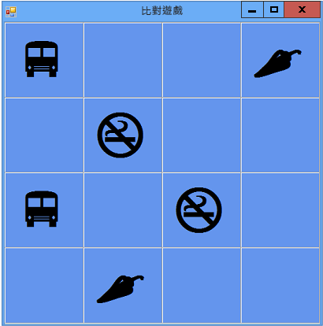

# 教學課程 3：建立配對遊戲
[!INCLUDE[vs2017banner](../code-quality/includes/vs2017banner.md)]

在本教學課程中，您會建置一個配對遊戲，而遊戲玩家必須配對隱藏的圖示。  您將學習如何：  
  
-   在 `List` 物件中儲存物件 \(例如圖示\)。  
  
-   使用 `foreach` 迴圈 \(Visual C\#\) 或 `For Each` 迴圈 \(Visual Basic\) 逐一查看清單中的項目。  
  
-   使用參考變數追蹤表單的狀態。  
  
-   建置您可以搭配多個物件使用的事件處理常式來回應事件。  
  
-   讓計時器倒數計時，然後讓計時器於啟動後剛好引發一個事件。  
  
 當您完成此教學課程時，您的程式看起來類似下列圖片。  
  
   
您在本教學課程中建立的遊戲  
  
 若要下載此範例的完整版本，請參閱[完整的配對遊戲教學課程範例](http://code.msdn.microsoft.com/Complete-Matching-Game-4cffddba)。  
  
> [!NOTE]
>  在本教學課程中，Visual C\# 和 Visual Basic 都會涵蓋在內，所以請將焦點放在您正在使用的程式語言專屬資訊。  
  
 如果您碰到程式開發的問題，請嘗試發表問題至 MSDN 論壇。  請參閱 [Visual Basic 論壇](http://social.msdn.microsoft.com/Forums/home?forum=vbgeneral)和 [Visual C\# 論壇](http://social.msdn.microsoft.com/Forums/home?forum=csharpgeneral)。  此外，其中提供了很好的免費視訊學習資源。  若要了解在 Visual Basic 程式設計的詳細資訊，請參閱[Visual Basic 基礎：適用於徹底初學者的開發](http://channel9.msdn.com/Series/Visual-Basic-Development-for-Absolute-Beginners)。  若要了解在 Visual C\# 程式設計的詳細資訊，請參閱[Visual C\# 基礎：適用於徹底初學者的開發](http://channel9.msdn.com/Series/C-Sharp-Fundamentals-Development-for-Absolute-Beginners)。  
  
## 相關主題  
  
|標題|描述|  
|--------|--------|  
|[步驟 1：建立專案並將資料表加入至表單](../ide/step-1-create-a-project-and-add-a-table-to-your-form.md)|從建立專案並加入 `TableLayoutPanel` 控制項，讓控制項正確對齊開始。|  
|[步驟 2：加入隨機物件和圖示清單](../ide/step-2-add-a-random-object-and-a-list-of-icons.md)|加入 `Random` 物件和 `List` 物件，以建立圖示清單。|  
|[步驟 3：將隨機圖示指派給每個標籤](../Topic/Step%203:%20Assign%20a%20Random%20Icon%20to%20Each%20Label.md)|將圖示隨機指派給 `Label` 控制項，因此，每個遊戲是不同的。|  
|[步驟 4：將 Click 事件處理常式加入至每個標籤](../Topic/Step%204:%20Add%20a%20Click%20Event%20Handler%20to%20Each%20Label.md)|加入 Click 事件處理常式，以變更已按下標籤的色彩。|  
|[步驟 5：加入標籤參考](../ide/step-5-add-label-references.md)|加入參考變數，以追蹤已按一下的標籤。|  
|[步驟 6：加入計時器](../Topic/Step%206:%20Add%20a%20Timer.md)|將計時器加入至表單，追蹤遊戲已經過的時間。|  
|[步驟 7：讓配對保持可見](../Topic/Step%207:%20Keep%20Pairs%20Visible.md)|如果已選取相符的配對，請讓圖示配對維持可見狀態。|  
|[步驟 8：加入方法以驗證玩家是否贏了](../ide/step-8-add-a-method-to-verify-whether-the-player-won.md)|加入 `CheckForWinner()` 方法以驗證玩家是否贏了。|  
|[步驟 9：嘗試其他功能](../ide/step-9-try-other-features.md)|嘗試其他功能，例如變更圖示和色彩、加上格線，以及加入音效。  試著讓戲局變大並調整計時器。|