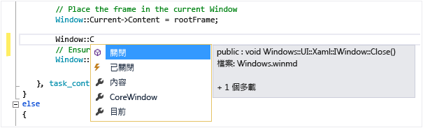

# 使用 IntelliSense
[!INCLUDE[vs2017banner](../code-quality/includes/vs2017banner.md)]

IntelliSense 是一些功能的概括詞彙：列出成員、參數資訊，快速諮詢和自動完成文字。  這些功能有助於深入了解您使用的程式碼，追蹤所輸入的參數，以及幾個按鍵即可加入屬性和方法呼叫。  
  
 IntelliSense 的許多方面是特定語言專屬的。  如需不同語言 IntelliSense 的詳細資訊，請參閱＜請參閱＞底下列出的主題。  
  
## 列出成員  
 類型 \(或命名空間\) 中的有效成員清單隨即在您輸入觸發字元 \(例如，Managed 程式碼中的句點 \(`.`\) 或 C\+\+ 中的 `::`\) 之後出現。  如果您繼續輸入字元，則會篩選清單，只包含以這些字元開頭的成員。  
  
 選取項目之後，您可以按 TAB 鍵或輸入空格，將它插入程式碼中。  如果您選取項目並輸入句號，則項目出現時，後面會接著句號，並顯示另一個成員清單。  當您選取某項目時，在插入項目前，會取得項目的快速諮詢。  
  
 在成員清單中，左方的圖示代表成員的類型，如命名空間、類別、函式或變數。  如需圖示的清單，請參閱[類別檢視和物件瀏覽器圖示](../ide/class-view-and-object-browser-icons.md)。  清單可能相當長，因此您可以按 PAGE UP 和 PAGE DOWN，在清單中上下移動。  
  
   
  
 您可以輸入 CTRL\+J，按一下 \[**編輯\]\/\[IntelliSense\]\/\[列出成員**\]，或按一下編輯器工具列上的 \[**列出成員**\] 按鈕，手動叫用 \[**列出成員**\] 功能。  在空白行或可辨識範圍外叫用清單時，清單會顯示全域命名空間中的符號。  
  
 若要預設關閉 \[列出成員\] \(讓它不出現，除非明確地叫用\)，請移至 \[**工具\]\/\[選項\]\/\[所有語言**\] 和取消選取 \[**自動列出成員**\]。  如果您想要只關閉特定語言的 \[列出成員\]，請移至該語言的 \[**一般**\] 設定。  
  
 您也可以變更為建議模式，在此模式中只會將您輸入的文字插入程式碼。  例如，如果您輸入不在清單中的識別碼並按下 TAB 鍵，則在完成模式中的項目會取代所輸入的識別碼。  若要在完成模式和建議模式間進行切換，按下 CTRL\+ALT\+空格鍵，或按一下 \[**編輯\]\/\[IntelliSense\]\/\[切換完成模式**\]。  
  
## 參數資訊  
 \[參數資訊\] 會提供方法、屬性泛型類型參數 \(C\# 中\) 或範本 \(C\+\+ 中\) 所需參數的數目、名稱和類型相關資訊。  
  
 粗體的參數表示您輸入函式時，所需的下一個參數。  對於多載函式，您可以使用向上鍵和向下鍵檢視函式多載的替代參數資訊。  
  
   
  
 當您以 XML 文件註解來附註函式和參數時，這些註解將會顯示成 \[參數資訊\]。  如需詳細資訊，請參閱[提供 XML 程式碼註解](../ide/supplying-xml-code-comments.md)。  
  
 您可以按一下 \[**編輯\]\/\[IntelliSense\]\/\[參數資訊**\]，輸入 CTRL\+SHIFT\+空格鍵，或按一下編輯器工具列上的 \[**參數資訊**\] 按鈕，手動叫用參數資訊。  
  
## 快速諮詢  
 \[快速諮詢\] 會顯示程式碼中任一識別項的完整宣告。  
  
   
  
 當您從 \[**列出成員**\] 方塊選取成員時，也會出現 \[快速諮詢\]。  
  
   
  
 您可以按一下 \[**編輯\]\/\[IntelliSense\]\/\[快速諮詢**\]，輸入 CTRL\+I 或按一下編輯器工具列上的 \[**快速諮詢**\] 按鈕，手動叫用 \[快速諮詢\]。  
  
 如果函式是多載函式，IntelliSense 可能不會顯示所有多載形式的資訊。  
  
 您可以將 \[**工具\]\/\[選項\]\/\[文字編輯器\]\/\[C\/C\+\+\]\/\[進階\]\/\[自動快速資訊**\] 設為 `false`，關閉 C\+\+ \[快速諮詢\]。  
  
## 自動完成文字  
 只要您輸入了足夠的字元，可以清楚識別詞彙，\[自動完成文字\] 就會輸入變數、命令或函式名稱的其餘部分。  您可以按一下 \[**編輯\]\/\[IntelliSense\]\/\[自動完成文字**\]，輸入 CTRL\+空格鍵，或按一下編輯器工具列上的 \[**自動完成文字**\] 按鈕，叫用 \[自動完成文字\]。  
  
## IntelliSense 選項  
 IntelliSense 選項預設為開啟。  若要關閉它們，請按一下 \[**工具\]\/\[選項\]\/\[文字編輯器**\] 並取消選取 \[**參數資訊**\] 或 \[**自動列出成員**\] \(如果您不想要列出成員功能\)。  
  
## 疑難排解 IntelliSense  
 IntelliSense 選項在某些情況下可能不會依照您的預期運作。  
  
 **游標位於程式碼錯誤的下方。** 如果游標上方的程式碼有不完整的函式或其他錯誤，您可能會無法使用 IntelliSense，因為 IntelliSense 可能無法剖析程式碼項目。  您可以註解適用的程式碼來解決這個問題。  
  
 **游標位於程式碼註解內。** 如果游標位於原始程式檔的註解中，則無法使用 IntelliSense。  
  
 **游標位於字串常值中。** 如果游標如下列範例所示位於用引號括住的字串常值中，則無法使用 IntelliSense：  
  
```  
MessageBox( hWnd, "String literal|") )  
```  
  
 **這些自動選項會關閉。** IntelliSense 預設會自動運作，但您可將其停用。  即使停用自動陳述式完成，還是可以叫用 IntelliSense 功能。  
  
## 請參閱  
 [Visual Basic 特定的 IntelliSense](../ide/visual-basic-specific-intellisense.md)   
 [Visual C\# IntelliSense](../ide/visual-csharp-intellisense.md)   
 [JavaScript IntelliSense](../ide/javascript-intellisense.md)   
 [提供 XML 程式碼註解](../ide/supplying-xml-code-comments.md)