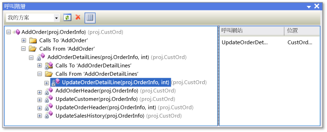

# 檢視程式碼的結構
[!INCLUDE[vs2017banner](../code-quality/includes/vs2017banner.md)]

您可以檢查 Visual Studio 專案中的物件與成員，以及 .NET Framework 元件、COM 元件、動態連結程式庫 \(DLL\) 與類型程式庫 \(TLB\) 中的物件與成員。  
  
 本文件的下列各節將說明不同的程式碼結構視窗。  
  
 [類別檢視 \(Visual Basic、C\#、C\+\+\)](#BKMK_ClassView)  
  
 [呼叫階層 \(Visual Basic、C\#、C\+\+\)](#BKMK_CallHierarchy)  
  
 [物件瀏覽器](#BKMK_ObjectBrowser)  
  
 [程式碼定義視窗 \(C\#、C\+\+\)](#BKMK_CodeDefinition)  
  
 您也可以使用 \[方案總管\] 來瀏覽專案中的類型與成員、搜尋符號、檢視方法的呼叫階層、尋找符號參考及更多功能，而無須在如上所述的多個工具視窗之間切換。  
  
 如果您有 Visual Studio Enterprise，即可使用 Code Map 以視覺方式呈現程式碼的結構，而其相依性適用於整個方案，且能夠向下鑽研至您感興趣的程式碼部分。  如需詳細資訊，請參閱[對應方案之間的相依性](../modeling/map-dependencies-across-your-solutions.md)。  
  
> [!NOTE]
>  Visual Studio 的版本及您正在使用的設定，可能會影響 IDE 中的功能。  其可能會與本主題中所述內容有所不同。  
  
##   類別檢視 \(Visual Basic、C\#、C\+\+\)  
 \[類別檢視\] 可以顯示為 \[方案總管\] 的一部分，同時也可顯示在另一個視窗中。  \[類別檢視\] 視窗會顯示應用程式的項目。  上窗格會顯示命名空間、類型、介面、列舉及類別，而下窗格則會顯示屬於上窗格中所選類型的成員。  您使用此視窗可移至原始程式碼中的成員定義 \(如果定義在您的方案之外，則會在 \[物件瀏覽器\] 中\)。  
  
 您不需要編譯專案，即可在 \[類別檢視\] 中檢視其項目。  當您修改專案中的程式碼時，視窗會重新整理。  
  
 您可以對專案加入程式碼，方法是先選取專案節點，接著選擇 \[加入\] 按鈕，以開啟 \[加入新項目\] 對話方塊。  程式碼會加入至不同的檔案。  
  
 如果您的專案已簽入原始程式碼控制項中，則每個 \[類別檢視\] 項目顯示的圖示即代表該檔案的原始程式碼狀態。  常用的原始程式碼控制命令 \(像是 \[簽出\]、\[簽入\] 和 \[取得最新的版本\]\)，對項目也提供捷徑功能表。  
  
### 類別檢視工具列  
 類別檢視工具列包含下列命令。  
  
|||  
|-|-|  
|**新增資料夾**|建立虛擬資料夾或子資料夾，您可以在其中整理經常使用的項目。  這些項目儲存在作用中的方案 \(.suo\) 檔案內。  重新命名或刪除程式碼中的項目之後，其可能會以錯誤節點的方式出現在虛擬資料夾中。  若要修正此問題，請刪除該錯誤節點。  如果您重新命名項目，則可將其再一次從專案階層移動到資料夾內。|  
|**上一頁**|巡覽至先前選取的項目。|  
|**下一頁**|巡覽至下一個選取的項目。|  
|\[類別圖檢視\] \(僅限Managed 程式碼專案\)|選取命名空間或在 \[類別檢視\] 中輸入時，會變成可以使用。  選取命名空間時，類別圖將會顯示其中的所有類型。  選取類型時，類別圖僅會顯示該類型。|  
  
### 類別檢視設定  
 工具列上的 \[類別檢視設定\] 按鈕具有下列設定。  
  
|||  
|-|-|  
|**顯示基底類型**|顯示基底類型。|  
|**顯示衍生類型**|顯示衍生類型。|  
|**顯示隱藏的類型與成員**|隱藏的類型與成員 \(不適合用戶端使用\) 會以淺灰色文字顯示。|  
|**顯示 Public 成員**|顯示 Public 成員。|  
|**顯示 Protected 成員**|顯示受保護的成員。|  
|**顯示 Private 成員**|顯示 Private 成員。|  
|**顯示其他成員**|顯示其他類型的成員，包括內部 \(在 Visual Basic 中稱為 Friend\) 成員。|  
|**顯示繼承成員**|顯示繼承的成員。|  
|**顯示擴充方法**|顯示擴充方法。|  
  
### 類別檢視捷徑功能表  
 視所選專案類型之不同，\[類別檢視\] 中的捷徑功能表可能包含下列命令。  
  
|||  
|-|-|  
|**移至定義**|如果開啟的專案中未定義該項目，便在原始程式碼或 \[物件瀏覽器\] 中，尋找該項目的定義。|  
|**瀏覽定義**|在 \[物件瀏覽器\] 中顯示所選項目。|  
|**尋找所有參考**|尋找目前所選物件項目，並在 \[尋找結果\] 視窗中顯示結果。|  
|\[對類型篩選\] \(僅限 Managed 程式碼\)|僅顯示所選類型或命名空間。  您可以選擇 \[尋找\] 方塊旁的 \[清除尋找\] \(X\) 按鈕來移除篩選。|  
|**複製**|複製項目的完整名稱。|  
|**依字母順序排序**|依名稱照字母順序列出類型與成員。|  
|**依成員類型排序**|依類型列出類型與成員 \(例如類別在介面前面、介面在委派前面、方法在屬性前面\)。|  
|**依成員存取方式排序**|依存取類型列出類型與成員，例如 Public 或 Private。|  
|**依成員類型群組**|將類型與成員依物件類型排序至群組內。|  
|\[移至宣告\] \(僅限 C\+\+ 程式碼\)|在原始程式碼中顯示類型或成員的宣告 \(如果有\)。|  
|**移至定義**|在原始程式碼中顯示類型或成員的定義 \(如果有\)。|  
|**移至參考**|在原始程式碼中顯示類型或成員的參考 \(如果有\)。|  
|**檢視呼叫階層**|在 \[呼叫階層\] 視窗中顯示所選方法。|  
  
##   呼叫階層 \(Visual Basic、C\#、C\+\+\)  
 \[呼叫階層\] 視窗會顯示從何處呼叫指定的方法 \(或是屬性或建構函式\)，並列出來自該方法所呼叫的方法。  您可以檢視多個層級的呼叫圖形，其可顯示指定範圍中方法之間呼叫端\/被呼叫端的關聯性。  
  
 您可以顯示 \[呼叫階層\] 視窗，方法是選取方法 \(或是屬性或建構函式\)，然後選擇捷徑功能表上的 \[檢視類別階層\]。  顯示畫面應與下方圖片類似。  
  
   
呼叫階層視窗  
  
 使用工具列上的下拉式清單，可以指定階層的範圍：方案、目前的專案或目前的文件。  
  
 主窗格會顯示呼叫對象與來源方法，而 \[呼叫站台\] 窗格則會顯示所選呼叫的位置。  若是虛擬或抽象成員，會出現 \[覆寫方法名稱\] 節點。  若是介面成員，會出現 \[實作方法名稱\] 節點。  
  
 \[呼叫階層\] 視窗找不到方法群組參考，其中包含會做為事件處理常式或指派至委派位置的方法。  若要尋找這些參考，請使用 \[尋找所有參考\] 命令。  
  
 \[呼叫階層\] 視窗中的捷徑功能表包含下列命令。  
  
|||  
|-|-|  
|**加入為新的根目錄**|加入所選節點為新的根節點。|  
|**移除根目錄**|從樹狀檢視窗格移除所選根節點。|  
|**移至定義**|巡覽至方法的原始定義。|  
|**尋找所有參考**|尋找專案中對所選方法的所有參考。|  
|**複製**|複製所選節點 \(但不複製其子節點\)。|  
|**重新整理**|重新整理資訊。|  
  
##   物件瀏覽器  
 \[物件瀏覽器\] 會顯示專案中程式碼的說明。  
  
 您可以篩選要在 \[物件瀏覽器\]中檢視的項目。  使用視窗頂端的下拉式清單，可以選擇下列選項：  
  
-   任何 .NET Framework  
  
-   Silverlight  
  
-   作用中的方案  
  
-   一組自訂的元件  
  
 自訂元件可包含 Managed 程式碼可執行檔、程式庫組件、類型程式庫和 .ocx 檔案。  無法加入 C \+ \+ 自訂元件。  自訂設定儲存在 Visual Studio 使用者應用程式目錄 %appdata%\\roaming\\microsoft\\visualstudio\\11.0\\objbrowex.dat 中。  
  
 \[物件瀏覽器\] 的左窗格會顯示實體容器，例如 .NET Framework 和 COM 元件。  您可以展開容器以顯示其含有的命名空間，然後展開命名空間以顯示其包含的類型。  選取類型時，其成員 \(例如屬性及方法\) 將會列於右窗格中。  右下方的窗格會顯示有關所選項目的詳細資訊。  
  
 您可以使用視窗頂端的 \[搜尋\] 方塊，搜尋特定項目。  搜尋不區分大小寫。  搜尋結果會顯示在左窗格中。  若要清除搜尋，請選擇 \[搜尋\] 方塊旁的 \[清除搜尋\] \(X\) 按鈕。  
  
 \[物件瀏覽器\] 會持續追蹤您選取的項目，您可以使用工具列上的 \[向前\] 和 \[向後\] 按鈕，在選取的項目之間巡覽。  
  
 您可以使用 \[物件瀏覽器\] 將組件參考加入開啟的方案中，方法是選取項目 \(組件、命名空間、類型或成員\)，然後選擇工具列上的 \[加入參考\] 按鈕。  
  
### 物件瀏覽器設定  
 使用工具列上的 \[物件瀏覽器設定\] 按鈕，可以指定下列檢視之一。  
  
|||  
|-|-|  
|**檢視命名空間**|在左窗格中顯示命名空間而非實體容器。  儲存在多個實體容器中的命名空間會合併。|  
|**檢視容器**|在左窗格中顯示實體容器而非命名空間。  \[檢視命名空間\] 和 \[檢視容器\] 是互斥的設定。|  
|**顯示基底類型**|顯示基底類型。|  
|**顯示衍生類型**|顯示衍生類型。|  
|**顯示隱藏的類型與成員**|隱藏的類型與成員 \(不適合用戶端使用\) 會以淺灰色文字顯示。|  
|**顯示 Public 成員**|顯示 Public 成員。|  
|**顯示 Protected 成員**|顯示受保護的成員。|  
|**顯示 Private 成員**|顯示 Private 成員。|  
|**顯示其他成員**|顯示其他類型的成員，包括內部 \(在 Visual Basic 中稱為 Friend\) 成員。|  
|**顯示繼承成員**|顯示繼承的成員。|  
|**顯示擴充方法**|顯示擴充方法。|  
  
### 物件瀏覽器捷徑功能表命令  
 視所選項目之不同，\[物件瀏覽器\] 中的捷徑功能表可能包含下列命令。  
  
|||  
|-|-|  
|**瀏覽定義**|顯示所選項目的主要節點。|  
|**尋找所有參考**|尋找目前所選物件項目，並在 \[尋找結果\] 視窗中顯示結果。|  
|**對類型篩選**|僅顯示所選類型或命名空間。  您可以選擇 \[清除搜尋\] 按鈕來移除篩選。|  
|**複製**|複製項目的完整名稱。|  
|**移除**|如果範圍是自訂元件集，請將所選元件從範圍中移除。|  
|**依字母順序排序**|依名稱照字母順序列出類型與成員。|  
|**依物件類型排序**|依類型列出類型與成員 \(例如類別在介面前面、介面在委派前面、方法在屬性前面\)。|  
|**依物件存取方式排序**|依存取類型列出類型與成員，例如 Public 或 Private。|  
|**依物件類型分組**|將類型與成員依物件類型排序至群組內。|  
|\[移至宣告\] \(僅限 C\+\+ 專案\)|在原始程式碼中顯示類型或成員的宣告 \(如果有\)。|  
|**移至定義**|在原始程式碼中顯示類型或成員的定義 \(如果有\)。|  
|**移至參考**|在原始程式碼中顯示類型或成員的參考 \(如果有\)。|  
|**檢視呼叫階層**|在 \[呼叫階層\] 視窗中顯示所選方法。|  
  
##   程式碼定義視窗 \(C\#、C\+\+\)  
 \[程式碼定義\] 視窗會在作用中專案內顯示所選類型或成員的定義。  類型或成員可以在程式碼編輯器或程式碼檢視視窗中加以選取。  
  
 雖然此視窗為唯獨視窗，但您仍可以在其中設定中斷點或書籤。  若要修改顯示的定義，請選擇捷徑功能表上的 \[編輯定義\]。  這會在程式碼編輯器中開啟原始程式檔，並將插入點移至定義的開始處。  
  
### 程式碼定義捷徑功能表  
 視程式設計語言之不同，\[程式碼定義\] 視窗中的捷徑功能表可能包含下列命令。  
  
|||  
|-|-|  
|**建立單元測試**|建立所選項目的單元測試。|  
|**產生順序圖表**|選取方法時，將會產生順序圖表。|  
|**建立私用存取子**|如果方案中出現單元測試，將會產生測試用以存取程式碼的方法。|  
|**移至定義**|尋找定義 \(或部分類別的定義\)，並將其顯示在 \[尋找結果\] 視窗中。|  
|**尋找所有參考**|在方案中尋找類型或成員的參考。|  
|**檢視呼叫階層**|在 \[呼叫階層\] 視窗中顯示方法。|  
|**顯示呼叫測試**|如果專案中含有單元測試，將會顯示呼叫所選程式碼的測試。|  
|**執行呼叫測試**|如果專案中含有單元測試，將會執行所選程式碼的測試。|  
|**中斷點**|插入中斷點 \(或追蹤點\)。|  
|**執行至游標處**|以偵錯模式執行程式，直到指標的位置為止。|  
|**複製**|複製所選列。|  
|**大綱**|標準大綱命令。|  
|**編輯定義**|將插入點移至程式碼視窗中的定義。|  
|**選擇編碼方式**|開啟 \[編碼\] 視窗，使您能夠設定檔案的編碼方式。|  
  
### 文件大綱視窗  
 您可以搭配使用 \[文件大綱\] 視窗與設計工具檢視，例如 XAML 頁面的設計工具或 Windows Form 設計工具，或搭配 HTML 頁面。  此視窗會以樹狀檢視來顯示項目，使您能夠檢視表單或頁面的邏輯結構，以及尋找深度內嵌或隱藏的控制項。  
  
## 請參閱  
 [類別檢視和物件瀏覽器圖示](../ide/class-view-and-object-browser-icons.md)