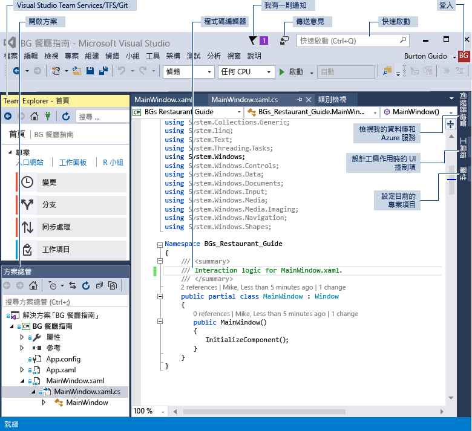
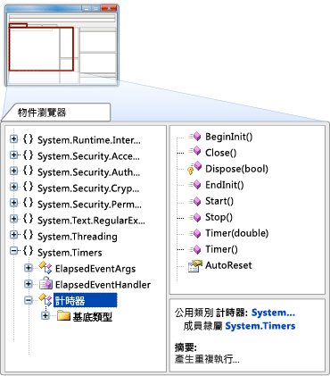
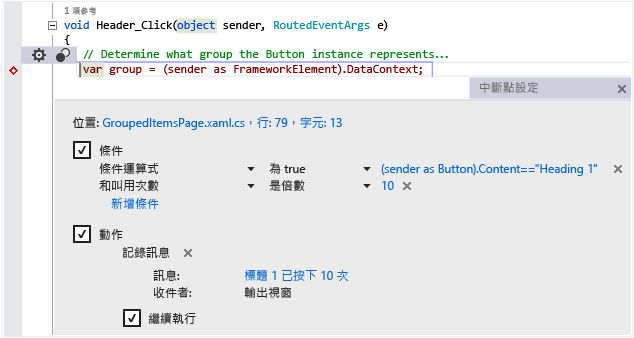
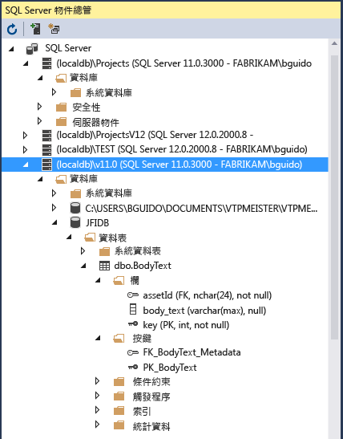

# Visual Studio IDE
Microsoft Visual Studio 2017 RC 是一套建立軟體的工具，適用於從規劃階段到 UI 設計、撰寫程式碼、測試、偵錯、分析程式碼品質和效能，部署給客戶以及收集使用量遙測。 這些工具的設計目的是要盡可能地緊密整合，而且全部都可透過 Visual Studio 整合式開發環境 (IDE) 公開。  

 您可以使用 Visual Studio 來建立許多種類的應用程式，從簡單的市集應用程式和行動用戶端的遊戲，到能讓企業和資料中心營運的大型、複雜的系統。 您可以建立  

 - 應用程式和遊戲，這些不只能在 Windows 上執行，也能在 Android 和 iOS 上執行。

 - 以 ASP.NET、JQuery、AngularJS 和其他常用架構為基礎的網站和 Web 服務。

 - 應用程式，供各種不同平台和裝置使用，舉幾個例子來說，例如 Azure、Office、Sharepoint、Hololens、Kinect 和物聯網等。

 - 使用 DirectX 提供適用於各種 Wondows 裝置包括 Xbox 在內的遊戲與大量圖形的應用程式。

 根據預設，Visual Studio 提供對於 C#、C 及 C++、JavaScript、TypeScript、F# 和 Visual Basic 的支援。 Visual Studio 透過 [Xamarin for Visual Studio](https://www.xamarin.com/visual-studio)、[Visual Studio Tools for Unity](../cross-platform/visual-studio-tools-for-unity.md) 延伸模組和 [Visual Studio Tools for Apache Cordova](../misc/get-started-with-visual-studio-tools-for-apache-cordova2.md) 分別與 Xamarin、Unity 這類協力廠商應用程式和 Apache Cordova 密切合作及整合。 您可以建立執行特定工作的自訂工具，透過 [Visual Studio SDK](../extensibility/visual-studio-sdk.md)來自行擴充 Visual Studio。

## 了解新功能
 如果您未曾使用過 Visual Studio，請開始使用 [Visual Studio 使用者入門](../ide/get-started-with-visual-studio.md)了解基本概念。
如果您想要了解 Visual Studio 2017 RC 的新功能，請參閱 [Visual Studio 2017 RC 的新功能](../ide/whats-new-in-visual-studio.md)。

## 設定 Visual Studio
 您可以在 [Visual Studio 產品](https://www.visualstudio.com/products/)找到最適合您的 Visual Studio 版本。

 您可以從 [Visual Studio 下載](https://www.visualstudio.com/vs/)來安裝 Visual Studio 2017 RC。 若要深入了解安裝程序，請參閱 [Installing Visual Studio 2017 RC](https://go.microsoft.com/fwlink/?linkid=833223) (安裝 Visual Studio 2017 RC)。

## IDE 快速導覽
 下圖顯示具有一個開啟的專案與數個重要工具視窗的 Visual Studio IDE。
 - [方案總管](../ide/solutions-and-projects-in-visual-studio.md)可讓您檢視和巡覽程式碼檔。
 - [Team Explorer](https://www.visualstudio.com/en-us/docs/connect/work-team-explorer) 可讓您追蹤工作項目，並使用版本控制技術 (例如 [Git](https://git-scm.com/) 和 [Team Foundation 版本控制 (TFVC)](https://www.visualstudio.com/en-us/docs/tfvc/overview)) 與其他人共用程式碼。
 - [Cloud Explorer](https://azure.microsoft.com/en-us/documentation/articles/vs-azure-tools-resources-managing-with-cloud-explorer/) 可讓您檢視和管理 Azure 資源，例如虛擬機器、資料表、SQL 資料庫等。
 - [編輯器] 視窗可讓您檢視與編輯原始程式碼和設計工具資料。
 - [輸出] 視窗會顯示編譯、執行、偵錯等作業的輸出。

   

 ### 登入
  當您第一次啟動 Visual Studio 時，可以使用您的 Microsoft 帳戶或是工作或學校帳戶登入。 登入即可跨多個裝置同步處理您的視窗配置等設定，並自動連接到您可能需要的服務，例如 Azure 訂用帳戶和 Visual Studio Team Services。 如果您有以訂用帳戶為基礎的授權，您必須定期登入 Visual Studio 以保持最新的授權權杖。 如果您有產品金鑰的授權就不必登入，但這樣做可以更方便地以 Azure、Office 365 和 Salesforce.com 連接到 Visual Studio Team Services 和您的帳戶。 如需詳細資訊，請參閱[登入 Visual Studio](../ide/signing-in-to-visual-studio.md)。

  如果您有多個 Visual Studio Team Services 帳戶、Azure 帳戶或 MSDN 訂閱，您只需登入一次，就可以加以連結，以及存取所有帳戶中的資源和服務。 如需詳細資訊，請參閱[使用多個使用者帳戶](../ide/work-with-multiple-user-accounts.md)。

 ### 隨時獲得最新消息
  當 Visual Studio 或任何已安裝相關元件的更新可供使用時，標題列上方中的旗標通知圖示會告知您。 您可選擇是否要關閉這些通知或採取行動。 如需詳細資訊，請參閱 [Visual Studio 通知](../ide/visual-studio-notifications.md)。

 ### 尋找項目並取得協助
  當您不知道鍵盤快速鍵或功能表位置時，下列螢幕擷取畫面中加上紅色外框的 [快速啟動] 視窗可快速尋找 Visual Studio 命令、工具和功能等。 只要輸入您要尋找的項目，[快速啟動] 就會給您該項目的連結。

 

 在 Visual Studio 中，您可以按 **F1** 鍵，移至使用中視窗的線上說明。 您也可以在程式碼編輯器中按 **F1** 鍵，移至目前插入號位置的應用程式開發介面或關鍵字之說明頁面。 例如，在 C# 檔案中，於某處輸入插入號，或只在 `System.String` 宣告的結尾輸入插入號，然後按 **F1** 鍵以移至 [String](assetId:///T:System.String?qualifyHint=False&autoUpgrade=True) 的說明頁面。

### 提出意見
 不管何時，只要您願意，就能很簡單地在 Visual Studio 上給我們意見反應。 按一下 **QuickLaunch** 旁邊標題列的意見反應圖示，然後按一下 [回報問題]  或 [提供建議] 。

 Visual Studio 的發行前版本還有 [為此產品評分]  選項。 我們會查看所有意見，並用來改善產品。 如需詳細資訊，請參閱[告訴我們](../ide/talk-to-us.md)。

### 個人化 IDE
 您可以自訂視窗配置以符合您的開發樣式。 您隨時都可以停駐、浮動或隱藏任何視窗，也可在全螢幕模式中執行編輯器。 您可以建立並儲存多個自訂視窗配置，這些只會顯示您所需特定內容的視窗。 例如，您可以建立全螢幕的配置，這樣一來您看到的就是所有程式碼編輯器。 而且，您可以建立不同的版面配置，來進行偵錯和小組作業。 如需詳細資訊，請參閱[自訂視窗版面配置](../ide/customizing-window-layouts-in-visual-studio.md)。

 您可以用許多其他的方式自訂 Visual Studio，而且若您在多部電腦上工作，也可以漫遊設定。 如需詳細資訊，請參閱[將 IDE 個人化](../ide/personalizing-the-visual-studio-ide.md)。

 幾乎所有項目都有鍵盤快速鍵，而且您也能加以自訂。 若要建立新的快速鍵，請在 [快速啟動] 中輸入 "Keyboard"，以開啟 [鍵盤] 對話方塊。 如果您需要選項的詳細資訊，可在這裏按 F1 移至說明頁面。 如需詳細資訊，請參閱 [Visual Studio 中的預設鍵盤快速鍵](../ide/default-keyboard-shortcuts-in-visual-studio.md)。

## 連接到 Visual Studio Team Services 和 Team Foundation Server
  Visual Studio Team Services (VSTS) 這項雲端式服務可用於裝載軟體專案，以及在小組中共同作業。 VSTS 支援 Git 和 Team Foundation 原始檔控制系統，以及 Scrum、CMMI 和 Agile 開發方法。 Team Foundation 版本控制 (TFVC) 使用單一且集中式伺服器儲存機制來追蹤和版本化檔案。 在其他開發人員取得最新變更的地方，一律將本機變更簽入中央伺服器。 Team Foundation Server (TFS) 2015 為 Visual Studio 的應用程式生命週期管理中樞。 其可讓所有人使用單一方案參與開發流程。 TFS 也適合用來管理異質小組和專案

  如果您在網路上有 Visual Studio Team Services 帳戶或 Team Foundation Server，可透過 [Team Explorer] 視窗與其連接。 在這個視窗中，您可以在原始檔控制簽入或簽出程式碼、管理工作項目、啟動建置和存取小組聊天室及工作區。 您可以從 [快速啟動] 開啟 [Team Explorer]，或從主功能表的 [檢視]、[Team Explorer] 或從 [小組]、[管理連接] 中予以開啟。  如需 Visual Studio Team Services 的詳細資訊，請參閱 [www.visualstudio.com](https://www.visualstudio.com/)。 如需 Team Foundation Server 的詳細資訊，請參閱 [Team Foundation Server](https://www.visualstudio.com/products/tfs-overview-vs)。

  下圖顯示裝載於 VSTS 中的解決方案 [Team Explorer] 窗格：

   

## 建立方案和專案
  雖然您可以使用 Visual Studio 瀏覽個別的程式碼檔案，但您會更常使用 *「專案」*(project)。 Visual Studio 專案是檔案及資源的集合，會編譯成單一的應用程式二進位可執行檔 (例如 .exe、DLL 或 appx)。 對於非 ASP.NET 的網站，並不產生任何可執行檔，且專案只包含 HTML、JavaScript 檔案和影像。 因為有時您可能需要建立多個二進位檔或密切相關的網站，所以 Visual Studio 具有包含多個專案或網站之方案的概念。 當您建立專案時，您實際上就是在建立單一方案的專案，您稍後如有需要也可加入更多專案到方案中。 例如，如果您有 DLL 專案時，您可以加入 .exe 專案到載入和使用 DLL 的方案。

  *「專案範本」* (project template) 是一組預先填入的程式碼檔案和組態設定，讓您得以快速設定，以建立特定種類的應用程式。 Visual Studio 隨附許多專案範本以供選擇，而若沒有任何預設範本適用，您可以建立自己的範本。 以範本建立專案之後，您可在範本提供的檔案或您加入的新檔案中開始撰寫自己的程式碼。 如需詳細資訊，請參閱[方案和專案](../ide/solutions-and-projects-in-visual-studio.md)。 下圖顯示適用於 ASP.NET 應用程式之專案範本的 [新增專案] 對話方塊。

 ![Visual Studio [新增專案] 對話方塊](../ide/media/vs2017_newprojectdialog.png "VS2017_NewProjectDialog")  

## 撰寫、巡覽和了解程式碼  
 如果您是開發人員，則編輯器視窗可能是耗費您大多數時間的地方。 Visual Studio 包含 C#、C++、Visual Basic、F#、JavaScript、TypeScript、XML, HTML 和 CSS 的內建編輯支援。 Visual Studio 也支援許多其他語言的編輯和編譯。

 您可以依序選擇 [檔案]、[開啟] 和 [檔案]，以在文字編輯器中編輯個別檔案。 若要編輯開啟專案中的檔案，請在方案總管中選擇和開啟檔名。 程式碼以色彩標示，而您可以在 [快速啟動] 中輸入 “Colors” 來個人化色彩配置。 您可以同時開啟多個文字編輯器的索引視窗。 您可以單獨分割每個視窗。 您也可以在全螢幕模式中執行文字編輯器。  

   

 文字編輯器可與許多產能功能緊密互動 (如果您想要的話)，協助您更快撰寫更好的程式碼。 這些功能會因語言而異，且您不必使用任何語言 (請在 [快速啟動] 中輸入 "Editor") 來開啟或關閉功能：下列為某些常見的產能功能：  

-  [重構](../ide/refactoring-in-visual-studio.md)包含一些作業，例如智慧型的變數重新命名、將選取的多行程式碼移動到個別函式、將程式碼移到其他位置、重新排序函式參數等等。

    

-  **IntelliSense** 為一種涵蓋一組常用功能的概括性詞彙，會直接在編輯器中顯示有關您程式碼的類型資訊，而在某些情況下會為您撰寫一些程式碼。 就像內嵌在編輯器中的基本文件，讓您無需在個別的 [說明] 視窗中查閱類型資訊。 IntelliSense 功能會因語言而異。 如需詳細資訊，請參閱 [Visual C# IntelliSense](../ide/visual-csharp-intellisense.md)、[Visual C++ Intellisense](../ide/visual-cpp-intellisense.md)、[JavaScript IntelliSense](../ide/javascript-intellisense.md)、[Visual Basic 特定的 IntelliSense](../ide/visual-basic-specific-intellisense.md)。 下圖顯示一些可用的 IntelliSense 功能：  

       

-  當您輸入程式碼時，[波浪線] 會即時提醒您程式碼中的錯誤或潛在問題，讓您可立即修正，不需等到編譯或執行階段才發現錯誤。 如果您將滑鼠停留在波浪線，則您會看到有關此錯誤的其他資訊。 左邊界也可能會出現燈泡與修正錯誤的建議。 如需詳細資訊，請參閱[執行燈泡提示的快速動作](../ide/perform-quick-actions-with-light-bulbs.md)。  

    

-  [書籤](../ide/setting-bookmarks-in-code.md)可讓您於正在處理的檔案中快速巡覽至特定一行。

    

-  您可以在文字編輯器操作功能表中叫用[呼叫階層](../ide/reference/call-hierarchy.md)視窗以顯示方法，這些方法會呼叫插入號下面的方法，或是由其所呼叫。

    

-  **CodeLens** 可讓您尋找程式碼、已連結的 Bug、工作項目、程式碼檢閱和單元測試的參考和變更，而不需離開編輯器。

    

  如需詳細資訊，請參閱[尋找程式碼變更和其他記錄](../ide/find-code-changes-and-other-history-with-codelens.md)。  

-  [查看定義]  視窗會顯示方法或類型的定義內嵌，而不用離開您目前的內容。 此視窗現在也適用於 XAML。  

    

-  [移至定義]  內容功能表選項會讓您直接進入定義函式或物件的位置。 以滑鼠右鍵在編輯器中按一下，還有其他巡覽命令可供使用。

    

- [物件瀏覽器](http://msdn.microsoft.com/en-us/f89acfc5-1152-413d-9f56-3dc16e3f0470)是一種相關工具，可讓您檢查系統上的 .NET 或 Windows 執行階段組件，查看它們包含的類型，以及查看這些類型包含的方法和屬性。  

       

 大部分 [編輯] 功能表和 [檢視] 功能表上的項目在某些方面與程式碼編輯器相關。 如需編輯器的詳細資訊，請參閱[撰寫程式碼](../ide/writing-code-in-the-code-and-text-editor.md)和 [Editing Your Code](https://www.visualstudio.com/features/ide-vs) (編輯程式碼)。  

## 編譯和建置程式碼  
 建置專案代表要編譯原始程式碼，並執行任何用以產生可執行檔的必要步驟。 不同語言有不同的建置作業，而一般網站則完全不用建置。 不論專案類型為何，[建置] 功能表是這些命令的標準位置。 若要以單一按鍵編譯和執行程式碼，請按 F5 鍵。 每個編譯器都可完全透過 IDE 設定。 [建置] 工具列可讓您指定是否要建置您程式的偵錯版本，搭配符號和額外的錯誤檢查來支援中斷點和偵錯工具的逐步執行，或指定建置您最後要交給使用者的發行組建。 在專案屬性頁上，您可以設定更多建置設定，以及許多其他的設定。 在方案總管中選擇專案節點的操作 (按一下滑鼠右鍵) 功能表，然後選擇 [屬性] 命令。 您也可以從命令列執行建置。  

 建置的輸出會出現在 [輸出視窗] 中，包含錯誤或成功訊息。 [錯誤清單] (如下所示) 會提供建置錯誤的詳細資訊。  

   

## 偵錯程式碼  
 Visual Studio 的先進偵錯程式可讓您對本機專案、遠端裝置或模擬器上執行的程式碼偵錯，例如適用 Android 或 Windows Phone 裝置的模擬器。 您可以一次一個逐步執行程式碼陳述式，並隨時檢查變數，也可以逐步執行多執行緒應用程式，您也可以設定當指定的條件為真時才會叫用的中斷點。 您可以在程式碼執行時監視變數的值。 這些全部都可以在程式碼編輯器本身中管理，如此您就不必離開程式碼的內容。  

   

 偵錯工具本身會有多個視窗，可讓您檢視和管理本機變數、呼叫堆疊和執行階段環境的其他方面。 您可以在 [偵錯]  功能表找到這些視窗。  

 [即時運算視窗](../ide/reference/immediate-window.md)可讓您輸入運算式，並立即查看其結果。

 [IntelliTrace](../debugger/intellitrace.md) 視窗會記錄執行中 .NET 程式的每個方法呼叫和其他事件，它可以幫助您快速找出問題的來源。

 如需詳細資訊，請參閱 [Visual Studio 偵錯](../debugger/debugging-in-visual-studio.md)。  

## 測試程式碼  
 Visual Studio 包含 Managed 程式碼 (.NET) 及原生 C++ 的單元測試架構。 若要建立單元測試，只要將測試專案加入您的方案，撰寫您的測試，然後從 [測試總管] 視窗執行。 如需詳細資訊，請參閱[對程式碼進行單元測試](../test/unit-test-your-code.md)。  

   

## 分析程式碼品質和效能  
 Visual Studio 包含靜態和執行階段分析的強大工具。 靜態分析工具可協助您識別設計、全球化、互通性、效能、安全性和其他類別的潛在錯誤。 效能測試或程式碼剖析需要測量您程式的執行方式。 您可從 [分析]  功能表存取這些工具。 如需詳細資訊，請參閱[使用 Visual Studio 診斷工具改善品質](../test/improve-code-quality.md)。  

## 連接至雲端服務和資料庫  
 Visual Studio 中的 [Cloud Explorer](https://azure.microsoft.com/en-us/documentation/articles/vs-azure-tools-resources-managing-with-cloud-explorer/) 顯示所登入 Azure 訂用帳戶下管理之所有帳戶中的 Azure 資源。 您可以安裝 [Azure SDK](https://azure.microsoft.com/en-us/downloads/)，以取得 Cloud Explorer。

 

 [伺服器總管](https://msdn.microsoft.com/en-us/library/cd2cz7yy.aspx)也可用來協助您在 Azure、Salesforce.com、Office 365 和網站上瀏覽和管理 SQL Server 執行個體和資產。

 Visual Studio 包含 [Microsoft SQL Server Data Tools](https://msdn.microsoft.com/en-us/data/tools.aspx) (SSDT)，可讓您建置、偵錯、維護和重構資料庫。 您可以使用資料庫專案，或直接使用內部或外部所連接的資料庫執行個體。  

 Visual Studio 中的 [SQL Server 物件總管](https://msdn.microsoft.com/en-us/library/hh231250.aspx)提供類似 SQL Server Management Studio 的資料庫物件檢視。 SQL Server 物件總管可讓您執行輕型的資料庫管理和設計工作，包含編輯資料表資料、比較結構描述，以及直接從 SQL Server 物件總管使用內容功能表執行查詢。 SSDT 也包含開發 SQL Server 2012 Analysis Services、 Reporting Services 和 Integration Services 商業智慧 (BI) 解決方案 (先前稱為 Business Intelligence Development Studio) 的特殊專案類型和工具。  

   

## 部署已完成的應用程式  
 當您的應用程式準備好要部署給客戶時，Visual Studio 會提供工具來部署，無論您要部署至 Windows 市集、Sharepoint 網站，或是透過 InstallShield 或 Windows Installer 技術部署。 這可透過所有 IDE 存取。 如需詳細資訊，請參閱[部署應用程式、服務和元件](../deployment/deploying-applications-services-and-components.md)。  

## Architecture and Modeling Tools (僅限 Enterprise 版)  
 您可以使用 Visual Studio 架構與模型化工具來設計您的應用程式並加以模型化。 這些工具可協助您視覺化程式碼的結構、行為和關聯性。 您可在整個應用程式生命週期的不同細節層次建立模型，做為開發程序的一部分。 您可以連結至 Team Foundation Server 工作項目和開發計畫，來追蹤需求、工作、測試案例、Bug 和其他與模型相關聯的工作。 如需詳細資訊，請參閱[設計和模型化應用程式](../modeling/analyze-and-model-your-architecture.md)。  

## 透過 Visual Studio SDK 擴充 Visual Studio  
 Visual Studio 是可擴充的平台。 Visual Studio 擴充功能是可和 IDE 整合的自訂工具。 您可以新增協力廠商擴充功能，或建立您自己的擴充功能。 如需詳細資訊，請參閱[開始開發 Visual Studio 延伸模組](../extensibility/starting-to-develop-visual-studio-extensions.md)。  

 [Visual Studio 使用者經驗指導方針](../extensibility/ux-guidelines/visual-studio-user-experience-guidelines.md)是任何人撰寫 Visual Studio 延伸模組不可或缺的參考。 這些特定平台指導方針包括設計對話方塊、字型、色彩、圖示、常見控制項和其他互動模式的詳細資訊，可讓您的新功能與 Visual Studio 緊密整合。  

## 另請參閱  
 [安裝 Visual Studio 2017 RC](../install/install-visual-studio.md)   
 [編輯程式碼](https://www.visualstudio.com/features/ide-vs)   
 [Visual Studio 2017 RC 的新功能](../ide/whats-new-in-visual-studio.md)   
 [移植、移轉和升級 Visual Studio 專案](../porting/porting-migrating-and-upgrading-visual-studio-projects.md)   
 [告訴我們](../ide/talk-to-us.md)

<!--HONumber=Feb17_HO4-->

