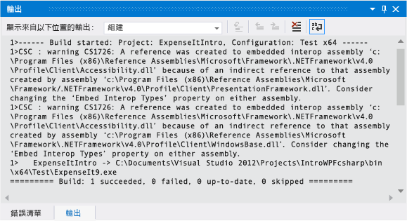
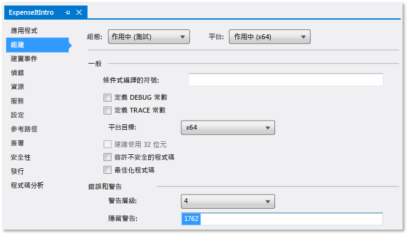
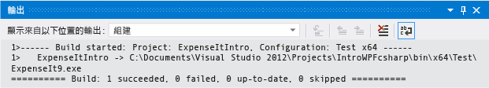
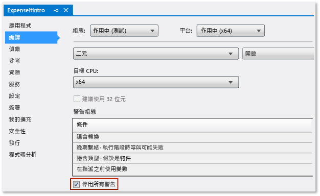

# 逐步解說：建置應用程式
藉由完成本逐步解說，您將更熟悉使用 Visual Studio 建置應用程式時可設定的幾個選項。 您將針對一個範例應用程式建立自訂組建組態、隱藏特定警告訊息、增加建置輸出資訊，以及執行其他工作。  
  
 此主題包括下列章節：  
  
 [安裝範例應用程式](../ide/walkthrough-building-an-application.md#BKMK_installapp)  
  
 [建立自訂組建組態](../ide/walkthrough-building-an-application.md#BKMK_CreateBuildConfig)  
  
 [建置應用程式](../ide/walkthrough-building-an-application.md#BKMK_building)  
  
 [隱藏編譯器警告](../ide/walkthrough-building-an-application.md#BKMK_hidewarning)  
  
 [在輸出視窗中顯示其他組建詳細資料](../ide/walkthrough-building-an-application.md#BKMK_outputdetails)  
  
 [建立發行組建](../ide/walkthrough-building-an-application.md#BKMK_releasebuild)  
  
##   安裝範例應用程式  
 您將使用 [延伸模組和更新] 對話方塊，從 Microsoft 網站上的範例庫尋找並安裝[建置 WPF 應用程式簡介](http://code.msdn.microsoft.com/Introduction-to-Building-b8d16419?SRC=VSIDE)範例。 此範例庫提供各種範例專案和程式碼，可供您在規劃和開發應用程式時進行下載和檢閱。  
  
#### 安裝範例應用程式  
  
1.  在功能表列上，選擇 [工具]、[延伸模組和更新]。  
  
2.  選擇 [線上] 分類，然後選擇 [範例庫] 分類。  
  
3.  在搜尋方塊中指定 `Introduction` 以尋找此範例。  
  
     ![[延伸模組和更新] 對話方塊](../ide/media/buildwalk_extensionsdialogsampledownload.png "BuildWalk_ExtensionsDialogSampleDownload")  
  
4.  在結果清單中，選擇 [建置 WPF 應用程式簡介 (Visual C#)] 或 [建置 WPF 應用程式簡介 (Visual Basic)]。  
  
5.  選擇 [下載] 按鈕，然後選擇 [關閉] 按鈕。  
  
 [建置 WPF 應用程式簡介] 範例會出現在 [新增專案] 對話方塊中。  
  
#### 為範例應用程式建立方案  
  
1.  開啟 [新增專案] 對話方塊。  
  
     ![在功能表列上，依序選擇 [檔案]、[新增] 和 [專案]](../ide/media/exploreide-filenewproject.png "ExploreIDE-FileNewProject")  
  
2.  在 [已安裝] 分類中，選擇 [範例] 分類以顯示 [建置 WPF 應用程式簡介] 範例。  
  
3.  將方案命名為 `IntroWPFcsharp` (Visual C#)。  
  
     ![[新增專案] 對話方塊、已安裝的範例](../ide/media/buildwalk_newprojectdlgintrotowpfsample.png "BuildWalk_NewProjectdlgIntrotoWPFsample")  
  
     OR  
  
     將方案命名為 `IntroWPFvb` (Visual Basic)。  
  
     ![[新增專案] 對話方塊、Visual Basic 範例](../ide/media/buildwalk_newprojectdlgintrotowpfsamplevb.png "BuildWalk_NewProjectdlgIntrotoWPFsampleVB")  
  
4.  選擇 [確定]  按鈕。  
  
##   建立自訂組建組態  
 當您建立方案時，系統會自動為方案定義偵錯和發行組建組態以及其預設平台目標。 之後，您可以自訂這些組態或建立您自己的組態。 組建組態指定組建類型。 組建平台指定應用程式針對該組態的目標作業系統。 如需詳細資訊，請參閱[了解組建組態](../ide/understanding-build-configurations.md)、[了解組建平台](../ide/understanding-build-platforms.md)和 [Debug and Release Project Configurations](http://msdn.microsoft.com/en-us/0440b300-0614-4511-901a-105b771b236e) (偵錯和發行專案組態)。  
  
 您可以使用 [組態管理員] 對話方塊變更或建立組態和平台設定。 在此程序中，您將建立要測試的組建組態。  
  
#### 建立組建組態  
  
1.  開啟 [組態管理員] 對話方塊。  
  
     ![[建置] 功能表、[組態管理員] 命令](../ide/media/buildwalk_configurationmanagerdialogbox.png "BuildWalk_ConfigurationManagerDialogBox")  
  
2.  在 [使用中的方案組態] 清單中，選擇 [新增]。  
  
3.  在 [新增方案組態] 對話方塊中，將新的組態命名為 `Test`，從現有的偵錯組態複製設定，然後選擇 [確定] 按鈕。  
  
     ![[新增方案組態] 對話方塊](~/docs/ide/media/buildwalk_newsolutionconfigdlgbox.png "BuildWalk_NewSolutionConfigDlgBox")  
  
4.  在 [使用中的方案平台] 清單中，選擇 [新增]。  
  
5.  在 [新增方案平台] 對話方塊中，選擇 [x64]，而不要從 x86 平台複製設定。  
  
     ![[新增方案平台] 對話方塊](~/docs/ide/media/buildwalk_newsolutionplatform.png "BuildWalk_NewSolutionPlatform")  
  
6.  選擇 [確定]  按鈕。  
  
 使用中的方案組態已變更為 [測試]，且使用中的方案平台設定為 [x64]。  
  
 ![包含測試組態的 [組態管理員]](../ide/media/buildwalk_configmanagertestconfig.png "BuildWalk_ConfigManagerTestconfig")  
  
 您可以使用 [標準] 工具列上的 [方案組態] 清單，快速驗證或變更使用中的方案組態。  
  
 ![[標準] 工具列的 [方案組態] 選項](../ide/media/buildwalk_standardtoolbarsolutioncongfig.png "BuildWalk_StandardToolbarSolutionCongfig")  
  
##   建置應用程式  
 接下來，您將使用自訂組建組態來建置方案。  
  
#### 若要建置方案  
  
-   在功能表列上，選擇 [建置] 、[建置方案] 。  
  
 [輸出] 視窗顯示組建的結果。 建置成功，但產生幾個警告訊息。  
  
 圖 1：Visual Basic 警告  
  
   
  
 圖 2：Visual C# 警告  
  
   
  
##   隱藏編譯器警告  
 您可以在建置期間暫時隱藏特定警告訊息，以避免干擾建置輸出。  
  
#### 隱藏特定 Visual C# 警告  
  
1.  在**方案總管**中，選擇頂層專案節點。  
  
2.  在功能表列上選擇 [ **檢視**]、[ **屬性頁**]。  
  
     [專案設計工具] 隨即開啟。  
  
3.  選擇 [建置] 頁面，然後在 [隱藏警告] 方塊中指定警告編號 `1762`。  
  
       
  
     如需詳細資訊，請參閱[專案設計工具、建置頁 (C#)](../ide/reference/build-page-project-designer-csharp.md)。  
  
4.  建置方案。  
  
     [輸出] 視窗只會顯示組建的摘要資訊。  
  
       
  
#### 隱藏所有 Visual Basic 建置警告  
  
1.  在方案總管中，選擇頂層專案節點。  
  
2.  在功能表列上選擇 [ **檢視**]、[ **屬性頁**]。  
  
     [專案設計工具] 隨即開啟。  
  
3.  在 [編譯] 頁面上，選取 [停用所有警告] 核取方塊。  
  
       
  
     如需詳細資訊，請參閱[在 Visual Basic 中設定警告](../ide/configuring-warnings-in-visual-basic.md)。  
  
4.  建置方案。  
  
 [輸出] 視窗只會顯示組建的摘要資訊。  
  
   
  
 如需詳細資訊，請參閱[如何︰隱藏編譯器警告](../ide/how-to-suppress-compiler-warnings.md)。  
  
##   在輸出視窗中顯示其他組建詳細資料  
 您可以變更出現在 [輸出] 視窗中的建置流程相關資訊量。 建置詳細等級通常會設定為 [最小]，這表示 [輸出] 視窗只會顯示建置流程摘要，以及任何高優先順序警告或錯誤。 您可以使用[選項對話方塊、專案和方案、建置並執行](../ide/reference/options-dialog-box-projects-and-solutions-build-and-run.md)，來顯示有關組建的詳細資訊。  
  
> [!IMPORTANT]
>  如果顯示詳細資訊，組建將需要更長的時間來完成。  
  
#### 變更輸出視窗中的資訊量  
  
1.  開啟 [選項] 對話方塊。  
  
     ![[工具] 功能表上的 [選項] 命令](../ide/media/exploreide-toolsoptionsmenu.png "ExploreIDE ToolsOptionsmenu")  
  
2.  選擇 [專案和方案] 分類，然後選擇 [建置並執行] 頁面。  
  
3.  在 [MSBuild 專案建置輸出詳細等級] 清單中，選擇 [一般]，然後選擇 [確定] 按鈕。  
  
4.  在功能表列上，選擇 [建置]、[清除方案]。  
  
5.  建置方案，然後檢閱 [輸出] 視窗中的資訊。  
  
     組建資訊包含組建的開始時間 (位於開頭)、檔案的處理順序，以及完成處理所需的時間 (位於結尾)。 這項資訊也包含 Visual Studio 在建置期間執行的實際編譯器語法。  
  
     例如，在 Visual C# 組建中，[/nowarn](/dotnet/visual-basic/reference/command-line-compiler/nowarn) 選項會列出您稍早在本主題中所指定的警告碼 1762，以及其他三個警告。  
  
     在 Visual Basic 組建中，[/nowarn](/dotnet/visual-basic/reference/command-line-compiler/nowarn) 不包含要排除的特定警告，因此不會出現任何警告。  
  
    > [!TIP]
    >  如果您選擇 Ctrl+F 鍵顯示 [尋找] 對話方塊，即可搜尋 [輸出] 視窗的內容。  
  
 如需詳細資訊，請參閱[如何：檢閱、儲存和設定建置記錄檔](../ide/how-to-view-save-and-configure-build-log-files.md)。  
  
##   建立發行組建  
 您可以建置已針對交付最佳化的範例應用程式版本。 針對發行組建，您將指定在開始建置之前將可執行檔複製到網路共用。  
  
 如需詳細資訊，請參閱[如何：變更建置輸出目錄](../ide/how-to-change-the-build-output-directory.md)和[在 Visual Studio 中建置和清除專案與方案](../ide/building-and-cleaning-projects-and-solutions-in-visual-studio.md)。  
  
#### 指定 Visual Basic 的發行組建  
  
1.  開啟 [專案設計工具]。  
  
     ![[檢視] 功能表、[屬性頁] 命令](../ide/media/buildwalk_viewpropertypages.png "BuildWalk_ViewPropertyPages")  
  
2.  選擇 [編譯] 頁面。  
  
3.  在 [組態] 清單中，選擇 [發行]。  
  
4.  在 [平台] 清單中，選擇 [x86]。  
  
5.  在 [建置輸出路徑] 方塊中，指定網路路徑。  
  
     例如，您可以指定 \\\myserver\builds。  
  
    > [!IMPORTANT]
    >  可能會出現一個訊息方塊，警告您所指定的網路共用可能不是信任的位置。 如果您信任所指定的位置，請在訊息方塊中選擇 [確定] 按鈕。  
  
6.  建置應用程式。  
  
     ![[建置] 功能表上的 [建置方案] 命令](../ide/media/exploreide-buildsolution.png "ExploreIDE-BuildSolution")  
  
#### 指定 Visual C# 的發行組建 #
  
1.  開啟 [專案設計工具]。  
  
     ![[檢視] 功能表、[屬性頁] 命令](../ide/media/buildwalk_viewpropertypages.png "BuildWalk_ViewPropertyPages")  
  
2.  選擇 [組建] 頁面。  
  
3.  在 [組態] 清單中，選擇 [發行]。  
  
4.  在 [平台] 清單中，選擇 [x86]。  
  
5.  在 [輸出路徑] 方塊中，指定網路路徑。  
  
     例如，您可以指定 \\\myserver\builds。  
  
    > [!IMPORTANT]
    >  可能會出現一個訊息方塊，警告您所指定的網路共用可能不是信任的位置。 如果您信任所指定的位置，請在訊息方塊中選擇 [確定] 按鈕。  
  
6.  建置應用程式。  
  
     ![[建置] 功能表上的 [建置方案] 命令](../ide/media/exploreide-buildsolution.png "ExploreIDE-BuildSolution")  
  
 可執行檔會複製到您指定的網路路徑。 其路徑為 \\\myserver\builds\\<檔名>.exe。  
  
 恭喜︰您已成功完成本逐步解說。  
  
## 另請參閱  
 [逐步解說：建置專案 (C++)](/cpp/ide/walkthrough-building-a-project-cpp)   
 [ASP.NET Web Application Project Precompilation Overview](http://msdn.microsoft.com/en-us/b940abbd-178d-4570-b441-52914fa7b887) (ASP.NET Web 應用程式專案先行編譯概觀)   
 [逐步解說：使用 MSBuild](../msbuild/walkthrough-using-msbuild.md)

