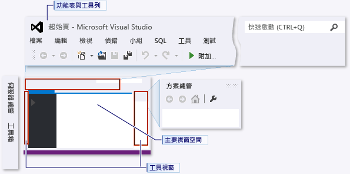
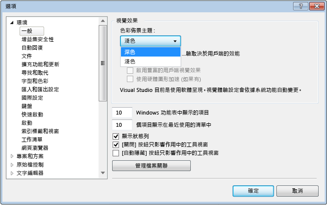
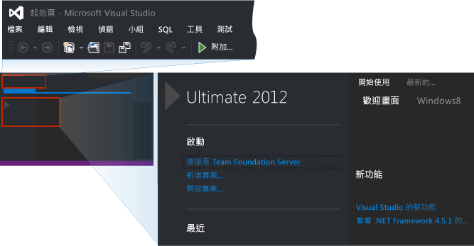
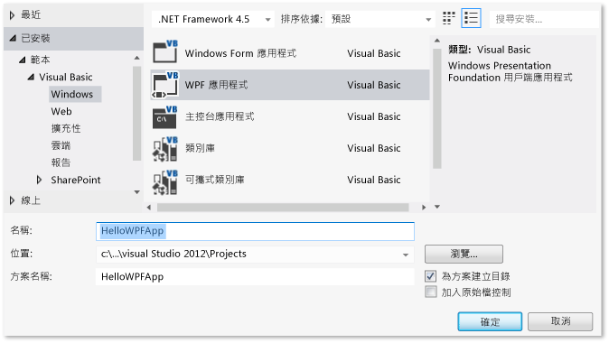
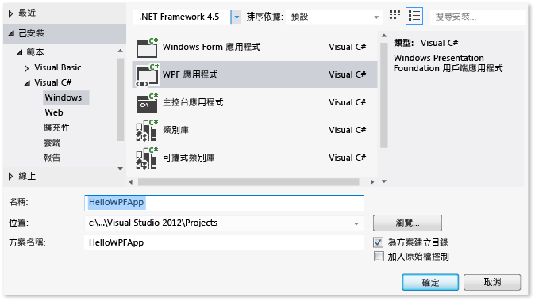
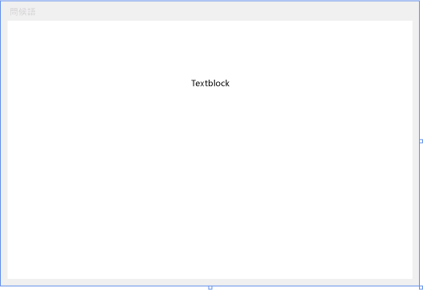
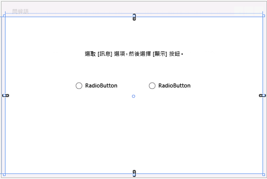
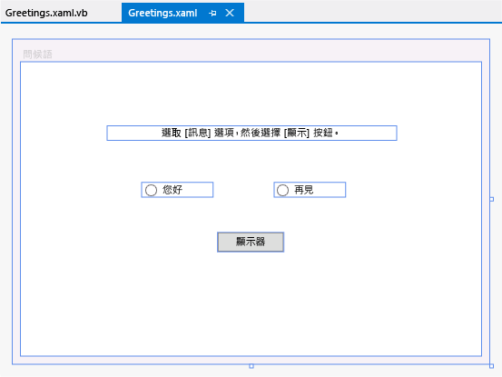

# <a name="walkthrough-create-a-simple-application-with-visual-c-or-visual-basic"></a>逐步解說：使用 Visual C# 或 Visual Basic 建立簡單的應用程式
藉由完成這個逐步解說，讓自己更熟悉許多可在使用 Visual Studio 開發應用程式時運用的工具、對話方塊和設計工具。 當您了解更多關於整合開發環境 (IDE) 的運作時，您將會建立簡單的 "Hello, World" 樣式應用程式、設計 UI、加入程式碼，以及進行偵錯。  
  
 此主題包括下列章節：  
  
 [設定 IDE](../ide/walkthrough-create-a-simple-application-with-visual-csharp-or-visual-basic.md#BKMK_ConfigureIDE)  
  
 [建立簡單的應用程式](../ide/walkthrough-create-a-simple-application-with-visual-csharp-or-visual-basic.md#BKMK_CreateApp)  
  
 [偵錯和測試應用程式](../ide/walkthrough-create-a-simple-application-with-visual-csharp-or-visual-basic.md#BKMK_DebugTest)  
  
> [!NOTE]
>  這個逐步解說是以 Visual Studio Professional 為基礎，提供您在建立這個逐步解說的專案時使用的 WPF 應用程式範本。 Visual Studio Express for Windows Desktop 也有提供該範本，不過，Visual Studio Express for Windows 和 Visual Studio Express for Web 則未提供。 如需如何使用 Visual Studio Express for Windows 的入門資訊，請參閱 [Windows 市集應用程式的開發人員中心](http://msdn.microsoft.com/windows/apps/br229519)。 如需如何使用 Visual Studio Express for Web 的入門資訊，請參閱 [Get Started with ASP.NET](http://www.asp.net/get-started)(開始使用 ASP.NET)。 此外，您的 Visual Studio 版本和使用的設定會決定某些使用者介面之項目的名稱和位置。 請參閱 [Visual Studio 中的自訂開發設定](http://msdn.microsoft.com/en-us/22c4debb-4e31-47a8-8f19-16f328d7dcd3)。  
  
##  <a name="BKMK_ConfigureIDE"></a> 設定 IDE  
 當您第一次啟動 Visual Studio 時，Visual Studio 會提示您使用 Microsoft 服務帳戶 (MSA) 登入，請 [登入 Visual Studio](http://blogs.msdn.com/b/visualstudio/archive/2013/06/28/welcome-sign-in-to-visual-studio.aspx)。 您不一定要登入，可以稍後再進行。  
  
 在 Visual Studio 上市之後，您接下來就必須選擇一組可將預先定義的自訂套用到 IDE 的設定組合。 每個設定組合都是為了讓您更輕鬆地開發應用程式而精心設計的。  
  
 這個逐步解說會假設您已套用 [一般開發設定]\(它對 IDE 套用的自訂最少)。 如果您已經選擇 C# 或 Visual Basic (兩者都是很好的選擇)，則不需要變更您的設定。  如果您要變更您的設定，則可使用 [匯入和匯出設定精靈] 。 請參閱 [Visual Studio 中的自訂開發設定](http://msdn.microsoft.com/en-us/22c4debb-4e31-47a8-8f19-16f328d7dcd3)。  
  
 開啟 Visual Studio 之後，您可以看到工具視窗、功能表和工具列，以及主視窗空間。 工具視窗會停駐在應用程式視窗的左右端，同時 [ **快速啟動**]、功能表列和標準工具列則位於視窗的上方。 位於應用程式視窗中央的是 [ **起始頁**]。 當您載入方案或專案時，編輯器和設計工具會出現在 [起始頁]  所在的空間中。 在開發應用程式時，您大部分時間都會在此中央區域工作。  
  
 圖 2：Visual Studio IDE  
  
   
  
 您可以使用 [ **選項** ] 對話方塊，對 Visual Studio 進行其他自訂，例如變更編輯器內文字的字體和大小，或 IDE 的色彩佈景主題。 根據您套用的設定，某些對話方塊中的項目可能不會自動出現。 您可以選擇 [ **顯示所有設定** ] 核取方塊以確保所有可能的選項都會出現。  
  
 圖 3：[選項] 對話方塊  
  
 ![包含 [顯示所有設定] 選項的 [選項] 對話方塊](../ide/media/exploreide-optionsdialogbox.png "ExploreIDE-Optionsdialogbox")  
  
 在此範例中，您會將 IDE 的色彩佈景主題由亮轉暗。  如果您願意的話，可以直接跳到建立專案。  
  
#### <a name="to-change-the-color-theme-of-the-ide"></a>變更 IDE 的色彩佈景主題  
  
1.  選擇上方的 [工具] **選項** 功能表及 [選項 …]  項目，即可開啟 [選項] **選項 …** 對話方塊。  
  
     ![[工具] 功能表上的 [選項] 命令](../ide/media/exploreide-toolsoptionsmenu.png "ExploreIDE ToolsOptionsmenu")  
  
2.  將 [ **色彩佈景主題。** ] 變更為 [ **深色**]，然後按一下 [ **確定**]。  
  
       
  
 在 Visual Studio 顯示的色彩應該像下面的影像：  
  
   
  
 這個逐步解說的其餘部分使用的圖片色彩佈景主題是淺色佈景主題。 如需自訂 IDE 的詳細資訊，請參閱[在 Visual Studio 中自訂開發設定](http://msdn.microsoft.com/en-us/22c4debb-4e31-47a8-8f19-16f328d7dcd3)。  
  
##  <a name="BKMK_CreateApp"></a> 建立簡單的應用程式  
  
### <a name="create-the-project"></a>建立專案  
 當您在 Visual Studio 中建立應用程式時，您需要先建立一個專案和一個方案。 在這個範例中，您將建立 Windows Presentation Foundation (WPF) 專案。  
  
##### <a name="to-create-the-wpf-project"></a>若要建立 WPF 專案  
  
1.  建立新的專案。 在功能表列上，依序選擇 [檔案] 、[新增] 和 [專案…] 。  
  
     ![在功能表列上，依序選擇 [檔案]、[新增] 和 [專案]](../ide/media/exploreide-filenewproject.png "ExploreIDE-FileNewProject")  
  
     您也可以在 [快速啟動]  方塊中輸入「新增專案」  ，執行相同的動作。  
  
     ![在 [快速啟動] 方塊中，指定新增專案](../ide/media/exploreide-quicklaunchnewprojectsmall.png "ExploreIDE-QuickLaunchNewProjectsmall")  
  
2.  例如，在左窗格選擇 [已安裝] 、[範本] 、[Visual C#] 、[Windows] ，然後在中央窗格選擇 [WPF 應用程式]，即可選擇 Visual Basic 或 Visual C# WPF 應用程式範本。  在 [新增專案] 對話方塊下方，將專案命名為 HelloWPFApp。  
  
       
  
     OR  
  
       
  
 Visual Studio 會建立 HelloWPFApp 專案和方案，而且 [方案總管]  會顯示各種不同檔案。 WPF 設計工具會在分割檢視中顯示 MainWindow.xaml 的設計檢視和 XAML 檢視。 您可以滑動分隔器來增加或減少顯示任一檢視。  您可以選擇只查看視覺檢視，或只查看 XAML 檢視。 (如需詳細資訊，請參閱[適用於 Windows Forms 開發人員的 WPF 設計工具](http://msdn.microsoft.com/en-us/47ad0909-e89b-4996-b4ac-874d929f94ca))。 下列項目會在 [ **方案總管**] 中出現：  
  
 圖 5：專案項目  
  
   
  
 建立專案之後，您可以進行自訂。 使用 [屬性]  視窗 (在 [檢視]  功能表上)，就可以顯示和變更應用程式中的專案項目、控制項及其他項目的選項。 您可以使用專案屬性和屬性頁，顯示並變更專案和方案的選項。  
  
##### <a name="to-change-the-name-of-mainwindowxaml"></a>變更 MainWindow.xaml 的名稱  
  
1.  在下列程序中，您將會賦予 MainWindow 一個更為具體的名稱。 在 [ **方案總管**] 中，選取 MainWindow.xaml。 您應該會看到 [屬性]  視窗；如果沒有，請選擇 [檢視]  功能表和 [屬性視窗]  項目。 將 [ **檔案名稱** ] 屬性變更為 `Greetings.xaml`。  
  
     ![已反白顯示檔案名稱的 [屬性] 視窗](../ide/media/exploreide-filenameinpropertieswindow.png "ExploreIDE-FilenameinPropertiesWindow")  
  
     [方案總管] 會顯示檔案的名稱現在是 Greetings.xaml；如果您展開 MainWindow.xaml 節點 (將焦點放在節點中，並按向右鍵)，就會看到 MainWindow.xaml.vb 或 MainWindow.xaml.cs 的名稱現在是 Greetings.xaml.vb 或 Greetings.xaml.cs。 這個程式碼檔案套疊在.xaml 檔案節點下，顯示它們彼此非常密切相關。  
  
    > [!WARNING]
    >  這項變更會導致錯誤，您將在稍後步驟中學習如何加以偵錯和修正。  
  
2.  在 [方案總管] 的 [設計工具] 檢視中開啟 Greetings.xaml (在節點具有焦點時按下 Enter 鍵)，然後使用滑鼠選取視窗的標題列。  
  
3.  在 [ **屬性** ] 視窗中，將 [ **標題** ] 屬性的值變更為 `Greetings`。  
  
 MainWindow.xaml 的標題列顯示的文字現在變成 Greetings。  
  
### <a name="design-the-user-interface-ui"></a>設計使用者介面 (UI)  
 我們會將三種類型的控制項加入至這個應用程式：一個 TextBlock 控制項、兩個 RadioButton 控制項和一個 Button 控制項。  
  
##### <a name="to-add-a-textblock-control"></a>加入 TextBlock 控制項  
  
1.  選擇 [檢視]  功能表和 [工具箱]  項目，開啟 [工具箱]  視窗。  
  
2.  在 [ **工具箱**] 中，搜尋 TextBlock 控制項。  
  
     ![已反白顯示 TextBlock 控制項的 [工具箱]](../ide/media/exploreide-textblocktoolbox.png "ExploreIDE-TextBlockToolbox")  
  
3.  選擇 TextBlock 項目並將它拖曳至設計介面上的視窗，即可將 TextBlock 控制項加入設計介面。  將控制項置中靠近視窗頂端。  
  
 您的視窗應該會和下圖類似：  
  
 圖 7：具有 TextBlock 控制項的 Greetings 視窗  
  
   
  
 XAML 標記應該看起來與下列程式碼範例相似：  
  
```  
<TextBlock HorizontalAlignment="Center" TextWrapping="Wrap" VerticalAlignment="Center" RenderTransformOrigin="4.08,2.312" Margin="237,57,221,238"><Run Text="TextBlock"/><InlineUIContainer><TextBlock TextWrapping="Wrap" Text="TextBlock"/>  
```  
  
##### <a name="to-customize-the-text-in-the-text-block"></a>自訂文字方塊中的文字  
  
1.  在 XAML 檢視中，找出 TextBlock 的標記並變更 Text 屬性：`Text=”Select a message option and then choose the Display button.”`  
  
2.  如果 TextBlock 未展開到符合 [設計中] 檢視的大小，請放大 TextBlock 控制項 (使用邊緣的抓取控點) 使其顯示所有文字。  
  
3.  按 Ctrl-s 或使用 [檔案]  功能表項目儲存您的變更。  
  
 接下來，您會將兩個 [RadioButton](http://msdn.microsoft.com/Library/6c9ba847-eab7-4bba-9c74-6b56ef72067b) 控制項新增至表單。  
  
##### <a name="to-add-radio-buttons"></a>加入選項按鈕  
  
1.  在 [ **工具箱**] 中，搜尋 RadioButton 控制項。  
  
     ![已選取 RadioButton 控制項的 [工具箱] 視窗](../ide/media/exploreide-radiobuttontoolbox.png "ExploreIDE-RadioButtonToolbox")  
  
2.  選擇 RadioButton 項目並將它拖曳至設計介面上的視窗兩次，然後移動按鈕 (加以選取並使用方向鍵)，讓按鈕並排顯示於 TextBlock 控制項下方，即可將兩個 RadioButton 控制項加入設計介面。  
  
     您的視窗應該會像這樣：  
  
     圖 8：Greetings 視窗中的 RadioButtons。  
  
       
  
3.  在左側 RadioButton 控制項的 [ **屬性** ] 視窗中，將 [ **名稱** ] 屬性 (在 [ **屬性** ] 視窗頂端的屬性) 變更為 `RadioButton1`。  確認您在表單上選取的是 RadioButton 而非背景格線；[名稱] 欄位下的 [屬性視窗] 的 [類型] 欄位應該會顯示 RadioButton。  
  
4.  在右邊 RadioButton 控制項的 [屬性]  視窗中，將 [名稱]  屬性變更為 `RadioButton2`，然後按 Ctrl-s 或使用 [檔案]  功能表項目儲存您的變更。  變更和儲存之前，請確定您選取的是 RadioButton。  
  
 您現在可以為每個 RadioButton 控制項加入顯示的文字。 下列步驟會更新 RadioButton 控制項的 [ **內容** ] 屬性。  
  
##### <a name="to-add-display-text-for-each-radio-button"></a>為每個選項按鈕加入顯示的文字  
  
1.  在設計介面上，在選取 RadioButton1 時按滑鼠右鍵，選擇 [編輯文字] ，然後輸入 `Hello`，即可開啟 RadioButton1 的捷徑功能表。  
  
2.  在選取 RadioButton2 時按滑鼠右鍵，選擇 [編輯文字] ，然後輸入 `Goodbye`，即可開啟 RadioButton2 的捷徑功能表。  
  
 最後一個要新增的 UI 項目是 [Button](http://msdn.microsoft.com/Library/a9d8f5a5-c98c-463e-808a-5a4e63173098) 控制項。  
  
##### <a name="to-add-the-button-control"></a>加入 Button 控制項  
  
1.  在 [工具箱] 中搜尋 **Button** 控制項，然後選取按鈕並將它拖曳至設計檢視中的表單，即可將它加入設計介面的 RadioButton 控制項底下。  
  
2.  在 XAML 檢視中，將 Button 控制項的 [內容]  值從 `Content=”Button”` 變更為 `Content=”Display”`，然後儲存變更 (Ctrl-s 或使用 [檔案]  功能表)。  
  
     這個標記應類似於下列範例：`<Button Content="Display" HorizontalAlignment="Left" VerticalAlignment="Top" Width="75" Margin="215,204,0,0"/>`  
  
 您的視窗應該會和下圖類似。  
  
 圖 9：最後的 Greetings UI  
  
   
  
### <a name="add-code-to-the-display-button"></a>將程式碼加入至 Display Button  
 此應用程式執行時，會在使用者第一次選擇選項按鈕並選擇 [ **顯示** ] 按鈕之後顯示訊息方塊。 一個訊息方塊會顯示 Hello，而另外一個會顯示 Goodbye。 若要建立這個行為，您必須將程式碼加入至 Greetings.xaml.vb 或 Greetings.xaml.cs 中的 Button_Click 事件。  
  
##### <a name="add-code-to-display-message-boxes"></a>加入程式碼以顯示訊息方塊  
  
1.  在設計介面上，按兩下 [ **顯示** ] 按鈕。  
  
     Greetings.xaml.vb 或 Greetings.xaml.cs 隨即開啟，並將游標置於 Button_Click 事件中。 您也可以加入 click 事件處理常式，如下所示 (如果貼上的程式碼的任一名稱下有紅色曲線，表示您可能沒有在設計介面上選取 RadioButton 控制項並加以重新命名)：  
  
     在 Visual Basic 中，事件處理常式如下所示：  
  
    ```vb#  
    Private Sub Button_Click_1(sender As Object, e As RoutedEventArgs)  
  
    End Sub  
    ```  
  
     在 Visual C# 中，事件處理常式如下所示：  
  
    ```c#  
    private void Button_Click_1(object sender, RoutedEventArgs e)  
    {  
  
    }  
    ```  
  
2.  對於 Visual Basic，請輸入下列程式碼：  
  
    ```vb#  
    If RadioButton1.IsChecked = True Then  
        MessageBox.Show("Hello.")  
    Else RadioButton2.IsChecked = True  
        MessageBox.Show("Goodbye.")  
    End If  
  
    ```  
  
     對於 Visual C# 中，請輸入下列程式碼：  
  
    ```  
    if (RadioButton1.IsChecked == true)  
    {  
        MessageBox.Show("Hello.");  
    }  
    else  
    {  
        RadioButton2.IsChecked = true;  
        MessageBox.Show("Goodbye.");  
    }  
    ```  
  
3.  儲存應用程式。  
  
##  <a name="BKMK_DebugTest"></a> 偵錯和測試應用程式  
 接下來，您會偵錯應用程式以尋找錯誤，並測試兩個訊息方塊是否都正確出現。 下列指示會告訴您如何建置和啟動偵錯工具，不過您稍後也可閱讀[建置 WPF 應用程式 (WPF)](http://msdn.microsoft.com/Library/a58696fd-bdad-4b55-9759-136dfdf8b91c) 和[偵錯 WPF](../debugger/debugging-wpf.md) 以取得詳細資訊。  
  
### <a name="find-and-fix-errors"></a>尋找和修正錯誤  
 在這個步驟中，您將會發現我們先前變更主視窗 XAML 檔案名稱所產生的錯誤。  
  
##### <a name="to-start-debugging-and-find-the-error"></a>開始偵錯並找出錯誤  
  
1.  依序選取 [ **偵錯**] 和 [ **開始偵錯**]，以啟動偵錯工具。  
  
     ![[偵錯] 功能表上的 [開始偵錯] 命令](../ide/media/exploreide-startdebugging.png "ExploreIDE-StartDebugging")  
  
     此時會顯示對話方塊，表示發生 IOException：找不到資源 'mainwindow.xaml'。  
  
2.  選擇 [ **確定** ] 按鈕，然後停止偵錯工具。  
  
     ![[偵錯] 功能表上的 [停止偵錯] 命令](../ide/media/exploreide-stopdebugging.png "ExploreIDE-StopDebugging")  
  
 我們在這個逐步解說開始時，將 Mainwindow.xaml 重新命名為 Greetings.xaml，但是程式碼仍然參照 Mainwindow.xaml 做為應用程式的啟動 URI，因此專案無法啟動。  
  
##### <a name="to-specify-greetingsxaml-as-the-startup-uri"></a>指定 Greetings.xaml 做為啟動 URI  
  
1.  在 [方案總管] 的 [XAML] 檢視中 (無法在 [設計] 檢視中開啟)，選取 App.xaml 檔案 (在 C# 專案中) 或 Application.xaml 檔案 (在 Visual Basic 專案中) 並按 Enter 鍵，或是按兩下該檔案，即可予以開啟。  
  
2.  將 `StartupUri="MainWindow.xaml"` 變更為 `StartupUri="Greetings.xaml"`，然後以 Ctrl-s 儲存變更。  
  
 再次啟動偵錯工具 (按 F5)。 您應該會看到應用程式的 Greetings 視窗。  
  
### <a name="to-debug-with-breakpoints"></a>使用中斷點進行偵錯  
 藉由加入一些中斷點，您就可以在偵錯時測試程式碼。 您可以選擇主功能表上的 [偵錯]  及 [切換中斷點]  ，或是在您要設定中斷點的那行程式碼旁邊按一下編輯器的左邊界，即可加入中斷點。  
  
##### <a name="to-add-breakpoints"></a>加入中斷點  
  
1.  開啟 Greetings.xaml.vb 或 Greetings.xaml.cs，然後選取下列程式碼行：`MessageBox.Show("Hello.")`  
  
2.  依序選取 [ **偵錯**] 和 [ **切換中斷點**]，以新增中斷點。  
  
     ![[偵錯] 功能表上的 [切換中斷點] 命令](../ide/media/exploreide-togglebreakpoint.png "ExploreIDE-ToggleBreakpoint")  
  
     在編輯器視窗最左緣、程式碼行的旁邊會出現一個紅色圓圈。  
  
3.  請選取下列程式碼行： `MessageBox.Show("Goodbye.")`。  
  
4.  按 F9 鍵加入中斷點，然後按 F5 鍵開始偵錯。  
  
5.  在 [ **Greetings** ] 視窗中，選擇 [ **Hello** ] 選項按鈕，然後選擇 [ **顯示** ] 按鈕。  
  
     程式碼行 `MessageBox.Show("Hello.")` 會以黃色反白顯示。 在 IDE 下方，[自動變數]、[區域變數] 和 [監看式] 視窗會一起停駐在左邊，而 [呼叫堆疊]、[中斷點]、[命令]、[即時運算] 和 [輸出] 視窗會一起停駐在右邊。  
  
6.  在功能表列上，選擇 [ **偵錯**]、[ **跳離函式**]。  
  
     應用程式會繼續執行，而且會顯示含有文字 "Hello" 的訊息方塊。  
  
7.  選擇訊息方塊上的 [ **確定** ] 按鈕將它關閉。  
  
8.  在 [ **Greetings** ] 視窗中，選擇 [ **Goodbye** ] 選項按鈕，然後選擇 [ **顯示** ] 按鈕。  
  
     程式碼行 `MessageBox.Show("Goodbye.")` 會以黃色反白顯示。  
  
9. 選擇 F5 鍵繼續偵錯。 當訊息方塊出現時，選擇訊息方塊中的 [ **確定** ] 按鈕關閉它。  
  
10. 按 SHIFT + F5 鍵 (先按 SHIFT，並在按住它時按 F5) 以停止偵錯。  
  
11. 在功能表列上，選擇 [ **偵錯**]、[ **停用所有中斷點**]。  
  
### <a name="build-a-release-version-of-the-application"></a>建置應用程式的發行版本  
 既然已經驗證應用程式的運作一切正常，您就可以準備其發行組建。  
  
##### <a name="to-clean-the-solution-files-and-build-a-release-version"></a>清除方案檔案和建置發行版本  
  
1.  在主功能表上，選取 [建置] 及 [清除方案]  ，刪除在上一個建置期間建立的中繼檔和輸出檔。  這並非必要動作，但它可清除偵錯建置輸出。  
  
     ![[建置] 功能表上的 [清除方案] 命令](../ide/media/exploreide-cleansolution.png "ExploreIDE-CleanSolution")  
  
2.  使用工具列上的下拉式控制項 (它目前的名稱是 "Debug")，將 HelloWPFApp 的建置組態從 [偵錯]  變更為 [發行]  。  
  
     ![已選取 [發行] 的 [標準] 工具列](../ide/media/exploreide-releaseversion.png "ExploreIDE-ReleaseVersion")  
  
3.  選擇 [建置] 及 [建置方案]  或按 F6 鍵，即可建置方案。  
  
     ![[建置] 功能表上的 [建置方案] 命令](../ide/media/exploreide-buildsolution.png "ExploreIDE-BuildSolution")  
  
 恭喜您完成此逐步解說！ 您可在方案和專案目錄下找到您建置的 .exe (…\HelloWPFApp\HelloWPFApp\bin\Release\\)。 如果您想要探索更多範例，請參閱 [Visual Studio 範例](../ide/visual-studio-samples.md)。  
  
## <a name="see-also"></a>另請參閱  
 [Visual Studio 2015 的新功能](../ide/what-s-new-in-visual-studio-2015.md)   
 [Visual Studio 使用者開發入門](../ide/get-started-developing-with-visual-studio.md)   
 [產能的秘訣](../ide/productivity-tips-for-visual-studio.md)
