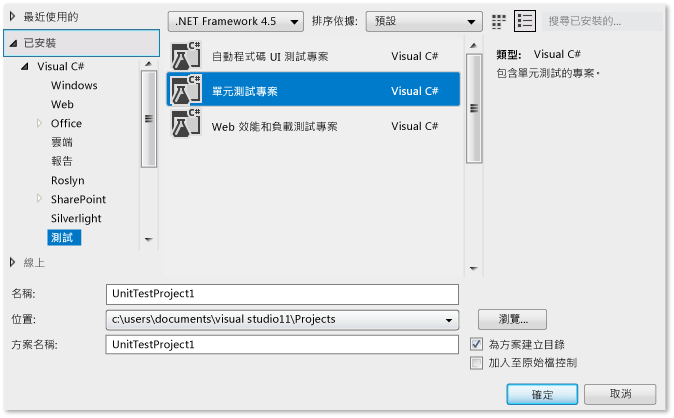
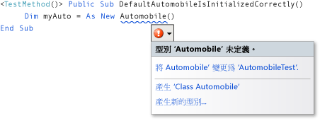
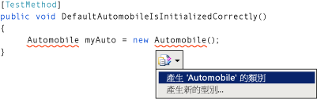
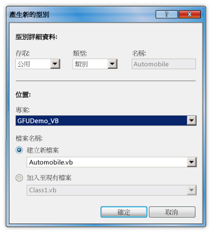
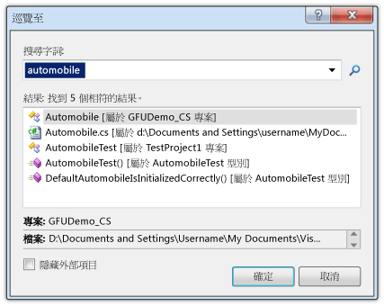
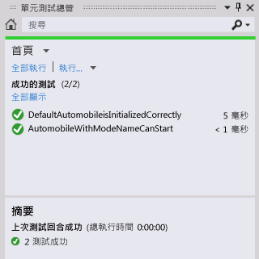

# 逐步解說：以使用時產生功能支援測試優先
[!INCLUDE[vs2017banner](../code-quality/includes/vs2017banner.md)]

本主題示範如何使用 [使用時產生](/visual-cpp/misc/generate-from-usage) 功能，支援「測試先行」開發方式。  
  
 *「測試先行」開發方式*\(Test\-first development\) 這種軟體設計方法，要先根據產品規格撰寫單元測試，再撰寫測試成功所需要的原始程式碼。[!INCLUDE[vsprvs](../code-quality/includes/vsprvs_md.md)] 支援「測試先行」開發方式的做法是，當您第一次在測試案例中參考類型和成員，在它們被定義之前，以原始程式碼產生新的類型和成員。  
  
 [!INCLUDE[vsprvs](../code-quality/includes/vsprvs_md.md)] 在盡可能不中斷工作流程的情況下產生新的類型和成員。 您可以建立類型、方法、屬性、欄位或建構函式的 Stub，但不離開目前所在的程式碼位置。 當您開啟對話方塊指定類型產生選項時，焦點會在對話方塊一關閉時，立即回到目前開啟的檔案。  
  
 \[從用量產生\] 功能可以和整合了 [!INCLUDE[vsprvs](../code-quality/includes/vsprvs_md.md)] 的測試架構一起使用。 本主題會示範 Microsoft 單元測試架構。  
  
 [!INCLUDE[note_settings_general](../data-tools/includes/note_settings_general_md.md)]  
  
### 建立 Windows 類別庫專案和測試專案  
  
1.  在 [!INCLUDE[csprcs](../data-tools/includes/csprcs_md.md)] 或 [!INCLUDE[vbprvb](../code-quality/includes/vbprvb_md.md)] 中建立新的 Windows 類別庫專案。 將其命名為 `GFUDemo_VB` 或 `GFUDemo_CS`，視所用語言而定。  
  
2.  在**方案總管**中，以滑鼠右鍵按一下上方的解決方案，指向 \[加入\]，然後按一下 \[新增專案\]。 在 \[新增專案\] 對話方塊左側的 \[專案類型\] 窗格中，按一下 \[測試\]。  
  
3.  在 \[範本\] 窗格中按一下 \[單元測試專案\]，並接受預設名稱 UnitTestProject1。 下圖顯示當它出現在 [!INCLUDE[csprcs](../data-tools/includes/csprcs_md.md)] 時的對話方塊。[!INCLUDE[vbprvb](../code-quality/includes/vbprvb_md.md)] 中的對話方塊看起來很類似。  
  
       
新增專案對話方塊  
  
4.  按一下 \[確定\] 關閉 \[新增專案\] 對話方塊。 您已準備好可開始撰寫測試  
  
### 從單元測試產生新類別  
  
1.  測試專案包含名為 UnitTest1 的檔案。 在**方案總管**中按兩下這個檔案，在程式碼編輯器中開啟它。 已產生測試類別和測試方法。  
  
2.  找到類別 `UnitTest1` 的宣告，並將它重新命名為 `AutomobileTest`。 如果 C\# 中有 `UnitTest1()` 建構函式，請將它重新命名為 `AutomobileTest()`。  
  
    > [!NOTE]
    >  IntelliSense 提供兩種完成 IntelliSense 陳述式的方式：*完成模式*\(completion mode\) 和*建議模式*\(suggestion mode\)。 當類別和成員在使用前即已定義的情況下，請使用建議模式。 當 IntelliSense 視窗開啟時，您可以按 CTRL\+ALT\+SPACEBAR 在完成模式和建議模式之間切換。 如需詳細資訊，請參閱 [使用 IntelliSense](../ide/using-intellisense.md)。 當您在下個步驟輸入 `Automobile` 時，建議模式非常有幫助。  
  
3.  找到 `TestMethod1()` 方法並將它重新命名為 `DefaultAutomobileIsInitializedCorrectly()`。 在這個方法內，建立名為 `Automobile` 的類別新執行個體，如下列圖例所示。 波浪底線隨即出現，這表示發生編譯時期錯誤，類型名稱下會出現智慧標籤。 智慧標籤的確切位置會因您使用 [!INCLUDE[vbprvb](../code-quality/includes/vbprvb_md.md)] 或 [!INCLUDE[csprcs](../data-tools/includes/csprcs_md.md)] 而不同。  
  
       
Visual Basic  
  
       
Visual C\#  
  
4.  將滑鼠指標停留在智慧標籤上查看錯誤訊息，表示尚未定義任何名為 `Automobile` 的類型。 按一下智慧標籤，或按 CTRL\+。 \(CTRL\+ 句號\) 開啟 \[從用量產生\] 快顯功能表，如下圖所示。  
  
       
Visual Basic  
  
       
Visual C\#  
  
5.  您現在有兩種選擇。 您可以按一下 \[產生 'Class Automobile'\] 在測試專案中建立新的檔案，並填入名為 `Automobile` 的空類別。 這可以在新檔案中快速建立新類別，這個新檔案具有目前專案的預設存取修飾詞。 您也可以按一下 \[產生新的類型\] 開啟 \[產生新的類型\] 對話方塊。 提供的選項包括將類別放在現有的檔案，以及將檔案加入另一個專案中。  
  
     按一下 \[產生新的類型\] 開啟 \[產生新的類型\] 對話方塊，如下圖所示。 在 \[專案\] 清單中，按一下 \[GFUDemo\_VB\] 或 \[GFUDemo\_CS\] 指示 [!INCLUDE[vsprvs](../code-quality/includes/vsprvs_md.md)] 將檔案加入原始程式碼專案中，不是加入測試專案。  
  
       
\[產生新的類型\] 對話方塊  
  
6.  按一下 \[確定\] 關閉對話方塊，並建立新的檔案。  
  
7.  在**方案總管**的 \[GFUDemo\_VB\] 或 \[GFUDemo\_CS\] 專案節點下，確認是否有新增的 Automobile.vb 或 Automobile.cs 檔案。 在程式碼編輯器中，焦點仍在 `AutomobileTest.DefaultAutomobileIsInitializedCorrectly`。 您可以盡可能不中斷的方式繼續撰寫測試。  
  
### 產生屬性 Stub  
  
1.  假設產品規格規定 `Automobile` 類別有兩個公用屬性，名為 `Model` 和 `TopSpeed`。 這些屬性必須由預設的建構函式以 `"Not specified"` 和 `-1` 的預設值來初始化。 以下的單元測試會驗證預設建構函式是否將屬性設定為正確的預設值。  
  
     在 `DefaultAutomobileIsInitializedCorrectly` 中加入下列程式碼行：  
  
     [!CODE [VbTDDWalkthrough#1](../CodeSnippet/VS_Snippets_VBCSharp/vbtddwalkthrough#1)]  
  
     因為程式碼參考 `Automobile` 上未定義的兩個屬性，所以會顯示智慧標籤。 按一下 `Model` 的智慧標籤，然後按一下 \[產生屬性 Stub\]。 也產生 `TopSpeed` 屬性的屬性Stub。  
  
     在 `Automobile` 類別中，會從內容正確推斷出新屬性的類型。  
  
     下圖顯示智慧標籤的快顯功能表。  
  
       
Visual Basic  
  
       
Visual C\#  
  
### 找出原始程式碼  
  
1.  使用 \[巡覽至\] 功能巡覽至 Automobile.cs 或 Automobile.vb 原始程式碼檔，以便驗證是否已產生新的屬性。  
  
     \[巡覽至\] 功能可讓您快速輸入文字字串，例如類型名稱或部分名稱，按一下結果清單中的項目移至想要的位置。  
  
     在程式碼編輯器按一下，然後按 CTRL\+, \(CTRL\+逗號\)，隨即開啟 \[巡覽至\] 對話方塊。 在文字方塊中輸入 `automobile`。 按一下清單中的 \[汽車\] 類別，然後按一下 \[確定\]。  
  
     下圖即會顯示 \[巡覽至\] 視窗。  
  
       
\[巡覽至\] 視窗  
  
### 產生新建構函式的 Stub  
  
1.  在這個測試方法中，您會產生建構函式 Stub，它會初始化 `Model` 和 `TopSpeed` 屬性以獲得您指定的值。 稍後，您會加入更多的程式碼以完成測試。 請將下列其他測試方法加入您的 `AutomobileTest` 類別中。  
  
     [!CODE [VbTDDWalkthrough#2](../CodeSnippet/VS_Snippets_VBCSharp/vbtddwalkthrough#2)]  
  
2.  按一下新類別建構函式下的智慧標籤，然後按一下 \[產生建構函式 Stub\]。 請注意，在 `Automobile` 類別檔案中，新的建構函式已檢查建構函式呼叫中所使用的區域變數名稱，找到 `Automobile` 類別中具有相同名稱的屬性，並提供建構函式主體的程式碼將引數值儲存在 `Model` 和 `TopSpeed` 屬性中。 \(在 [!INCLUDE[vbprvb](../code-quality/includes/vbprvb_md.md)] 中，新建構函式的 `_model` 和 `_topSpeed` 欄位都是 `Model` 和 `TopSpeed` 屬性的隱含定義支援欄位。\)  
  
3.  產生新的建構函式後，`DefaultAutomobileIsInitializedCorrectly` 的預設建構函式呼叫下會出現波浪底線。 錯誤訊息指出 `Automobile` 類別沒有任何建構函式採用零引數。 若要產生沒有任何參數的明確預設建構函式，請按一下智慧標籤，然後按一下 \[產生建構函式 Stub\]。  
  
### 產生方法的 Stub  
  
1.  假設規格規定，如果其 `Model` 和 `TopSpeed` 屬性設為預設值以外的值，新的 `Automobile` 就可以放入執行狀態。 請將下列各行加入 `AutomobileWithModelNameCanStart` 方法中。  
  
     [!CODE [VbTDDWalkthrough#3](../CodeSnippet/VS_Snippets_VBCSharp/vbtddwalkthrough#3)]  
  
2.  按一下 `myAuto.Start` 方法呼叫的智慧標籤，然後按一下 \[產生方法 Stub\]。  
  
3.  按一下 `IsRunning` 屬性的智慧標籤，然後按一下 \[產生屬性 Stub\]。 現在 `Automobile` 類別包含下列程式碼。  
  
     [!CODE [VbTDDWalkthrough#4](../CodeSnippet/VS_Snippets_VBCSharp/vbtddwalkthrough#4)]  
  
### 執行測試  
  
1.  在 \[單元測試\] 功能表中指向 \[執行單元測試\]，然後按一下 \[所有測試\]。 這個命令會執行為目前的解決方案撰寫的所有測試架構中的全部測試。  
  
     在這個案例中，會有兩個測試，而且兩個測試都應該要失敗。`DefaultAutomobileIsInitializedCorrectly` 測試失敗的原因是 `Assert.IsTrue` 條件傳回 `False`。`AutomobileWithModelNameCanStart` 測試失敗的原因是 `Automobile` 類別的 `Start` 方法擲回例外狀況。  
  
     下圖顯示 \[測試結果\] 視窗。  
  
       
測試結果視窗  
  
2.  在 \[測試結果\] 視窗中，在每個測試結果資料列按兩下，移至每一項測試失敗的位置。  
  
### 實作原始程式碼  
  
1.  將下列程式碼加入預設建構函式中，讓 `Model`、`TopSpeed` 和 `IsRunning` 屬性都初始化為正確的 `"Not specified"`、`-1` 和 `True` \(`true`\) 預設值。  
  
     [!CODE [VbTDDWalkthrough#5](../CodeSnippet/VS_Snippets_VBCSharp/vbtddwalkthrough#5)]  
  
2.  呼叫 `Start` 方法時，它應該只有在 `Model` 或 `TopSpeed` 屬性設為預設值以外的值時，才將 `IsRunning` 旗標設為 true。 從方法主體移除 `NotImplementedException`，並加入下列程式碼。  
  
     [!CODE [VbTDDWalkthrough#6](../CodeSnippet/VS_Snippets_VBCSharp/vbtddwalkthrough#6)]  
  
### 再次執行測試  
  
1.  在 \[測試\] 功能表中指向 \[執行\]，然後按一下 \[方案中的所有測試\]。 測試這一次會成功。 下圖顯示 \[測試結果\] 視窗。  
  
       
測試結果視窗  
  
## 請參閱  
 [使用時產生](/visual-cpp/misc/generate-from-usage)   
 [撰寫程式碼](../ide/writing-code-in-the-code-and-text-editor.md)   
 [使用 IntelliSense](../ide/using-intellisense.md)   
 [對程式碼進行單元測試](../test/unit-test-your-code.md)