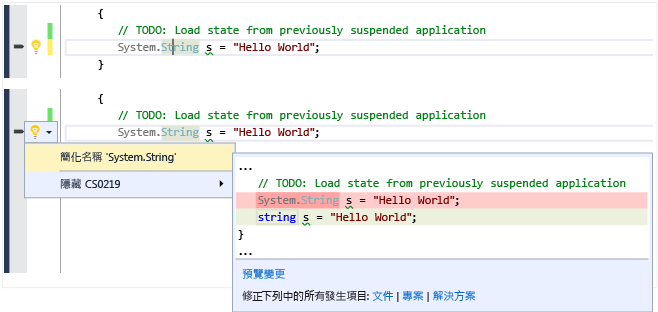
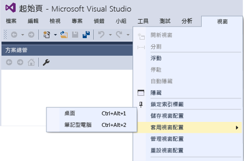

# Visual Studio 2015 的新功能
[!INCLUDE[vs2017banner](../code-quality/includes/vs2017banner.md)]

歡迎使用 Visual Studio 2015 這套整合了開發人員生產力工具、雲端服務和擴充功能的套件，讓您和您的團隊可以建立適用於網路、Windows 市集、桌上型電腦、Android 及 iOS 的絕佳應用程式和遊戲。  
  
 本頁的重點在於說明自 Visual Studio 2013 RTM 以後新增的一些最重要功能，包括其中一個 Visual Studio 2013 更新第一次引進的功能。 如需 Visual Studio 2015 新功能的完整清單，請參閱[版本資訊](https://www.visualstudio.com/news/vs2015-vs)。  
  
 如需 Visual Studio ALM 中許多增強功能和新功能的詳細資訊，請參閱 [Visual Studio 2015 中 Application Lifecycle Management 的新功能](http://msdn.microsoft.com/zh-tw/54b98a53-6083-4303-869a-8063d8fae938)。  
  
## 新的安裝經驗  
 [!INCLUDE[downloadvs](../ide/includes/downloadvs_md.md)]  
  
 Visual Studio 2015 安裝經驗已經元件化，因此，您只需要安裝所需的組件。 對於包含 .NET 或 Web 開發的許多常見案例而言，這可加速安裝。 如果您執行其他類型的開發 \(例如跨平台行動開發\)，或使用 C\+\+ 或 F\# 工作，請選擇 \[自訂\] 安裝，然後選擇您需要的元件和選擇性協力廠商 SDK。 您之後也可以安裝任何自訂元件。 例如，如果您選擇 \[基本\] 安裝，然後嘗試建立新的 C\+\+ 專案時，則系統會提示您下載 C\+\+ 開發工具。  
  
   
  
## 跨多個帳戶登入  
 Visual Studio 2015 的新登入功能設計，可以大大地簡化您存取線上資源的流程，即使使用多個 Visual Studio 帳戶，也一樣地有效率。 當您登入 Visual Studio 之後，您會自動登入您電腦上所有的 Visual Studio 2015 執行個體及 Blend 執行個體。 登入會自動為您開始漫遊您的設定。 在 Visual Studio 2015 中，所有功能會共用您的帳戶，因此，只要您持有有效的權杖，便能從 **Team Explorer** 存取您的 Visual Studio Team Services 帳戶，以及使用您的 Microsoft Azure 訂用帳戶，從 \[伺服器總管\] 存取資源及網站。 您也可以在 Application Insights 專案的 \[新增專案\] 對話方塊中，檢視您的 Azure 資源；還可在新增加的 \[加入已連接服務\] 對話方塊中，檢視 Azure Mobile、Azure 儲存體、[Microsoft Office 365](http://msdn.microsoft.com/office/aa905340.aspx) 和 [Saleforce.com 開發人員](https://developer.salesforce.com/)帳戶。  
  
 您可以前往或使用新的帳戶管理員，加入多個使用者帳戶在 Visual Studio 中使用。 如此一來，您便能夠在要連線到服務或存取線上資源時，隨時切換帳戶。 Visual Studio 會記住您加入的帳戶，因此您可以從任何 Visual Studio 或 Blend 執行個體使用這些帳戶。 Visual Studio 也將隨您的個人化帳戶漫遊帳戶清單 \(不過我們不會漫遊您的重要認證\)，因此您可以在其他裝置上快速開始使用其中一個帳戶。 您也可以隨時從 \[帳戶設定\] 對話方塊中移除這些帳戶。 若要開始使用，請參閱[使用多個使用者帳戶](../ide/work-with-multiple-user-accounts.md)。  
  
   
  
## 選擇您的目標平台  
 Visual Studio 2015 可支援您的跨平台行動裝置開發工作。 您可以撰寫目標平台為 iOS、Android 和 Windows 的應用程式及遊戲，並且全部共用同一組程式碼，而所有這一切，全都可以在 Visual Studio IDE 中完成。 您會在 \[檔案\]、\[新增專案\] 對話方塊中，看到所有新專案類型。  
  
 此外，對於傳統桌面應用程式的支援也比過去更好，無論在語言、程式庫及工具上，都有多項的改進。  
  
### 搭配使用 C\# 和適用於 Visual Studio 的 Xamarin 的跨平台行動應用程式  
 Xamarin 是可讓您以 C\# 撰寫程式碼的行動架構，以原生繫結至 iOS 和 Android API。 Microsoft 也與 Xamarin 密切合作，共同發行了適用於 Visual Studio 的 Xamarin 這項擴充功能，讓您可以在單一方案中使用同一組程式碼，進行 Android、iOS 和 Windows Phone 的開發工作。 使用 Xamarin，您將使用一種語言和一種程式碼基底 \(平台間的差異極小\)。  Visual Studio 2010 和更新版本支援適用於 Visual Studio 的 Xamarin。 Visual Studio 2015 中已包括 Xamarin 的入門版本。 若要開始使用，請參閱[使用 Visual Studio 的 Xamarin 建置具有原生 UI 的應用程式](../cross-platform/build-apps-with-native-ui-using-xamarin-in-visual-studio.md)。  
  
### 搭配使用 HTML\/JavaScript 撰寫的跨平台行動應用程式與 Apache Cordova  
 Visual Studio Tools for Apache Cordova 是 Microsoft 與開放原始碼 Apache Cordova 社群密切合作的結果。 這些工具允許使用 HTML、CSS 和 JavaScript \(或 Typescript\) 進行跨平台行動開發。 您只須使用一組程式碼，就能執行目標平台為 Android、iOS 和 Windows 的開發工作，同時使用 Visual Studio IDE 所提供的豐富功能，包括 JavaScript IntelliSense、DOM 總管、JavaScript 主控台、中斷點、監看功能、區域變數、Just My Code 等等。  透過 Visual Studio Tools for Apache Cordova，您的應用程式可以透過提供一般 JavaScript API 的外掛程式，存取所有平台上的原生裝置功能。 若要開始使用，請參閱[開始使用 Visual Studio Tools for Apache Cordova](../Topic/Get%20Started%20with%20Visual%20Studio%20Tools%20for%20Apache%20Cordova1.md)。  
  
### 搭配使用 C\# 和 Unity 的跨平台行動遊戲  
 Unity 是用於開發多平台 2D 和 3D 遊戲之廣為使用的平台。 您可以使用 C\# 撰寫遊戲，並以原生形態在 Android、iOS、Windows Phone 和許多其他平台上執行。 Visual Studio Tools for Unity 是整合 Unity 和 Visual Studio IDE 的擴充功能。 透過這項擴充功能，您可以取得 Visual Studio IDE 和偵錯工具的所有功能，以及專為 Unity 開發人員設計的生產力功能。 Visual Studio Tools for Unity 2.0 Preview 2 不僅增加許多新功能，還加入對 Visual Studio 2015 的支援，例如提升物件在 \[區域變數\] 視窗及 \[監看式\] 視窗的顯示能力。 Microsoft 最近併購了創造 Visual Studio Tools for Unity 的公司 SyntaxTree。 若要下載 Visual Studio Tools for Unity 2.0 Preview 2，以及如需 Visual Studio Tools for Unity 的詳細資訊，請參閱 [Visual Studio Tools for Unity 2.0](http://Aka.ms/vstu)。  
  
### 跨平台應用程式及原生 C\+\+ 的程式庫  
 C\+\+ 是跨大部分行動裝置的原生可用語言。 您可以使用它來撰寫可針對多個行動平台目標建置的跨平台共用程式碼程式庫。 您甚至可以使用 C\+\+ 建立整個行動應用程式。 Visual C\+\+ 可提供工具來編輯、建置和部署跨平台程式碼，並對其進行偵錯。 除了 Windows 應用程式的範本之外，您還可以使用適用於 Android Native Activity 應用程式、iOS 應用程式或多種平台的共用程式碼程式庫專案 \(包括 Xamarin 混合式應用程式\)。 需要區分平台的 IntelliSense 可讓您探索各種 API，進而產生適用於目標平台為 Android、iOS 或 Windows 的正確程式碼。 您可以設定您的 x86 或 ARM 原生平台組建，並將您的程式碼部署到 iOS 模擬器、連接網路之 Mac 上的 iOS 裝置、直接附加的 Android 裝置，或是使用高效能 Microsoft Visual Studio Emulator for Android 進行測試。 您可以在 Visual Studio 偵錯工具中設定中斷點、監看變數、檢視堆疊，以及逐步執行 C\+\+ 程式碼。 除了需要區分平台的程式碼之外，您還可以跨多個應用程式平台共用所有的程式碼，而且只需要在 Visual Studio 中建立一個方案，就能建置所有的應用程式。  
  
 若要開始使用跨平台 C\+\+，請參閱[使用 Visual C\+\+ 建置跨平台應用程式](../misc/build-cross-platform-mobile-apps-with-visual-cpp.md)。  
  
### 適用於任何 Windows 10 裝置的通用 Windows 應用程式  
 透過通用 Windows 平台和單一 Windows 核心，您可以在從手機到桌上型電腦的任何 Windows 10 裝置上執行相同的應用程式。 您可以使用 Visual Studio 2015 和通用 Windows 應用程式開發工具，來建立這些通用 Windows 應用程式。  
  
   
  
 在 Windows 10 手機、Windows 10 桌上型電腦或 Xbox 上執行您的應用程式。 全部使用相同的應用程式套件！ 有了 Windows 10 單一整合核心，一個應用程式套件可以在所有平台上執行。 數個平台都有擴充功能 SDK，可供您加入應用程式以利用平台專屬行為。 例如，手機的擴充功能 SDK 會處理在 Windows 手機上按下返回鍵的行為。 如果您在專案中參考擴充功能 SDK，只要加入執行階段檢查，就能測試該平台是否可以使用這個 SDK。 因此，您可以針對每一個平台使用相同的應用程式套件！  
  
 使用 C\#、Visual Basic、C\+\+ 或 JavaScript 建立這些[通用 Windows 應用程式](http://msdn.microsoft.com/library/dn975273.aspx)。  
  
### Web  
 ASP.NET 5 是 MVC、WebAPI 和 SignalR 的重大更新，可以在 Windows、Mac 和 Linux 上執行。  ASP.NET 5 是全新的設計，提供您可組合的簡式 .NET 堆疊，讓您建置現代化的雲端應用程式。 Visual Studio 2015 工具與常用 Web 開發工具 \(例如 Bower 和 Grunt\) 更緊密整合。 若要開始使用，請參閱 [.NET Web 開發及工具部落格](http://blogs.msdn.com/b/webdev/)上的多篇部落格文章。  
  
### 傳統桌面和 Windows 市集  
 Visual Studio 2015 仍會繼續支援傳統桌上型電腦及 Windows 市集的開發工作。 隨著 Windows 進化，Visual Studio 也跟著進化。  在 Visual Studio 2015 中，.NET 及 C\+\+ 的程式庫及語言均有大幅改進，而且所有 Windows 版本皆適用這些改良功能。  
  
#### .NET Framework  
 Microsoft [!INCLUDE[net_v46](../ide/includes/net_v46_md.md)] 新增大約 150 項 API 及 50 項更新的 API，可以應用在更多的案例上。 例如有更多的集合實作了 <xref:System.Collections.Generic.IReadOnlyCollection%601>，在使用性上也變得更好。 除此之外，前文所述的 ASP.NET 5 也提供簡式 .NET 平台，可用於建置現代化的雲端應用程式。  
  
 使用 C\+\+ 為目標平台為 .NET Framework 所撰寫的 Windows 市集應用程式，現在也可使用 .NET Native 將應用程式編譯為原生程式碼，而不是 IL；此外，[!INCLUDE[net_v46](../ide/includes/net_v46_md.md)] 也增加了 64 位元的 Just\-In\-Time \(JIT\) 編譯器。  
  
 新增加的 C\# 與 VB 編譯器 \("Roslyn"\) 可大幅縮短編譯時間，並提供豐富的程式碼分析 API。 Visual Studio 2015 透過 Roslyn 提供更的重構功能，包括內嵌重新命名、分析器及快速檢修。  
  
 C\# 和 Visual Basic 語言在核心語言及 IDE 支援方面都有許多微幅改進。 這些改進項目整合在一起，可以讓您擁有更加直覺式的 .NET 程式設計經驗，而且更加方便、生產效率更高。  
  
 如需詳細資訊，請參閱[新功能](../Topic/What's%20New%20in%20the%20.NET%20Framework.md) 和 [.NET 部落格](http://blogs.msdn.com/b/dotnet/)。  
  
#### C\+\+  
 Visual C\+\+ 在 C\+\+11\/14 的語言相容性上有顯著的改善；支援跨平台行動裝置的開發；支援可繼續函式及 Await \(目前規劃在 C\+\+17 時進行標準化\)；改良 C 執行階段程式庫 \(CRT\) 及 C\+\+ 標準程式庫 \(STL\) 實作並修復其 Bug；MFC 中的可調整大小對話方塊；新增編譯器最佳化；提升建置效能；在程式碼編譯器中新增診斷功能及生產力工具。  
  
 如需詳細資訊，請參閱[What's New for Visual C\+\+](/visual-cpp/top/what-s-new-for-visual-cpp-in-visual-studio-2015) 和 [Visual C\+\+ 部落格](http://blogs.msdn.com/b/vcblog/)。  
  
## 裝置預覽功能表列  
 在通用 Windows 平台專案中，裝置預覽功能表列可讓您查看如何以各種螢幕大小呈現以 XAML 為基礎的 UI。  
  
   
  
## Visual Studio 圖形診斷  
 自 Visual Studio 2013 之後，Visual Studio 圖形診斷已經加入許多新功能 \(包括畫面格分析，Windows Phone 支援、著色器編輯和套用，以及命令列擷取工具\)。 它也已加入對 DirectX12 應用程式進行偵錯的支援。 如需詳細資訊，請參閱 [Visual Studio 圖形診斷](../debugger/visual-studio-graphics-diagnostics.md)。  
  
## 連接至服務  
 Visual Studio 2015 讓您的應用程式比過去更容易連接至服務。  新的 \[加入已連接服務精靈\] 可設定您的專案、加入必要的驗證支援，並下載必要的 NuGet 套件，以協助您快速順利地開始編寫服務的程式碼。 \[加入已連接服務精靈\] 也與新的帳戶管理員整合，因此更容易使用多個使用者帳戶和訂用帳戶。 在 Visual Studio 2015 中，對下列服務提供現成的支援 \(假設您擁有帳戶\)：  
  
1.  Azure 行動服務  
  
2.  Azure 儲存體  
  
3.  Office 365 \(郵件、連絡人、行事曆、檔案、使用者及群組\)  
  
4.  銷售力  
  
 我們將持續加入新服務，您也可以按一下精靈中的 \[尋找新服務連結\] 探索這些服務。  
  
   
  
## 設計您的 UI  
 設計 XAML 使用者介面的 Blend 體驗已大幅改進。 Blend 已完全重新設計，提供更直覺的 UI、含 IntelliSense 等更強大的 XAML 編輯功能，以及與 Visual Studio 更佳的整合。 如需詳細資訊，請參閱[Designing XAML in Visual Studio and Blend for Visual Studio](../designers/designing-xaml-in-visual-studio.md)。  
  
## 跨平台偵錯支援  
 您可以使用 Visual Studio，來建立及偵錯在 Windows、iOS 和 Android 裝置上執行的原生行動應用程式。 使用 [Visual Studio Emulator for Android](http://blogs.msdn.com/b/visualstudioalm/archive/2014/11/12/introducing-visual-studio-s-emulator-for-android.aspx)，或連接裝置並直接在 Visual Studio 中偵錯程式碼。  
  
-   **JavaScript \/ Cordova**。 使用 [Visual Studio Tools for Apache Cordova](http://msdn.microsoft.com/library/dn879821\(v=vs.140\).aspx) 來建置 Windows、iOS 和 Android 的 JavaScript 原生應用程式。  
  
     MSDN Library 中的 [偵錯應用程式](../Topic/Debug%20Your%20App%20Built%20with%20Visual%20Studio%20Tools%20for%20Apache%20Cordova.md) 會詳細說明 Visual Studio 對 Cordova 的偵錯支援。  
  
-   **C\# \/ Xamarin**。 使用 [Xamarin](http://msdn.microsoft.com/library/dn879698\(v=vs.140\).aspx) 在 Visual Studio 中以 C\# 建置 Windows、iOS 和 Android 的原生應用程式。  
  
     [Xamarin 開發人員指南](http://developer.xamarin.com/guides)中的[偵錯](http://developer.xamarin.com/guides/ios/deployment,_testing,_and_metrics/debugging_in_xamarin_ios/) \(iOS\) 和[在裝置上偵錯](http://developer.xamarin.com/guides/android/deployment,_testing,_and_metrics/debugging_with_xamarin_android/)說明偵錯經驗。  
  
-   **C\+\+ \/ Android**。 使用[適用於跨平台行動裝置開發的 Visual C\+\+](http://msdnstage.redmond.corp.microsoft.com/library/dn872463\(v=vs.140\).aspx) 範本以及如 [Android NDK](https://developer.android.com/tools/sdk/ndk/index.html) 的協力廠商工具，建立適用於 Windows 和 Android 的原生應用程式。  
  
## 偵錯和診斷  
 如需偵錯新功能的相關資訊，請參閱 [Visual Studio 2015 中偵錯工具的新功能](../debugger/what’s-new-for-the-debugger-in-visual-studio-2015.md)。  
  
 如需診斷新功能的相關資訊，請參閱 [診斷工具的新功能](../profiling/what-s-new-in-profiling-tools.md)。  
  
 下列新的或改進的工具可對程式碼執行不同類型的診斷和分析：  
  
### 效能提示  
 效能提示顯示偵錯期間方法的執行時間，可讓您快速發現瓶頸，而不需要叫用分析工具。 若要開始，請參閱[效能提示：使用 Visual Studio 偵錯，效能資訊快速檢視](http://blogs.msdn.com/b/visualstudioalm/archive/2014/08/18/perftips-performance-information-at-a-glance-while-debugging-with-visual-studio.aspx)。  
  
### 錯誤清單  
 錯誤清單現在支援對任何資料行進行篩選。 該清單也可以隨著您的輸入調整，以顯示整個 C\# 或 Visual Basic 方案中之錯誤、警告和程式碼分析的即時檢視，就算程式碼變更產生了數千項警告也沒有問題。 新的錯誤清單可回溯相容於現有的使用量。 如需詳細資訊，請參閱[錯誤清單視窗](../ide/reference/error-list-window.md)。  
  
### GPU 使用量工具  
 GPU 使用量工具可協助您收集和分析 DirectX 應用程式和遊戲中的 GPU 使用量資料，並對效能瓶頸源自於 CPU 或 GPU 進行疑難排解。 若要開始使用此工具，請參閱 [Visual C\+\+ 小組部落格文章](http://blogs.msdn.com/b/vcblog/archive/2014/09/05/gpu-usage-tool-in-visual-studio-2013-update-4-ctp1.aspx)。  
  
## 即時程式碼分析 \(燈泡\)  
 C\# 和 Visual Basic 的新 Roslyn 編譯器不只能加快編譯時間，也可支援全新的案例，例如程式碼即時分析，其可直接在程式碼編輯器中，隨著您的輸入提供豐富並可自訂的意見及建議。 在 Visual Studio 2015 中，燈泡顯示在左邊界 \(使用鍵盤時\) 或工具提示中 \(滑鼠停留在錯誤上方時\)。 燈泡可在編譯器 \(可能使用自訂規則集\) 偵測到程式碼中的問題時，即時發出通知，也可提供如何修正問題的建議。 當您看到燈泡時，請按一下以取得可採取動作的建議。  
  
   
  
## 享受下列其他 IDE 改進  
  
### 同步設定 \(漫遊設定\)  
 Visual Studio 2013 針對一些最常見的組態設定 \(例如文字編輯器、按鍵組合、主題和字型和色彩、啟動，以及環境別名\)，引進同步設定。  Visual Studio 2015 透過同步處理更多您的設定，以及同步處理不同 Visual Studio 系列應用程式 \(例如 Professional、Enterprise、Express SKU 和 Blend\) 的設定，改進這項體驗。 當您使用與 Visual Studio 2013 所用相同的帳戶第一次登入 Visual Studio 2015 時，您會看到從 Visual Studio 2013 套用的同步設定。 您可以在 \[快速啟動\] 中輸入 "sync"，或巡覽至 \[工具\] \> \[選項\] \> \[環境\] \> \[同步設定\] 來存取您的設定。  
  
### 自動更新擴充功能  
 現在，如果您已安裝的 Visual Studio 擴充功能在 Visual Studio 組件庫上有新版本時，即可自動更新。 如需如何自訂擴充功能自動更新的詳細資訊，請參閱[尋找及使用 Visual Studio 擴充功能](../ide/finding-and-using-visual-studio-extensions.md)。  
  
### 字首大寫的功能表  
 我們重視您的意見反應。 Visual Studio 功能表再一次預設為字首大寫。 若您偏好全部大寫的樣式，可以在啟動時或使用 \[工具\] \> \[選項\] \> \[一般\] 屬性頁面中加以設定：  
  
   
  
### 高解析度影像和觸控支援  
 Visual Studio IDE 現在可在像素更密集的顯示畫面上 \(在功能表、操作功能表、工具視窗命令列等區域中，以及方案總管的一些專案中\)，提供真正高解析度的影像。 在 Visual Studio 程式碼編輯器視窗的觸控螢幕方面，您現在可以使用觸碰並按住、捏合、點選等手勢來縮放、捲動、選取文字及叫用操作功能表。  
  
   
  
### 自訂配置  
 您可以建立存放區並漫遊自訂視窗配置。 例如，您可以為桌上型電腦定義一種偏好配置，再為筆記型電腦或小型螢幕裝置定義另外一種偏好配置。 或者，您也可以針對 UI 專案偏好使用某個配置，並針對資料庫專案偏好使用另一個配置。 按鍵組合可讓您快速切換配置。 當您登入時，可在任何 Visual Studio 執行個體上使用這些配置。 如需詳細資訊，請參閱[建立自訂視窗配置](../misc/create-custom-window-layouts.md)。  
  
   
  
### 通知中樞  
 通知中區的使用者介面已經過簡化，方便您快速掃描。 已加入其他種類的通知，包括效能問題、轉譯問題和當機，而且您現在可以告訴 Visual Studio 停止顯示通知。 如需詳細資訊，請參閱 [Visual Studio 通知](../ide/visual-studio-notifications.md)。  
  
### CodeLens：了解您的程式碼的狀態 \(僅限 Enterprise 和 Professional 版\)  
 尋找程式碼的相關資訊而不需要離開編輯器，讓您可以專注於工作。 您可以檢閱儲存在 Visual Studio Team Services \(VSTS\) 或 Team Foundation Server \(TFS\) 中之程式碼的變更，以及工作項目、Bug、程式碼檢閱等其他記錄。  
  
 在 Visual Studio Professional 和 Visual Studio Professional 中，您現在可以：  
  
-   取得 Visual Studio 編輯器中整個程式碼檔案的歷程記錄。  
  
       
  
-   查看顯示變更您程式碼之人員的圖表。 這可協助您找出小組變更的模式，並評估其影響。  
  
       
  
-   輕鬆地查看上次變更程式碼的時間。  
  
-   尋找影響您程式碼之其他分支的變更。  
  
 請參閱 [CodeLens](../ide/find-code-changes-and-other-history-with-codelens.md)。  
  
### 設計和模型工具 \(僅限 Enterprise 版本\)  
 **Code Map 和相依性圖形**  
  
 在 Visual Studio Enterprise 中，當您想要了解程式碼中的特定相依性時，請建立 Code Map 來將其視覺化。 然後，您可以使用出現在您程式碼旁邊的對應，來巡覽這些關聯性。 Code Map 也可以在您工作或偵錯程式碼時，協助追蹤您在程式碼中的位置，如此一來，當您進一步了解程式碼設計時，便可以少看一些程式碼。  
  
 在此版本中，我們將命令分組成與選取、編輯和管理群組相關的區段，並變更群組內容的配置，以更容易使用程式碼項目和連結的捷徑功能表。 另請注意，測試專案的顯示樣式會與其他專案不同，並且我們已將對應上的項目圖示更新為更適當的版本。  
  
   
  
 其他改進還包括：  
  
-   **改進由上而下的圖表**。 針對中大型 Visual Studio 方案，您現在可以使用簡化的 \[架構\] 功能表，取得對方案更實用的 Code Map。 方案的組件會依方案資料夾分組，因此您可以在內容中查看，並且利用之前建構方案的辛勞成果。 您會立即看到專案和組件參考，並接著顯示連結類型。 此外，方案的外部組件也會以更精簡的方式分組。  
  
-   **測試專案已有不同的樣式並可篩選**。 由於對應上的測試專案具有不同的樣式，因此您現在可以更輕鬆快速地識別這些專案。 您也可以篩選專案，以專注於應用程式的使用中程式碼。  
  
-   **簡化外部相依性連結**。 相依性連結不再繼承自 System.Object、System.ValueType、System.Enum 和 System.Delegate，因此您可以在 Code Map 中更輕鬆地查看外部相依性。  
  
-   **「向內切入相依性連結」會將篩選納入考量**。 當您展開以了解相依性連結的比重時，可以獲得一目暸然的實用圖表。 這個圖表較整齊，也會將您所選取的連結篩選選項列入考量。  
  
-   **程式碼項目會連同其內容加入 Code Map**。 由於圖表現在會連同其內容一起顯示 \(最上層為可視需要篩選出的組件和方案資料夾\)，因此當您從方案總管、類別檢視、物件瀏覽器拖放程式碼項目時，或者在方案總管中選取項目並選擇 \[在 Code Map 上顯示\] 時，您會獲得更實用的圖表。  
  
-   **更快取得反應靈敏的 Code Map**。 拖放作業會產生立即結果，並且可更快速地建立節點之間的連結，而不會影響後續使用者啟動的作業 \(例如展開節點或要求更多節點\)。 當您在不建置方案的情況下建立 Code Map 時，現在會處理所有極端案例 \(例如未建置組件時\)。  
  
-   **略過重建方案。**在建立及編輯圖表時提升效能。  
  
-   **篩選程式碼項目節點和群組**。 您可以根據程式碼項目的類別來顯示或隱藏程式碼項目，也可以依照方案資料夾、組件、命名空間、專案資料夾和類型分組程式碼項目，以快速地整理對應。  
  
-   **篩選關聯性以更容易閱讀圖表**。 連結篩選現在也適用於跨群組連結，因此使用篩選視窗的干擾比舊版更低。  
  
-   **從類別檢視和物件瀏覽器建立圖表**。 將檔案和組件從類別檢視和物件瀏覽器拖放到新的或現有的對應中。  
  
 請參閱 [對應方案之間的相依性](../modeling/map-dependencies-across-your-solutions.md)。  
  
 **本版中的其他設計和模型變更：**  
  
-   **分層圖**。 使用類別檢視和物件瀏覽器來更新這些圖表。 為了達到軟體設計需求，請使用分層圖來描述軟體所需的相依性。 透過尋找不符合這些條件約束的程式碼，並使用這個基準來驗證未來的程式碼，讓程式碼與這個設計保持一致。  
  
-   **UML 圖表**。 您已無法再從程式碼建立 UML 類別圖和循序圖。 但您還是可以使用新的 UML 元素來建立這些圖表。  
  
-   **架構總管**。 您已無法再使用架構總管來建立圖表。 但您還是可以使用方案總管。  
  
## Visual Studio 擴充性工具  
 現在，您可以更輕鬆地安裝 Visual Studio 擴充性工具 \(VS SDK 和範本\)，因為這些工具已在安裝期間隨附為選用的元件。  擴充性工具可讓開發人員撰寫擴充功能，以自訂功能並將其加入 Visual Studio。 如需 Visual Studio 擴充性的詳細資訊，請參閱 [Visual Studio SDK](../extensibility/visual-studio-sdk.md)。  
  
 如果您想要在自訂安裝中包含擴充性工具，可在 \[功能 \/ 通用工具 \/ Visual Studio 擴充性工具\] 下方找到。  您也可以開啟 \[新增專案\] 對話方塊，並選取 \[Visual C\# \/ 擴充性\] 項目底下方的 \[安裝 Visual Studio 擴充性工具\]，以在稍後安裝擴充性工具。  
  
## 請提供您的寶貴意見  
 為什麼要傳送意見反應給 Visual Studio 小組？ 我們極為重視客戶的意見反應。 我們其實會檢視得自意見反應系統的每一項意見反應。 您的意見反應是我們進步的動力。  
  
### 傳送笑臉  
 當我們符合或超出您的要求時，請告訴我們您所喜歡的功能，讓我們更加了解您的需要。 當我們在設計及實作新功能時，我們會參考資料，了解您所喜歡的功能來協助我們制定設計的決策。 因此，您如有喜歡 Visual Studio 的任何功能，請與我們分享。 方法很簡單，直接在 IDE 中就能完成這項動作。  
  
 只要按一下標題列上的黃色笑臉，讓我們知道您所喜歡的功能，然後按一下 \[傳送笑臉\] 按鈕就可以了。  
  
 就這麼容易！ 我們會將您的意見反應分送給相關團隊鼓舞他們的士氣，讓他們有更多的能量構思更能符合您需要的功能。  
  
### 傳送苦臉  
 了解產品需要改進的項目，有助於我們管理我們的待處理項目，並將注意力優先集中在對客戶而言最重要的項目上。 您如有不喜歡的功能，可以直接在 IDE 中使用 \[傳送苦臉\] 功能告訴我們。 方法也同樣十分簡單：  
  
 只要按一下標題列上的黃色笑臉，然後再按一下 \[傳送苦臉\] 就可以了。 請告訴我們您不喜歡的原因，然後按一下 \[傳送苦臉\] 按鈕。 如需詳細資訊，請參閱[告訴我們](../ide/talk-to-us.md)。  
  
### 回報當機、無回應及效能問題  
 有些時候，傳送苦臉中的簡短文字並無法盡述您為什麼不喜歡某項功能。 當您有無回應、當機或效能問題時，您可以使用傳送苦臉後所顯示的對話方塊，列下重現步驟、當機傾印或追蹤檔案。  
  
 首先，請依照前述步驟傳送苦臉。 接著在隨後顯示的對話方塊上，您可以使用任何預設標籤，或是建立您自己的標籤來標記您的意見反應。 使用標籤可以協助我們將您的意見反應分立到正確的功能團隊。 從 \[選擇類別\] 下拉式清單中，選取可代表您回報之問題的選項，然後遵循所示步驟重現問題。 此外也會提供如何使用 Visual Studio 提供意見反應的詳細步驟。 如需詳細資訊，請參閱[Visual Studio 傳送笑臉指示](../Topic/Visual%20Studio%20Send%20a%20Smile%20Instructions.md)。  
  
### 使用 Connect 追蹤您的問題  
 您若想追蹤 Visual Studio 2015 意見反應的狀態，可前往[Connect](http://connect.microsoft.com/) 並回報 Bug。 回報了 Bug 之後，您便能返回 Connect 追蹤其狀態。  
  
## 請參閱  
 [使用 Apache Cordova 建置跨平台應用程式](../Topic/Build%20cross-platform%20apps%20with%20Visual%20Studio%20Tools%20for%20Apache%20Cordova.md)   
 [使用 Visual Studio 的 Xamarin 建置具有原生 UI 的應用程式](../cross-platform/build-apps-with-native-ui-using-xamarin-in-visual-studio.md)   
 [使用 Visual C\+\+ 建置跨平台應用程式](../misc/build-cross-platform-mobile-apps-with-visual-cpp.md)   
 [使用 IntelliTest 為程式碼產生單元測試](../test/generate-unit-tests-for-your-code-with-intellitest.md)   
 [使用多個使用者帳戶](../ide/work-with-multiple-user-accounts.md)   
 [建立自訂視窗配置](../misc/create-custom-window-layouts.md)   
 [執行燈泡提示的快速動作](../ide/perform-quick-actions-with-light-bulbs.md)   
 [Visual Studio 2015 中 Application Lifecycle Management 的新功能](http://msdn.microsoft.com/zh-tw/54b98a53-6083-4303-869a-8063d8fae938)