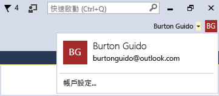
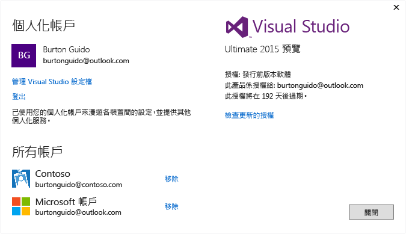

# Work with multiple user accounts
如果您有多個 Microsoft 帳戶及 (或) 工作或學校的帳戶，可以將它們全部加入 Visual Studio，這樣就可以存取所有帳戶的資源，而無須各別登入每個帳戶。 目前，Azure、Application Insights、Team Foundation Server 和 Office 365 服務支援經簡化的登入體驗。 日後也可能會提供其他服務。

 在同一部電腦上加入多個帳戶之後，如果您於另一部電腦上登入 Visual Studio，該組帳戶會隨您漫遊。 請務必注意，雖然帳戶名稱可以漫遊，但認證卻非如此。 因此，當您於新電腦上第一次嘗試使用其他帳戶的資源時，系統會提示您輸入該帳戶的認證。  

 以下的逐步解說將展示如何將多個帳戶加入 Visual Studio，以及如何查看可以從那些帳戶存取的資源反映在 [加入已連接服務]  對話方塊、[伺服器總管] 以及 [Team Explorer] 之類的地方。  

## 登入 Visual Studio  

- 以 Microsoft 帳戶或組織帳戶登入 Visual Studio。 您應該會看到您的使用者名稱出現在視窗上方，如下所示：  

       

### 在伺服器總管中存取您的 Azure 帳戶  
 按 **Ctrl + Alt + S** 以開啟 [伺服器總管] 。 選擇 Azure 圖示，當其展開時，會看到與您用以登入 Visual Studio 之識別碼相關聯的 Azure 帳戶中所提供之資源。 它看起來應該會如下，差別在於您會看到您自己的資源。

   

 第一次在任何特定裝置上使用 Visual Studio 時，此對話方塊只會顯示用以登入此 IDE 之識別碼所註冊的訂閱。 您可以直接從 [伺服器總管]  存取任何其他帳戶的資源，方法是在 Azure 節點上按一下滑鼠右鍵，然後選擇 [管理和篩選訂閱]  並從帳戶選擇器控制項加入帳戶。 您可視需要再選擇另一個帳戶，只要按一下向下箭頭，從帳戶的清單中選擇帳戶即可。 選擇帳戶之後，可以選擇在伺服器總管中要顯示該帳戶的哪些訂閱。  

 ![[管理 Azure 訂用帳戶] 對話方塊](~/ide/media/vs2015_manage_subs.png "vs2015_manage_subs")  

 下次您開啟伺服器總管時，就會顯示該訂閱的資源。  

### 透過加入已連接服務對話方塊存取您的 Azure 帳戶  

1.  以 C# 建立通用應用程式專案。  

2.  在方案總管中選擇專案節點，然後依序選擇 [新增] 和 [已連接服務]。 [新增已連接服務精靈] 隨即出現，並顯示與 Visual Studio 登入識別碼相關聯之 Azure 帳戶中的服務清單。 請注意，您不需要分別登入 Azure。 但當您在指定的電腦上第一次嘗試存取其他帳戶的資源時，就必須登入這些帳戶。  

    > [!WARNING]
    >  如果這是您第一次在特定電腦上於 Visual Studio 中建立市集應用程式，系統會提示您前往電腦上的 [設定] &#124; [更新與安全性] &#124; [適用於開發人員] 來啟用裝置的開發模式。 如需詳細資訊，請參閱[啟用您的裝置以用於開發](https://msdn.microsoft.com/en-us/library/windows/apps/dn706236.aspx)。  

###   在 Web 專案中存取 Azure Active Directory  
 Azure AD 可支援在 ASP.NET MVC Web 應用程式中進行使用者單一登入，或是在 Web API 服務中進行 AD 驗證。 網域驗證與個別使用者帳戶驗證不同；擁有您 Active Directory 網域存取權的使用者，可以使用其現有的 Azure AD 帳戶，連接到您的 Web 應用程式。 Office 365 應用程式也可以使用網域驗證。 若要查看此作業如何進行，請建立 Web 應用程式 ([檔案]、[新增專案]、[C#]、[雲端]、[ASP.NET Web 應用程式])。 然後在 [ASP.NET 新專案] 對話方塊中，選擇 [變更驗證] 。 隨即會出現驗證精靈，供您選擇要在應用程式中使用何種驗證。  

 ![ASP.NET 的 [變更驗證] 對話方塊](~/ide/media/vs2015_change_authentication.png "VS2015_change_authentication")  

 如需 ASP.NET 中各種驗證方式的詳細資訊，請參閱 [Creating ASP.NET Web Projects in Visual Studio 2013](http://www.asp.net/visual-studio/overview/2013/creating-web-projects-in-visual-studio#orgauth)(在 Visual Studio 2013 中建立 ASP.NET Web 專案) (此驗證相關資訊仍與目前 Visual Studio 版本有關)。  

### 存取 Visual Studio Team Services 帳戶  
 從主要功能表依序選擇 [小組] 和 [連接到 Team Foundation Server]，以顯示 [Team Explorer] 視窗。 按一下 [選取 Team 專案] ，然後在 [選取 Team Foundation Server] 底下的清單方塊中，應該會看到您的 Visual Studio Team Services 帳戶的 URL。 如果選取 URL，不必重新輸入認證即可登入。  

## 將第二個使用者帳戶加入 Visual Studio  
 在 Visual Studio 上方，按一下使用者名稱旁邊的向下箭號。 然後選擇 [帳戶設定] 功能表項目。 [帳戶管理員]  對話方塊出現，並顯示您用來登入的帳戶。 選擇對話方塊下方的 [新增帳戶] 連結，以新增 Microsoft 帳戶或是工作或學校帳戶。  

   

 遵循提示輸入新帳戶認證。 下列說明顯示使用者加入 Contoso.com 工作帳戶之後的帳戶管理員。  

   

## 再次瀏覽加入已連接服務精靈和伺服器總管  
 現在，再次前往 [伺服器總管]  ，在 Azure 節點上按一下滑鼠右鍵，然後選擇 [管理和篩選訂閱] 。 按一下目前帳戶旁的下拉式箭號，選擇新的帳戶，接著選擇您想要在伺服器總管中顯示的訂閱。 您應該會看到與指定的訂閱相關聯之所有服務。即使您目前並未使用第二個帳戶登入 Visual Studio IDE，但仍登入了該帳戶的服務與資源。 [專案]、[新增已連接服務] 以及 [小組]、[連接到 Team Foundation Server] 也是這樣。

<!--HONumber=Feb17_HO4-->

