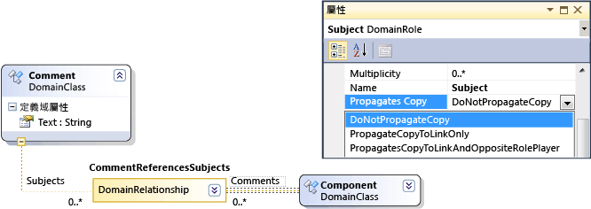
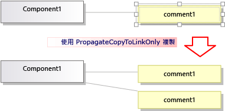
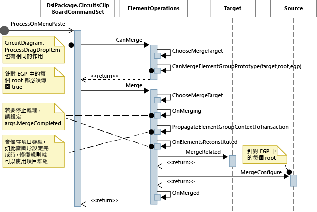

# 自訂複製行為
[!INCLUDE[vs2017banner](../code-quality/includes/vs2017banner.md)]

在使用 [!INCLUDE[vsprvs](../code-quality/includes/vsprvs_md.md)] Visualization and Modeling SDK 建立之網域指定的語言 \(DSL\) 中，您可以變更使用者複製及貼上項目時所發生的情況。  
  
## 標準複製和貼上行為  
 若要啟用複製，請設定 \[DSL 總管\] 中 \[編輯器\] 節點的 \[啟用複製貼上\] 屬性。  
  
 根據預設，當使用者將項目複製到 \[剪貼簿\] 時，也會複製下列項目：  
  
-   所選項目的內嵌子系。  \(也就是來源為複製項目之內嵌關聯性的目標項目\)。  
  
-   複製項目之間的關聯性連結。  
  
 此規則會以遞迴方式套用至複製的項目和連結。  
  
   
  
 複製的項目和連結會經過序列化並儲存在 <xref:Microsoft.VisualStudio.Modeling.ElementGroupPrototype> \(EGP\) 中，再置於 \[剪貼簿\] 上。  
  
 此外，也會將複製項目的影像置於 \[剪貼簿\] 上。  如此可讓使用者貼入 Word 等其他應用程式。  
  
 使用者可以將複製的項目貼到根據 DSL 定義可接受項目的目標上。  例如，在從元件方案範本產生的 DSL 中，使用者可以將通訊埠貼到元件上，但無法貼到圖表上；也可以將元件貼到圖表上，但無法貼到其他元件上。  
  
## 自訂複製和貼上行為  
 如需使用程式碼自訂模型的詳細資訊，請參閱[巡覽及更新程式碼中的模型](../modeling/navigating-and-updating-a-model-in-program-code.md)。  
  
 **啟用或停用複製、剪下和貼上。**  
 在 \[DSL 總管\] 中，設定 \[編輯器\] 節點的 \[啟用複製貼上\] 屬性。  
  
 **將連結複製到相同的目標。**例如，將複製的註解方塊連結至相同的主旨項目。  
 將角色的 \[傳播複本\] 屬性設定為 \[只將複本傳播至連結\]。  如需詳細資訊，請參閱[自訂連結複製行為](#customizeLinks)。  
  
 複製連結的項目。例如，當您複製新項目時，也會建立任何連結之註解方塊的複本。  
 將角色的 \[傳播複本\] 屬性設定為 \[將複本傳播至連結和相反角色扮演者\]。  如需詳細資訊，請參閱[自訂連結複製行為](#customizeLinks)。  
  
 **透過複製和貼上快速複製項目。**一般而言，您剛複製的項目仍處於已選取狀態，因此您無法貼上相同類型的項目。  
 將 Element Merge 指示詞加入至網域類別，並加以設定，以正向合併至父類別。  這對拖曳作業會造成相同的影響。  如需詳細資訊，請參閱[自訂項目的建立和移動](../modeling/customizing-element-creation-and-movement.md)。  
  
 \-或\-  
  
 選取圖表，再透過覆寫 `ClipboardCommandSet.ProcessOnPasteCommand()` 來貼上項目。  在 DslPackage 專案的自訂檔案中加入這個程式碼：  
  
```c#  
namespace Company.MyDsl {  
using System.Linq;  
using Microsoft.VisualStudio.Modeling.Diagrams;   
using Microsoft.VisualStudio.Modeling.Shell;  
partial class MyDslClipboardCommandSet  
{  
  protected override void ProcessOnMenuPasteCommand()  
  {  
 // Deselect the current selection after copying:  
 Diagram diagram = (this.CurrentModelingDocView as SingleDiagramDocView).Diagram;  
    this.CurrentModelingDocView  
     .SelectObjects(1, new object[] { diagram }, 0);  
  }  
} }  
  
```  
  
 **當使用者貼到選取的目標上時，會建立其他連結。**例如，將註解方塊貼到項目上時，會建立這兩者之間的連結。  
 將 Element Merge 指示詞加入至目標網域類別，並加以設定，以處理加入連結的合併作業。  這對拖曳作業會造成相同的影響。  如需詳細資訊，請參閱[自訂項目的建立和移動](../modeling/customizing-element-creation-and-movement.md)。  
  
 \-或\-  
  
 覆寫 `ClipboardCommandSet.ProcessOnPasteCommand()` 可在呼叫基底方法之後建立其他連結。  
  
 **自訂可複製到外部應用程式的項目格式** \- 例如，若要將框線加入至點陣圖格式。  
 覆寫 DslPackage 專案中的 *MyDsl*`ClipboardCommandSet.ProcessOnMenuCopyCommand()`。  
  
 **自訂以複製命令 \(而不是拖曳作業\) 將項目複製到 \[剪貼簿\] 的方式。**  
 覆寫 DslPackage 專案中的 *MyDsl*`ClipboardCommandSet.CopyModelElementsIntoElementGroupPrototype()`。  
  
 **透過複製和貼上保留配置。**  
 當使用者複製多個圖形時，您可以在貼上時保留圖形的相對位置。  [VMSDK：電路圖表範例](http://go.microsoft.com/fwlink/?LinkId=213879)中的範例示範這個方法。  
  
 若要達成這個效果，請將圖形和連接線加入至複製的 ElementGroupPrototype。  最方便的覆寫方法是 ElementOperations.CreateElementGroupPrototype\(\)。  若要執行這項操作，請將下列程式碼加入至 DSL 專案：  
  
```c#  
  
public class MyElementOperations : DesignSurfaceElementOperations  
{  
  // Create an EGP to add to the clipboard.  
  // Called when the elements to be copied have been  
  // collected into an ElementGroup.  
 protected override ElementGroupPrototype CreateElementGroupPrototype(ElementGroup elementGroup, ICollection<ModelElement> elements, ClosureType closureType)  
  {  
 // Add the shapes and connectors:  
 // Get the elements already in the group:  
    ModelElement[] mels = elementGroup.ModelElements  
        .Concat(elementGroup.ElementLinks) // Omit if the paste target is not the diagram.  
        .ToArray();  
 // Get their shapes:  
    IEnumerable<PresentationElement> shapes =   
       mels.SelectMany(mel =>   
            PresentationViewsSubject.GetPresentation(mel));  
    elementGroup.AddRange(shapes);  
  
 return base.CreateElementGroupPrototype  
           (elementGroup, elements, closureType);  
  }  
  
 public MyElementOperations(IServiceProvider serviceProvider, ElementOps1Diagram diagram)  
      : base(serviceProvider, diagram)  
  { }  
}  
  
// Replace the standard ElementOperations  
// singleton with your own:  
partial class MyDslDiagram // EDIT NAME  
{  
 /// <summary>  
 /// Singleton ElementOperations attached to this diagram.  
 /// </summary>  
 public override DesignSurfaceElementOperations ElementOperations  
  {  
 get  
    {  
 if (singleton == null)  
      {  
        singleton = new MyElementOperations(this.Store as IServiceProvider, this);  
      }  
 return singleton;  
    }  
  }  
 private MyElementOperations singleton = null;  
}  
  
```  
  
 **在選擇的位置貼上圖形，例如目前的游標位置。**  
 當使用者複製多個圖形時，您可以在貼上時保留圖形的相對位置。  [VMSDK：電路圖表範例](http://go.microsoft.com/fwlink/?LinkId=213879)中的範例示範這個方法。  
  
 若要達成這個效果，請覆寫 `ClipboardCommandSet.ProcessOnMenuPasteCommand()` 以使用特定位置版本的 `ElementOperations.Merge()`。  若要執行這項操作，請在 DslPackage 專案中加入下列程式碼：  
  
```c#  
  
partial class MyDslClipboardCommandSet // EDIT NAME  
{  
   /// <summary>  
    /// This method assumes we only want to paste things onto the diagram  
    /// - not onto anything contained in the diagram.  
    /// The base method pastes in a free space on the diagram.  
    /// But if the menu was used to invoke paste, we want to paste in the cursor position.  
    /// </summary>  
    protected override void ProcessOnMenuPasteCommand()  
    {  
  
  NestedShapesSampleDocView docView = this.CurrentModelingDocView as NestedShapesSampleDocView;  
  
      // Retrieve data from clipboard:  
      System.Windows.Forms.IDataObject data = System.Windows.Forms.Clipboard.GetDataObject();  
  
      Diagram diagram = docView.CurrentDiagram;  
      if (diagram == null) return;  
  
      if (!docView.IsContextMenuShowing)  
      {  
        // User hit CTRL+V - just use base method.  
  
        // Deselect anything that's selected, otherwise  
        // pasted item will be incompatible:  
        if (!this.IsDiagramSelected())  
        {  
          docView.SelectObjects(1, new object[] { diagram }, 0);  
        }  
  
        // Paste into a convenient spare space on diagram:  
    base.ProcessOnMenuPasteCommand();  
      }  
      else  
      {  
        // User right-clicked - paste at mouse position.  
  
        // Utility class:  
        DesignSurfaceElementOperations op = diagram.ElementOperations;  
  
        ShapeElement pasteTarget = diagram;  
  
        // Check whether what's in the paste buffer is acceptable on the target.  
        if (pasteTarget != null && op.CanMerge(pasteTarget, data))  
        {  
  
        // Although op.Merge would be a no-op if CanMerge failed, we check CanMerge first  
          // so that we don't create an empty transaction (after which Undo would be no-op).  
          using (Transaction t = diagram.Store.TransactionManager.BeginTransaction("paste"))  
          {  
            PointD place = docView.ContextMenuMousePosition;  
            op.Merge(pasteTarget, data, PointD.ToPointF(place));  
            t.Commit();  
          }  
        }  
      }  
    }  
  }  
```  
  
 **讓使用者拖放項目。**  
 請參閱 [如何：加入拖放處理常式](../modeling/how-to-add-a-drag-and-drop-handler.md)。  
  
##  <a name="customizeLinks"></a> 自訂連結複製行為  
 當使用者複製項目時，標準行為是所有內嵌項目也會一併複製。  您可以修改標準複製行為。  在 DSL 定義中，選取關聯性一端的角色，並在 \[屬性\] 視窗中設定 \[傳播複本\] 值。  
  
   
  
 共有三個值：  
  
-   不要傳播複本  
  
-   只將複本傳播至連結 \- 貼上群組時，這個連結的新複本會參考連結另一端的現有項目。  
  
-   將複本傳播至連結和相反角色扮演者 \- 複製的群組包含連結另一端的項目複本。  
  
   
  
 您所做的變更會影響複製的項目和影像。  
  
## 程式設計複製和貼上行為  
 DSL 行為在許多方面與複製、貼上、建立及刪除物件相關，這些物件是由合併至圖表的 <xref:Microsoft.VisualStudio.Modeling.ElementOperations> 執行個體所管理。  您可以從 <xref:Microsoft.VisualStudio.Modeling.ElementOperations> 衍生自己的類別，並覆寫您的圖表類別的 <xref:Microsoft.VisualStudio.Modeling.Diagrams.Diagram.ElementOperations%2A> 屬性，藉此修改 DSL 的行為。  
  
> [!TIP]
>  如需使用程式碼自訂模型的詳細資訊，請參閱[巡覽及更新程式碼中的模型](../modeling/navigating-and-updating-a-model-in-program-code.md)。  
  
   
  
   
  
#### 定義自己的 ElementOperations  
  
1.  在 DSL 專案的新檔案中，建立衍生自 <xref:Microsoft.VisualStudio.Modeling.Diagrams.DesignSurfaceElementOperations> 的類別。  
  
2.  加入圖表類別的部分類別定義。  您可以在 **Dsl\\GeneratedCode\\Diagrams.cs** 中找到此類別的名稱。  
  
     在圖表類別中，覆寫 <xref:Microsoft.VisualStudio.Modeling.Diagrams.Diagram.ElementOperations%2A> 以傳回 ElementOperations 子類別的執行個體。  每次呼叫都應該傳回相同的執行個體。  
  
 在 DslPackage 專案的自訂程式碼檔案中加入這個程式碼：  
  
```c#  
  
using Microsoft.VisualStudio.Modeling;  
using Microsoft.VisualStudio.Modeling.Diagrams;  
using Microsoft.VisualStudio.Modeling.Diagrams.ExtensionEnablement;  
  
  public partial class MyDslDiagram  
  {  
    public override DesignSurfaceElementOperations ElementOperations  
    {  
      get  
      {  
        if (this.elementOperations == null)  
        {  
          this.elementOperations = new MyElementOperations(this.Store as IServiceProvider, this);  
        }  
        return this.elementOperations;  
      }  
    }  
    private MyElementOperations elementOperations = null;  
  }  
  
  public class MyElementOperations : DesignSurfaceElementOperations  
  {  
    public MyElementOperations(IServiceProvider serviceProvider, MyDslDiagram diagram)  
      : base(serviceProvider, diagram)  
    { }  
    // Overridden methods follow  
  }  
  
```  
  
## 接受從其他模型拖曳的項目  
 ElementOperations 也可用於定義複製、移動、刪除和拖放行為。  此處提供的範例定義自訂拖放行為，示範如何使用 ElementOperations。  不過針對該目的，您可以考慮使用[如何：加入拖放處理常式](../modeling/how-to-add-a-drag-and-drop-handler.md)中所述的替代方法，此方法的擴充性更高。  
  
 在您的 ElementOperations 類別中定義兩個方法：  
  
-   `CanMerge(ModelElement targetElement, System.Windows.Forms.IDataObject data)`，決定是否可以將來源項目拖曳至目標圖形、連接線或圖表上。  
  
-   `MergeElementGroupPrototype(ModelElement targetElement, ElementGroupPrototype sourcePrototype)`，將來源項目結合成目標。  
  
### CanMerge\(\)  
 呼叫 `CanMerge()` 可決定當滑鼠移過圖表時，應提供給使用者的意見。  此方法的參數包括滑鼠停留的項目，以及有關執行拖曳作業之來源的資料。  使用者可以從畫面上的任何位置拖曳。  因此，來源物件可以是許多不同類型，並可以不同的格式進行序列化。  如果來源為 DSL 或 UML 模型，資料參數是 <xref:Microsoft.VisualStudio.Modeling.ElementGroupPrototype> 的序列化。  拖曳、複製和工具箱作業使用 ElementGroupPrototypes 代表模型片段。  
  
 一個項目群組原型可以包含任意數目的項目和連結。  項目類型可由其 GUID 識別。  此 GUID 是拖曳圖形的 GUID，而不是基礎模型項目的 GUID。  在下列範例中，如果將 UML 圖表中的圖形類別拖曳至這個圖表上，則 `CanMerge()` 傳回 true。  
  
```c#  
public override bool CanMerge(ModelElement targetShape, System.Windows.Forms.IDataObject data)  
 {  
  // Extract the element prototype from the data.  
  ElementGroupPrototype prototype = ElementOperations.GetElementGroupPrototype(this.ServiceProvider, data);  
  if (targetShape is MyTargetShape && prototype != null &&  
        prototype.RootProtoElements.Any(rootElement =>   
          rootElement.DomainClassId.ToString()   
          ==  "3866d10c-cc4e-438b-b46f-bb24380e1678")) // Guid of UML Class shapes  
          // or SourceClass.DomainClassId  
        return true;  
   return base.CanMerge(targetShape, data);  
 }  
  
```  
  
## MergeElementGroupPrototype\(\)  
 當使用者將項目放到圖表、圖形或連接線上時，會呼叫這個方法。  此方法應該會將拖曳的內容合併成目標項目。  在這個範例中，程式碼會判斷是否可以辨識目標和原型類型的組合；如果可以，此方法會將拖曳的項目轉換成應加入至模型的項目原型。  呼叫基底方法可對已轉換或未轉換的項目進行合併。  
  
```c#  
public override void MergeElementGroupPrototype(ModelElement targetShape, ElementGroupPrototype sourcePrototype)  
{  
  ElementGroupPrototype prototypeToMerge = sourcePrototype;  
  MyTargetShape pel = targetShape as MyTargetShape;  
  if (pel != null)  
  {  
    prototypeToMerge = ConvertDraggedTypeToLocal(pel, sourcePrototype);  
  }  
  if (prototypeToMerge != null)  
    base.MergeElementGroupPrototype(targetShape, prototypeToMerge);  
}  
  
```  
  
 這個範例處理從 UML 類別圖表拖曳的 UML 類別項目。  DSL 的設計不會直接儲存 UML 類別；相反地，我們會為每個拖曳的 UML 類別建立 DSL 項目。  這在 DSL 是執行個體圖表時，會很有用。  使用者可以將類別拖曳至圖表上，以建立這些類別的執行個體。  
  
```c#  
  
private ElementGroupPrototype ConvertDraggedTypeToLocal (MyTargetShape snapshot, ElementGroupPrototype prototype)  
{  
  // Find the UML project:  
  EnvDTE.DTE dte = snapshot.Store.GetService(typeof(EnvDTE.DTE)) as EnvDTE.DTE;  
  foreach (EnvDTE.Project project in dte.Solution.Projects)  
  {  
    IModelingProject modelingProject = project as IModelingProject;  
    if (modelingProject == null) continue; // not a modeling project  
    IModelStore store = modelingProject.Store;  
    if (store == null) continue;  
    // Look for the shape that was dragged:  
    foreach (IDiagram umlDiagram in store.Diagrams())  
    {  
      // Get modeling diagram that implements UML diagram:  
      Diagram diagram = umlDiagram.GetObject<Diagram>();  
      Guid elementId = prototype.SourceRootElementIds.FirstOrDefault();  
      ShapeElement shape = diagram.Partition.ElementDirectory.FindElement(elementId) as ShapeElement;  
      if (shape == null) continue;  
      IClass classElement = shape.ModelElement as IClass;  
      if (classElement == null) continue;  
  
      // Create a prototype of elements in my DSL, based on the UML element:  
      Instance instance = new Instance(snapshot.Store);  
      instance.Type = classElement.Name;  
      // Pack them into a prototype:  
      ElementGroup group = new ElementGroup(instance);  
      return group.CreatePrototype();  
    }  
  }  
  return null;  
}  
  
```  
  
## 標準複製行為  
 本節的程式碼顯示您可以覆寫以變更複製行為的方法。  為了協助您了解如何達成您自己的自訂，本節顯示的程式碼會覆寫與複製相關的方法，但不會變更標準行為。  
  
 當使用者按下 CTRL\+C 或使用 \[複製\] 功能表命令時，會呼叫 <xref:Microsoft.VisualStudio.Modeling.Shell.ClipboardCommandSet.ProcessOnMenuCopyCommand%2A> 方法。  您可以在 **DslPackage\\Generated Code\\CommandSet.cs** 中檢視設定方式。  如需如何設定命令的詳細資訊，請參閱[如何：在捷徑功能表中加入命令](../Topic/How%20to:%20Add%20a%20Command%20to%20the%20Shortcut%20Menu.md)。  
  
 您可以在 DslPackage 專案中加入 *MyDsl*`ClipboardCommandSet` 的部分類別定義，來覆寫 ProcessOnMenuCopyCommand。  
  
```c#  
using System.Collections.Generic;  
using System.Drawing;  
using System.Windows.Forms;  
using Microsoft.VisualStudio.Modeling;  
using Microsoft.VisualStudio.Modeling.Diagrams;  
  
partial class MyDslClipboardCommandSet  
{  
  /// <summary>  
  /// Override ProcessOnMenuCopyCommand() to copy elements to the  
  /// clipboard in different formats, or to perform additional tasks  
  /// before or after copying – for example deselect the copied elements.  
  /// </summary>  
  protected override void ProcessOnMenuCopyCommand()  
  {  
    IList<ModelElement> selectedModelElements = this.SelectedElements;  
    if (selectedModelElements.Count == 0) return;  
  
    // System container for clipboard data.  
    // The IDataObject can contain data in several formats.  
    IDataObject dataObject = new DataObject();  
  
    Bitmap bitmap = null; // For export to other programs.  
    try  
    {  
      #region Create EGP for copying to a DSL.  
      this.CopyModelElementsIntoElementGroupPrototype  
                     (dataObject, selectedModelElements);  
      #endregion  
  
      #region Create bitmap for copying to another application.   
      // Find all the shapes associated with this selection:  
      List<ShapeElement> shapes = new List<ShapeElement>(  
        this.ResolveExportedShapesForClipboardImages  
              (dataObject, selectedModelElements));  
  
      bitmap = this.CreateBitmapForClipboard(shapes);  
      if (bitmap != null)  
      {  
        dataObject.SetData(DataFormats.Bitmap, bitmap);  
      }  
      #endregion   
  
      // Add the data to the clipboard:  
      Clipboard.SetDataObject(dataObject, true, 5, 100);  
    }  
    finally  
    {  
      // Dispose bitmap after SetDataObject:  
      if (bitmap != null) bitmap.Dispose();  
    }  
  }  
/// <summary>  
/// Override this to customize the element group that is copied to the clipboard.  
/// </summary>  
protected override void CopyModelElementsIntoElementGroupPrototype(IDataObject dataObject, IList<ModelElement> selectedModelElements)  
{  
  return this.ElementOperations.Copy(dataObject, selectedModelElements);  
}  
}  
```  
  
 每個圖表都有一個 ElementOperations 執行個體。  您可以提供自己的衍生項目。  這個檔案可置於 DSL 專案中，其運作方式與所覆寫的程式碼相同：  
  
```c#  
using System;  
using System.Collections.Generic;  
using System.Linq;  
using Microsoft.VisualStudio.Modeling;  
using Microsoft.VisualStudio.Modeling.Diagrams;  
  
namespace Company.MyDsl  
{  
  partial class MyDslDiagram  
  {  
    /// <summary>  
    /// Singleton ElementOperations attached to this diagram.  
    /// </summary>  
    public override DesignSurfaceElementOperations ElementOperations  
    {  
      get  
      {  
        if (this.elementOperations == null)  
        {  
          this.elementOperations = new MyElementOperations(this.Store as IServiceProvider, this);  
        }  
        return this.elementOperations;  
      }  
    }  
    private MyElementOperations elementOperations = null;  
  }  
  
  // Our own version of ElementOperations so that we can override:  
  public class MyElementOperations : DesignSurfaceElementOperations  
  {  
    public MyElementOperations(IServiceProvider serviceProvider, ElementOps1Diagram diagram)  
      : base(serviceProvider, diagram)  
    { }  
  
    /// <summary>  
    /// Copy elements to the clipboard data.  
    /// Provides a hook for adding custom data.  
    /// </summary>  
    public override void Copy(System.Windows.Forms.IDataObject data,   
      ICollection<ModelElement> elements,   
      ClosureType closureType,   
      System.Drawing.PointF sourcePosition)  
    {  
      if (CanAddElementGroupFormat(elements, closureType))  
      {  
        AddElementGroupFormat(data, elements, closureType);   
      }  
  
      // Override these to store additional data:  
      if (CanAddCustomFormat(elements, closureType))  
      {  
        AddCustomFormat(data, elements, closureType, sourcePosition);  
      }  
    }  
  
    protected override void AddElementGroupFormat(System.Windows.Forms.IDataObject data, ICollection<ModelElement> elements, ClosureType closureType)  
    {  
      // Add the selected elements and those implied by the propagate copy rules:  
      ElementGroup elementGroup = this.CreateElementGroup(elements, closureType);  
  
      // Mark all the elements that are not embedded under other elements:  
      this.MarkRootElements(elementGroup, elements, closureType);  
  
      // Store in the clipboard data:  
      ElementGroupPrototype elementGroupPrototype = this.CreateElementGroupPrototype(elementGroup, elements, closureType);  
      data.SetData(ElementGroupPrototype.DefaultDataFormatName, elementGroupPrototype);  
    }  
  
    /// <summary>  
    /// Override this to store additional elements in the element group:  
    /// </summary>  
    protected override ElementGroupPrototype CreateElementGroupPrototype(ElementGroup elementGroup, ICollection<ModelElement> elements, ClosureType closureType)  
    {  
      ElementGroupPrototype prototype = new ElementGroupPrototype(this.Partition, elementGroup.RootElements, elementGroup);  
      return prototype;  
    }  
  
    /// <summary>  
    /// Create an element group from the given starting elements, using the   
    /// copy propagation rules specified in the DSL Definition.  
    /// By default, this includes all the embedded descendants of the starting elements,  
    /// and also includes reference links where both ends are already included.  
    /// </summary>  
    /// <param name="startElements">model elements to copy</param>  
    /// <param name="closureType"></param>  
    /// <returns></returns>  
    protected override ElementGroup CreateElementGroup(ICollection<ModelElement> startElements, ClosureType closureType)  
    {  
      // ElementClosureWalker finds all the connected elements,   
      // according to the propagate copy rules specified in the DSL Definition:  
      ElementClosureWalker walker = new ElementClosureWalker(this.Partition,   
        closureType, // Normally ClosureType.CopyClosure  
        startElements,   
        true, // Do not load other models.  
        null, // Optional list of domain roles not to traverse.  
        true); // Include relationship links where both ends are already included.  
  
      walker.Traverse(startElements);  
      IList<ModelElement> closureList = walker.ClosureList;  
      Dictionary<object, object> closureContext = walker.Context;  
  
      // create a group for this closure  
      ElementGroup group = new ElementGroup(this.Partition);  
      group.AddRange(closureList, false);  
  
      // create the element group prototype for the group  
      foreach (object key in closureContext.Keys)  
      {  
        group.SourceContext.ContextInfo[key] = closureContext[key];  
      }  
  
      return group;  
    }  
  }  
}  
  
```  
  
## 請參閱  
 [自訂項目的建立和移動](../modeling/customizing-element-creation-and-movement.md)   
 [如何：加入拖放處理常式](../modeling/how-to-add-a-drag-and-drop-handler.md)   
 [自訂刪除行為](../modeling/customizing-deletion-behavior.md)   
 [範例：VMSDK 電路圖表範例](http://go.microsoft.com/fwlink/?LinkId=213879)