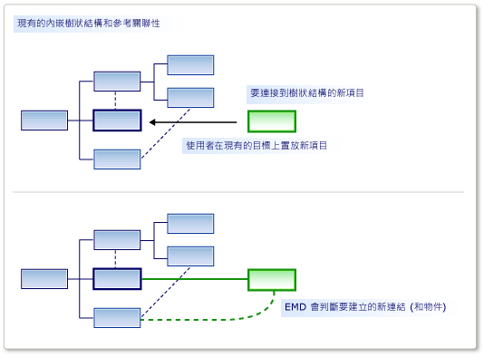

# 自訂項目的建立和移動
[!INCLUDE[vs2017banner](../code-quality/includes/vs2017banner.md)]

您可以允許的項目拖曳到另一個，從 [工具箱]，或是在貼上或移動作業。 您可以移動的項目連結至目標項目中，使用您指定的關聯性。  
  
 項目合併指示詞 (EMD) 可讓您指定一個模型項目時，會發生什麼事 *合併* 到另一個模型項目。 發生這種情況時︰  
  
-   使用者將從 [工具箱] 拖曳至圖表或圖形。  
  
-   使用者建立的項目，使用 [總管] 或 [區間圖形中的 [加入] 功能表。  
  
-   使用者會從一個泳道項目移到另一個。  
  
-   使用者貼上項目。  
  
-   您的程式碼會呼叫項目合併指示詞。  
  
 雖然建立作業似乎與複製作業不同，它們實際運作方式相同。 已新增的項目，例如從 [工具箱] 中，它的原型會複寫時。 原型併入模型中，做為模型的另一個組件已複製的項目相同的方式。  
  
 EMD 的責任是決定如何將物件群組應該合併至模型中的特定位置。 特別是，它會決定哪些關聯性應該具現化，將合併的群組連結至模型。 您也可以自訂，以設定屬性，並建立其他物件。  
  
   
角色的項目合併指示詞  
  
 當您定義內嵌關聯性時，會自動產生 EMD。 EMD 這個預設值建立關聯性的執行個體，當使用者將新的子執行個體加入父代。 您可以修改這些預設 EMDs，例如加入自訂程式碼。  
  
 您也可以加入您自己 EMDs 在 DSL 定義中，若要讓使用者拖曳或貼上合併和接收類別的不同組合。  
  
## <a name="defining-an-element-merge-directive"></a>定義項目合併指示詞  
 您可以將項目合併指示詞加入至網域類別、 網域關聯性、 圖形、 連接器和圖表。 您可以新增或 DSL 總管] 中的接收網域類別底下找到它們。 接收的類別是網域類別已在模型中，並拖曳至新的或複製的項目合併的項目。  
  
   
  
  **索引類別** 是項目，可以合併到接收類別成員的網域類別。 編製索引的類別的子類別的執行個體將也由這個 EMD，合併，除非您將設定 **子類別化適用於** 為 False。  
  
 有兩種類型的合併指示詞︰  
  
-   A **合併程序** 指示詞會指定到樹狀結構中，新的項目應連結的關聯性。  
  
-   A **向前合併** 指示詞將新的項目重新導向至另一個接收項目，通常是父代。  
  
 您可以加入自訂程式碼來合併指示詞︰  
  
-   設定 **使用自訂接受** 加入您自己的程式碼，以判斷特定的執行個體，編製索引的項目是否應該合併至目標項目。 當使用者從 [工具箱] 拖曳時，「 無效 」 的指標會顯示是否您的程式碼就不允許合併。  
  
     例如，您可以在接收的項目處於特定狀態時，才允許合併。  
  
-   設定 **使用自訂合併** 將提供自己的程式碼來定義時執行合併模型所做的變更。  
  
     比方說，您可以使用從模型中的新位置的資料，合併的項目中設定屬性。  
  
> [!NOTE]
>  如果您撰寫自訂的合併程式碼，它會影響可利用此 EMD 來執行的唯一合併。 如果合併相同類型的物件，其他 EMDs，或如果沒有其他自訂程式碼會建立這些物件，而不需使用 EMD，則它們將不會受到您的自訂合併程式碼。  
>   
>  如果您想要確保新的項目或新的關聯性一律處理您的自訂程式碼，請考慮定義 `AddRule` 上內嵌關聯性和 `DeleteRule` 上的項目網域類別。 如需詳細資訊，請參閱 [規則傳播變更內模型](../modeling/rules-propagate-changes-within-the-model.md)。  
  
## <a name="example-defining-an-emd-without-custom-code"></a>範例︰ 定義 EMD 不需要自訂程式碼  
 下列範例可讓使用者在同一時間建立項目連接器，從 [工具箱] 拖曳到現有的圖形拖曳。 此範例會將 EMD 加入至 DSL 定義。 之前這個修改之後，使用者可以將工具拖曳至圖表，但不是到現有的圖形。  
  
 使用者也可以貼上項目拖曳至其他項目。  
  
#### <a name="to-let-users-create-an-element-and-a-connector-at-the-same-time"></a>若要讓使用者能夠同時建立一個項目和連接器  
  
1.  使用建立新的 DSL **最小語言** 方案範本。  
  
     當您執行這個 DSL 時，它可讓您建立的圖形及圖形之間的連接器。 您無法將新 **ExampleElement** 圖形從工具箱拖曳到現有的圖形。  
  
2.  若要讓使用者合併項目拖曳至 `ExampleElement` 圖形，建立在新 EMD `ExampleElement` 網域類別︰  
  
    1.  在 **DSL Explorer**, ，依序展開 **網域類別**。 以滑鼠右鍵按一下 `ExampleElement` 然後按一下 [ **加入新項目合併指示詞**。  
  
    2.  請確定 **DSL 詳細資料** 視窗已開啟，以便您可以檢視新 EMD 的詳細資訊。 (功能表︰ **檢視**, ，**其他 Windows**, ，**DSL 詳細資料**。)  
  
3.  設定 **索引類別** 在 DSL 詳細資料視窗中，以定義哪些類別的項目可以合併到 `ExampleElement` 物件。  
  
     此範例中，選取 `ExampleElements`, ，好讓使用者可以將新項目拖曳至現有的項目。  
  
     請注意索引類別會變成 EMD DSL 總管] 中的名稱。  
  
4.  在 **藉由建立連結的程序合併**, ，新增兩個路徑︰  
  
    1.  一個路徑會將新的項目連結至父模型。 您必須輸入的路徑運算式巡覽從現有的項目，透過內嵌關聯性的父模型。 最後，它會指派新項目的新連結中指定的角色。 路徑為，如下所示︰  
  
         `ExampleModelHasElements.ExampleModel/!ExampleModel/.Elements`  
  
    2.  在另一個路徑指向現有項目連結的新項目。 路徑運算式指定的參考關聯性和角色指派新的項目。 此路徑如下所示︰  
  
         `ExampleElementReferencesTargets.Sources`  
  
     您可以使用路徑瀏覽工具來建立每個路徑︰  
  
    1.  在 **在路徑中建立連結的程序合併**, ，按一下 [ **\< 新增路徑>**。  
  
    2.  按一下下拉式箭號右邊的清單項目。 樹狀結構檢視會顯示。  
  
    3.  展開成您想要指定的路徑樹狀目錄中的節點。  
  
5.  測試 DSL:  
  
    1.  按 F5 以重新建置並執行方案。  
  
         重建將會需要較長的時間，因為產生的程式碼會從文字範本，以符合新的 DSL 定義更新。  
  
    2.  當實驗執行個體 [!INCLUDE[vsprvs](../code-quality/includes/vsprvs_md.md)] 已啟動，請開啟您的 DSL 模型檔。 建立一些範例項目。  
  
    3.  拖曳 **範例項目** 工具拖曳到現有的圖形。  
  
         建立新的圖形會出現，並會連結至現有圖形與連接器。  
  
    4.  複製現有的圖形。 選取另一個圖形，並貼上。  
  
         會建立一份的第一個圖形。  它具有新名稱，它會連結至第二個圖形的連接線。  
  
 請注意此程序中的下列各點︰  
  
-   藉由建立項目合併指示詞，您可以允許任何類別接受任何其他項目。 EMD 建立在接收網域類別中，並在指定公認的網域類別 **Index 類別** 欄位。  
  
-   藉由定義路徑，您可以指定哪些連結應該用來將新的項目連接到現有的模型。  
  
     您指定的連結應該包含一個內嵌關聯性。  
  
-   EMD 會影響這兩種建立從工具箱以及貼上作業。  
  
     如果您撰寫自訂程式碼會建立新的項目，您可以明確叫用 EMD 使用 `ElementOperations.Merge` 方法。 如此可確保，您的程式碼中的連結新的項目到模型其他作業相同的方式。 如需詳細資訊，請參閱 [自訂複製行為](../modeling/customizing-copy-behavior.md)。  
  
## <a name="example-adding-custom-accept-code-to-an-emd"></a>範例︰ 接受自訂的程式碼加入至 EMD  
 將自訂程式碼新增至 EMD，您可以定義更複雜的合併行為。 這個簡單的範例會防止使用者從多個固定數目的項目加入至圖表。 下列範例會修改預設 EMD 隨附一個內嵌關聯性。  
  
#### <a name="to-write-custom-accept-code-to-restrict-what-the-user-can-add"></a>撰寫自訂接受以限制使用者可以新增的程式碼  
  
1.  藉由建立 DSL **最小語言** 方案範本。 開啟 DSL 定義圖。  
  
2.  在 [DSL 總管] 中，展開 **網域類別**, ，`ExampleModel`, ，**項目合併指示詞**。 選取名為項目合併指示詞 `ExampleElement`。  
  
     此 EMD 控制使用者如何建立新 `ExampleElement` 在模型中，例如藉由從 [工具箱] 拖曳的物件。  
  
3.  在 **DSL 詳細資料** 視窗中，選取 **使用自訂接受**。  
  
4.  重建方案。 這會需要較長的時間，因為產生的程式碼將會從模型中更新。  
  
     建置錯誤會報告，類似於: 「 Company.ElementMergeSample.ExampleElement 未包含定義 CanMergeExampleElement...」  
  
     您必須實作方法 `CanMergeExampleElement`。  
  
5.  建立新的程式碼檔案中 **Dsl** 專案。 以下列程式碼取代其內容，並變更您的專案的命名空間的命名空間。  
  
    ```c#  
    using Microsoft.VisualStudio.Modeling;  
  
    namespace Company.ElementMergeSample // EDIT.  
    {  
      partial class ExampleModel  
      {  
        /// <summary>  
        /// Called whenever an ExampleElement is to be merged into this ExampleModel.  
        /// This happens when the user pastes an ExampleElement  
        /// or drags from the toolbox.  
        /// Determines whether the merge is allowed.  
        /// </summary>  
        /// <param name="rootElement">The root element in the merging EGP.</param>  
        /// <param name="elementGroupPrototype">The EGP that the user wants to merge.</param>  
        /// <returns>True if the merge is allowed</returns>  
        private bool CanMergeExampleElement(ProtoElementBase rootElement, ElementGroupPrototype elementGroupPrototype)  
        {  
          // Allow no more than 4 elements to be added:  
          return this.Elements.Count < 4;  
        }  
      }  
    }  
  
    ```  
  
     這個簡單的範例會限制可以合併到父模型的項目數。 更有趣的條件，此方法可以檢查任何屬性，以及接收物件的連結。 它也可以檢查執行中的合併項目屬性 <xref:Microsoft.VisualStudio.Modeling.ElementGroupPrototype>。 如需詳細資訊 `ElementGroupPrototypes`, ，請參閱 [自訂複製行為](../modeling/customizing-copy-behavior.md)。 如需如何撰寫讀取模型的程式碼的詳細資訊，請參閱 [巡覽和更新程式碼中的模型](../modeling/navigating-and-updating-a-model-in-program-code.md)。  
  
6.  測試 DSL:  
  
    1.  按 F5 以重新建置方案。 當實驗執行個體 [!INCLUDE[vsprvs](../code-quality/includes/vsprvs_md.md)] 隨即開啟，並開啟您的 DSL 的執行個體。  
  
    2.  透過數種方式建立新項目︰  
  
        1.  拖曳 **範例項目** 工具拖曳至圖表。  
  
        2.  在 **範例模型總管**, ，以滑鼠右鍵按一下根節點，然後按一下 **加入新的範例項目**。  
  
        3.  複製並貼在圖表上的項目。  
  
    3.  請確認您無法使用任何這些方法可將四個以上的項目加入至模型。 這是因為它們都使用項目合併指示詞。  
  
## <a name="example-adding-custom-merge-code-to-an-emd"></a>範例︰ 將自訂合併程式碼加入至 EMD  
 在自訂的合併程式碼，您可以定義當使用者拖曳工具或貼到項目時，會發生什麼事。 有兩種方式來定義自訂合併︰  
  
1.  設定 **使用自訂合併** ，並提供必要的程式碼。 您的程式碼取代產生的合併程式碼。 如果您想要完全重新定義合併的用途，請使用此選項。  
  
2.  覆寫 `MergeRelate` 方法，並選擇性地 `MergeDisconnect` 方法。 若要這樣做，您必須設定 **產生雙衍生** 網域類別的屬性。 您的程式碼可以呼叫產生的合併程式碼基底類別中。 如果您想要在執行合併之後，執行額外的操作，請使用此選項。  
  
 這些方法只會影響可利用此 EMD 來執行的合併。 如果您想要影響所有的方法可以在其中建立合併的項目，另一個方法是定義 `AddRule` 上內嵌關聯性和 `DeleteRule` 合併的網域類別上。 如需詳細資訊，請參閱 [規則傳播變更內模型](../modeling/rules-propagate-changes-within-the-model.md)。  
  
#### <a name="to-override-mergerelate"></a>若要覆寫 MergeRelate  
  
1.  在 DSL 定義中，請確定您已定義您要加入程式碼的 EMD。 如果您想，您可以將路徑，並定義自訂接受的程式碼，如前一節中所述。  
  
2.  在 DslDefinition 圖表中，選取接收合併的類別。 通常它是在來源端的內嵌關聯性類別。  
  
     例如，從最小語言方案所產生的 DSL，在選取 `ExampleModel`。  
  
3.  在 **屬性** 視窗中，設定 **產生雙衍生** 至 **true**。  
  
4.  重建方案。  
  
5.  檢查的內容 **Dsl\Generated Files\DomainClasses.cs**。 搜尋方法命名為 `MergeRelate` ，並檢查其內容。 這將協助您撰寫您自己的版本。  
  
6.  在新的程式碼檔案中，撰寫接收類別的部分類別並覆寫 `MergeRelate` 方法。 請務必呼叫基底方法。 例如：  
  
    ```c#  
    partial class ExampleModel  
    {  
      /// <summary>  
      /// Called when the user drags or pastes an ExampleElement onto the diagram.  
      /// Sets the time of day as the name.  
      /// </summary>  
      /// <param name="sourceElement">Element to be added</param>  
      /// <param name="elementGroup">Elements to be merged</param>  
      protected override void MergeRelate(ModelElement sourceElement, ElementGroup elementGroup)  
      {  
        // Connect the element according to the EMD:  
        base.MergeRelate(sourceElement, elementGroup);  
  
        // Custom actions:   
        ExampleElement mergingElement = sourceElement as ExampleElement;  
        if (mergingElement != null)  
        {  
          mergingElement.Name = DateTime.Now.ToLongTimeString();  
        }  
      }  
    }  
  
    ```  
  
#### <a name="to-write-custom-merge-code"></a>撰寫自訂合併程式碼  
  
1.  在 **Dsl\Generated Code\DomainClasses.cs**, ，檢查方法命名為 `MergeRelate`。 這些方法會建立新的項目與現有的模型之間的連結。  
  
     同時，檢查方法命名為 `MergeDisconnect`。 刪除時，這些方法取消連結從模型項目。  
  
2.  在 **DSL Explorer**, ，選取或建立項目合併指示詞，您想要自訂。 在 **DSL 詳細資料** 視窗中，設定 **使用自訂合併**。  
  
     當您設定此選項， **合併程序** 和 **向前合併** 選項都會被忽略。 您的程式碼會使用。  
  
3.  重建方案。 因為產生的程式碼檔案將會更新模型，它需要較長的時間。  
  
     會出現錯誤訊息。 按兩下錯誤訊息，若要查看產生的程式碼中的指示。 這些指示會要求您提供兩種方法， `MergeRelate`*YourDomainClass* 和 `MergeDisconnect`*YourDomainClass*  
  
4.  在不同的程式碼檔案中的部分類別定義中撰寫方法。 應該建議您檢查先前的範例，您的需要。  
  
 自訂的合併程式碼將不會影響程式碼會直接建立物件和關聯性並不會影響其他 EMDs。 若要確定不論如何建立項目已經實作了其他的變更，請考慮撰寫 `AddRule` 和 `DeleteRule` 改。 如需詳細資訊，請參閱 [規則傳播變更內模型](../modeling/rules-propagate-changes-within-the-model.md)。  
  
## <a name="redirecting-a-merge-operation"></a>重新導向合併作業  
 正向合併指示詞會重新導向合併作業的目標。 一般而言，新的目標是內嵌的初始目標的父系。  
  
 比方說，在使用元件圖範本建立 DSL 連接埠會內嵌在元件中。 連接埠會顯示為 「 元件 」 圖形的邊緣上的小圖形。 使用者建立通訊埠工具拖曳到元件圖形的連接埠。 但某些情況下，使用者不小心拖曳通訊埠工具拖曳至現有的連接埠，而不是元件，以及作業失敗。 有數個現有的連接埠時，這是種易犯錯誤。 為了要避免這個討厭的使用者，您可以允許連接埠，以將它們拖曳至現有的連接埠，但有重新導向至父元件的動作。 運算的運作方式如同目標項目是元件。  
  
 您可以建立正向合併指示詞元件模型方案中。 如果您編譯並執行原始的方案，您應該會看到使用者可以將任何數目的 **輸入連接埠** 或 **輸出連接埠** 項目從 **工具箱** 至 **元件** 項目。 不過，它們無法將連接埠拖曳至現有的連接埠。 無法使用指標警示它們，不會啟用此移動。 不過，您可以建立正向合併指示詞，讓連接埠，會在無意中卸除現有 **輸入連接埠** 轉送到 **元件** 項目。  
  
#### <a name="to-create-a-forward-merge-directive"></a>若要建立正向合併指示詞  
  
1.  建立 [!INCLUDE[dsl](../modeling/includes/dsl_md.md)] 方案使用 [元件模型] 範本。  
  
2.  顯示 **DSL Explorer** 開啟 DslDefinition.dsl。  
  
3.  在 **DSL Explorer**, ，依序展開 **網域類別**。  
  
4.   **ComponentPort** 抽象網域類別是基底類別，這兩者的 **InPort** 和 **OutPort**。 以滑鼠右鍵按一下 **ComponentPort** 然後按一下 [ **加入新項目合併指示詞**。  
  
     新 **項目合併指示詞** 節點會顯示在 **項目合併指示詞** 節點。  
  
5.  選取 **項目合併指示詞** 節點並開啟 **DSL 詳細資料** 視窗。  
  
6.  在索引類別清單中，選取 **ComponentPort**。  
  
7.  選取 **轉寄到另一個網域類別合併**。  
  
8.  在 [路徑] 選取項目清單中，依序展開 **ComponentPort**, ，依序展開 **ComponentHasPorts**, ，然後選取 **元件**。  
  
     新的路徑看起來應該像這一個︰  
  
     **ComponentHasPorts.Component/!Component**  
  
9. 儲存方案，並接著轉換範本最右邊的按鈕，即可 **方案總管] 中** 工具列。  
  
10. 建置並執行方案。 新執行個體 [!INCLUDE[vsprvs](../code-quality/includes/vsprvs_md.md)] 隨即出現。  
  
11. 在 **方案總管] 中**, ，開啟 Sample.mydsl。 圖表和 **ComponentLanguage 工具箱** 出現。  
  
12. 拖放到 **輸入連接埠** 從 **工具箱** 到另一個 **輸入連接埠。** 接著，您可以拖曳 **OutputPort** 至 **InputPort** ，然後將另一個 **OutputPort**。  
  
     就不會看到無法使用的指標，而且您應該可以卸除新 **輸入連接埠** 上現有的交易。 選取新 **輸入連接埠** 並將其拖曳至另一個點 **元件**。  
  
## <a name="see-also"></a>請參閱  
 [巡覽和更新程式碼中的模型](../modeling/navigating-and-updating-a-model-in-program-code.md)   
 [自訂工具和工具箱](../modeling/customizing-tools-and-the-toolbox.md)   
 [電路圖表範例 DSL](http://code.msdn.microsoft.com/Visualization-Modeling-SDK-763778e8)