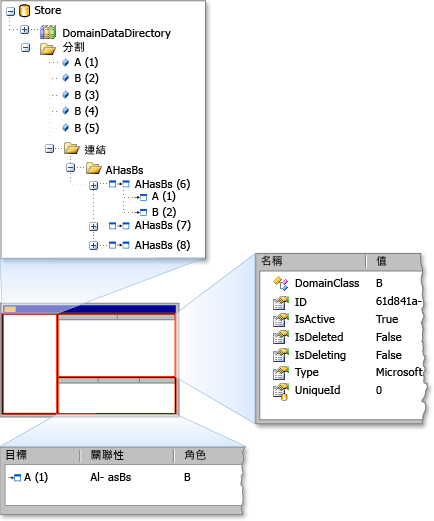

# 使用存放區檢視進行偵錯
[!INCLUDE[vs2017banner](../code-quality/includes/vs2017banner.md)]

使用儲存的檢視器\] 中，您可以檢查狀態的*儲存*所使用的[!INCLUDE[dsl](../modeling/includes/dsl_md.md)]。  儲存檢視器可顯示所有在特定的存放區，連同項目屬性和項目間的連結中的網域模型項目。  
  
## 開啟存放區檢視  
 如果您正在進行[!INCLUDE[vsprvs](../code-quality/includes/vsprvs_md.md)]實驗建置、 停止於中斷點的程式碼執行個體存放區包含模型資訊的位置。然後，開啟存放區檢視器中輸入下列命令，在**即時運算**視窗：  
  
```  
Microsoft.VisualStudio.Modeling.Diagnostics.StoreViewer.Show(mystore);  
```  
  
> [!NOTE]
>  您必須取代`mystore`與您的存放區執行個體的名稱。  此外，如果您的程式碼加入命名空間，您可以輸入不完整的命名空間的情況下顯示儲存庫檢視器的命令：  
>   
>  `using Microsoft.VisualStudio.Modeling.Diagnostics;`  
>   
>  `…`  
>   
>  `StoreViewer.Show(mystore);`  
  
 `Show` 方法含有多項多載。  您可以指定一個存放區或磁碟分割的執行個體，做為參數。  
  
 或者，您可以將任何一處顯示程式碼中的儲存庫檢視器的程式碼行位置的參數，您將傳遞至`Show`方法是在範圍中。  下的一行程式碼執行以內容存放區的快照集時，此動作就會顯示 \[儲存檢視器\]。  
  
### 使用存放區檢視  
 當儲存庫檢視器開啟時，則非強制回應的 Windows Form 視窗隨即出現，如下列圖例所示。  
  
   
存放區檢視  
  
 儲存庫檢視器有三個窗格： 左的窗格、 右上方\] 窗格中，以及右下方的窗格。  左邊的窗格會以樹狀檢視中的型別`DomainDataDirectory`存放區的成員。  如果您展開 \[分割\] 節點，然後按一下 \[項目，則會在右上方窗格中出現元素的屬性。  如果項目連結至其他元素時，額外的項目會出現在右下方的窗格中。  如果您按兩下右下方的窗格中的項目，項目會在左窗格中反白顯示。  
  
## 請參閱  
 [巡覽及更新程式碼中的模型](../modeling/navigating-and-updating-a-model-in-program-code.md)