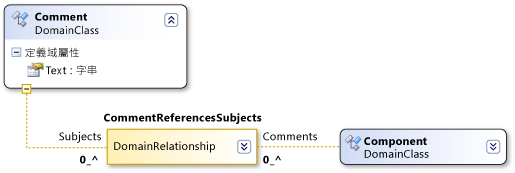

# 網域路徑語法
[!INCLUDE[vs2017banner](../code-quality/includes/vs2017banner.md)]

DSL 定義使用類似 XPath 的語法來尋找模型中的特定項目。  
  
 您通常不需要直接使用這個語法。  \[DSL 詳細資料\] 或 \[屬性\] 視窗中會顯示這個語法，您可以在視窗中按一下向下箭號並使用路徑編輯器。  不過，在使用編輯器之後，路徑會以下列格式顯示在欄位中。  
  
 網域路徑的格式如下：  
  
 *RelationshipName.PropertyName\/\!Role*  
  
   
  
 這個語法會周遊模型的樹狀結構。  例如，上圖中的網域關聯性 CommentReferencesSubjects 具有 Subjects 角色。  路徑區段 \/\!Subjectt 指定路徑在透過 Subjects 角色存取的項目處結束。  
  
 每個區段以網域關聯性的名稱開頭。  如果是項目到關聯性的周遊，路徑區段會顯示為 *Relationship.PropertyName*。  如果是連結到項目的躍點，路徑區段會顯示為 *Relationship\/\!RoleName*。  
  
 請以斜線分隔路徑的語法。  每個路徑區段可以是項目到連結的躍點 \(關聯性執行個體\) 或連結到項目的躍點。  路徑區段經常會成對顯示。  一個路徑區段表示項目到連結的躍點，下一個區段表示連結到項目的反向躍點。  \(任何連結也可以是關聯性本身的來源或目標\)。  
  
 用於表示項目到連結之躍點的名稱是角色的 \[`Property Name`\] 值。  用於表示連結到項目之躍點的名稱是目標角色名稱。  
  
## 請參閱  
 [了解模型、類別和關聯性](../modeling/understanding-models-classes-and-relationships.md)