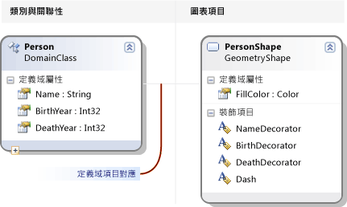
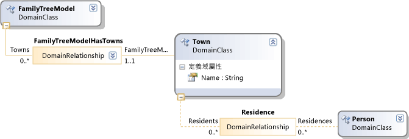
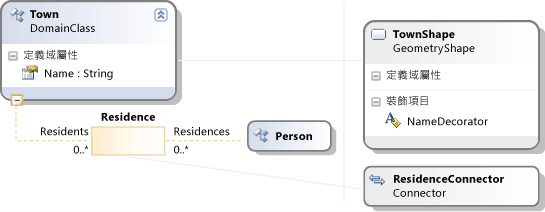

# <a name="getting-started-with-domain-specific-languages"></a>開始使用網域指定的語言
本主題說明在定義和使用適用於 Visual Studio Modeling SDK 所建立的定義域專屬語言 (DSL) 的基本概念。  


[!INCLUDE[modeling_sdk_info](includes/modeling_sdk_info.md)]

  
 如果您不熟悉 dsl，建議您逐步**DSL 工具實驗室**，您可以在這個網站中找到︰ [Visualizaton and Modeling SDK](http://go.microsoft.com/fwlink/?LinkID=186128)  
  
## <a name="what-can-you-do-with-a-domain-specific-language"></a>您可以使用定義域專屬語言做什麼？  
 定義域專屬語言是標記法，通常是圖形，是設計用來為特定的用途。 相較之下，例如 UML 的語言是一般用途。 在 DSL 中，您可以定義類型的模型項目和其關聯性，以及在螢幕上的呈現方式。  
  
 當您設計 DSL 時，您可以將它做為 Visual Studio 整合擴充功能 (VSIX) 封裝的一部分。 使用者在使用中的 DSL [!INCLUDE[vsprvs](../code-quality/includes/vsprvs_md.md)]:  
  
   
  
 表示法是非負數的 DSL 的組件。 這個標記法，VSIX 套件包含工具，使用者就可以套用，幫助他們編輯並產生其模型的內容。  
  
 其中一個主要的應用程式的 Dsl 是產生的程式碼、 組態檔和其他成品。 尤其是在大型專案和產品線，其中將建立一項產品的數個變化，從 Dsl 產生許多變動層面可以提供大幅增加可靠性和需求的變更非常快速的回應中。  
  
 本概觀的其餘部分則介紹建立和使用中的網域特定語言的基本作業的逐步解說[!INCLUDE[vsprvs](../code-quality/includes/vsprvs_md.md)]。  
  
## <a name="prerequisites"></a>必要條件  
 若要定義 DSL，您必須已安裝下列元件：  
  
|||  
|-|-|  
|[!INCLUDE[vsprvs](../code-quality/includes/vsprvs_md.md)]|[http://go.microsoft.com/fwlink/?LinkId=185579](http://go.microsoft.com/fwlink/?LinkId=185579)|  
|[!INCLUDE[vssdk_current_short](../modeling/includes/vssdk_current_short_md.md)]|[http://go.microsoft.com/fwlink/?LinkId=185580](http://go.microsoft.com/fwlink/?LinkId=185580)|  
|Modeling SDK for Visual Studio||  


[!INCLUDE[modeling_sdk_info](includes/modeling_sdk_info.md)]

  
## <a name="creating-a-dsl-solution"></a>建立 DSL 方案  
 若要建立新的定義域專屬語言，您建立新[!INCLUDE[vsprvs](../code-quality/includes/vsprvs_md.md)]方案使用定義域專屬語言專案範本。  
  
#### <a name="to-create-a-dsl-solution"></a>建立 DSL 方案  
  
1.  在 [檔案]  功能表中，指向 [新增] ，然後按一下 [專案] 。  
  
2.  在**專案類型**，依序展開**其他專案類型**節點，然後按一下 **擴充性**。  
  
3.  按一下 **定義域專屬語言設計工具**。  
  
       
  
4.  在**名稱**方塊中，輸入**FamilyTree**。 按一下 [確定]。  
  
     **定義域專屬語言精靈**隨即開啟，並顯示範本 DSL 方案清單。  
  
     按一下每個範本的描述，  
  
     範本可起始點。 每個提供完整的工作 DSL，您可以加以編輯以符合您的需求。 一般而言，您會選擇最接近您要建立範本。  
  
5.  此逐步解說中，選擇 **最小語言**範本。  
  
6.  在適當的精靈頁面中輸入 DSL 的副檔名。 這是包含 DSL 將使用之執行個體的檔案的副檔名。  
  
    -   選擇不在您的電腦，或您要安裝 DSL 的任何電腦中的任何應用程式相關聯的擴充功能。 例如， **docx**和**htm**是無法接受的檔案名稱的副檔名。  
  
    -   如果您已輸入的副檔名正用來做為 DSL，精靈將會警告您。 請考慮使用不同的副檔名。 您也可以重設 Visual Studio SDK Experimental 執行個體以清除舊的實驗設計工具。 按一下 **啟動**，按一下 **所有程式**， **Microsoft Visual Studio 2010 SDK**，**工具**，然後**重設 Microsoft Visual Studio 2010 實驗執行個體**。  
  
7.  檢查其他頁面，然後按一下 **完成**。  
  
     產生的方案包含兩個專案。 Dsl 和 DslPackage 種命名。 圖表檔案，也就是開啟具名的 DslDefinition.dsl。  
  
    > [!NOTE]
    >  從 DslDefinition.dsl 產生大多數的程式碼，您可以看到兩個專案中的資料夾中。 基於這個理由，大部分您的 DSL 來修改此檔案中。  
  
 這時使用者介面類似以下圖片。  
  
   
  
 此方案定義網域指定的語言。 如需詳細資訊，請參閱[定義域專屬語言工具使用者介面的概觀](../modeling/overview-of-the-domain-specific-language-tools-user-interface.md)。  
  
## <a name="the-important-parts-of-the-dsl-solution"></a>DSL 方案的重要部分  
 請注意下列各方面的新方案。  
  
-   **Dsl\DslDefinition.dsl**這是您會看到當您建立 DSL 方案的檔案。 方案中幾乎所有的程式碼會產生這個檔案，及此處所做的大部分您對 DSL 定義的變更。 如需詳細資訊，請參閱使用[使用 DSL 定義圖](../modeling/working-with-the-dsl-definition-diagram.md)。  
  
-   **Dsl 專案**這個專案會包含定義網域特定語言的程式碼。  
  
-   **在 DslPackage 專案**此專案包含允許的開啟和編輯在 DSL 執行個體的程式碼[!INCLUDE[vsprvs](../code-quality/includes/vsprvs_md.md)]。  
  
##  <a name="a-namedebugginga-running-the-dsl"></a><a name="Debugging"></a>執行 DSL  
 在建立時，您可以執行 DSL 方案。 稍後，您可以修改 DSL 定義逐漸，在每次變更之後，再次執行方案。  
  
#### <a name="to-experiment-with-the-dsl"></a>若要試驗 DSL  
  
1.  按一下 **轉換所有範本**方案總管 工具列。 這會重新產生大部分的 DslDefinition.dsl 的原始程式碼。  
  
    > [!NOTE]
    >  每當您變更 DslDefinition.dsl，您必須按一下**轉換所有範本**重新建置方案之前。 您可以自動化此步驟。 如需詳細資訊，請參閱[如何自動化轉換的所有範本](http://msdn.microsoft.com/en-us/b63cfe20-fe5e-47cc-9506-59b29bca768a)。  
  
2.  按下 F5，或在**偵錯**] 功能表上，按一下 [**開始偵錯**。  
  
     DSL 組建和已安裝在實驗執行個體[!INCLUDE[vsprvs](../code-quality/includes/vsprvs_md.md)]。  
  
     [!INCLUDE[vsprvs](../code-quality/includes/vsprvs_md.md)] 的實驗執行個體隨即啟動。 會從個別的子樹的登錄，其設定的實驗執行個體執行所在[!INCLUDE[vsprvs](../code-quality/includes/vsprvs_md.md)]延伸都已登錄的偵錯之用。 一般的執行個體[!INCLUDE[vsprvs](../code-quality/includes/vsprvs_md.md)]不能那里註冊擴充功能的存取。  
  
3.  在實驗性執行個體[!INCLUDE[vsprvs](../code-quality/includes/vsprvs_md.md)]，開啟模型檔案，名為**測試**從**方案總管 中**。  
  
     \-或-  
  
     偵錯專案上按一下滑鼠右鍵，指向**新增**，然後按一下 **項目**。 在**加入項目**對話方塊中，選取該檔案類型的 DSL。  
  
     模型檔案開啟為空白的圖表。  
  
     工具箱 中開啟，並顯示適用於圖表類型的工具。  
  
4.  使用工具來建立圖表上的圖形和連接器。  
  
    1.  若要建立圖形，拖曳到圖表的範例圖形工具。  
  
    2.  若要連接兩個圖形，按一下範例連接器工具，按一下第一個圖形，，然後按一下第二個圖形。  
  
5.  按一下 變更形狀的標籤。  
  
 實驗[!INCLUDE[vsprvs](../code-quality/includes/vsprvs_md.md)]會類似下列的範例︰  
  
   
  
### <a name="the-content-of-a-model"></a>模型的內容  
 DSL 的執行個體檔案的內容會呼叫*模型*。 模型包含*模型**元素*和*連結*項目之間。 DSL 定義中指定的模型項目類型，可以存在於模型中的連結。 例如，在最小語言範本所建立的 DSL，沒有一種類型的模型項目，以及一種類型的連結。  
  
 DSL 定義可以指定模型圖上顯示的方式。 您可以選擇各式各樣的圖形和連接器的樣式。 您可以指定某些圖形出現在其他圖形。  
  
 您可以在樹狀結構檢視模型**總管**檢視您正在編輯模型。 將圖形新增到圖表時，模型項目也會出現在 [總管] 中。 可以使用 [總管] 中，即使沒有任何圖表。  
  
 如果您無法看到 [總管] 中的偵錯的執行個體[!INCLUDE[vsprvs](../code-quality/includes/vsprvs_md.md)]上**檢視**] 功能表中的指向**其他視窗**，然後按一下 [ *\<程式語言 >* **總管**。  
  
### <a name="the-api-of-your-dsl"></a>您的 DSL 的 API  
 您的 DSL 會產生一個 API，讓您讀取和更新模型的 DSL 執行個體。 API 的一個應用程式會從模型產生文字檔案。 如需詳細資訊，請參閱[設計階段使用 T4 文字範本產生程式碼](../modeling/design-time-code-generation-by-using-t4-text-templates.md)。  
  
 在偵錯方案中，開啟範本檔案具有副檔名".tt"。 這些範例會示範如何從模型中，產生的文字，並讓您測試您的 DSL 的 API。 其中一個範例以撰寫[!INCLUDE[vbprvb](../code-quality/includes/vbprvb_md.md)]、 在其他[!INCLUDE[csprcs](../data-tools/includes/csprcs_md.md)]。  
  
 在每個範本檔案會是它所產生的檔案。 依序展開 [方案總管] 中的範本檔案，並開啟產生的檔案。  
  
 範本檔案包含簡短列出模型中的所有項目的程式碼區段。  
  
 產生的檔案包含的結果。  
  
 當您變更模型檔案時，您會看到產生的檔案中對應的變更之後重新產生的檔案。  
  
##### <a name="to-regenerate-text-files-after-you-change-the-model-file"></a>若要重新產生文字檔案之後變更的模型檔案  
  
1.  在實驗性執行個體[!INCLUDE[vsprvs](../code-quality/includes/vsprvs_md.md)]，儲存模型檔案。  
  
2.  請確定檔案名稱參數，每個.tt 檔案中的是指您用於實驗的模型檔案。 儲存.tt 檔案。  
  
3.  按一下 [**轉換所有範本**的工具列中的**方案總管] 中**。  
  
     \-或-  
  
     以滑鼠右鍵按一下您想要重新產生，然後按一下 範本**執行自訂工具**。  
  
 您可以將任何數目的文字範本檔加入專案。 每個範本會產生一個結果檔案。  
  
> [!NOTE]
>  當您變更 DSL 定義中時，範例文字範本程式碼將無法運作，除非您加以更新。  
  
 如需詳細資訊，請參閱[定義域專屬語言產生程式碼](../modeling/generating-code-from-a-domain-specific-language.md)和[用來自訂網域特定語言撰寫程式碼](../modeling/writing-code-to-customise-a-domain-specific-language.md)。  
  
## <a name="customizing-the-dsl"></a>自訂 DSL  
 當您想要修改 DSL 定義中時，關閉此實驗執行個體，並更新主定義[!INCLUDE[vsprvs](../code-quality/includes/vsprvs_md.md)]執行個體。  
  
> [!NOTE]
>  您已修改 DSL 定義之後，您可能會遺失您建立使用較早版本的測試模型中的資訊。  例如，偵錯方案包含名為範例，其中包含一些圖形和連接器的檔案。 您開始開發您的 DSL 定義之後，將不會顯示，並將會遺失您儲存檔案時。  
  
 您可以將各種不同的擴充功能對您的 DSL。 下列範例會提供您各種可能性的印象。  
  
 每個變更後，儲存 DSL 定義中，按一下 [**轉換所有範本**中**方案總管] 中**，然後按下**F5**試驗變更 DSL。  
  
### <a name="rename-the-types-and-tools"></a>重新命名類型和工具  
 重新命名現有的網域類別和關聯性。 例如，從最小語言範本所建立的 Dsl 定義開始，您就可以執行下列重新命名作業，以便代表家庭樹狀結構的 DSL。  
  
##### <a name="to-rename-domain-classes-relationships-and-tools"></a>若要重新命名網域類別、 關聯和工具  
  
1.  DslDefinition 圖表中，在重新命名**ExampleModel**至**FamilyTreeModel**， **ExampleElement**至**人**，**目標**至**父系**，和**來源**至**子系**。 您可以按一下每一個標籤加以變更。  
  
       
  
2.  重新命名的項目和連接器工具。  
  
    1.  按一下 [方案總管] 索引標籤中開啟 [DSL 總管] 視窗。 如果您無法看到它，在**檢視**] 功能表中的指向**其他視窗**然後按一下 [ **DSL Explorer**。 DSL 總管 DSL 定義圖是使用中視窗時，才是可見。  
  
    2.  開啟 [屬性] 視窗，它定位好，您可以同時看到 DSL 總管和屬性。  
  
    3.  在 [DSL 總管] 中，展開**編輯器**，**工具箱索引標籤**， * \<DSL >*，然後**工具**。  
  
    4.  按一下  **ExampleElement**。 這是用來建立項目的工具箱項目。  
  
    5.  在 [屬性] 視窗中，變更**名稱**屬性**人**。  
  
         請注意，**標題**屬性也會變更。  
  
    6.  同樣地，在變更名稱**ExampleConnector**工具**ParentLink**。 Alter**標題**屬性，因此它不是一份名稱屬性。 例如，輸入**父連結**。  
  
3.  重建 DSL。  
  
    1.  儲存 DSL 定義檔案。  
  
    2.  按一下 [**轉換所有範本**在方案總管] 的工具列  
  
    3.  按 F5。 等到實驗執行個體[!INCLUDE[vsprvs](../code-quality/includes/vsprvs_md.md)]隨即出現。  
  
4.  偵錯方案中的實驗執行個體[!INCLUDE[vsprvs](../code-quality/includes/vsprvs_md.md)]，開啟測試模型檔案。 項目從 [工具箱] 拖曳至它。 請注意，已變更的工具的標題和 DSL 總管 中的型別名稱。  
  
5.  儲存模型檔案。  
  
6.  開啟.tt 檔案，並使用新的名稱來取代舊的型別和屬性名稱的項目。  
  
7.  請確定.tt 檔案中指定的檔案名稱指定測試模型。  
  
8.  儲存.tt 檔案。 開啟產生的檔案，請參閱.tt 檔案中執行程式碼的結果。 確認正確。  
  
### <a name="add-domain-properties-to-classes"></a>將網域屬性加入類別  
 將屬性加入至網域類別，例如若要表示的出生年份和死亡的人員。  
  
 若要顯示新的屬性在圖表上，您必須新增*裝飾項目*圖形以顯示模型項目。 您也必須對應屬性來裝飾項目。  
  
##### <a name="to-add-properties-and-display-them"></a>若要新增內容，並加以顯示  
  
1.  加入屬性。  
  
    1.  在 DSL 定義圖表中，以滑鼠右鍵按一下**人**網域類別，指向**新增**，然後按一下 **網域屬性**。  
  
    2.  輸入新的屬性名稱的清單，例如**生日**和**死亡**。 按下**Enter**之後每一個。  
  
2.  將裝飾項目，會顯示在圖形中的屬性。  
  
    1.  請遵循從 Person 網域類別延伸到圖表的另一端的灰線。 這是圖表項目對應。 它的網域類別連結圖形類別。  
  
    2.  此圖形類別上按一下滑鼠右鍵，指向**新增**，然後按一下 **文字裝飾項目**。  
  
    3.  將裝飾名稱的兩個項目，例如**BirthDecorator**和**DeathDecorator**。  
  
    4.  選取每個新的裝飾項目，然後在 [屬性] 視窗中，設定**位置**欄位。 這會決定網域屬性值顯示在圖形上的位置。 例如，設定**InnerBottomLeft**和**InnerBottomRight**。  
  
           
  
3.  將裝飾項目對應至屬性。  
  
    1.  開啟 [DSL 詳細資料] 視窗。 它通常是在索引標籤旁邊的 [輸出] 視窗。 如果您無法看到它，在**檢視**功能表上，指向**其他視窗**，然後按一下  **DSL 詳細資料**。  
  
    2.  在 DSL 定義圖表中，按一下 連接的線條**人**圖形類別的網域類別。  
  
    3.  在**DSL 詳細資料**上**裝飾項目對應**索引標籤上，按一下 [未對應的裝飾項目] 核取方塊。 在**顯示屬性**，選取您要它對應的網域屬性。 例如，對應**BirthDecorator**至**生日**。  
  
4.  儲存 DSL 中，按一下 轉換所有範本，然後按 F5。  
  
5.  在範例模型圖中，確認您可以現在按一下您所選擇的位置並輸入值。 此外，當您選取**人**圖形，[屬性] 視窗會顯示生日及死亡的新屬性。  
  
6.  在.tt 檔案，您可以加入程式碼會取得每個人的內容。  
  
   
  
### <a name="define-new-classes"></a>定義新類別  
 您可以加入網域類別和關聯性的模型。 例如，您可以建立新的類別來代表城鎮，以及新的關聯性來代表人員存留現身。  
  
 若要讓模型圖表上不同的類型不同，您可以在各種不同的圖形，或使用不同的幾何和色彩的圖案對應網域類別。  
  
##### <a name="to-add-and-display-a-new-domain-class"></a>若要新增和顯示新的網域類別  
  
1.  網域類別，並讓模型根的子系。  
  
    1.  在 DSL 定義圖表中，按一下 **內嵌關聯性**工具，請按一下 根類別**FamilyTreeModel**，然後按一下圖表的空白部分。  
  
         新的網域類別，會出現，連接到內嵌關聯性與 FamilyTreeModel。  
  
         將它的名稱，例如**城鎮**。  
  
        > [!NOTE]
        >  模型的根以外的每個網域類別必須至少一個內嵌關聯性的目標，或必須繼承自的類別，做為目標的內嵌。 基於這個理由，就經常方便使用的內嵌關聯性工具來建立網域類別。  
  
    2.  將網域屬性加入至新的類別，例如**名稱**。  
  
2.  新增人員與城市之間的參考關聯性。  
  
    1.  按一下 **參考關聯性**工具中，按一下收件者，然後按一下 城鎮。  
  
           
  
        > [!NOTE]
        >  參考關聯性表示從模型樹狀結構的一部分到另一部分的交互參照。  
  
3.  新增圖形以代表城鎮模型圖表上。  
  
    1.  拖放到**幾何圖形**從工具箱拖曳至圖表，並重新命名，例如**TownShape**。  
  
    2.  在 [屬性] 視窗中，會將新的圖形，例如填滿色彩和幾何的外觀欄位。  
  
    3.  加入顯示的城鎮名稱裝飾項目，並將它重新命名 NameDecorator。 設定它的位置屬性。  
  
4.  將城鎮網域類別對應至 TownShape。  
  
    1.  按一下 **圖表項目對應**工具，然後按一下 城鎮網域類別，然後再 TownShape 圖形類別。  
  
    2.  在**裝飾項目對應** 索引標籤的**DSL 詳細資料**選取視窗與對應的連接器，請 NameDecorator，並設定**顯示屬性**名稱。  
  
5.  建立連接器，以顯示個人和城鎮之間的關係。  
  
    1.  將連接器從 [工具箱] 拖曳至圖表。 將它重新命名，並設定其外觀屬性。  
  
    2.  使用**圖表項目對應**工具城鎮人員之間的關聯性連結新的連接器。  
  
           
  
6.  建立項目工具進行新市鎮。  
  
    1.  在**DSL Explorer**，依序展開**編輯器**然後**工具箱索引標籤**。  
  
    2.  以滑鼠右鍵按一下* \<DSL >*然後按一下 **加入新項目工具**。  
  
    3.  設定**名稱**屬性與新的工具，並設定其**類別**城鎮的屬性。  
  
    4.  設定**工具箱圖示**屬性。 Click **[...]**和**檔案名稱**欄位中，選取圖示檔。  
  
7.  建立連接器工具進行城鎮與人之間的連結。  
  
    1.  以滑鼠右鍵按一下* \<DSL >*然後按一下 **加入新的連接器工具**。  
  
    2.  設定新工具的名稱屬性。  
  
    3.  在**ConnectionBuilder**屬性中，選取包含人與鄉鎮的關聯性的名稱產生器。  
  
    4.  設定**工具箱圖示**。  
  
8.  儲存 DSL 定義中，按一下 **轉換所有範本**，然後按下**F5**。  
  
9. 在實驗性執行個體[!INCLUDE[vsprvs](../code-quality/includes/vsprvs_md.md)]，開啟測試模型檔案。 使用新的工具來建立城鎮和城鎮與人員之間的連結。 請注意，您可以只建立正確類型的項目之間的連結。  
  
10. 建立會列出的城鎮中存在的每個人的程式碼。 文字範本是您可以在其中執行這類程式碼的地方。 例如，您可以修改偵錯方案中現有的 Sample.tt 檔案，使其包含下列程式碼︰  
  
    ```  
    <#@ template inherits="Microsoft.VisualStudio.TextTemplating.VSHost.ModelingTextTransformation" debug="true" #>  
    <#@ output extension=".txt" #>  
    <#@ FamilyTree processor="FamilyTreeDirectiveProcessor" requires="fileName='Sample.ftree'" #>  
  
    <#  
      foreach (Person person in this.FamilyTreeModel.People)  
      {  
    #>  
        <#= person.Name #><#if (person.Town != null) {#> of <#= person.Town.Name #> <#}#>  
  
    <#  
          foreach (Person child in person.Children)  
      {  
    #>  
                <#= child.Name #>  
    <#  
      }  
      }  
    #>  
  
    ```  
  
     當您儲存 *.tt 檔案時，它會建立包含清單的成員和其 residences 的附帶檔案。 如需詳細資訊，請參閱[定義域專屬語言產生程式碼](../modeling/generating-code-from-a-domain-specific-language.md)。  
  
## <a name="validation-and-commands"></a>驗證和命令  
 您可以開發進一步這個 DSL 加入驗證條件約束。 這些條件約束是方法，您可以定義，請確定模型處於正確狀態。 例如，您可以定義條件約束，確保的孩子的出生日期晚於其父代的。 如果 DSL 使用者嘗試儲存會中斷任何條件約束的模型驗證功能會顯示警告。 如需詳細資訊，請參閱[驗證定義域專屬語言](../modeling/validation-in-a-domain-specific-language.md)。  
  
 您也可以定義使用者可以叫用的功能表命令。 命令可以修改模型。 也可以與其他模型中互動[!INCLUDE[vsprvs](../code-quality/includes/vsprvs_md.md)]與外部資源。 如需詳細資訊，請參閱[如何︰ 修改標準功能表命令](../modeling/how-to-modify-a-standard-menu-command-in-a-domain-specific-language.md)。  
  
## <a name="deploying-the-dsl"></a>部署 DSL  
 若要允許其他使用者使用定義域專屬語言，您將發佈[!INCLUDE[vsprvs](../code-quality/includes/vsprvs_md.md)]擴充功能 (VSIX) 檔案。 這會建立當您建置 DSL 方案。  
  
 您的方案的 bin 資料夾中找到.vsix 檔案。 將它複製到您要安裝的電腦。 在安裝程式，請按兩下 VSIX 檔案。 中的所有執行個體可用 DSL[!INCLUDE[vsprvs](../code-quality/includes/vsprvs_md.md)]該電腦上。  
  
 您可以使用相同的程序，讓您不必使用實驗性執行個體，您自己電腦上安裝 DSL [!INCLUDE[vsprvs](../code-quality/includes/vsprvs_md.md)]。  
  
 如需詳細資訊，請參閱[部署網域指定的語言方案](../modeling/deploying-domain-specific-language-solutions.md)。  
  
##  <a name="a-namereseta-removing-old-experimental-dsls"></a><a name="Reset"></a>移除舊的實驗 Dsl  
 如果您建立實驗的 Dsl，您不再需要，您可以從您的電腦中移除它們，重設[!INCLUDE[vsprvs](../code-quality/includes/vsprvs_md.md)]實驗執行個體。  
  
 這會從電腦移除所有實驗 Dsl 和其他實驗性[!INCLUDE[vsprvs](../code-quality/includes/vsprvs_md.md)]延伸模組。 這些是已在偵錯模式執行的擴充功能。  
  
 此程序不會移除 Dsl 或其他[!INCLUDE[vsprvs](../code-quality/includes/vsprvs_md.md)]完整安裝執行 VSIX 檔案的副檔名。  
  
#### <a name="to-reset-the-visual-studio-experimental-instance"></a>若要重設的 Visual Studio 實驗執行個體  
  
1.  按一下 **啟動**，按一下 **所有程式**， **Microsoft Visual Studio 2010 SDK**，**工具**，然後**重設 Microsoft Visual Studio 2010 實驗執行個體**。  
  
2.  重建任何實驗 Dsl 或其他實驗[!INCLUDE[vsprvs](../code-quality/includes/vsprvs_md.md)]要使用的擴充功能。  
  
## <a name="see-also"></a>另請參閱  
 [了解模型、 類別和關聯性](../modeling/understanding-models-classes-and-relationships.md)   
 [如何定義特定領域語言](../modeling/how-to-define-a-domain-specific-language.md)   

[!INCLUDE[modeling_sdk_info](includes/modeling_sdk_info.md)]


