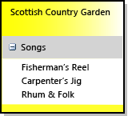

# 如何定義網域指定的語言
若要定義網域指定的語言 (DSL)，請從範本建立 [!INCLUDE[vsprvs](../code-quality/includes/vsprvs_md.md)] 方案。 該方案的關鍵部分是儲存在 DslDefinition.dsl 中的 DSL 定義圖。 [DSL 定義] 可定義 DSL 的類別和圖形。 在修改並加入這些項目之後，您可以加入程式碼，即可以更詳細的方式自訂 DSL。  
  
 如果您不熟悉 dsl，建議您逐步**DSL 工具實驗室**，您可以在這個網站中找到︰ [Visualizaton and Modeling SDK](http://go.microsoft.com/fwlink/?LinkID=186128)  

[!INCLUDE[modeling_sdk_info](includes/modeling_sdk_info.md)]

  
##  選取範本方案  
 若要定義 DSL，您必須已安裝下列元件：  
  
|||  
|-|-|  
|[!INCLUDE[vsprvs](../code-quality/includes/vsprvs_md.md)]|[http://go.microsoft.com/fwlink/?LinkId=185579](http://go.microsoft.com/fwlink/?LinkId=185579)|  
|[!INCLUDE[vssdk_current_short](../modeling/includes/vssdk_current_short_md.md)]|[http://go.microsoft.com/fwlink/?LinkId=185580](http://go.microsoft.com/fwlink/?LinkId=185580)|  
|Visual Studio Visualization and Modeling SDK||  

[!INCLUDE[modeling_sdk_info](includes/modeling_sdk_info.md)]

  
 若要建立新的網域指定語言，請使用 [網域指定的語言] 專案範本建立新的 [!INCLUDE[vsprvs](../code-quality/includes/vsprvs_md.md)] 方案。  
  
#### 建立 DSL 方案  
  
1.  建立方案**定義域專屬語言**範本，您可以找到**其他專案類型/擴充性**中**新的專案**對話方塊。  
  
       
  
     當您按一下**確定**、**定義域專屬語言精靈**會開啟並顯示範本 DSL 方案清單。  
  
2.  按一下每一個範本可查看說明。 選擇與您要建立的方案最相似的方案。  
  
     每一個 DSL 範本都定義基本工作 DSL。 您將編輯此 DSL 以符合您自己的需求。  
  
     如需詳細資訊，請按一下各個範例。  
  
    -   選取**工作流程**以建立具有泳道的 DSL。 泳道是圖表的垂直或水平分割。  
  
    -   選取**元件模型**以建立連接埠的 DSL。 連接埠是較大圖形邊緣上的小圖形。  
  
    -   選取**類別圖表**定義具有區間圖形的 DSL。 區間圖形包含項目清單。  
  
    -   選取**最小語言**在其他情況下，或如果您不確定。  
  
    -   選取**最小 WinForm 設計工具**或**最小 WPF 設計工具**以建立 Windows Form 或 WPF 介面所顯示的 DSL。 您將必須撰寫程式碼以定義編輯器。 如需詳細資訊，請參閱下列主題：  
  
         [建立 Windows Forms 架構的特定領域語言](../modeling/creating-a-windows-forms-based-domain-specific-language.md)  
  
         [建立 WPF 架構的特定領域語言](../modeling/creating-a-wpf-based-domain-specific-language.md)  
  
3.  在適當的精靈頁面中輸入 DSL 的副檔名。 這是包含 DSL 將使用之執行個體的檔案的副檔名。  
  
    -   請選擇未與您公司中的任何應用程式相關聯的副檔名，或是未與您要安裝 DSL 之任何電腦中的任何應用程式相關聯的副檔名。 例如， **docx**和**htm**是無法接受的檔案名稱的副檔名。  
  
    -   如果您已輸入的副檔名正用來做為 DSL，精靈將會警告您。 請考慮使用不同的副檔名。 您也可以重設 Visual Studio SDK Experimental 執行個體以清除舊的實驗設計工具。 按一下 **啟動**，按一下 **所有程式**， **Microsoft Visual Studio 2010 SDK**，**工具**，然後**重設 Microsoft Visual Studio 2010 實驗執行個體**。  
  
4.  您可以調整其他頁面上的設定，或是保留預設值。  
  
5.  按一下 [ **完成**]。  
  
     精靈會建立包含兩個或三個專案的方案，並從 DSL 定義產生程式碼。  
  
 這時使用者介面類似以下圖片。  
  
   
  
 此方案定義網域指定的語言。 如需詳細資訊，請參閱[定義域專屬語言工具使用者介面的概觀](../modeling/overview-of-the-domain-specific-language-tools-user-interface.md)。  
  
### 測試方案  
 範本方案提供一個工作 DSL，可以加以修改或依現狀使用它。  
  
 若要測試方案，請按 F5 或 CTRL+F5。 
          [!INCLUDE[vsprvs](../code-quality/includes/vsprvs_md.md)] 的新執行個體隨即在實驗模式中開啟。  
  
 在 [!INCLUDE[vsprvs](../code-quality/includes/vsprvs_md.md)] 的新執行個體中，在 [方案總管] 開啟範例檔案。 此檔案會開啟為具有工具箱的圖表。  
  
 如果您執行解決方案，建立從**最小語言**範本、 實驗[!INCLUDE[vsprvs](../code-quality/includes/vsprvs_md.md)]會類似下列的範例︰  
  
   
  
 使用工具進行實驗。 建立項目並連接它們。  
  
 關閉 [!INCLUDE[vsprvs](../code-quality/includes/vsprvs_md.md)] 的實驗執行個體。  
  
> [!NOTE]
>  當您已修改 DSL 時，將再也無法在範例測試檔案上看到圖形。 不過，您將能夠建立新項目。  
  
### 修改範本 DSL  
 重新命名並保留範本 DSL 定義中的部分或全部網域類別及圖形類別。 您的新類別名稱應為有效的 CLR 名稱，不含空格或標點符號。  
  
 保留這些類別特別有用：  
  
-   根類別出現在 DSL 定義圖左上方底下**類別和關聯性**。 將它重新命名為 DSL 以外的名稱。 例如，名為 DSL **MusicLibrary**可能具有名為根類別**音樂**。  
  
-   在圖表的類別會出現在 DSL 定義圖右下方**圖表項目**資料行。 您可能必須捲動到右側才能看到它。 它通常會命名為*您的 Dsl***圖表**。  
  
-   如果您使用**工作流程**範本，而且您想要建立具有泳道的圖表、 保留並重新命名 Actor 網域類別和 ActorSwimlane 圖形。  
  
 刪除或重新命名其他類別以符合您的需求。  
  
##  定義 DSL 的模式  
 建議您一次加入或調整一或多個功能來開發 DSL。 加入功能，執行 DSL 並測試它，然後再多加入一兩個功能。 DSL 的一般功能可能是：  
  
-   網域類別、將項目連接到模型的內嵌關聯性、將該類別的項目顯示在圖表上所需的圖型，以及可讓使用者建立項目的項目工具。  
  
-   網域類別的網域屬性，以及將它們顯示在圖形上的裝飾項目。  
  
-   參考關聯性和將它顯示在圖表上的連接器，以及可讓使用者建立連結的連接器工具。  
  
-   需要程式碼的自訂，例如驗證條件約束或功能表命令。  
  
 以下章節說明如何建構最實用的 DSL 功能。 有許多可以用來建構 DSL 的其他模式，但是這些是最常使用的模式。  
  
> [!NOTE]
>  在之後加入功能，別忘了按一下**轉換所有範本**在方案總管 的工具列，再建置和執行 DSL。  
  
 下圖顯示 DSL 的類別和關聯性部分，可用來做為本主題中的範例。  
  
   
  
 下一張圖是此 DSL 的範例模型：  
  
   
  
> [!NOTE]
>  「模型」是指使用者建立的 DSL 執行個體，通常會顯示為圖表。 本主題同時討論 DSL 定義圖以及使用 DSL 時出現的模型圖表。  
  
##  定義網域類別  
 網域類別代表 DSL 的概念。 執行個體是*模型項目*。 例如，在**MusicLibrary** DSL，您可能會有網域類別，名為**專輯**和**歌曲**。  
  
 若要建立網域類別，您可以將從**具名網域類別**工具加入圖表中，並將類別重新命名。  
  
 如需詳細資訊，請參閱[網域內容類別](../modeling/properties-of-domain-classes.md)。  
  
### 為每一個網域類別建立內嵌關聯性  
 每個網域類別 (根類別除外) 都必須是至少一個內嵌關聯性的目標，或者它必須繼承自身為內嵌關聯性之目標的類別。  
  
 在模型中，每個模型項目都是內嵌關聯性之單一樹狀結構中的一個節點。 內嵌關聯性的來源和目標通常又稱為父系和子系。  
  
 網域類別的父系選擇取決於您希望其項目的存留期如何相依於其他項目。 如果刪除了某個樹狀結構的節點，通常也會刪除其子樹狀結構。 具有獨立存在性的項目類別也就因此直接內嵌於根類別之下。  
  
 一般而言，如果您在一個項目內顯示另一個項目，您應指出擁有者關聯性。 在這種情況下，最適當的父類別為容器的類別。 例外情況是當您在容器內看到的項目實際上只是獨立項目的參考連結時。 在這種情況下，刪除容器會刪除參考而不是刪除其目標。  
  
 在本主題中所說明的 DSL 定義模式中，我們將假設刪除容器時，將會刪除容器內顯示的項目。 更複雜的配置是可行的，可以透過定義規則來達成。  
  
|項目的顯示方式|父 (內嵌) 類別|DSL 方案範本中的範例|  
|------------------------------|--------------------------------|--------------------------------------|  
|圖表上的圖形。   泳道。|DSL 的根類別。|最小語言。   工作流程：行動類別。|  
|泳道中的圖形。|顯示為泳道的項目網域類別。|工作流程：工作類別。|  
|圖形中的清單項目，其中刪除容器時會刪除項目。   圖形邊緣的連接埠。|對應到容器圖形的網域類別。|類別圖：屬性類別。   元件圖：連接埠類別。|  
|清單中的項目，刪除容器時並不會刪除。|DSL 的根類別。   此清單顯示參考連結。||  
|不直接顯示。|其形成部分所屬的類別。||  
  
 在音樂庫範例中，Album 顯示為矩形，其中列出 Song 的標題。 因此，Album 的父系為根類別音樂，而 Song 的父系為 Album。  
  
 若要建立網域類別和其內嵌在此同時，按一下 **內嵌關聯性**工具，然後按一下父類別，然後按一下圖表的空白部分。  
  
 通常並不一定要調整內嵌關聯性及其角色的名稱，因為它們會自動追蹤類別名稱。  
  
 如需詳細資訊，請參閱[屬性的網域關聯性](../modeling/properties-of-domain-relationships.md)和[網域角色的屬性](../modeling/properties-of-domain-roles.md)。  
  
> [!NOTE]
>  內嵌與繼承不同。 內嵌關聯性中的子系並不從其父系繼承功能。  
  
### 將網域屬性加入每一個網域類別  
 網域屬性會儲存值。 範例為：「名稱」、「標題」、「發佈日期」。  
  
 按一下 **網域內容**在類別中，按下 ENTER 鍵，然後輸入屬性的名稱。 網域屬性的預設類型為字串。 如果您想要變更的類型，選取網域屬性，並設定**類型**中**屬性**視窗。 如果您想要的類型不在下拉式清單中，請參閱[加入屬性類型](#addTypes)。  
  
 **設定項目名稱屬性。** 選取網域屬性可以用來識別語言總管中的項目。 例如，在可以選取 Title 網域屬性的 Song 網域類別中。 在**屬性**視窗中，設定**Is Element Name**到`true`。  
  
### 建立衍生的網域類別  
 如果您要網域類別具有繼承其屬性和關聯性的變異，請建立從它衍生的類別。 例如，Album 可能有衍生類別 WMA 和 MP3。  
  
 建立衍生的類別使用**網域類別**工具。  
  
 按一下 **繼承**工具，按一下 衍生的類別，然後按一下 基底類別。  
  
 請考慮設定**繼承修飾詞**基底類別的**抽象**。 如果您認為您可能需要基底類別的執行個體，請考慮為它們建立分開的衍生類別。  
  
 衍生類別繼承其基底類別的屬性和角色。  
  
### 整理 DSL 定義圖  
 加入關聯性時，部分類別將會出現在多個地方。 若要減少的外觀，並使圖表寬一些，目標類別的關聯性，以滑鼠右鍵按一下，然後按一下 **此處將樹狀結構**。 相反的效果，以滑鼠右鍵按一下目標類別的關聯性和按一下**分割樹狀結構**。 如果沒有看到這些功能表命令，請確定是否只有選取網域類別。  
  
 使用 CTRL+Up 和 CTRL+Down 移動網域類別和圖形類別。  
  
### 測試網域類別  
  
##### 測試新的網域類別  
  
1.  **按一下 [轉換所有範本**] 工具列中的 [方案總管] 中，以產生 DSL 設計工具程式碼。 您可以自動化此步驟。 如需詳細資訊，請參閱[如何自動化轉換的所有範本](http://msdn.microsoft.com/en-us/b63cfe20-fe5e-47cc-9506-59b29bca768a)。  
  
2.  **建置並執行 DSL。** 按下 F5 或 CTRL + F5 執行的新執行個體[!INCLUDE[vsprvs](../code-quality/includes/vsprvs_md.md)]在實驗模式中。 在 [!INCLUDE[vsprvs](../code-quality/includes/vsprvs_md.md)] 的實驗執行個體中，開啟或建立具有您 DSL 之副檔名的檔案。  
  
3.  **開啟 [總管] 中。** 在圖表的側邊是語言總管 視窗，為通常名為*YourLanguage*總管。 如果您沒有看到這個視窗，可能是在 [方案總管] 下方的索引標籤上。 如果您找不到，在**檢視**功能表上，指向**其他視窗**，然後按一下  *YourLanguage***總管**。  
  
     您的總管隨即呈現模型的樹狀檢視。  
  
4.  **建立新的項目。** 在頂端的根節點上按一下滑鼠右鍵，然後按一下**新增***YourClass*。  
  
     您的語言總管中隨即出現類別的新執行個體。  
  
5.  請確認您建立新執行個體時，每一個執行個體都有不同的名稱。 這在您設定時，才會發生**Is Element Name**網域屬性上的旗標。  
  
6.  **檢查網域屬性。選取此選項，您類別的執行個體與**檢查 [屬性] 視窗。 它應顯示您在此網域類別上所定義的網域屬性。  
  
7.  **將檔案儲存、 關閉它，然後重新開啟它**。 在展開節點之後，總管中應該會看到您所建立的所有執行個體。  
  
##  在圖表上定義的圖形  
 您可以將圖表上顯示的項目類別定義為矩形、橢圓形或圖示。  
  
#### 定義在圖表上顯示為圖形的項目類別  
  
1.  **定義和測試中所述的網域類別**[定義網域類別](#classes) **。  **  
  
    -   類別的父系應為根類別。 也就是說，根類別與新網域類別之間應該有內嵌關聯性。  
  
    -   如果您的圖表具有泳道，父系可以是對應到泳道的網域類別。 再繼續進行此程序，請參閱[定義具有泳道的 DSL](#swimlanes)。  
  
2.  **加入圖形類別**來表示模型圖上的項目。 從下列其中一個工具拖曳到 DSL 定義圖上：  
  
    -   **幾何圖案**提供矩形或橢圓形。  
  
    -   **影像圖形**顯示您所提供的影像。  
  
    -   **區間圖形**是一個矩形，包含一個或多個項目清單。  
  
     將圖形類別重新命名，該類別將出現在 DSL 定義圖右側的圖形與連接器之下。  
  
3.  **定義影像，如果您建立了影像圖形**。  
  
    1.  建立任何大小的影像檔。 支援 BMP、JPEG、GIF 和 EMF 等格式。  
  
    2.  在 [方案總管] 中，將檔案加入 [Dsl\資源] 之下的方案。  
  
    3.  返回 DSL 定義圖，並選取新的影像圖形類別。  
  
    4.  在 屬性 視窗中，按一下 **映像**屬性。  
  
    5.  在**選取影像** 對話方塊，請按下的下拉式選單**檔案名稱**，選取的映像。  
  
4.  **將文字裝飾項目加入至圖形，顯示網域屬性。**  
  
     若要顯示模型項目的名稱或標題，您可能需要至少一個文字裝飾項目。  
  
     以滑鼠右鍵按一下圖形類別的標頭，並指向**新增**，然後按一下 **文字裝飾項目**。 設定名稱裝飾項目，並在 [屬性] 視窗設定其**位置**。  
  
5.  **每個圖形連接至網域類別，它應該會顯示圖表項目對應的**。  
  
     按一下 **圖表項目對應**工具，然後按一下 網域類別，再按一下圖形類別。  
  
6.  **屬性對應至文字裝飾項目。**  
  
    1.  選取網域類別與代表圖表項目對應的圖形類別之間的灰線。  
  
    2.  在**DSL 詳細資料** 視窗中，按一下 **裝飾項目對應** 索引標籤。 如果看不到**DSL 詳細資料**視窗，請在**檢視**功能表上，指向**其他視窗**然後按一下  **DSL 詳細資料**。 經常需要提高此視窗的頂端才能查看其所有內容。  
  
    3.  選取裝飾項目的名稱。 在**屬性顯示**，選取網域類別的屬性名稱。 針對每一個裝飾項目重複此動作。  
  
         如果您想要顯示的屬性相關的項目，按下的下拉式樹狀巡覽器**來顯示屬性的路徑**。  
  
    4.  請確定核取記號隨每一個裝飾項目名稱出現。  
  
       
  
7.  **工具箱項目設為建立網域類別的項目。**  
  
    1.  在**DSL Explorer**，依序展開**編輯器**節點及其所有子節點。  
  
    2.  以滑鼠右鍵按一下節點下的**工具箱索引標籤**具有相同名稱，例如 MusicLibrary DSL。 按一下 **加入項目工具**。  
  
        > [!NOTE]
        >  如果您以滑鼠右鍵按一下**工具**節點，將不會看到**加入項目工具**。 請改按一下其上方的節點。  
  
    3.  在 選取新的項目工具的 屬性 視窗中，設定**類別**到您剛加入的網域類別。  
  
    4.  設定**標題**和**工具提示**。  
  
    5.  設定**工具箱圖示**會出現在工具箱的圖示。 您可以將它設定為新圖示或已用於另一個工具的圖示。  
  
         若要建立新的圖示，開啟中的 Dsl\Resources**方案總管 中**。 複製並貼上其中一個現有的項目工具 BMP 檔案。 將貼上的複本重新命名，然後按兩下加以編輯。  
  
         返回 DSL 定義圖、 選取工具]，並在 [屬性] 視窗中按一下 [ **[...]**中**工具箱圖示**。 在**選取點陣圖**對話方塊中，選取您。從下拉式選單 BMP 檔案。  
  
 如需詳細資訊，請參閱[幾何圖案屬性](../modeling/properties-of-geometry-shapes.md)和[影像圖形屬性](../modeling/properties-of-image-shapes.md)。  
  
#### 測試圖形  
  
1.  **按一下 [轉換所有範本**] 工具列中的 [方案總管] 中，以產生 DSL 設計工具程式碼。  
  
2.  **建置並執行 DSL。** 按下 F5 或 CTRL + F5 執行的新執行個體[!INCLUDE[vsprvs](../code-quality/includes/vsprvs_md.md)]在實驗模式中。 在 [!INCLUDE[vsprvs](../code-quality/includes/vsprvs_md.md)] 的實驗執行個體中，開啟或建立具有您 DSL 之副檔名的檔案。  
  
3.  **確認項目工具出現在工具箱上。**  
  
4.  **建立圖形**拖曳到模型圖上的工具。  
  
5.  **確認每個文字裝飾項目會出現，**而且︰  
  
    1.  您可以編輯它，除非您已設定**Is UI Read Only**網域屬性上的旗標。  
  
    2.  當您在 [屬性] 視窗或裝飾項目中編輯屬性時，會更新其他檢視。  
  
 先測試圖形之後，您可能想要調整其部分屬性以及加入一些其他的進階功能。 如需詳細資訊，請參閱[自訂及擴充定義域專屬語言](../modeling/customizing-and-extending-a-domain-specific-language.md)。  
  
##  定義參考關聯性  
 您可以在任何來源網域類別與任何目標網域類別之間定義參考關聯性。 參考關聯性通常在圖表上顯示為連接器，做為圖形之間的線條。  
  
 例如，如果音樂 Album 和 Artist 顯示為圖表上的圖形，您可以定義名為 ArtistsAppearedOnAlbums 的關聯性，該關聯性會將 Artist 連結到他們已工作的 Album。 請參閱圖中的範例。  
  
   
  
 參考關聯性也可以連結相同類型的項目。 例如，在代表家庭樹狀結構的 DSL 中，父系與其子系之間的關聯性是從人員到人員的參考關聯性。  
  
### 定義參考關聯性  
 按一下 [參考關聯性] 工具，然後按一下關聯性的來源網域類別，然後按一下目標網域類別。 目標類別可以與來源類別相同。  
  
 每一個關聯性都有兩個角色，由關聯性方塊每一端的線條表示。 您可以在 [屬性] 視窗中選取每一個角色以及設定其屬性。  
  
 **請考慮重新命名角色**。 例如，在人員與人員之間的關聯性中，您可能需要將預設名稱變更為父與子、上司與下屬、老師與學生等等。  
  
 **調整每個角色的多重性**，如果它是必要。 如果您要每一位人員最多有一位上司，請將顯示在圖表上 Manager 標籤下方的多重性設為 0..1。  
  
 **您可以將網域屬性加入關聯性。** 在圖中，Artist-album 關聯性具有角色的屬性。  
  
 **設定允許重複的屬性關聯性，**如果相同的模型項目組之間有多個相同的類別連結。 例如，您可以允許老師向同一位學生教授多個科目。  
  
   
  
 如需詳細資訊，請參閱[屬性的網域關聯性](../modeling/properties-of-domain-relationships.md)和[網域角色的屬性](../modeling/properties-of-domain-roles.md)。  
  
### 定義連接器以顯示關聯性  
 連接器會在模型圖上的兩個圖形之間顯示一條線。  
  
 拖放到**連接器**工具拖曳到 DSL 定義圖。  
  
 如果您要在連接器上顯示標籤，請加入文字裝飾項目。 設定它們的位置。 若要讓使用者移動文字裝飾項目，設定其**Is Moveable**屬性。  
  
 使用**圖表項目對應**工具將連接器連結到參考關聯性。  
  
 選取圖表項目對應，以開啟**DSL 詳細資料**視窗，然後開啟**裝飾項目對應** 索引標籤。  
  
 選取每一個**裝飾項目**，並設定**屬性顯示**到正確的網域屬性。  
  
 請確定在每個項目旁邊出現核取記號**裝飾項目**清單。  
  
### 定義連接產生器工具  
 在**DSL Explorer**  視窗中，展開**編輯器**節點及其所有子節點。  
  
 以滑鼠右鍵按一下具有您的 DSL 同名的節點，然後按一下**新增連接工具**。  
  
 已選取新工具時，在 [屬性] 視窗中：  
  
-   設定**標題**和**工具提示**。  
  
-   按一下 **連接產生器**，然後選取適當的產生器，為新的關聯。  
  
-   設定**工具箱圖示**為您想要出現在工具箱中的圖示。 您可以將它設定為新圖示或已用於另一個工具的圖示。  
  
     若要建立新的圖示，開啟中的 Dsl\Resources**方案總管 中**。 複製並貼上其中一個現有的項目工具 BMP 檔案。 將貼上的複本重新命名，然後按兩下加以編輯。  
  
     返回 DSL 定義圖、 選取工具]，並在 [屬性] 視窗中按一下 [ **[...]**中**工具箱圖示**。 在**選取點陣圖**對話方塊中，選取您。從下拉式選單 BMP 檔案。  
  
##### 測試參考關聯性和連接器  
  
1.  **按一下 [轉換所有範本**] 工具列中的 [方案總管] 中，以產生 DSL 設計工具程式碼。  
  
2.  **建置並執行 DSL。** 按下 F5 或 CTRL + F5 執行的新執行個體[!INCLUDE[vsprvs](../code-quality/includes/vsprvs_md.md)]在實驗模式中。 在 [!INCLUDE[vsprvs](../code-quality/includes/vsprvs_md.md)] 的實驗執行個體中，開啟或建立具有您 DSL 之副檔名的檔案。  
  
3.  **請確認連接工具出現在工具箱上。**  
  
4.  **建立圖形**拖曳到模型圖上的工具。  
  
5.  **建立連線**圖形之間。 按一下連接器工具，按一下圖形，然後按一下另一個圖形。  
  
6.  **請確認您無法建立不適當的類別之間的連線。** 比方說，如果您的關聯性介於 Album 和 Artist，請確認您無法將 Artist 連結到 Artist。  
  
7.  **確認多重性正確無誤。例如，確認您無法連線至多個管理員人。**  
  
8.  **確認每個文字裝飾項目會出現，**而且︰  
  
    1.  您可以編輯它，除非您已設定**Is UI Read Only**網域屬性上的旗標。  
  
    2.  當您在 [屬性] 視窗或裝飾項目中編輯屬性時，會更新其他檢視。  
  
 先測試連接器之後，您可能想要調整其部分屬性以及加入一些其他的進階功能。 如需詳細資訊，請參閱[自訂及擴充定義域專屬語言](../modeling/customizing-and-extending-a-domain-specific-language.md)。  
  
##  定義包含清單的圖形︰ 區間圖形  
 區間圖形包含一或多個項目清單。 例如，在音樂庫 DSL 中，您可以使用區間圖形來代表音樂 Album。 在每一個 Album 中都有一份 Song 清單。  
  
   
  
 在 DSL 定義中達成此效果的最簡單方法中，請為容器定義一個網域類別，並為每一份清單各定義一個網域類別。 容器類別會對應到區間圖形。  
  
   
  
 如需詳細資訊，請參閱[區間圖形屬性](../modeling/properties-of-compartment-shapes.md)。  
  
#### 定義區間圖形  
  
1.  **建立容器網域類別**。 按一下 **內嵌關聯性**工具中，按一下模型的根類別，然後按一下 DSL 定義圖表的空白部分。 這會在範例圖中建立名為 Album 的網域類別。  
  
     您可以將容器內嵌於對應到泳道的網域類別中，而不是內嵌於根類別中。  
  
     名稱之類的網域屬性加入至類別，並設定其**Is Element Name**旗標，在 [屬性] 視窗中的。  
  
2.  **建立清單項目網域類別**。 按一下 **內嵌關聯性**工具中，按一下容器類別 (Album)，然後按一下 圖表的空白部分。 這會在範例圖中建立名為 Song 的網域類別。  
  
     新增標題至類別，例如網域屬性，並設定其**Is Element Name**旗標。  
  
     加入其他網域屬性。  
  
     為您要顯示的每一份清單加入另一個清單項目。  
  
3.  **混用數種類型的清單中的項目**，建立繼承自清單類別的類別。 List 類別抽象可藉由設定使其**繼承修飾詞**。  
  
     例如，如果您要依作者 (而非演奏者) 排序古典音樂，您可以建立 Song 的兩個子類別 (ClassicalSong 和 NonClassicalSong)。  
  
4.  **建立區間圖形**。 拖曳**區間圖形**工具拖曳到 DSL 定義圖。  
  
     加入文字裝飾項目並設定其名稱。  
  
     加入區間並設定其名稱。  
  
5.  若要讓使用者隱藏清單區間，區間圖形類別上按一下滑鼠右鍵，指向**新增**，然後按一下 **展開/摺疊裝飾項目**。 在 [屬性] 視窗中，設定裝飾項目的位置。  
  
6.  按一下 **圖表項目對應**工具中，按一下 容器網域類別，然後按一下 區間圖形。  
  
7.  選取網域類別與圖形之間的圖表項目對應連結。 在**DSL 詳細資料**視窗︰  
  
    1.  按一下 [**裝飾項目**] 索引標籤。 按一下 裝飾項目的名稱，然後選取適當的項目底下**顯示屬性**。 請確定裝飾項目名稱旁邊出現核取記號。  
  
    2.  按一下 [**區間對應**] 索引標籤。  
  
         按一下區間的名稱。  
  
         在**顯示項目集合路徑**，瀏覽清單項目類別 (Song)。 按一下下拉箭號以使用巡覽器工具。  
  
         在**顯示屬性**，選取應該顯示在清單中的屬性。 在範例中，此屬性為 Title。  
  
> [!NOTE]
>  藉由使用 [裝飾項目對應] 中的 [路徑] 欄位和 [區間對應] 欄位，您可以在網域類別與區間圖形之間建立更複雜的關聯性。  
  
#### 定義用於建立圖形的工具  
  
1.  **工具箱項目設為建立網域類別的項目。**  
  
2.  在**DSL Explorer**，依序展開**編輯器**節點及其所有子節點。  
  
3.  以滑鼠右鍵按一下節點下的**工具箱索引標籤**具有相同名稱，例如 MusicLibrary DSL。 按一下 **加入項目工具**。  
  
    > [!NOTE]
    >  如果您以滑鼠右鍵按一下**工具**節點，將不會看到**加入項目工具**。 請改按一下其上方的節點。  
  
4.  在 選取新的項目工具的 屬性 視窗中，設定**類別**到您剛加入的網域類別。  
  
5.  設定**標題**和**工具提示**。  
  
6.  設定**工具箱圖示**會出現在工具箱的圖示。 您可以將它設定為新圖示或已用於另一個工具的圖示。  
  
     若要建立新的圖示，開啟中的 Dsl\Resources**方案總管 中**。 複製並貼上其中一個現有的項目工具 .BMP 檔案。 將貼上的複本重新命名，然後按兩下加以編輯。  
  
     返回 DSL 定義圖、 選取工具]，並在 [屬性] 視窗中按一下 [ **[...]**中**工具箱圖示**。 在**選取點陣圖**對話方塊方塊中，從下拉式選單選取 BMP 檔案。  
  
#### 測試區間圖形  
  
1.  **按一下 [轉換所有範本**] 工具列中的 [方案總管] 中，以產生 DSL 設計工具程式碼。  
  
2.  **建置並執行 DSL。** 按下 F5 或 CTRL + F5 執行的新執行個體[!INCLUDE[vsprvs](../code-quality/includes/vsprvs_md.md)]在實驗模式中。 在 [!INCLUDE[vsprvs](../code-quality/includes/vsprvs_md.md)] 的實驗執行個體中，開啟或建立具有您 DSL 之副檔名的檔案。  
  
3.  **請確認該工具出現在工具箱上。**  
  
4.  將該工具拖曳至模型圖上。 隨即建立一個圖形。  
  
     確認項目的名稱出現，並自動設為預設值。  
  
5.  以滑鼠右鍵按一下新的形狀的標頭，然後按一下 新增*您的清單項目。* 在此範例中， 命令為 Add Song。  
  
     確認清單中出現一個項目，而且它具有新名稱。  
  
6.  按一下其中一個清單項目，然後檢查 [屬性] 視窗。 您應該會看到清單項目的屬性。  
  
7.  開啟語言總管。 確認您可以看到內部有清單項目節點的容器節點。  
  
   
  
 先測試區間圖形之後，您可能想要調整其部分屬性以及加入一些其他的進階功能。 如需詳細資訊，請參閱[自訂及擴充定義域專屬語言](../modeling/customizing-and-extending-a-domain-specific-language.md)。  
  
### 在區間中顯示參考連結  
 您在區間中顯示的項目通常是以區間圖形所代表的項目之子系。 但是您有時會想要顯示以參考關聯性連結到它的項目。  
  
 例如，我們可以將第二個區間加入 AlbumShape，此項目顯示連結到 Album 的 Artist 清單。  
  
 在此情況下，區間應會顯示連結而非參考的項目。 這是因為當使用者選取區間中的項目並按下 DELETE 時，您要刪除的是連結而不是參考的項目。  
  
 然而，您可以讓所參考項目的名稱出現在區間中。  
  
 以下程序假設您已建立網域類別、參考關聯性，區間圖形以及圖表項目對應，如本節稍早所述。  
  
##### 在區間中顯示參考連結  
  
1.  **將區間加入區間圖形**。 在 DSL 定義圖表中，以滑鼠右鍵按一下區間圖形類別，並指向**新增**，然後按一下 **區間**。  
  
2.  設定**顯示項目集合路徑**瀏覽至該連結，而非其目標項目。 按一下下拉式功能表，並使用樹狀檢視選取參考關聯性而非其目標。 在此範例中，關聯性是**ArtistAppearedOnAlbums**。  
  
3.  設定**路徑 Display 屬性**來導覽連結目標項目。 在此範例中，這是**演出者**。  
  
4.  設定**顯示屬性**適當屬性的目標項目，例如**名稱**。  
  
5.  **轉換所有範本**、 建置和執行 DSL，然後開啟測試模型。  
  
6.  在模型圖中，建立圖形的適當類別，設定它們的名稱，然後在它們之間建立連結。 在區間圖形中，應會出現所連結項目的名稱。  
  
7.  選取區間圖形中的連結或項目。 這時連結和項目應該都會消失。  
  
##  定義在另一個圖形界限上的連接埠  
 連接埠是位於另一個圖形界限上的圖形。  
  
 連接埠也可用來提供另一個圖形上的固定連接點，使用者可繪製連接器到其中。 在此情況下，您可以使連接埠圖形透明。  
  
 若要查看使用連接埠的範例，請選取**元件圖**範本，當您建立新的 DSL 方案。 此範例顯示定義連接埠時可以考慮的要點：  
  
-   有一個代表連接埠之容器的網域類別 `Component`。  
  
-   有一個代表連接埠的網域類別。 在範例中，此類別為 `ComponentPort`。  
  
-   有一個從容器網域類別到連接埠網域類別的內嵌關聯性。 如需詳細資訊，請參閱[定義網域類別](#classes)。  
  
-   如果您要在同一個容器上混合不同類型的連接埠，可以建立連接埠網域類別的子類別。 在範例中，`InPort` 和 `OutPort` 皆繼承自 `ComponentPort`。  
  
-   容器網域類別可以對應到任何類型的圖形。 在範例中，此圖形為 `ComponentShape`。 如需詳細資訊，請參閱[定義圖形](#shapes)。  
  
-   連接埠網域類別會對應到連接埠圖形。 您可以將衍生的類別對應到分開的連接埠圖形類別，或是將基底類別對應到一個連接埠圖形類別。  
  
 在其他方面，連接埠圖形的行為中所述[定義圖形](#shapes)。  
  
 如需詳細資訊，請參閱[屬性的連接埠圖形](../modeling/properties-of-port-shapes.md)。  
  
##  定義具有泳道的 DSL  
 泳道是圖表的水平或垂直分割。 每一個泳道都對應於模型項目。 您的 DSL 定義需要一個網域類別做為泳道項目。  
  
 若要建立具有泳道的 DSL，最佳的方式是建立新的 DSL 方案並選擇 [工作流程] 方案範本。 在 DSL 定義中，Actor 類別是對應到泳道的網域類別。 請重新命名此類別和其他類別以符合專案。  
  
 若要加入將在泳道內顯示為圖形的類別，請在泳道類別與新類別之間建立內嵌關聯性。 使用者能夠將項目從一個泳道拖曳到另一個泳道，但是每一個項目一律都在特定的泳道內。 在 [工作流程] 方案範本中，FlowElement 是泳道類別的子系。  
  
 若要加入將顯示為與泳道無關之圖形的類別，請在根類別與新類別之間建立內嵌關聯性。 使用者將能夠在圖表上的任何位置放置這些圖形，包括跨越泳道的界限以及在泳道外。 在 [工作流程] 方案範本中，Comment 是根類別的子系。  
  
 如需詳細資訊，請參閱[區隔線屬性](../modeling/properties-of-swimlanes.md)。  
  
##  加入屬性類型  
  
### 網域列舉和常值  
 網域列舉是具有數個常數值的類型。  
  
 若要加入網域列舉，以滑鼠右鍵按一下模型中的根**DSL Explorer**然後按一下 **加入新的網域列舉**。 項目會出現在**DSL Explorer**下**網域類型**節點。 此項目不會出現在圖形上。  
  
 列舉常數加入網域列舉，請以滑鼠右鍵按一下網域列舉，在**DSL Explorer**然後按一下 **加入新的列舉常數**。  
  
 根據預設，具有列舉類型的屬性一次只能設定為一個列舉值。 如果您想要使用者和程式設計人員能夠設定值的任何組合 「 位元欄位-」 設定**IsFlags**列舉型別的屬性。  
  
### 外部類型  
 當您設定網域屬性的型別，如果找不到類型時，您想**類型**下拉式清單中，您可以加入外部類型。 例如，您可以加入**System.Drawing.Color**類型加入清單。  
  
 若要加入型別，以滑鼠右鍵按一下 DSL Explorer 中模型的根，然後按一下 **加入新的外部類型**。 在 [屬性] 視窗中，將名稱設**色彩**和命名空間**System.Drawing**。 這個類型現在會出現在 [DSL 總管] 的下方**網域類型**。 每當設定網域屬性的類型時，您都可以選擇它。  
  
##  自訂 DSL  
 利用本主題中所述的技巧，您可以使用圖表標記法、可讀取的 XML 表單，以及產生程式碼和其他成品所需的基本工具，即可快速建立 DSL。  
  
 擴充 DSL 定義的方法有兩種：  
  
1.  使用 DSL 定義的更多功能來微調 DSL。 例如，您可以製作可建立數種類型連接器的單一連接器工具，並且可以控制規則，透過該規則，刪除一個項目也會刪除相關項目。 這些技巧大部分是透過設定 DSL 定義中的值來達成，而某些技巧則需要幾行程式碼。  
  
     如需詳細資訊，請參閱[自訂及擴充定義域專屬語言](../modeling/customizing-and-extending-a-domain-specific-language.md)。  
  
2.  使用程式碼來達成更進階的效果，即可擴充模型工具。 例如，您可以建立可變更模型的功能表命令，並建立能整合兩個或多個 DSL 的工具。 VMSDK 是為了能讓您輕鬆整合擴充功能與從 DSL 定義產生的程式碼而專門設計的。  如需詳細資訊，請參閱[用來自訂網域特定語言撰寫程式碼](../modeling/writing-code-to-customise-a-domain-specific-language.md)。  
  
### 變更 DSL 定義  
 當您在 DSL 定義中建立任何項目時，會自動設定許多預設值。 設定預設值之後，您就可以加以變更。 這樣可簡化 DSL 開發，同時仍然可以進行強大的自訂。  
  
 例如，當您將圖形對應到項目時，會自動根據網域類別的內嵌關聯性設定對應的父項目路徑。 不過，如果您稍後變更內嵌關聯性，並不會自動變更父項目路徑。  
  
 因此，您應了解當您在 DSL 定義中變更某些關聯性時，儲存定義或轉換所有範本時，回報錯誤的情形並非不尋常。 其中大部分的錯誤都很容易修正。 按兩下錯誤報告可查看錯誤的位置。  
  
 另請參閱[How to︰ 變更命名空間的定義域專屬語言](../modeling/how-to-change-the-namespace-of-a-domain-specific-language.md)。  
  
##  疑難排解  
 下表列出在設計 DSL 時會遇到的一些最常見的問題，以及對其方案的建議事項。 在提供更多建議[視覺化工具可擴充性論壇](http://go.microsoft.com/fwlink/?LinkId=186074)。  
  
|問題|建議|  
|-------------|----------------|  
|我在 DSL 定義檔案中所做的變更沒有任何作用。|按一下 [**轉換所有範本**方案總管] 中，然後重建方案上方的工具列中。|  
|圖形顯示裝飾項目的名稱而非屬性值。|設定裝飾項目對應。 在 DSL 定義圖上，按一下圖表項目對應，此對應為網域類別與圖形類別之間的灰線。   開啟**DSL 詳細資料**視窗。 如果您無法看到它，在 檢視 功能表上，指向**其他視窗**，然後按一下  **DSL 詳細資料**。   按一下 [**裝飾項目對應**] 索引標籤。 選取裝飾項目的名稱。 請確定已核取它旁邊的方塊。 在**屬性顯示**，選取網域屬性的名稱。   如需詳細資訊，請參閱[圖表上的圖形](#shapes)。|  
|在 [DSL Explorer] 中，我無法加入集合。 例如，當我以滑鼠右鍵按一下 [工具] 時，功能表中沒有 [加入工具] 命令。   在我的 DSL 總管中，我無法將項目加入清單。|以滑鼠右鍵按一下您正在嘗試之節點上方的項目。 當您想要加入清單時，[加入] 命令不在清單節點中，而是在其擁有者中。|  
|我建立了網域類別，但是無法在語言總管中建立執行個體。|每個網域類別 (根類別除外) 都必須是一個內嵌關聯性的目標。|  
|在我的 DSL 總管中，項目只會與其類型名稱一起顯示。|在 DSL 定義中，選取 網域屬性的類別，並在 屬性 視窗中，將**Is Element Name**設為 true。|  
|My DSL 一律在 XML 編輯器中開啟。|這種情況的發生原因是在讀取檔案時所發生的錯誤。 然而，即使在修正該錯誤之後，您都必須明確地將編輯器重設為 DSL 設計工具。   以滑鼠右鍵按一下專案項目中，按一下**開啟**，然後選取*YourLanguage***設計工具 （預設值）**。|  
|變更組件名稱之後未出現 DSL 的工具箱。|檢查並更新**DslPackage\GeneratedCode\Package.tt**如需詳細資訊，請參閱[How to︰ 變更命名空間的定義域專屬語言](../modeling/how-to-change-the-namespace-of-a-domain-specific-language.md)。|  
|DSL 的工具箱未出現，但是我未變更組件名稱。   或者，出現一個訊息方塊，回報載入擴充功能失敗。|重設實驗執行個體，然後重建方案。   1.在 Windows [開始] 功能表上，在**所有程式**，依序展開[!INCLUDE[vssdk_current_long](../misc/includes/vssdk_current_long_md.md)]，然後**工具**，然後按一下 **重設 Microsoft Visual Studio 實驗執行個體**。 2.在[!INCLUDE[vsprvs](../code-quality/includes/vsprvs_md.md)]**建置**] 功能表上，按一下 [**重建方案**。|  
  
## 另請參閱  
 [開始使用定義域專屬語言](../modeling/getting-started-with-domain-specific-languages.md)   
 [建立 Windows Form 架構定義域專屬語言](../modeling/creating-a-windows-forms-based-domain-specific-language.md)   
 [建立 WPF 架構的特定領域語言](../modeling/creating-a-wpf-based-domain-specific-language.md)

[!INCLUDE[modeling_sdk_info](includes/modeling_sdk_info.md)]

