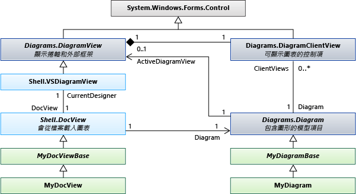

# <a name="navigating-and-updating-a-model-in-program-code"></a>巡覽及更新程式碼中的模型
您可以撰寫程式碼來建立和刪除模型項目、 設定其屬性，以及建立和刪除項目之間的連結。 必須在交易內進行所有變更。 如果在圖表上檢視項目，圖表 「 」 自動修正交易的結尾。  
  
## <a name="in-this-topic"></a>本主題內容  
 [DSL 定義範例](#example)  
  
 [瀏覽模型](#navigation)  
  
 [存取類別資訊](#metadata)  
  
 [執行交易內的變更](#transaction)  
  
 [建立模型項目](#elements)  
  
 [建立關聯性連結](#links)  
  
 [刪除項目](#deleteelements)  
  
 [刪除關聯性連結](#deletelinks)  
  
 [重新排列關聯性的連結](#reorder)  
  
 [鎖定](#locks)  
  
 [複製和貼上](#copy)  
  
 [巡覽和更新圖表](#diagrams)  
  
 [圖案和項目之間巡覽](#views)  
  
 [圖形和連接器的內容](#shapeProperties)  
  
 [DocView 和 DocData](#docdata)  
  
##  <a name="a-nameexamplea-an-example-dsl-definition"></a><a name="example"></a>DSL 定義範例  
 這是 DslDefinition.dsl 的主要部分，如本主題中的範例︰  
  
   
  
 此模型是此 DSL 的執行個體︰  
  
   
  
### <a name="references-and-namespaces"></a>參考和命名空間  
 若要執行本主題中的程式碼，您應該參考︰  
  
 `Microsoft.VisualStudio.Modeling.Sdk.11.0.dll`  
  
 您的程式碼會使用此命名空間︰  
  
 `using Microsoft.VisualStudio.Modeling;`  
  
 此外，如果您要從您的 DSL 定義的一個不同的專案中撰寫程式碼，您應該匯入的 Dsl 專案所建置的組件。  
  
##  <a name="a-namenavigationa-navigating-the-model"></a><a name="navigation"></a>瀏覽模型  
  
### <a name="properties"></a>屬性  
 您在 DSL 定義中定義的網域屬性會變成您可以在程式碼存取的屬性︰  
  
 `Person henry = ...;`  
  
 `if (henry.BirthDate < 1500) ...`  
  
 `if (henry.Name.EndsWith("VIII")) ...`  
  
 如果您想要設定屬性，您必須這麼做在[交易](#transaction):  
  
 `henry.Name = "Henry VIII";`  
  
 如果在 DSL 定義中，屬性的**種類**是**計算**，您不能設定它。 如需詳細資訊，請參閱[計算和儲存體的自訂內容](../modeling/calculated-and-custom-storage-properties.md)。  
  
### <a name="relationships"></a>關聯性  
 您在 DSL 定義中定義的網域關聯性會變成組屬性，另一個在每一端的關聯性類別。 屬性的名稱會顯示為關聯性的每一端的角色上的標籤的 DslDefinition 圖表中。 Role 的多重性，根據屬性的型別是位於關聯性另一端的類別，或是該類別的集合。  
  
 `foreach (Person child in henry.Children) { ... }`  
  
 `FamilyTreeModel ftree = henry.FamilyTreeModel;`  
  
 在關聯性的屬性永遠是對等。 當連結是建立或刪除時，會更新這兩個項目上的角色屬性。 下列運算式 (它會使用的副檔名`System.Linq`) 永遠是 ParentsHaveChildren 關聯性，在範例中，則為 true:  
  
 `(Person p) => p.Children.All(child => child.Parents.Contains(p))`  
  
 `&& p.Parents.All(parent => parent.Children.Contains(p));`  
  
 **ElementLinks**。 關聯性也由模型項目稱為*連結*，這是網域關聯性類型的執行個體。 連結永遠會有一個來源項目和一個目標項目。 來源項目和目標項目可以有名稱相同。  
  
 您可以存取的連結和其屬性︰  
  
 `ParentsHaveChildren link = ParentsHaveChildren.GetLink(henry, edward);`  
  
 `// This is now true:`  
  
 `link == null || link.Parent == henry && link.Child == edward`  
  
 根據預設，允許有一個以上的執行個體的關聯性連結模型項目的任何組合。 但在 DSL 定義中，如果`Allow Duplicates`旗標為 true 的關聯性，則可能會有一個以上的連結，而且您必須使用`GetLinks`:  
  
 `foreach (ParentsHaveChildren link in ParentsHaveChildren.GetLinks(henry, edward)) { ... }`  
  
 另外還有其他方法可以存取的連結。 例如:   
  
 `foreach (ParentsHaveChildren link in     ParentsHaveChildren.GetLinksToChildren(henry)) { ... }`  
  
 **隱藏的角色。** 在 DSL 定義中，如果**屬性產生**是**false**特定角色，則屬性不會產生對應於該角色。 不過，您仍然可以存取連結和周遊使用關聯性的方法的連結︰  
  
 `foreach (Person p in ParentsHaveChildren.GetChildren(henry)) { ... }`  
  
 最常使用的範例是<xref:Microsoft.VisualStudio.Modeling.Diagrams.PresentationViewsSubject>圖形會顯示在圖表上的連結模型項目關聯性︰</xref:Microsoft.VisualStudio.Modeling.Diagrams.PresentationViewsSubject>  
  
 `PresentationViewsSubject.GetPresentation(henry)[0] as PersonShape`  
  
### <a name="the-element-directory"></a>項目目錄  
 您可以存取使用的項目目錄存放區中的所有項目︰  
  
 `store.ElementDirectory.AllElements`  
  
 也有一些方法，尋找項目，如下所示︰  
  
 `store.ElementDirectory.FindElements(Person.DomainClassId);`  
  
 `store.ElementDirectory.GetElement(elementId);`  
  
##  <a name="a-namemetadataa-accessing-class-information"></a><a name="metadata"></a>存取類別資訊  
 您可以取得資訊的類別、 關聯性和 DSL 定義中的其他層面。 例如:   
  
 `DomainClassInfo personClass = henry.GetDomainClass();`  
  
 `DomainPropertyInfo birthProperty =`  
  
 `personClass.FindDomainProperty("BirthDate")`  
  
 `DomainRelationshipInfo relationship =`  
  
 `link.GetDomainRelationship();`  
  
 `DomainRoleInfo sourceRole = relationship.DomainRole[0];`  
  
 模型項目的上階類別如下所示︰  
  
-   ModelElement-所有項目和關聯性是 ModelElements  
  
-   中繼角色的所有關聯性都 ElementLinks  
  
##  <a name="a-nametransactiona-perform-changes-inside-a-transaction"></a><a name="transaction"></a>執行交易內的變更  
 每當您的程式碼變更存放區中的任何項目時，它必須在交易內進行。 這適用於所有模型項目、 關聯性、 圖形、 圖表和其屬性。 如需詳細資訊，請參閱<xref:Microsoft.VisualStudio.Modeling.Transaction>。</xref:Microsoft.VisualStudio.Modeling.Transaction>  
  
 管理交易的最簡單的方法是使用`using`陳述式括住`try...catch`陳述式︰  
  
```  
Store store; ...  
try  
{  
  using (Transaction transaction =  
    store.TransactionManager.BeginTransaction("update model"))  
    // Outermost transaction must always have a name.  
  {  
    // Make several changes in Store:  
    Person p = new Person(store);  
    p.FamilyTreeModel = familyTree;  
    p.Name = "Edward VI";  
    // end of changes to Store  
  
    transaction.Commit(); // Don't forget this!  
  } // transaction disposed here  
}  
catch (Exception ex)  
{  
  // If an exception occurs, the Store will be   
  // rolled back to its previous state.  
}  
```  
  
 您可以讓任意數目的一筆交易內的變更。 您可以開啟使用中交易內的新交易。  
  
 若要進行永久變更，您應該`Commit`處置它之前的交易。 如果發生例外狀況未攔截到在交易內，所做的變更之前的狀態將會重設存放區。  
  
##  <a name="a-nameelementsa-creating-model-elements"></a><a name="elements"></a>建立模型項目  
 這個範例會將元素加入至現有的模型︰  
  
```  
FamilyTreeModel familyTree = ...; // The root of the model.         
using (Transaction t =  
    familyTree.Store.TransactionManager  
    .BeginTransaction("update model"))  
{  
  // Create a new model element   
  // in the same partition as the model root:  
  Person edward = new Person(familyTree.Partition);  
  // Set its embedding relationship:  
  edward.FamilyTreeModel = familyTree;  
          // same as: familyTree.People.Add(edward);  
  // Set its properties:  
  edward.Name = "Edward VII";  
  t.Commit(); // Don't forget this!  
}  
```  
  
 這個範例會說明這些重點有關建立一個項目︰  
  
-   存放區的特定資料分割中建立新的項目。 模型項目和關聯性，但不形狀，這通常是預設資料分割。  
  
-   可讓內嵌關聯性的目標。 在此範例的 DslDefinition，每個人都必須是內嵌關聯性 FamilyTreeHasPeople 的目標。 若要達到此目的，我們可以設定將 Person 物件，FamilyTreeModel 角色屬性，或是將人員加入至 FamilyTreeModel 物件的使用者角色屬性。  
  
-   設定新的項目，特別是屬性的屬性`IsName`在 DslDefinition 中為 true。 這個旗標標記可以用來識別唯一內其擁有者的項目屬性。 在此情況下，Name 屬性具有該旗標。  
  
-   此 DSL 的 DSL 定義必須載入到存放區。 如果您正在撰寫如功能表命令擴充功能，這通常會是已經，則為 true。 在其他情況下，您可以明確地將模型載入到存放區，或使用<xref:Microsoft.VisualStudio.Modeling.Integration.ModelBus>載入它。</xref:Microsoft.VisualStudio.Modeling.Integration.ModelBus> 如需詳細資訊，請參閱[How to︰ 從程式碼中的檔案開啟模型](../modeling/how-to-open-a-model-from-file-in-program-code.md)。  
  
 當您建立項目，如此一來時，圖形會自動建立 （如果 DSL 圖表）。 它會出現在自動指派的位置，使用預設的圖形、 色彩和其他功能。 如果您想要控制相關聯的圖形顯示的位置和方式，請參閱[建立項目和其圖形](#merge)。  
  
##  <a name="a-namelinksa-creating-relationship-links"></a><a name="links"></a>建立關聯性連結  
 有兩個範例 DSL 定義中定義的關聯性。 每個關聯性定義*角色屬性*每一端的關聯性類別上。  
  
 有三種方式，您可以在其中建立關聯性的執行個體。 每個這三種方法都有相同的效果︰  
  
-   設定來源角色扮演者的屬性。 例如:   
  
    -   `familyTree.People.Add(edward);`  
  
    -   `edward.Parents.Add(henry);`  
  
-   設定目標角色扮演者的屬性。 例如:   
  
    -   `edward.familyTreeModel = familyTree;`  
  
         此角色的多重性是`1..1`，因此我們將值指派。  
  
    -   `henry.Children.Add(edward);`  
  
         此角色的多重性是`0..*`，因此我們將加入至集合。  
  
-   明確建構關聯性的執行個體。 例如:   
  
    -   `FamilyTreeHasPeople edwardLink = new FamilyTreeHasPeople(familyTreeModel, edward);`  
  
    -   `ParentsHaveChildren edwardHenryLink = new ParentsHaveChildren(henry, edward);`  
  
 最後一個方法是很有用，如果您想要設定關聯性本身的屬性。  
  
 當您建立項目，如此一來時，在圖表上的連接器會自動建立，但有預設圖形、 色彩和其他功能。 若要控制相關聯的連接器的建立方式，請參閱[建立項目和其圖形](#merge)。  
  
##  <a name="a-namedeleteelementsa-deleting-elements"></a><a name="deleteelements"></a>刪除項目  
 刪除項目，藉由呼叫`Delete()`:  
  
 `henry.Delete();`  
  
 這項作業也會刪除︰  
  
-   關聯性的連結項目。 例如，`edward.Parents`就不再包含`henry`。  
  
-   在角色的項目`PropagatesDelete`旗標為 true。 例如，將刪除顯示的項目圖形。  
  
 根據預設，每個內嵌關聯性的`PropagatesDelete`在目標角色，則為 true。 刪除`henry`不會刪除`familyTree`，但`familyTree.Delete()`會刪除所有`Persons`。 如需詳細資訊，請參閱[自訂刪除行為](../modeling/customizing-deletion-behavior.md)。  
  
 根據預設，`PropagatesDelete`不適用的參考關聯性的角色。  
  
 您可以讓您刪除物件時，略過特定的傳用刪除規則。 這非常有用，如果您以一個項目取代為另一個。 您提供的一或多個角色的刪除應該不會傳播的 GUID。 從關聯性類別，可以取得 GUID:  
  
 `henry.Delete(ParentsHaveChildren.SourceDomainRoleId);`  
  
 (在此範例中會有任何作用，因為`PropagatesDelete`是`false`的角色`ParentsHaveChildren`關聯性。)  
  
 在某些情況下，因鎖定項目或項目，會刪除傳播的存在而無法刪除。 您可以使用`element.CanDelete()`來檢查是否可以刪除該項目。  
  
##  <a name="a-namedeletelinksa-deleting-relationship-links"></a><a name="deletelinks"></a>刪除關聯性連結  
 您可以從角色屬性中移除項目來刪除關聯性連結︰  
  
 `henry.Children.Remove(edward); // or:`  
  
 `edward.Parents.Remove(henry);  // or:`  
  
 您也可以明確地刪除連結︰  
  
 `edwardHenryLink.Delete();`  
  
 所有這三種方法有相同的效果。 您只需要使用其中一個。  
  
 如果角色有多重性 0..1 或 1..1，您可以將它設定為`null`，或為另一個值︰  
  
 `edward.FamilyTreeModel = null;`或︰  
  
 `edward.FamilyTreeModel = anotherFamilyTree;`  
  
##  <a name="a-namereordera-re-ordering-the-links-of-a-relationship"></a><a name="reorder"></a>重新排序關聯性的連結  
 取得資料來源或目標特定的模型項目特定關聯性的連結有特定的順序。 它們會出現在已加入的順序。 例如，此陳述式，一定會產生相同的順序中的子系︰  
  
 `foreach (Person child in henry.Children) ...`  
  
 您可以變更連結的順序︰  
  
 `ParentsHaveChildren link = GetLink(henry,edward);`  
  
 `ParentsHaveChildren nextLink = GetLink(henry, elizabeth);`  
  
 `DomainRoleInfo role =`  
  
 `link.GetDomainRelationship().DomainRoles[0];`  
  
 `link.MoveBefore(role, nextLink);`  
  
##  <a name="a-namelocksa-locks"></a><a name="locks"></a>鎖定  
 您的變更可能會無法鎖定。 個別項目、 磁碟分割，以及在存放區，可以設定鎖定。 如果任何這些層級鎖定來防止您想要的變更類型，當您在嘗試時可能會擲回例外狀況。 您可以發現使用項目是否設定鎖定。GetLocks()，也就是<xref:Microsoft.VisualStudio.Modeling.Immutability>。</xref:Microsoft.VisualStudio.Modeling.Immutability>命名空間中定義的擴充方法  
  
 如需詳細資訊，請參閱[定義鎖定原則來建立唯讀區段](../modeling/defining-a-locking-policy-to-create-read-only-segments.md)。  
  
##  <a name="a-namecopya-copy-and-paste"></a><a name="copy"></a>複製和貼上  
 您可以將項目或項目群組複製到<xref:System.Windows.Forms.IDataObject>::</xref:System.Windows.Forms.IDataObject>  
  
```  
Person person = personShape.ModelElement as Person;  
Person adopter = adopterShape.ModelElement as Person;  
IDataObject data = new DataObject();  
personShape.Diagram.ElementOperations  
      .Copy(data, person.Children.ToList<ModelElement>());  
```  
  
 項目會儲存為序列化的項目群組。  
  
 您可以將項目從 IDataObject 合併至模型︰  
  
```  
using (Transaction t = targetDiagram.Store.  
        TransactionManager.BeginTransaction("paste"))  
{  
  adopterShape.Diagram.ElementOperations.Merge(adopter, data);  
}  
```  
  
 `Merge ()`可以接受`PresentationElement`或`ModelElement`。 如果您提供`PresentationElement`，您也可以在第三個參數的目標圖表上指定的位置。  
  
##  <a name="a-namediagramsa-navigating-and-updating-diagrams"></a><a name="diagrams"></a>巡覽和更新圖表  
 在 DSL 中，網域模型項目，它代表的概念，例如人或歌曲，是個別從圖形項目，表示您在圖表上所看到的內容。 網域模型項目儲存的重要屬性和關聯性的概念。 圖形元素儲存大小、 位置和物件的檢視，請在圖表上的色彩和其元件部分的版面配置。  
  
### <a name="presentation-elements"></a>簡報項目  
   
  
 在 DSL 定義中，您指定每個項目會建立衍生自下列標準類別的其中一個類別。  
  
|元素的類型|基底類別|  
|---------------------|----------------|  
|網域類別|<xref:Microsoft.VisualStudio.Modeling.ModelElement></xref:Microsoft.VisualStudio.Modeling.ModelElement>|  
|網域關聯性|<xref:Microsoft.VisualStudio.Modeling.ElementLink></xref:Microsoft.VisualStudio.Modeling.ElementLink>|  
|圖形|<xref:Microsoft.VisualStudio.Modeling.Diagrams.NodeShape></xref:Microsoft.VisualStudio.Modeling.Diagrams.NodeShape>|  
|接點|<xref:Microsoft.VisualStudio.Modeling.Diagrams.BinaryLinkShape></xref:Microsoft.VisualStudio.Modeling.Diagrams.BinaryLinkShape>|  
|圖表|<xref:Microsoft.VisualStudio.Modeling.Diagrams.Diagram></xref:Microsoft.VisualStudio.Modeling.Diagrams.Diagram>|  
  
 在圖表上的項目通常表示模型項目。 通常 （但不是一定），<xref:Microsoft.VisualStudio.Modeling.Diagrams.NodeShape>代表網域類別執行個體和<xref:Microsoft.VisualStudio.Modeling.Diagrams.BinaryLinkShape>代表網域關聯性執行個體。</xref:Microsoft.VisualStudio.Modeling.Diagrams.BinaryLinkShape> </xref:Microsoft.VisualStudio.Modeling.Diagrams.NodeShape> <xref:Microsoft.VisualStudio.Modeling.Diagrams.PresentationViewsSubject>關聯性連結至模型項目所代表的節點或連結的圖形。</xref:Microsoft.VisualStudio.Modeling.Diagrams.PresentationViewsSubject>  
  
 每一個節點或連結的圖形都屬於一個圖表。 二進位連結圖形會連接兩個節點的圖形。  
  
 圖形可以有兩個集合中的子圖形。 中的圖形`NestedChildShapes`組會侷限於其父系的週框方塊。 中的圖形`RelativeChildShapes`清單可以出現在外部或部分的父 – 例如標籤或連接埠範圍之外。 圖表沒有`RelativeChildShapes`，而且沒有`Parent`。  
  
###  <a name="a-nameviewsa-navigating-between-shapes-and-elements"></a><a name="views"></a>圖案和項目之間巡覽  
 網域模型項目和圖形元素的關聯<xref:Microsoft.VisualStudio.Modeling.Diagrams.PresentationViewsSubject>關聯性。</xref:Microsoft.VisualStudio.Modeling.Diagrams.PresentationViewsSubject>  
  
```c#  
// using Microsoft.VisualStudio.Modeling;  
// using Microsoft.VisualStudio.Modeling.Diagrams;  
// using System.Linq;  
Person henry = ...;  
PersonShape henryShape =   
  PresentationViewsSubject.GetPresentation(henry)  
    .FirstOrDefault() as PersonShape;  
```  
  
 相同的關聯性會連結到圖表上的連接器的關聯性︰  
  
```  
Descendants link = Descendants.GetLink(henry, edward);  
DescendantConnector dc =  
   PresentationViewsSubject.GetPresentation(link)  
     .FirstOrDefault() as DescendantConnector;  
// dc.FromShape == henryShape && dc.ToShape == edwardShape  
```  
  
 此關聯性也會連結到圖表的模型的根︰  
  
```  
FamilyTreeDiagram diagram =   
   PresentationViewsSubject.GetPresentation(familyTree)  
      .FirstOrDefault() as FamilyTreeDiagram;  
```  
  
 若要取得圖形所代表的模型項目，請使用︰  
  
 `henryShape.ModelElement as Person`  
  
 `diagram.ModelElement as FamilyTreeModel`  
  
### <a name="navigating-around-the-diagram"></a>瀏覽的圖表  
 一般而言不建議您巡覽圖形和圖表上的連接器。 最好是瀏覽在模型中，就必須處理圖表的外觀時，才移動圖形和連接器之間的關聯性。 這些方法會連結到每一端圖形的連接器︰  
  
 `personShape.FromRoleLinkShapes, personShape.ToRoleLinkShapes`  
  
 `connector.FromShape, connector.ToShape`  
  
 許多圖形都是複合應用程式。它們會組成父圖形和一個或多個層級的子系。 放置相對於另一個圖案的圖形可以說是其*子系*。 父圖形移動時，隨之移動子系。  
  
 *相對的子系*可以出現在父圖形的週框方塊的外部。 *巢狀*系嚴格地出現在父代的界限內。  
  
 若要取得最上層的一組圖形在圖表上，請使用︰  
  
 `Diagram.NestedChildShapes`  
  
 圖形和連接器的上階類別有︰  
  
 <xref:Microsoft.VisualStudio.Modeling.ModelElement></xref:Microsoft.VisualStudio.Modeling.ModelElement>  
  
 --<xref:Microsoft.VisualStudio.Modeling.Diagrams.PresentationElement></xref:Microsoft.VisualStudio.Modeling.Diagrams.PresentationElement>  
  
 --<xref:Microsoft.VisualStudio.Modeling.Diagrams.ShapeElement></xref:Microsoft.VisualStudio.Modeling.Diagrams.ShapeElement>  
  
 -----<xref:Microsoft.VisualStudio.Modeling.Diagrams.NodeShape></xref:Microsoft.VisualStudio.Modeling.Diagrams.NodeShape>  
  
 -------<xref:Microsoft.VisualStudio.Modeling.Diagrams.Diagram></xref:Microsoft.VisualStudio.Modeling.Diagrams.Diagram>  
  
 ------- *YourShape*  
  
 -----<xref:Microsoft.VisualStudio.Modeling.Diagrams.LinkShape></xref:Microsoft.VisualStudio.Modeling.Diagrams.LinkShape>  
  
 -------<xref:Microsoft.VisualStudio.Modeling.Diagrams.BinaryLinkShape></xref:Microsoft.VisualStudio.Modeling.Diagrams.BinaryLinkShape>  
  
 --------- *YourConnector*  
  
###  <a name="a-nameshapepropertiesa-properties-of-shapes-and-connectors"></a><a name="shapeProperties"></a>圖形和連接器的內容  
 在大部分情況下，不需要對圖形進行明確的變更。 當您變更模型項目時，「 修復 」 規則更新圖形和連接器。 如需詳細資訊，請參閱[回應及傳播變更](../modeling/responding-to-and-propagating-changes.md)。  
  
 不過，最好明確變更圖形中的模型項目無關的屬性。 例如，您可以變更這些屬性︰  
  
-   <xref:Microsoft.VisualStudio.Modeling.Diagrams.NodeShape.Size%2A>-決定圖形的寬度與高度。</xref:Microsoft.VisualStudio.Modeling.Diagrams.NodeShape.Size%2A>  
  
-   <xref:Microsoft.VisualStudio.Modeling.Diagrams.NodeShape.Location%2A>-相對於父圖形或圖表的位置</xref:Microsoft.VisualStudio.Modeling.Diagrams.NodeShape.Location%2A>  
  
-   <xref:Microsoft.VisualStudio.Modeling.Diagrams.ShapeElement.StyleSet%2A>-畫筆和筆刷用來繪製圖形或連接器的設定</xref:Microsoft.VisualStudio.Modeling.Diagrams.ShapeElement.StyleSet%2A>  
  
-   <xref:Microsoft.VisualStudio.Modeling.Diagrams.ShapeElement.Hide%2A>-使圖案的不可見</xref:Microsoft.VisualStudio.Modeling.Diagrams.ShapeElement.Hide%2A>  
  
-   <xref:Microsoft.VisualStudio.Modeling.Diagrams.ShapeElement.Show%2A>-之後顯示圖形`Hide()`</xref:Microsoft.VisualStudio.Modeling.Diagrams.ShapeElement.Show%2A>  
  
###  <a name="a-namemergea-creating-an-element-and-its-shape"></a><a name="merge"></a>建立項目和形狀  
 當您建立項目，並將它連結到樹狀結構中的內嵌關聯性時，圖形會自動建立並與它相關聯。 這是由執行的交易結尾的 「 修復 」 規則。 不過，圖形會出現在一個自動指派的位置，和其圖形、 色彩和其他功能都有預設值。 若要控制圖形的建立方式，您可以使用合併函式。 您必須先加入您想要加入至 ElementGroup，項的目，然後再合併到圖表中的 群組。  
  
 這個方法︰  
  
-   如果，設定的名稱，您已指派的項目名稱的屬性。  
  
-   會遵守任何項目合併指示詞在 DSL 定義中所指定。  
  
 當使用者按兩下圖表，此範例會建立圖形的滑鼠位置。 在此範例中，DSL 定義`FillColor`屬性`ExampleShape`已公開。  
  
```  
  
using Microsoft.VisualStudio.Modeling;  
using Microsoft.VisualStudio.Modeling.Diagrams;  
partial class MyDiagram  
{  
  public override void OnDoubleClick(DiagramPointEventArgs e)  
  {  
    base.OnDoubleClick(e);  
  
    using (Transaction t = this.Store.TransactionManager  
        .BeginTransaction("double click"))  
    {  
      ExampleElement element = new ExampleElement(this.Store);  
      ElementGroup group = new ElementGroup(element);  
  
      { // To use a shape of a default size and color, omit this block.  
        ExampleShape shape = new ExampleShape(this.Partition);  
        shape.ModelElement = element;  
        shape.AbsoluteBounds = new RectangleD(0, 0, 1.5, 1.0);  
        shape.FillColor = System.Drawing.Color.Azure;  
        group.Add(shape);  
      }  
  
      this.ElementOperations.MergeElementGroupPrototype(  
        this,  
        group.CreatePrototype(),  
        PointD.ToPointF(e.MousePosition));  
      t.Commit();  
    }  
  }  
}  
  
```  
  
 如果您提供多個圖案，設定其使用的相對位置`AbsoluteBounds`。  
  
 您也可以設定色彩，以及使用此方法的連接器公開的屬性。  
  
### <a name="use-transactions"></a>使用交易  
 圖形、 連接器和圖表的子類型的<xref:Microsoft.VisualStudio.Modeling.ModelElement>和即時存放區中。</xref:Microsoft.VisualStudio.Modeling.ModelElement> 因此，您必須進行它們變更只有在交易內。 如需詳細資訊，請參閱[How to︰ 使用交易來更新模型](../modeling/how-to-use-transactions-to-update-the-model.md)。  
  
##  <a name="a-namedocdataa-document-view-and-document-data"></a><a name="docdata"></a>文件檢視和文件資料  
   
  
## <a name="store-partitions"></a>儲存資料分割  
 載入模型時，會在同時載入伴隨的圖表。 通常，模型載入 Store.DefaultPartition，且圖表內容載入至另一個磁碟分割。 通常，每個資料分割的內容會載入，並且儲存到不同的檔案。  
  
## <a name="see-also"></a>另請參閱  
 <xref:Microsoft.VisualStudio.Modeling.ModelElement></xref:Microsoft.VisualStudio.Modeling.ModelElement>   
 [定義域專屬語言中的驗證](../modeling/validation-in-a-domain-specific-language.md)   
 [從定義域專屬語言產生程式碼](../modeling/generating-code-from-a-domain-specific-language.md)   
 [如何︰ 使用異動更新模型](../modeling/how-to-use-transactions-to-update-the-model.md)   
 [使用 Visual Studio Modelbus 整合模型](../modeling/integrating-models-by-using-visual-studio-modelbus.md)   
 [回應及傳播變更](../modeling/responding-to-and-propagating-changes.md)

