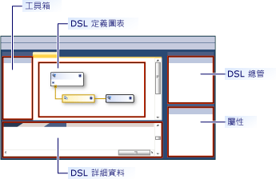
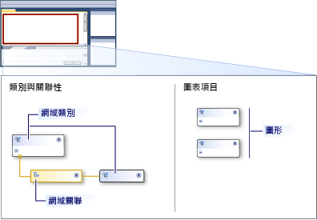
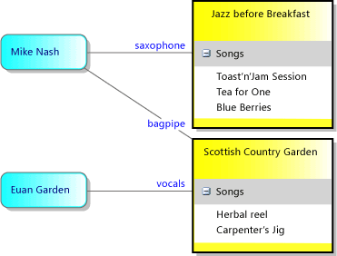
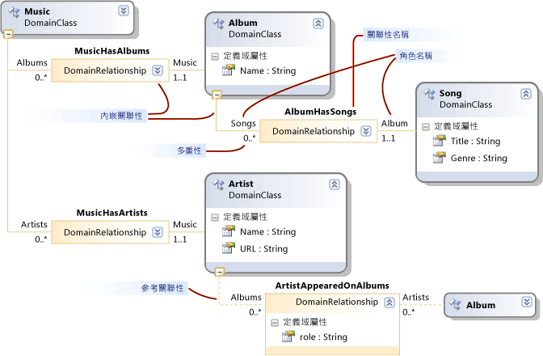

# 了解模型、類別和關聯性
定義域專屬語言 (DSL) 是由其 DSL 定義檔案，以及您可能會撰寫任何自訂的程式碼定義。 大部分的 DSL 方案中的程式碼會產生這個檔案。  
  
 本主題說明 DSL 定義中的核心的功能。  
  
## DSL 定義  
 當您開啟`Dsl\DslDefinition.dsl`，[!INCLUDE[vsprvs](../code-quality/includes/vsprvs_md.md)]視窗類似下列圖片。  
  
   
  
 在 DSL 定義中最重要的資訊會顯示在 DSL 定義圖。 其他資訊，也是 DslDefinition.dsl 的一部分，會顯示在 [DSL 總管] 中，它通常會顯示在圖表的側邊。 您可以使用圖中的最常見的工作，與用於更進階的自訂 DSL 總管。  
  
 DSL 定義圖會顯示定義模型項目，以及定義連結模型項目之間的關聯性的網域類別。 它也會顯示圖形及連接器，用來向使用者顯示的模型項目。  
  
   
  
 當您在 DSL 定義中，在圖表上或在 [DSL 總管] 中，選取項目相關的資訊會顯示在 [屬性] 視窗中。 在 [DSL 詳細資料] 視窗中，可能會顯示其他資訊。  
  
### 模型是 Dsl 的執行個體  
 A*模型*是由使用者建立 DSL 的執行個體。 模型包含模型項目，也就是您定義時，網域類別和連結項目，也就是您定義網域關聯性執行個體的執行個體。 圖形與連接器，在圖表顯示的模型項目和連結，也可以有一個模型。 DSL 定義中包含圖形類別、 連接線類別，以及類別圖表。  
  
 DSL 定義也就是*網域模型*。 DSL 定義或網域模型是定義域專屬語言的設計階段表示，而此模型是定義域專屬語言執行階段具現化。  
  
## 網域類別定義的模型項目  
 網域類別來建立在網域中的各種項目，而且網域關聯性是指的項目之間的連結。 也就是項目和連結，將具現化的設計特定語言的使用者在建立其模型時的設計階段表示。  
  
 下圖顯示音樂庫 DSL 的使用者所建立的模型。 音樂專輯，其中包含的歌曲清單來表示。 演出者與圓角的方塊中，代表為要參與連線。  
  
   
  
 DSL 定義用來分隔兩個層面。 模型項目上模型圖表的外觀是由使用圖形類別和連接器類別定義。 使用網域類別和網域關聯性定義模型中所含的資訊。  
  
 下圖顯示網域類別和關聯性在 DSL 定義中的音樂媒體櫃。  
  
   
  
 下圖顯示四個網域類別︰ 音樂、 專輯、 演出者與歌曲。 網域類別定義網域屬性，例如名稱、 標題等。 在執行個體模型中，其中一些屬性的值會顯示在圖表上。  
  
 類別之間的網域關聯性︰ MusicHasAlbums、 MusicHasArtists、 AlbumbHasSongs 和 ArtistAppearedOnAlbums。 關聯性具有 1..1，例如多重性 0..*。 例如，必須與相關 AlbumHasSongs 關聯性透過一個專輯的所有歌曲。 每個專輯可以有任意數目的歌曲。  
  
### 重新整理 DSL 定義圖  
 請注意網域類別可以在 DSL 定義圖表中，會出現許多次未在此圖中的專輯。 總是有一個主要的檢視，而且不可以有一些*參考*檢視。  
  
 若要重新整理 DSL 定義圖，您可以︰  
  
-   交換主要與參考檢視使用**此處將樹狀結構**和**分割樹狀結構**命令。 若要查看這些命令的單一網域類別上按一下滑鼠右鍵。  
  
-   按下 Ctrl + 向上鍵和 Ctrl + 向下重新排列的網域類別和圖形類別。  
  
-   摺疊或展開類別使用的每個圖形右上角的圖示。  
  
-   按一下底部的 網域類別減號 （-） 摺疊樹狀結構的部分。  
  
## 繼承  
 可以使用繼承來定義網域類別。 若要建立繼承衍生，按一下 [繼承] 工具，按一下衍生的類別中，然後按一下基底類別。 模型項目具有它自己的網域類別，以及繼承自基底類別的所有屬性定義的所有屬性。 它也會繼承其關聯性中的角色。  
  
 也可以使用繼承，之間的關聯性、 圖形和連接器。 繼承必須保留相同的群組內。 網域類別無法繼承圖形。  
  
## 網域關聯性  
 可以透過關聯性連結模型項目。 連結一律是二進位。它們會連結兩個項目。 不過，任何項目可以有許多連結指向其他物件，而且甚至可以有多個相同的項目組之間的連結。  
  
 就像您可以定義不同類別的項目，您可以定義不同類別的連結。 連結的類別稱為*網域關聯性*。 網域關聯性指定的項目類別及其執行個體可以連線。 關聯性的每一端稱為*角色*，和網域關聯性定義兩個角色，以及關聯性本身的名稱。  
  
 有兩種類型的網域關聯性︰ 內嵌關聯性和參考關聯性。 在 DSL 定義圖表中，內嵌關聯性具有實線，在每個角色，並參考關聯性有虛線。  
  
### 內嵌關聯性  
 在模型中，其根目錄中，除了每個項目是一個內嵌連結的目標。 因此，整個模型會形成單一樹狀結構的內嵌的連結。 內嵌關聯性代表內含項目或擁有權。 在這種方式中有關聯的兩個模型項目也就是為 parent 與 child。 子系，即會內嵌在父代。  
  
 內嵌的連結不通常會顯示明確為圖表上的連接器。 相反地，它們通常會以內含項目。 模型的根由圖表中，並在其中內嵌項目會顯示為圖表上的圖形。  
  
 在範例中，根類別音樂有內嵌關聯性具有內嵌 AlbumHasSongs 歌曲的專輯的 MusicHasAlbums。 歌曲會顯示為每個專輯內的清單中的項目。 音樂也有內嵌 MusicHasArtists 演出者類別，其執行個體也會顯示為圖表上的圖形。  
  
 根據預設，內嵌的項目會自動刪除時刪除其父系。  
  
 當儲存模型是以 XML 格式檔案，內嵌的項目會在巢狀其父代，除非您已自訂序列化。  
  
> [!NOTE]
>  內嵌與繼承不同。 內嵌關聯性中的子系不會繼承父系的屬性。 內嵌是連結的一種模型項目之間。 繼承關聯性類別，並不會建立模型項目之間的連結。  
  
### 內嵌的規則  
 每個執行個體模型中的項目必須是連結的一個內嵌，除了模型根的目標。  
  
 因此，每個非抽象網域類別，除了根類別，必須至少一個內嵌關聯性的目標，或者它必須繼承自基底類別的內嵌。 類別可以是兩個或多個內嵌的目標，但其執行個體模型項目一次只能有一個父代。 從目標到來源的多重性必須是 0..1 或 1..1。  
  
### [總管] 會顯示內嵌樹狀結構  
 DSL 定義也會建立檔案總管，使用者會看到隨其模型圖表。  
  
   
  
 [總管] 中會顯示在模型中，即使您尚未定義任何圖形的所有項目。 它會顯示項目和內嵌關聯性，但不是會參考關聯性。  
  
 若要查看項目的網域屬性的值，使用者在模型圖表或在 [模型總管] 中，選取一個項目，並開啟 [屬性] 視窗。 它會顯示所有網域屬性，包括那些不會顯示在圖表上。 在範例中，每首歌曲具有標題和內容類型，但在圖表上顯示標題的值。  
  
## 參考關聯性  
 參考關聯性代表任何種類的非內嵌的關聯性。  
  
 參考關聯性通常會做為圖形之間的連接器顯示在圖表上。  
  
 模型的 XML 表示法，在兩個項目之間的參考連結都表示使用*moniker。* 也就是說，moniker 是唯一識別模型中的每個元素的名稱。 每個模型項目的 XML 節點會包含指定的關聯性名稱和其他項目之 moniker 的節點。  
  
## 角色  
 每個網域關聯性有兩個角色、 來源角色和目標角色。  
  
 在下列圖片之間的線**發行者**網域類別和**PublisherCatalog**網域關聯性是來源角色。 網域關聯性之間的線條和**專輯**網域類別是目標角色。  
  
 ![角色和屬性。] (~/modeling/media/propertycode.png "PropertyCode")  
  
 當您撰寫會周遊模型的程式碼時，具有關聯性相關聯的名稱便特別重要。 比方說，當您建置 DSL 方案時，所產生的類別 「 發行者 」 就會有一個屬性是集合的專輯的目錄。 專輯的類別有一個屬性是 「 發行者 」 之類別的單一執行個體的發行者。  
  
 當您在 DSL 定義中建立關聯性時，其屬性和關聯性名稱都會有預設值。 不過，您可以變更它們。  
  
## 多重性  
 多重性指定多少項目可以有相同的角色中的網域關聯性。 在範例中，若要多零 (0...\*) 上的多重性設定**目錄**角色指定的任何執行個體**發行者**網域類別可以有任意數目**PublisherCatalog**關聯性連結，為您想要給予它。  
  
 在圖表上輸入或修改設定 role 的多重性`Multiplicity`屬性**屬性**視窗。 下表說明這個屬性的設定。  
  
|多重性類型|說明|  
|-----------------------|-----------------|  
|0..* （從零至多個）|每個網域類別執行個體可以有多個執行個體的關聯性或沒有關聯性的執行個體。|  
|0..1 （零至其中一個）|每個網域類別執行個體可以有一個執行個體的關聯性或沒有關聯性的執行個體。|  
|1..1 （一個）|每個網域類別執行個體可以有一個關聯性的執行個體。 您無法從任何角色類別的執行個體來建立此關聯性的多個執行個體。 如果已啟用驗證，角色類別的任何執行個體有關聯性的執行個體時，會出現驗證錯誤。|  
|1..* （一對多）|擁有此多重性的角色，類別的每個執行個體可以有多個執行個體的關聯性，以及每個執行個體必須具有至少一個執行個體的關聯性。 如果已啟用驗證，角色類別的任何執行個體有關聯性的執行個體時，會出現驗證錯誤。|  
  
## 網域關聯性類別  
 連結表示為 LinkElement，這是 ModelElement 的衍生的類別的執行個體存放區中。 您可以在網域模型圖中的網域關聯性定義這些屬性。  
  
 您也可以讓關聯性的來源或目標的其他關聯性。 在網域模型圖中，以滑鼠右鍵按一下網域關聯性，然後按一下 **顯示類別**。 其他類別會出現一個方塊。 您可以連接到它的關聯性。  
  
 您可以定義關聯性部分繼承一樣，您可以使用網域類別。 選取衍生關聯性，並設定**基底關聯性**[屬性] 視窗中。  
  
 在衍生的關聯性的專長是其基底的關聯性。 網域類別的它應該從衍生的連結，或連結的基底的關聯性的類別相同。 在模型中建立衍生的關聯性的連結時，它是衍生和基底的關聯性的執行個體。 在程式碼中，您可以瀏覽至使用基底或衍生類別所產生的屬性連結的另一端。  
  
## 另請參閱  
 [定義域專屬語言工具字彙](http://msdn.microsoft.com/en-us/ca5e84cb-a315-465c-be24-76aa3df276aa)

