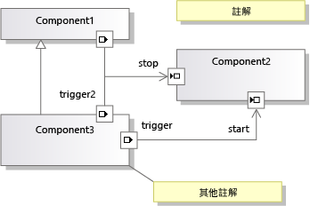

# <a name="understanding-the-dsl-code"></a>了解 DSL 程式碼
網域指定的語言 (DSL) 方案會產生可用來讀取及更新 [!INCLUDE[vsprvs](../code-quality/includes/vsprvs_md.md)] 中之 DSL 執行個體的應用程式開發介面。 這個應用程式開發介面是以從 DSL 定義產生的程式碼來定義。 本主題說明產生的應用程式開發介面。  
  
## <a name="the-example-solution-component-diagrams"></a>範例方案：元件圖表  
 若要建立方案，大部分的範例，本主題中的來源，建立從 DSL**元件模型**方案範本。 這是您建立新的 DSL 方案時所顯示的其中一個標準範本。  
  
> [!NOTE]
>  元件圖表 DSL 範本與 UML 元件圖表，您可以使用 Visual Studio 中的 [架構] 功能表建立不相關。 在**新的專案**對話方塊方塊中，展開**其他專案類型 \ 擴充性**然後按一下 **定義域專屬語言設計工具**。  
  
 如果您對這個方案範本不熟悉，請按 F5 鍵進行實驗。 請特別注意，您可以將通訊埠工具拖曳到元件上來建立通訊埠，也可以連接通訊埠。  
  
   
  
## <a name="the-structure-of-the-dsl-solution"></a>DSL 方案的結構  
 **Dsl**專案定義 DSL 的 API。 **DslPackage**專案可讓您定義如何與整合[!INCLUDE[vsprvs](../code-quality/includes/vsprvs_md.md)]。 您也可以加入自己的專案，這些專案也可以包含從模型產生的程式碼。  
  
### <a name="the-code-directories"></a>程式碼目錄  
 大部分的每個專案中的程式碼會產生從**Dsl\DslDefinition.dsl**。 產生的程式碼位於**產生的程式碼**資料夾。 若要查看產生的檔案，請按一下  **[+]**旁邊產生**.tt**檔案。  
  
 建議您檢查產生的程式碼，以協助您了解 DSL。 若要查看產生的檔案，請展開 [方案總管] 中的 *.tt 檔。  
  
 \*.Tt 檔案包含極少的產生程式碼。 相反地，這些檔案使用 `<#include>` 指示詞來包含共用範本檔案。 共用的檔案位於**files\microsoft Visual Studio 10.0\Common7\IDE\Extensions\Microsoft\DSL \ common7\ide\extensions\microsoft\dsl SDK\DSL Designer\11.0\TextTemplates**  
  
 當您將自己的程式碼加入至 DSL 方案時，請將此程式碼加入至 Generated Code 資料夾外部的其他檔案中。 您可能想要建立**自訂程式碼**資料夾。 (當您將新的程式碼檔案加入至自訂資料夾時，請記得修正初始程式碼基本架構中的命名空間)。  
  
 強烈建議您不要直接編輯產生的程式碼，因為當您重建方案時，您的編輯將會遺失。 相反地，若要自訂您的 DSL：  
  
-   調整 DSL 定義中的許多參數。  
  
-   以不同的程式碼檔案撰寫部分類別，覆寫產生的類別中所定義或繼承的方法。 在某些情況下，您必須設定**產生雙衍生**在 DSL 定義中，類別的選項，才能覆寫產生的方法。  
  
-   設定 DSL 定義中的選項，使產生的程式碼為您自己的程式碼提供「攔截」。  
  
     例如，如果您設定**有自訂建構函式**網域類別的選項，然後建置方案，您會看到錯誤訊息。 當您按兩下其中一個錯誤訊息時，您會看到產生的程式碼中的註解，說明自訂程式碼應提供的項目。  
  
-   撰寫您自己的文字範本，以產生應用程式特定的程式碼。 您可以使用包含檔案，以共用許多專案通用的範本組件，也可以建立 [!INCLUDE[vsprvs](../code-quality/includes/vsprvs_md.md)] 專案範本，以設定透過您自己的檔案結構初始化的專案。  
  
## <a name="generated-files-in-dsl"></a>在 DSL 中產生的檔案  
 下列產生的檔案會出現在**Dsl**專案。  
  
 *您的 Dsl*`Schema.xsd`  
  
 包含您的 DSL 執行個體的檔案結構描述。 這個檔案複製到編譯 (**bin**) 目錄。 當您安裝 DSL 時，您可以複製此檔案來**files\microsoft Visual Studio 11.0\Xml\Schemas**以驗證模型檔。 如需詳細資訊，請參閱[部署網域指定的語言方案](../modeling/deploying-domain-specific-language-solutions.md)。  
  
 如果透過設定 [DSL 總管] 中的選項來自訂序列化，此結構描述會據以變更。 但是，如果您撰寫自己的序列化程式碼，這個檔案可能不再表示實際的結構描述。 如需詳細資訊，請參閱[自訂檔案儲存體和 XML 序列化](../modeling/customizing-file-storage-and-xml-serialization.md)。  
  
 `ConnectionBuilders.cs`  
  
 連接產生器是建立關聯性的類別。 它是連接工具的後置程式碼。 這個檔案針對每個連接工具各包含一組類別。 其名稱衍生自網域關聯性和連接工具的名稱︰*關聯性*產生器，以及*連接工具*ConnectAction。  
  
 (在元件方案範例中，其中一個連接產生器稱為 ConnectionBuilder，這是巧合，因為網域關聯性的名稱剛好是 Connection。)  
  
 在建立關聯性*關聯性*`Builder.Connect()`方法。 預設版本驗證來源和目標模型項目是可接受的，然後再具現化關聯性。 例如：  
  
 `CommentReferencesSubject(sourceAccepted, targetAccepted);`  
  
 每個產生器會產生類別中的節點從**連接產生器**DSL 總管 中的區段。 一個 `Connect` 方法可建立一組或多組網域類別之間的關聯性。 每組類別是由 Link Connect 指示詞定義，您可以在 [DSL 總管] 中的產生器節點下找到此指示詞。  
  
 例如，您可以針對範例 DSL 中的三種關聯性類型，各加入一個連接產生器 Link Connect 指示詞。 這會提供使用者一個連接工具。 具現化的關聯性類型取決於使用者選取的來源和目標項目類型。  若要加入 Link Connect 指示詞，請以滑鼠右鍵按一下 [DSL 總管] 中的產生器。  
  
 若要撰寫自訂程式碼，在建立特定類型的網域關聯性時執行，請在產生器節點下選取適當的 Link Connect 指示詞。 在 [屬性] 視窗中，設定**使用自訂連接**。 重建方案，然後提供程式碼以修正產生的錯誤。  
  
 撰寫自訂的使用者使用這個連接工具時執行的程式碼，請設定**是自訂**連接產生器的屬性。 您可以提供程式碼，決定是否允許來源項目、是否允許來源和目標的特定組合，以及建立連接時應進行的更新。 例如，您可以僅在連接不會在圖表中建立迴圈時允許連接。 除了單一關聯性連結之外，您還可以具現化來源和目標之間伺服器內部相關項目的更複雜模式。  
  
 `Connectors.cs`  
  
 包含連接線類別，此圖表項目通常可用來表示參考關聯性。 每個類別是由 DSL 定義中的一個連接線所產生。 每一個連接線類別衍生自<xref:Microsoft.VisualStudio.Modeling.Diagrams.BinaryLinkShape></xref:Microsoft.VisualStudio.Modeling.Diagrams.BinaryLinkShape>  
  
 若要將執行階段的色彩和其他一些樣式功能變數，以滑鼠右鍵按一下 DSL 定義圖上的類別，並指向**加入已公開**。  
  
 若要將其他樣式功能變數在執行階段，請參閱範例<xref:Microsoft.VisualStudio.Modeling.Diagrams.TextField>和<xref:Microsoft.VisualStudio.Modeling.Diagrams.ShapeElement>.</xref:Microsoft.VisualStudio.Modeling.Diagrams.ShapeElement> </xref:Microsoft.VisualStudio.Modeling.Diagrams.TextField>  
  
 `Diagram.cs`  
  
 包含定義圖表的類別。 它被衍生自<xref:Microsoft.VisualStudio.Modeling.Diagrams.Diagram>。</xref:Microsoft.VisualStudio.Modeling.Diagrams.Diagram>  
  
 若要將執行階段的色彩和其他一些樣式功能變數，以滑鼠右鍵按一下 DSL 定義圖上的類別，並指向**加入已公開**。  
  
 此外，這個檔案包含 `FixupDiagram` 規則，會在新項目加入至模型時回應。 這個規則會加入新圖形，並將圖形連結至模型項目。  
  
 `DirectiveProcessor.cs`  
  
 這個指示詞處理器可協助您的使用者撰寫文字範本，以讀取您的 DSL 執行個體。 這個指示詞處理器會載入 DSL 的組件 (DLL)，並有效地插入命名空間的 `using` 陳述式。 如此一來，文字範本中的程式碼便能夠使用您在 DSL 中定義的類別和關聯性。  
  
 如需詳細資訊，請參閱[定義域專屬語言產生程式碼](../modeling/generating-code-from-a-domain-specific-language.md)和[建立自訂 T4 文字範本指示詞處理器](../modeling/creating-custom-t4-text-template-directive-processors.md)。  
  
 `DomainClasses.cs`  
  
 實作您已定義的網域類別，包括抽象類別和模型根類別。 它們衍生自<xref:Microsoft.VisualStudio.Modeling.ModelElement>。</xref:Microsoft.VisualStudio.Modeling.ModelElement>  
  
 每個網域類別包含：  
  
-   每個網域屬性的屬性定義和巢狀處理常式類別。 您可以覆寫 OnValueChanging() 和 OnValueChanged()。 如需詳細資訊，請參閱[網域屬性值變更處理常式](../modeling/domain-property-value-change-handlers.md)。  
  
     在範例 DSL 中，`Comment` 類別包含 `Text` 屬性和 `TextPropertyHandler` 處理常式類別。  
  
-   這個網域類別參與之關聯性的存取子屬性。 (角色屬性沒有巢狀類別)。  
  
     在範例 DSL 中，`Comment` 類別具有存取子，可透過內嵌關聯性 `ComponentModelHasComments` 來存取其父模型。  
  
-   建構函式。 如果您想要覆寫這些，設定**有自訂建構函式**網域類別上。  
  
-   項目群組原型 (EGP) 處理常式方法。 這是如果使用者將必須*合併*（新增） 到此類別的執行個體上的另一個項目。 使用者通常會透過從項目工具或另一個圖形拖曳，或透過貼上作業，來執行這項操作。  
  
     在範例 DSL 中，「輸入通訊埠」或「輸出通訊埠」可合併為一個「元件」。 此外，「元件」和「註解」可合併為模型。 此  
  
     「元件」類別中的 EGP 處理常式方法允許「元件」接受「通訊埠」，但不接受「註解」。 根模型類別中的 EGP 處理常式接受「元件」和「註解」，但不接受「通訊埠」。  
  
 `DomainModel.cs`  
  
 表示網域模型的類別。 它被衍生自<xref:Microsoft.VisualStudio.Modeling.DomainModel>。</xref:Microsoft.VisualStudio.Modeling.DomainModel>  
  
> [!NOTE]
>  此類別與模型的根類別不同。  
  
 Copy Closure 和 Delete Closure 定義複製或刪除某個項目時，應包含的其他項目。 您可以設定來控制這個行為**傳播複本**和**傳播刪除**上的每個關聯性每一端之角色的屬性。 如果您要動態決定這些值，您可以撰寫程式碼，覆寫 Closure 類別的方法。 
  
 `DomainModelResx.resx`  
  
 這個檔案包含網域類別和屬性的描述、屬性名稱、工具箱標籤、標準錯誤訊息等字串，以及可能向使用者顯示的其他字串； 也包含工具圖示和影像圖形的影像。  
  
 這個檔案會繫結至建置的組件中，並提供這些資源的預設值。 您可以建立包含當地語系化版本之資源的附屬組件，將您的 DSL 當地語系化。 在符合當地語系化資源的文化特性中安裝 DSL 時，會使用該版本。 如需詳細資訊，請參閱[部署網域指定的語言方案](../modeling/deploying-domain-specific-language-solutions.md)。  
  
 `DomainRelationships.cs`  
  
 模型中兩個項目之間的每個連結會以網域關聯性類別執行個體表示。 所有關聯性類別衍生自<xref:Microsoft.VisualStudio.Modeling.ElementLink>，而後者又被衍生自<xref:Microsoft.VisualStudio.Modeling.ModelElement>。</xref:Microsoft.VisualStudio.Modeling.ModelElement> </xref:Microsoft.VisualStudio.Modeling.ElementLink> 由於這是 ModelElement，關聯性執行個體可具有屬性，並且可以是關聯性的來源或目標。  
  
 `HelpKeywordHelper.cs`  
  
 提供使用者按 F1 鍵時所使用的函式。  
  
 `MultiplicityValidation.cs`  
  
 在您指定 1..1 或 1..* 之多重性的關聯性角色中，應警告使用者至少需要一個關聯性執行個體。 這個檔案提供實作這些警告的驗證條件約束。 系統不會驗證內嵌父項的 1..1 連結。  
  
 若要執行這些條件約束，您必須已經設定的其中一個**使用...**選項**編輯器 \ 驗證**DSL 總管 中的節點。 如需詳細資訊，請參閱[驗證定義域專屬語言](../modeling/validation-in-a-domain-specific-language.md)。  
  
 `PropertiesGrid.cs`  
  
 這個檔案只有在您已將「自訂類型描述元」連結至網域屬性時，才會包含程式碼。 如需詳細資訊，請參閱[自訂屬性 視窗](../modeling/customizing-the-properties-window.md)。  
  
 `SerializationHelper.cs`  
  
-   一個驗證方法，用於確保相同的 Moniker 不會參考兩個項目。 如需詳細資訊，請參閱[自訂檔案儲存體和 XML 序列化](../modeling/customizing-file-storage-and-xml-serialization.md)。  
  
-   SerializationHelper 類別，提供序列化類別通用的函式。  
  
 `Serializer.cs`  
  
 每個網域類別、關聯性、圖形、連接線、圖表和模型的序列化程式類別。  
  
 這些類別的功能大多可以控制下的 DSL 總管 中的設定**Xml 序列化行為**。  
  
 `Shapes.cs`  
  
 代表 DSL 定義中每一個圖形類別的類別。 圖形被衍生自<xref:Microsoft.VisualStudio.Modeling.Diagrams.NodeShape>。</xref:Microsoft.VisualStudio.Modeling.Diagrams.NodeShape> 如需詳細資訊，請參閱[自訂檔案儲存體和 XML 序列化](../modeling/customizing-file-storage-and-xml-serialization.md)。  
  
 若要覆寫產生的方法，以您自己的方法，在部分類別中，設定**產生雙衍生**DSL 定義中的連接器。 若要建構函式取代成您自己的程式碼，請設定**有自訂建構函式**。  
  
 若要將執行階段的色彩和其他一些樣式功能變數，以滑鼠右鍵按一下 DSL 定義圖上的類別，並指向**加入已公開**。  
  
 若要將其他樣式功能變數在執行階段，請參閱例如<xref:Microsoft.VisualStudio.Modeling.Diagrams.TextField>和<xref:Microsoft.VisualStudio.Modeling.Diagrams.ShapeElement></xref:Microsoft.VisualStudio.Modeling.Diagrams.ShapeElement></xref:Microsoft.VisualStudio.Modeling.Diagrams.TextField>  
  
 `ToolboxHelper.cs`  
  
 透過將項目群組原型安裝到項目工具中，來設定工具箱。 當使用者執行工具時，會將這些原型的複本與目標項目合併。  
  
 您可以覆寫 `CreateElementPrototype()` 定義工具箱項目，以建立數個物件的群組。 例如，您可以定義項目，來表示內含子元件的物件。 變更程式碼之後，請重設 [!INCLUDE[vsprvs](../code-quality/includes/vsprvs_md.md)] 的實驗執行個體以清除工具箱快取。  
  
## <a name="generated-files-in-the-dslpackage-project"></a>在 DslPackage 專案中產生的檔案  
 DslPackage 會與 DSL 模型結合為 [!INCLUDE[vsprvs](../code-quality/includes/vsprvs_md.md)] Shell，以管理視窗、工具箱和功能表命令。 大多數的類別是雙衍生類別，因此您可以覆寫類別的任何方法。  
  
 `CommandSet.cs`  
  
 圖表上顯示的內容功能表命令。 您可以調整這個組合或將命令加入至這個組合。 這個檔案包含命令的程式碼。 功能表上的命令位置是由 Commands.vsct 檔所決定。 如需詳細資訊，請參閱[撰寫使用者命令和動作](../modeling/writing-user-commands-and-actions.md)。  
  
 `Constants.cs`  
  
 GUID。  
  
 `DocData.cs`  
  
 *您的 Dsl* `DocData`管理載入和儲存模型檔案，並建立存放區執行個體。  
  
 例如，如果您要在資料庫 (而不是檔案) 中儲存 DSL，您可以覆寫 `Load` 和 `Save` 方法。  
  
 `DocView.cs`  
  
 *您的 Dsl* `DocView`管理顯示圖表的視窗。 例如，您可以在視窗表單內嵌圖表：  
  
 將使用者控制項檔案加入至 DslPackage 專案。 加入可顯示圖表的面板。 加入按鈕和其他控制項。 在表單的程式碼檢視中，加入下列程式碼，並依照您的 DSL 調整名稱：  
  
```  
using System;  
using System.Collections.Generic;  
using System.ComponentModel;  
using System.Drawing;  
using System.Data;  
using System.Linq;  
using System.Text;  
using System.Windows.Forms;  
using Microsoft.VisualStudio.Modeling;  
using Microsoft.VisualStudio.Modeling.Shell;  
  
namespace Company.EmbedInForm  
{  
  public partial class UserControl1 : UserControl  
  {  
    public UserControl1()  
    {  
      InitializeComponent();  
    }  
  
    private DiagramDocView docView;  
  
    public UserControl1(DiagramDocView docView, Control content)  
      : this()  
    {  
      this.docView = docView;  
      panel1.Controls.Add(content);  
    }  
  
    private void button1_Click(object sender, EventArgs e)  
    {  
      ExampleModel modelRoot = this.docView.CurrentDiagram.ModelElement as ExampleModel;  
      foreach (ExampleElement element in modelRoot.Elements)  
      {  
       listBox1.Items.Add(element.Name);  
      }  
    }  
  }  
  internal partial class EmbedInFormDocView  
  {  
  
    private ContainerControl container;  
  
    /// <summary>  
    /// Return a User Control instead of the DSL window.   
    /// The user control will contain the DSL window.  
    /// </summary>  
  
    public override System.Windows.Forms.IWin32Window Window  
    {  
      get  
      {  
        if (container == null)  
        {  
          // Put the normal DSL Window inside our control  
          container = new UserControl1(this, (Control)base.Window);  
        }  
        return container;  
      }  
    }  
  }  
  
}  
  
```  
  
 `EditorFactory.cs`  
  
 具現化 `DocData` 和 `DocView`。 這個檔案執行 [!INCLUDE[vsprvs](../code-quality/includes/vsprvs_md.md)] 在啟動您的 DSL 封裝時用於開啟編輯器的標準介面。 Package.cs 中的 `ProvideEditorFactory` 屬性會參考這個檔案。  
  
 `GeneratedVSCT.vsct`  
  
 圖表 內容功能表中，會找出的標準功能表命令**編輯** 功能表上，依此類推。 命令的程式碼位於 CommandSet.cs 中。 您可以重新配置或修改標準命令，也可以加入自己的命令。 如需詳細資訊，請參閱[撰寫使用者命令和動作](../modeling/writing-user-commands-and-actions.md)。  
  
 `ModelExplorer.cs`  
  
 定義您的 DSL 的模型總管。 這是使用者會在圖表旁看到的模型樹狀檢視。  
  
 例如，您可以覆寫 `InsertTreeView()`，變更模型總管中項目的顯示順序。  
  
 如果您需要使模型總管中的選取與圖表選取保持同步，您可以使用下列程式碼：  
  
```  
protected override void OnSelectionChanged(global::System.EventArgs e)  
{  
base.OnSelectionChanged(e);  
// get the selected element  
DslModeling::ModelElement selectedElement =   
this.PrimarySelection as DslModeling::ModelElement;  
// Select in the model explorer  
SelectInModelExplorer<YOURLANGUAGEExplorerToolWindow>(selectedElement);  
}  
private void SelectInModelExplorer<T>(DslModeling::ModelElement modelElement)  
where T : DslShell.ModelExplorerToolWindow  
{  
DslShell::ModelingPackage package =   
this.GetService(typeof(VSShell.Package)) as DslShell::ModelingPackage;  
  
if (package != null)  
{  
// find the model explorer window  
T explorerWindow = package.GetToolWindow(typeof(T), true) as T;  
if (explorerWindow != null)  
{  
// get the tree container  
DslShell.ModelExplorerTreeContainer treeContainer =   
explorerWindow.TreeContainer;  
// find the tree node  
DslShell.ExplorerTreeNode treeNode =   
treeContainer.FindNodeForElement(modelElement);  
// select the node  
explorerWindow.TreeContainer.ObjectModelBrowser.SelectedNode = treeNode;  
}  
}  
}  
  
```  
  
 `ModelExplorerToolWindow.cs`  
  
 定義顯示模型總管的視窗。 處理總管中的項目選取。  
  
 `Package.cs`  
  
 這個檔案定義 DSL 與 [!INCLUDE[vsprvs](../code-quality/includes/vsprvs_md.md)] 的整合方式。 封裝類別上的屬性可將 DSL 註冊為具有您的副檔名之檔案的處理常式；定義其工具箱；以及定義如何開啟新視窗。 將第一個 DSL 載入至 [!INCLUDE[vsprvs](../code-quality/includes/vsprvs_md.md)] 執行個體時，會呼叫 Initialize() 方法一次。  
  
 `Source.extension.vsixmanifest`  
  
 若要自訂這個檔案，請編輯 `.tt` 檔。  
  
> [!WARNING]
>  如果您編輯 .tt 檔以納入圖示或影像等資源，請確定 VSIX 組建中包含此資源。 在 [方案總管] 中，選取檔案，並請確定**Include in VSIX**屬性是`True`。  
  
 這個檔案控制如何將 DSL 封裝成 Visual Studio 整合擴充功能 (VSIX)。 如需詳細資訊，請參閱[部署網域指定的語言方案](../modeling/deploying-domain-specific-language-solutions.md)。  
  
## <a name="see-also"></a>另請參閱  
 [如何定義定義域專屬語言](../modeling/how-to-define-a-domain-specific-language.md)   
 [了解模型、 類別和關聯性](../modeling/understanding-models-classes-and-relationships.md)   
 [自訂及擴充定義域專屬語言](../modeling/customizing-and-extending-a-domain-specific-language.md)   
 [撰寫程式碼來自訂特定領域語言](../modeling/writing-code-to-customise-a-domain-specific-language.md)

