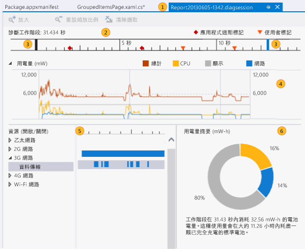
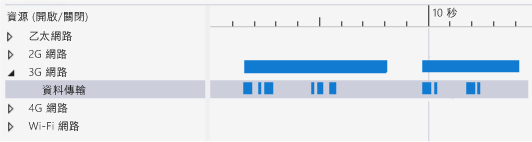
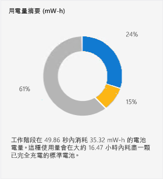

# <a name="analyze-energy-use-in-store-apps"></a>分析市集應用程式中的能源利用
Visual Studio [ **能源消耗** ] 分析工具可協助您分析 Windows 市集應用程式在全部或部分時間使用自己的電池執行的低電源平板裝置上的功率和能源消耗情形。 在電池供電的裝置上，使用太多能源的應用程式可能導致客戶諸多不滿，最後客戶可能會解除安裝應用程式。 最佳化能源利用，可以提高客戶對應用程式的採用率。  
  
##  <a name="BKMK_What_the_Energy_Consumption_tool_is__how_it_works__and_what_it_measures"></a> 能源消耗分析工具是什麼，它的運作方式為何，以及測量什麼內容  
 [能源消耗] 分析工具會在分析工作階段期間，擷取裝置的顯示器、CPU 和網路連線的活動。 然後它會產生這些活動的用電量評估，以及該分析工作階段的總計能源量。  
  
> [!NOTE]
>  能源分析工具會使用代表可能執行應用程式的低電源平板裝置之標準參考裝置硬體的軟體模型，評估用電和能源利用。 為了提供最佳評估結果，建議您在低電源平板裝置上收集分析資料。  
>   
>  雖然這個模型可針對各種低電源裝置提供良好評估，但是您所分析裝置的實際值仍可能有所不同。 使用這些值找出相對於其他資源來說耗用量較高，也因此可能是合適的最佳化候選項目的顯示器、CPU 和網路活動。  
  
 [能源消耗] 分析工具使用下列「 *功率* 」(Power) 和「 *能源*」(Energy) 的定義：  
  
-   「*功率* 」(Power) 用於測量在某段時間內完成工作的用電速率。 在電子學中，功率的標準單位是「 *瓦*」(Watt)，其定義為一安培電流流經一伏特電位差時，工作完成的速率。 在 [用電量]  圖形上，單位顯示為毫瓦 **mW** ，相當於千分之一瓦特。  
  
     請注意，由於功率是一種速率，因此有方向 (工作在某段時間內可能增加或減少) 和速度 (工作增加或減少的量)。  
  
-   「*能源* 」(Energy) 用於測量總功率，以容量或電位、電池的電量，或某段時間的累計總用電量表示。 能源的單位是瓦-小時，一小時內連續產生的一瓦功率數。 在 [ **能源摘要**] 中，單位顯示為毫瓦-小時 [ **mW-h**]。  
  
   
  
 例如，平板電腦中完全充電的電池有特定的儲存電能量。 當能源用來執行像是網路通訊、計算值或顯示圖形這類工作時，電池的電力會以不同的速率消耗。 任一段時間內的總耗電量也是以能源測量。  
  
##  <a name="BKMK_Identify_scenarios_with_user_marks"></a> 透過使用者標記識別情節  
 您可以將「 *使用者標記* 」(User Mark) 加入至分析資料，以便識別時間軸尺規中的區段。  
  
   
  
 在方法執行的時候，該標記會在時間軸中顯示為橙色三角形。 當您將游標停留在標記上時，訊息和時間就會做為工具提示顯示。 如果兩個以上的使用者標記很接近，標記會合併，並且工具提示資料會結合在一起。 您可以放大時間軸來分隔標記。  
  
 **將標記加入至 C#、Visual Basic、C++ 程式碼**  
  
 若要將使用者標記新增至 C#、Visual Basic、C++ 程式碼，請先建立 [Windows.Foundation.Diagnostics LoggingChannel](http://msdn.microsoft.com/library/windows/apps/windows.foundation.diagnostics.loggingchannel.aspx) 物件。 接著，請在程式碼中您要標記的位置插入 [LoggingChannel.LogMessage](http://msdn.microsoft.com/library/windows/apps/dn264210.aspx) 方法的呼叫， 並在呼叫中使用 [LoggingLevel.Information](http://msdn.microsoft.com/library/windows/apps/windows.foundation.diagnostics.logginglevel.aspx) 。  
  
 當方法執行時，使用者標記就會與訊息一起加入至分析資料中。  
  
> [!NOTE]
>  -   Windows.Foundation.Diagnostics LoggingChannel 會實作 [Windows.Foundation.IClosable](http://msdn.microsoft.com/library/windows/apps/windows.foundation.iclosable.aspx) 介面 (等同於 C# 和 VB 中的 [System.IDisposable](http://msdn.microsoft.com/library/System.IDisposable.aspx))。為了避免作業系統資源流失，請在記錄頻道結束時呼叫 [LoggingChannel.Close](http://msdn.microsoft.com/library/windows/apps/windows.foundation.diagnostics.loggingchannel.close.aspx) (等同於 C# 和 VB 中的 [Windows.Foundation.Diagnostics.LoggingChannel.Dispose](https://msdn.microsoft.com/en-us/library/windows/apps/windows.foundation.diagnostics.loggingchannel.dispose.aspx))。  
> -   每個開啟的記錄通道都必須具有唯一名稱。 嘗試使用與尚未處置的通道相同的名稱建立新記錄通道，將會造成例外狀況。  
  
 如需相關範例，請參閱 [LoggingSession 範例](http://code.msdn.microsoft.com/windowsapps/LoggingSession-Sample-ccd52336) 這個 Windows SDK 範例。  
  
 **將標記加入至 JavaScript 程式碼**  
  
 若要加入使用者標記，請在程式碼中您要標記的位置，插入下列程式碼：  
  
```  
if (performance && performance.mark) {  
    performance.mark(markDescription);  
}  
```  
  
 *markDescription* 這個字串包含要在使用者標記工具提示中顯示的訊息。  
  
##  <a name="BKMK_Configure_your_environment_for_profiling"></a> 設定您的環境以進行分析  
 為了獲得較佳的評估結果，建議您分析以本身電池供電之低電源裝置上的應用程式能源使用情形。 由於這類裝置大部分不會執行 Visual Studio，因此您需要將 Visual Studio 電腦連接到使用 Visual Studio 遠端工具的裝置。 若要連接到遠端裝置，您必須設定 Visual Studio 專案和遠端裝置。 如需詳細資訊，請參閱[在遠端電腦上執行 Windows 市集應用程式](../debugger/run-windows-store-apps-on-a-remote-machine.md)。  
  
> [!TIP]
>  -   我們不建議在 Windows 市集模擬器或 Visual Studio 電腦上進行能源分析。 在實際裝置上進行分析可提供更實際的資料。  
> -   在以電池供電的目標裝置上進行分析。  
> -   關閉其他可能使用相同資源 (網路、CPU 或顯示器) 的應用程式。  
  
##  <a name="BKMK_Collect_energy_profile_data_for_your_app"></a> 收集應用程式的能源分析資料  
  
1.  在 [偵錯]  功能表上，選擇 [啟動診斷但不偵錯] 。  
  
     ![選擇診斷中樞內的 [能源消耗]](../profiling/media/energyprof_diagnosticshub.png "ENERGYPROF_DiagnosticsHub")  
  
2.  選擇 [ **能源消耗** ]，然後選擇 [ **開始**]。  
  
    > [!NOTE]
    >  當您啟動 [ **能源消耗** ] 分析工具時，可能會看到 [ **使用者帳戶控制** ] 視窗，要求您提供執行 VsEtwCollector.exe 的權限。 選擇 [ **是**]。  
  
3.  執行您的應用程式進行資料收集。  
  
4.  若要停止分析，請切換回到 Visual Studio (Alt+Tab)，並選擇診斷中樞頁面上的 [ **停止收集** ]。  
  
       
  
     Visual Studio 會分析收集到的資料並顯示結果。  
  
##  <a name="BKMK_Collect_energy_profile_data_for_an_installed_app"></a> 收集已安裝應用程式的能源分析資料  
 [能源消耗] 工具只能在從 Visual Studio 方案啟動或從 Windows 市集安裝的 Windows 8.1 市集應用程式上執行。 方案在 Visual Studio 中開啟時，預設目標為 [ **啟始專案**]。 目標為已安裝的應用程式：  
  
1.  選擇 [ **變更目標** ]，然後選擇 [ **已安裝的應用程式**]。  
  
2.  從 [ **選取已安裝的應用程式套件** ] 清單中選擇目標。  
  
3.  選擇 [診斷中樞] 頁面上的 [ **能源消耗** ]。  
  
4.  選擇 [ **開始** ]，開始分析。  
  
 若要停止分析，請切換回到 Visual Studio (Alt+Tab)，並選擇診斷中樞頁面上的 [ **停止收集** ]。  
  
##  <a name="BKMK_Analyze_energy_profile_data"></a> 分析能源分析資料  
 能源分析資料會顯示在 Visual Studio 文件視窗中：  
  
   
  
|||  
|-|-|  
||報告檔的名稱為 Report*YYYYMMDD-HHMM*.diagsession。 如果您決定儲存報告，可以變更名稱。|  
||時間軸會顯示程式碼剖析工作階段的長度、應用程式週期啟用事件，以及使用者標記。|  
||您可以拖曳藍色巡覽列，選取時間軸的區域，將報告限制在時間軸的一部分。|  
||[ **用電量** ] 圖形是多行折線圖，顯示程式碼剖析工作階段期間由裝置資源造成的電源輸出變更。 能源消耗分析工具會追蹤 CPU、網路活動和螢幕顯示器使用的電源。|  
||[ **資源 (開啟/關閉)**  ] 圖形提供網路能源成本的詳細資料。 [ **網路** ] 橫條圖表示網路連接開啟的時間。 [ **資料傳輸** ] 子橫條圖是應用程式透過網路接收或傳送資料的時間。|  
||[ **用電量摘要** ] 會顯示所選時間軸中 CPU、網路活動和螢幕顯示器使用的能源總計比例。|  
  
 **若要分析能源分析資料**  
  
 尋找資源用電量尖峰的區域。 將尖峰區與應用程式的功能產生關聯。 然後使用時間軸上的時間軸控制列放大該區域。 如果您將焦點放在網路使用方式，請展開 [ **資源 (開啟/關閉)** ] 圖形的 [ **網路**  ] 節點，比較網路連接開啟時間與應用程式透過連接接收或傳輸資料的時間。 減少在非必要時開啟網路，是非常有效的最佳化方式。  
  
##  <a name="BKMK_Optimize_energy_use"></a> 最佳化能源利用  
 除了傳輸資料之外，網路連線初始化、維護及關閉連線都會產生能源成本。 某些網路在資料已傳送或接收後仍然保持連線一段時間，以便讓更多資料透過單一連線傳輸。 您可以使用 [ **資源 (開啟/關閉)** ] 窗格檢查應用程式與連接互動的方式。  
  
   
  
 如果 [ **網路** ] 和 [ **資料傳輸** ] 橫條圖顯示長時間開啟連接，間歇地傳送一系列的小型資料封包，您可以批次處理資料，使其在單一傳輸中傳送，減少開啟網路的時間，因此節省能源成本。  
  
   
  
 對於顯示器的能源成本，您擁有的控制權比較少。 大部分畫面顯示淺色時，所需的能源比顯示深色更多，因此使用深色背景會是節省成本的一種方式。  
  
##  <a name="BKMK_Other_resources"></a> 其他資源  
  
-   Windows 開發人員中心有關 **C#/VB/C++ 和 XAML** 和 [JavaScript 和 HTML](http://msdn.microsoft.com/en-us/0ee0b706-8432-4d49-9801-306ed90764e1) 的 [連線狀態和成本管理](http://msdn.microsoft.com/en-us/372afa6a-1c7c-4657-967d-03a77cd8e933) 章節中，描述了提供網路連線資訊的 Windows API，這些資訊可讓您的應用程式用來減少網路流量的成本。  
  
     Windows 市集應用程式適用的 Visual Studio 模擬器可讓您模擬網路資訊 API 的資料連接屬性。 請參閱 [Run Windows Store apps in the simulator](../debugger/run-windows-store-apps-in-the-simulator.md)  
  
-   [JavaScript 函式計時]  和 [CPU 使用量]  工具可以協助您降低因為沒有效率的函式所造成的 CPU 負載。 請參閱[分析 CPU 使用量](../profiling/analyze-cpu-usage-in-a-windows-universal-app.md)。
